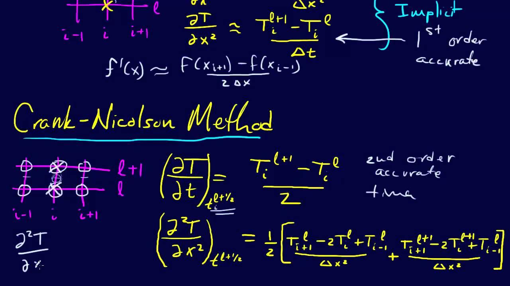

## Table of Contents

## What is the Crank-Nicolson method?

The Crank-Nicolson method is a way to solve equations that change over time, like heat flow or how chemicals spread. It's a mix of two other methods: one that looks at the past (called backward Euler) and one that looks at the future (called forward Euler). By using both, the Crank-Nicolson method tries to be more accurate than using just one of them. It does this by taking an average of the past and future values at each small step in time.

This method is popular because it's stable and gives good results. "Stable" means that small mistakes in your calculations won't grow bigger over time. It's also good at keeping the total amount of whatever you're studying (like heat or chemicals) the same, which is important in many situations. However, it can be a bit harder to use because you need to solve a system of equations at each step, which can take more time and effort.

## How does the Crank-Nicolson method differ from explicit methods?

The Crank-Nicolson method is different from explicit methods in how it calculates the next step in time. Explicit methods, like the forward Euler method, use only the current state to predict the future. They are simple because you can directly calculate the next value without solving any equations. However, this simplicity can lead to problems because if you take too big a step in time, the calculations can become unstable, meaning small errors can grow bigger and bigger.

On the other hand, the Crank-Nicolson method is an implicit method, meaning it uses both the current and the future states to find the next step. This makes it more stable and less sensitive to the size of the time step you choose. Instead of directly calculating the next value, you need to solve a system of equations at each step, which can be more complex and time-consuming. But this extra work pays off because the Crank-Nicolson method is generally more accurate and better at conserving quantities like heat or mass over time.

In summary, while explicit methods are easier to implement and faster to compute, they can be unstable and less accurate. The Crank-Nicolson method, though more complex and requiring more computational effort, offers greater stability and accuracy, making it a preferred choice for many scientific and engineering applications where precision is important.

## What are the basic steps to implement the Crank-Nicolson scheme?

To implement the Crank-Nicolson scheme, you first need to set up your problem. This means defining the equation you want to solve, like a heat equation or a diffusion equation. Then, you need to decide on the size of your grid in space and time. The grid in space is where you'll calculate the values of your function, and the time steps are how you move from one moment to the next. You'll also need to set the initial conditions, which are the starting values of your function, and the boundary conditions, which are the values at the edges of your grid.

Next, you start solving the problem step by step in time. At each time step, you'll need to solve a system of equations. This system comes from the Crank-Nicolson formula, which averages the values of your function at the current time and the next time. To solve this system, you can use a method like Gaussian elimination or a computer program that solves linear equations. You keep doing this for each time step until you reach the end of the time period you're interested in. At the end, you'll have a solution that shows how your function changes over time and space.

The Crank-Nicolson method requires a bit more work than simpler methods because you have to solve equations at each step, but it's worth it for the accuracy and stability it provides. It's good at keeping the total amount of whatever you're studying the same, which is important in many scientific and engineering problems. Once you've set up your problem and run the method, you can analyze the results to see how your function behaves over time.

## What are the advantages of using the Crank-Nicolson method over other numerical methods?

The Crank-Nicolson method is really good at solving problems that change over time, like heat or how chemicals spread. One big advantage is that it's stable. This means if you make a small mistake in your calculations, it won't grow bigger over time. Other methods, like the forward Euler method, can be unstable if you take too big a step in time. The Crank-Nicolson method lets you take bigger time steps without worrying about your solution going crazy, which saves time and effort.

Another advantage is that the Crank-Nicolson method is very accurate. It's better at keeping the total amount of whatever you're studying the same, which is important in many situations. For example, if you're studying heat, you want to make sure you're not losing or gaining heat out of nowhere. This method is also good at giving you a smooth solution that doesn't jump around a lot, which makes it easier to understand what's happening in your problem.

However, the Crank-Nicolson method can be a bit harder to use because at each step, you need to solve a system of equations. This takes more time and effort compared to simpler methods. But for many scientific and engineering problems, the extra work is worth it because of the stability and accuracy you get. So, if you need a reliable and precise solution, the Crank-Nicolson method is a great choice.

## Can you explain the stability of the Crank-Nicolson method?

The Crank-Nicolson method is stable, which means that small errors in your calculations won't grow bigger over time. This is really important because it lets you take bigger steps in time without worrying about your solution becoming unreliable. Other methods, like the forward Euler method, can become unstable if you take too big a step in time. But with the Crank-Nicolson method, you don't have to worry about that as much. It's like having a safety net that keeps your calculations on track.

This stability comes from the way the Crank-Nicolson method works. It uses an average of the past and future values at each time step, which helps to smooth out any errors. Imagine you're trying to guess where a ball will be in the future. If you only look at where it is now, you might make a big mistake. But if you also consider where it was in the past, you can make a much better guess. That's what the Crank-Nicolson method does, and it's why it's so good at keeping things stable.

## How do you handle boundary conditions in the Crank-Nicolson scheme?

Handling boundary conditions in the Crank-Nicolson scheme is important because it helps set the values at the edges of your grid. You need to decide what happens at the boundaries before you start solving the equations. There are different types of boundary conditions you might use, like Dirichlet conditions, where you set the value at the boundary to a specific number, or Neumann conditions, where you set the rate of change at the boundary. Once you've chosen your boundary conditions, you include them in your calculations at each time step.

When you're solving the system of equations at each time step, the boundary conditions come into play. For example, if you're using Dirichlet conditions, you'll fix the values at the boundary points in your equations. If you're using Neumann conditions, you'll adjust the equations to reflect the rate of change at the boundary. This means the boundary conditions help shape the solution by setting the starting and ending points for each time step. By carefully handling the boundary conditions, you make sure your solution stays accurate and makes sense in the context of your problem.

## What are the common applications of the Crank-Nicolson method?

The Crank-Nicolson method is often used to solve problems where things change over time, like heat moving through a material or how chemicals spread out. It's really good at these kinds of problems because it's stable and accurate. For example, if you want to know how heat spreads through a metal rod over time, the Crank-Nicolson method can help you figure that out. It's also used in studying how chemicals move through water or air, which is important in environmental science.

Another common use of the Crank-Nicolson method is in finance, where it's used to model how the prices of things like stocks or options change over time. This is important for people who want to predict how much money they might make or lose. The method's stability and accuracy make it a good choice for these kinds of predictions. Overall, the Crank-Nicolson method is a powerful tool that helps in many areas where understanding how things change over time is important.

## How does the Crank-Nicolson method handle nonlinear problems?

The Crank-Nicolson method is usually used for problems that follow a straight line, like heat moving through a material. But it can also be used for problems that don't follow a straight line, which we call nonlinear problems. These problems are trickier because the way things change can depend on the current state in a complicated way. To use the Crank-Nicolson method for nonlinear problems, you need to do something called linearization. This means you turn the nonlinear problem into a simpler, linear one that you can solve step by step.

Linearization can be done in different ways, but a common one is to use the current values to guess what the nonlinear part will be at the next step. You then use these guesses in the Crank-Nicolson formula and solve the equations. This process might need to be repeated a few times at each time step to make sure your solution is accurate. Even though it's more work, the Crank-Nicolson method can still be a good choice for nonlinear problems because it's stable and helps keep the total amount of whatever you're studying the same over time.

## What are the potential pitfalls or limitations of the Crank-Nicolson method?

The Crank-Nicolson method is really good at solving problems that change over time, but it has some limitations. One big problem is that it can be hard to use because you need to solve a system of equations at each step. This takes more time and effort compared to simpler methods. Also, the method can sometimes cause something called "oscillations" in your solution, which means the values might go up and down in a way that doesn't make sense for your problem. This can happen if you're not careful with how you set up your grid in space and time.

Another limitation is that the Crank-Nicolson method can be tricky to use for problems that don't follow a straight line, which we call nonlinear problems. You need to turn these problems into simpler ones that you can solve, and this can add more steps and make things more complicated. If you don't do this carefully, you might not get the right answer. So, while the Crank-Nicolson method is great for many problems, it's important to understand its limitations and use it in the right way to get the best results.

## How can the Crank-Nicolson method be extended to higher dimensions?

The Crank-Nicolson method can be used for problems that happen in more than one direction, like heat moving through a block instead of just a rod. To do this, you need to set up a grid that covers all the directions you're interested in. For example, if you're looking at a 2D problem, you'll have a grid that goes both left-right and up-down. You'll then use the Crank-Nicolson formula to figure out how things change over time in all these directions. This means you'll have to solve a bigger system of equations at each step, but the basic idea is the same as in one dimension.

In higher dimensions, the Crank-Nicolson method still works by taking an average of the past and future values at each time step. This helps keep the solution stable and accurate, just like in one dimension. But because you're dealing with more directions, the calculations can get a lot more complicated. You might need to use special computer programs to solve the equations, especially if you're working in three dimensions or more. Even though it's more work, the Crank-Nicolson method can still be a great choice for these kinds of problems because it's good at keeping the total amount of whatever you're studying the same over time.

## Can you discuss the computational complexity of the Crank-Nicolson method compared to other schemes?

The Crank-Nicolson method takes more time and effort to use than simpler methods like the forward Euler method. This is because at each step in time, you need to solve a system of equations, which can be a lot of work. The forward Euler method, on the other hand, lets you calculate the next value directly without solving any equations, so it's faster and easier. But the Crank-Nicolson method's extra work pays off because it's more stable and accurate. This means you can take bigger steps in time without worrying about your solution becoming unreliable, which can actually save you time in the long run.

When you compare the Crank-Nicolson method to other implicit methods, like the backward Euler method, they are similar in how much work they need. Both methods require solving a system of equations at each step, so they have about the same level of computational complexity. However, the Crank-Nicolson method is often preferred because it's better at keeping the total amount of whatever you're studying the same over time. This makes it a good choice for many scientific and engineering problems where accuracy and stability are really important.

## What advanced techniques can be used to improve the accuracy of the Crank-Nicolson method?

One way to make the Crank-Nicolson method more accurate is by using something called adaptive time-stepping. This means you change the size of your time steps based on how quickly things are changing. If things are changing a lot, you use smaller steps to get a more accurate solution. If things are changing slowly, you can use bigger steps to save time. This helps you get a better solution without using too much extra work.

Another technique is to use a finer grid in space. The Crank-Nicolson method works by calculating values at different points in your grid. If you have more points, you can get a more detailed picture of how things are changing. This can help you see small details that you might miss with a bigger grid. But remember, using a finer grid means more calculations, so it takes more time and effort.

You can also combine the Crank-Nicolson method with other methods to get even better results. For example, you might use the Crank-Nicolson method for most of your problem, but switch to a different method near the boundaries where things can be trickier. This is called a hybrid approach. By mixing methods, you can use the strengths of each one to get a more accurate solution overall.

## What is the Crank-Nicolson Method and how does it work?

The Crank-Nicolson method is a finite-difference algorithm utilized to solve partial differential equations (PDEs), specifically parabolic PDEs, which are prevalent in modeling time-dependent processes. This method is pivotal in numerical analysis due to its unique combination of accuracy and stability, qualities essential for solving complex equations in modern computational applications, including algorithmic trading.

Historically, the Crank-Nicolson method was developed in the mid-20th century by John Crank and Phyllis Nicolson. It was initially applied to solve the heat equation, a fundamental problem in physics and engineering. The heat equation is a second-order parabolic PDE that describes how heat diffuses through a given region over time. The development of the Crank-Nicolson method marked a significant advancement since it provided a stable and accurate solution over longer time steps compared to existing approaches.

The Crank-Nicolson method employs a finite-difference approach to discretize both time and space domains. It is implicit in time, which means the method requires solving a system of equations at each time step. This approach characteristically involves taking the average of the forward-time centered-space (FTCS) and the backward-time centered-space (BTCS) scheme. Mathematically, for a PDE of the form:

$$
\frac{\partial u}{\partial t} = \mathcal{L}[u]
$$

where $\mathcal{L}[u]$ represents a spatial differential operator, the Crank-Nicolson method can be expressed as:

$$
\frac{u^{n+1} - u^n}{\Delta t} = \frac{1}{2}\left(\mathcal{L}[u^{n+1}] + \mathcal{L}[u^n]\right)
$$

In this formulation, $u^n$ and $u^{n+1}$ are the solutions at the current and next time step, respectively, and $\Delta t$ is the time step size. This semi-implicit form is crucial because it offers a compromise between accuracy and computational cost both in time-stepping and spatial discretization.

One of the primary features of the Crank-Nicolson method is its second-order accuracy in time, which significantly improves the precision of simulations over broad time intervals without necessitating prohibitively small time steps. Additionally, it is unconditionally stable for linear problems, meaning that numerical errors do not amplify uncontrollably as the simulation progresses, a considerable advantage when modeling financial markets, which demand high fidelity over extended periods.

In the context of [algorithmic trading](/wiki/algorithmic-trading), these stability and accuracy features make the Crank-Nicolson method especially suited for developing robust trading models. Financial derivatives, such as options, often require the solution of PDEs with complex boundary conditions and variable coefficients. The ability of the Crank-Nicolson method to handle these complexities with precision ensures that trading algorithms can predict price movements accurately and manage risk appropriately, which is critical for market participants seeking to maintain a competitive edge.

## What are Practical Implementation Strategies?

Implementing the Crank-Nicolson method within trading algorithms requires a methodical approach, utilizing suitable software, programming languages, and tools, to maximize its efficacy and reliability in financial modeling.

### Step-by-Step Guidance

1. **Understanding the Problem:**
   Begin by defining the partial differential equations (PDEs) that describe the financial model. For instance, the Black-Scholes equation used for option pricing can be solved using the Crank-Nicolson method.

2. **Discretization:**
   Transform the continuous PDE into a discrete form. This involves creating a finite difference grid in both time and space. The Crank-Nicolson method applies the trapezoidal rule, which is implicit in time and balanced between the current and next time step. The finite difference approximation for a PDE can be expressed as:
$$
   \frac{u^{n+1}_{i} - u^{n}_{i}}{\Delta t} = \frac{1}{2} \left( \frac{u^{n}_{i+1} - 2u^{n}_{i} + u^{n}_{i-1}}{\Delta x^2} + \frac{u^{n+1}_{i+1} - 2u^{n+1}_{i} + u^{n+1}_{i-1}}{\Delta x^2} \right)

$$

3. **Assembling the Matrix System:**
   The method leads to a system of linear equations that can be expressed in the matrix form $Ax = b$, where $A$ is a tridiagonal matrix. Techniques like the Thomas algorithm can be used to efficiently solve this system. 

4. **Implementation in Software:**
   - **Programming Languages:** Python is preferred due to its extensive libraries for numerical computation, such as NumPy and SciPy. Alternatively, MATLAB or C++ can be used for high-performance applications.
   - **Code Example in Python:**
     ```python
     import numpy as np
     from scipy.linalg import solve_banded

     def crank_nicolson_step(U, dt, dx, alpha):
         N = len(U)
         # Coefficients
         a = c = -alpha
         b = 2 + 2*alpha

         # Create diagonals
         diagonals = np.zeros((3, N))
         diagonals[0, 1:] = a   # Upper diagonal
         diagonals[1, :] = b    # Main diagonal
         diagonals[2, :-1] = c  # Lower diagonal

         # Right-hand side
         B = np.dot(-a, U[:-2] + U[2:]) + (2 - 2*alpha) * U[1:-1]

         # Solve system
         U[1:-1] = solve_banded((1, 1), diagonals, B)

     ```

5. **Optimization Tips:**
   - Utilize vectorized operations in Python to enhance performance.
   - For large datasets, consider parallel computing techniques via libraries such as Dask or multiprocessing.
   - Assess convergence by checking the difference between subsequent iterations, ensuring stability and accuracy.

6. **Case Studies and Examples:**
   In practice, financial institutions often use Crank-Nicolson to model complex derivatives under stochastic [volatility](/wiki/volatility-trading-strategies) models or local volatility surfaces. A realistic implementation could involve calibrating model parameters to market data to ensure the model's intrinsic assumptions align with observed behaviors.

### Tools and Software

- **Numerical Libraries:** Use NumPy and SciPy for managing matrices and solving algebraic equations.
- **Development Environments:** Jupyter Notebook provides an interactive computing environment for implementing and testing algorithms.
- **Data Management Tools:** Pandas can be used for organizing and manipulating financial data input and output.

By following these strategies, traders and financial engineers can effectively harness the Crank-Nicolson method's power to improve the precision and robustness of algorithmic trading systems.

## References & Further Reading

[1]: Crank, J., & Nicolson, P. (1947). ["A practical method for numerical evaluation of solutions of partial differential equations of the heat-conduction type."](https://link.springer.com/article/10.1007/BF02127704) Proceedings of the Cambridge Philosophical Society.

[2]: Wilmott, P., Howison, S., & Dewynne, J. (1997). ["The Mathematics of Financial Derivatives: A Student Introduction."](https://www.cambridge.org/core/books/mathematics-of-financial-derivatives/7121345D07C5BCE4FBEC91A8A7E6F267) Cambridge University Press.

[3]: Black, F., & Scholes, M. (1973). ["The Pricing of Options and Corporate Liabilities."](https://www.cs.princeton.edu/courses/archive/fall09/cos323/papers/black_scholes73.pdf) Journal of Political Economy.

[4]: Tavella, D., & Randall, C. (2000). ["Pricing Financial Instruments: The Finite Difference Method."](https://www.researchgate.net/publication/235622490_Pricing_Financial_Instruments_The_Finite_Difference_Method) John Wiley & Sons.

[5]: Jäckel, P. (2002). ["Monte Carlo Methods in Finance."](https://www.wiley.com/en-us/Monte+Carlo+Methods+in+Finance-p-9780471497417) John Wiley & Sons.