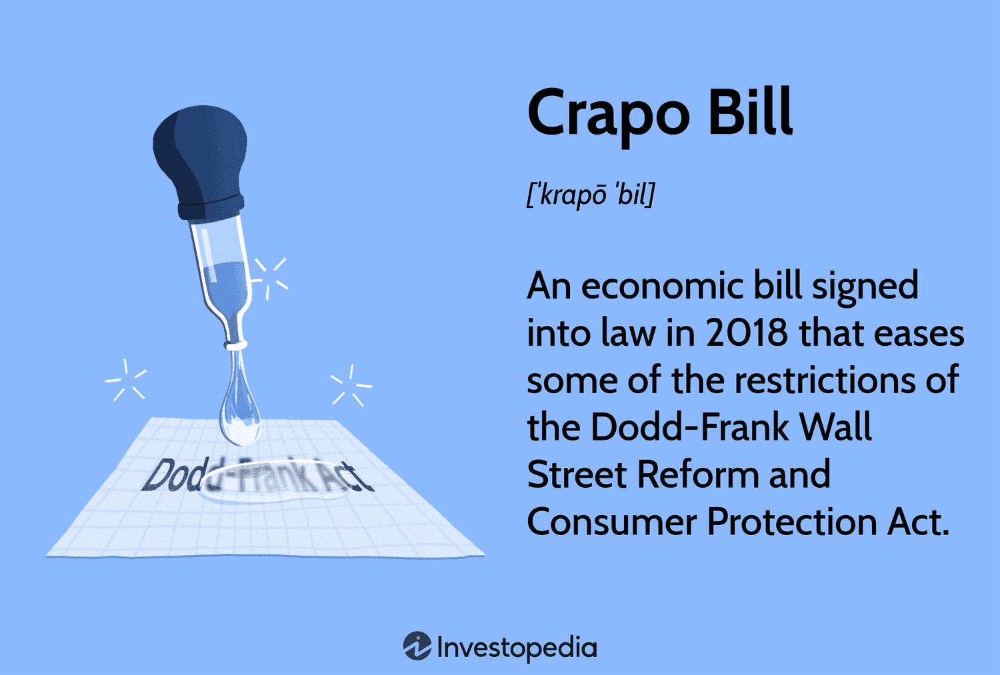

The Crapo Bill represents a significant legislative effort aimed at reforming the financial sector. Officially enacted as the Economic Growth, Regulatory Relief, and Consumer Protection Act in 2018, it was introduced by Senator Mike Crapo with the primary objective of adjusting the regulatory framework established by the Dodd-Frank Wall Street Reform and Consumer Protection Act. This bill has been both supported and criticized for altering the delicate balance of financial oversight aimed at preventing systemic risks and promoting growth. 

As the financial industry evolves, algorithmic trading has become a dominant strategy, leveraging advanced algorithms to execute trades at speeds and frequencies beyond human capability. Algorithmic trading thrives on market predictability and robustness imposed by financial regulations. Therefore, when legislative changes such as those proposed by the Crapo Bill are introduced, they have consequential ripple effects on trading strategies and market dynamics. 



This article examines the criticisms surrounding the Crapo Bill, particularly its implications for algorithmic trading. Understanding how legislative measures impact trading practices is crucial for investors and financial professionals who must navigate the intertwined relationship between regulations and market behavior. 

The Crapo Bill's key features and the criticisms it faces are outlined to offer a comprehensive overview of its influence on financial markets and trading strategies. By exploring these aspects, this discussion aims to provide insights into the challenges and potential opportunities that arise from significant financial legislation, underscoring the importance for stakeholders to continuously adapt to an evolving regulatory environment.

## Table of Contents

## What is the Crapo Bill?

Introduced by Senator Mike Crapo, the Crapo Bill represents a legislative effort designed to ease certain restrictions imposed by the Dodd-Frank Wall Street Reform and Consumer Protection Act. Officially titled the Economic Growth, Regulatory Relief, and Consumer Protection Act, it was enacted in 2018 with the intention of modifying the financial regulatory environment put in place after the 2008 financial crisis.

The Dodd-Frank Act, passed in response to the financial crisis, introduced comprehensive reforms aimed at reducing risks in the U.S. financial system, primarily affecting large banking institutions considered "too big to fail." One of the major features of the Crapo Bill is the alteration of thresholds that determine when a bank is subject to stringent regulations. Under the new legislation, the asset threshold for enhanced regulatory scrutiny increased from $50 billion to $250 billion. This adjustment alleviated some smaller and mid-sized banks from extensive regulatory oversight, effectively categorizing them differently from their larger counterparts.

Compliance requirements were another focal point of the Crapo Bill, aiming to remove what proponents viewed as unnecessary regulatory burdens that could stifle the competitiveness and economic viability of smaller financial institutions. By adjusting these requirements, the legislation sought to foster an environment conducive to economic growth, largely by enabling smaller banks to allocate resources more efficiently.

In advocating for the Crapo Bill, its proponents argued that the reduction in regulatory burdens would enable these banks to better serve their communities through increased lending capabilities, thereby promoting broader economic growth. This included provisions for easing mortgage regulations and consumer lending rules to stimulate credit availability.

Overall, the Crapo Bill represents a significant change in the regulatory landscape, walking a line between maintaining the robust safeguards introduced by the Dodd-Frank Act and introducing flexibility aimed at stimulating the economy through lesser-regulated banks and lending practices.

## Criticism of the Crapo Bill

Critics of the Crapo Bill maintain that this legislation potentially undermines the critical financial safeguards established by the Dodd-Frank Wall Street Reform and Consumer Protection Act. The Dodd-Frank Act was introduced in response to the 2008 financial crisis to impose stricter regulations on large financial institutions, aiming to prevent the recurrence of similar crises. The Crapo Bill, by easing these restrictions, raises concerns about the safety and stability of the financial system.

One significant criticism is that the Crapo Bill may encourage riskier financial practices, particularly among smaller and mid-sized banks. By raising the threshold for banks considered "too big to fail," these institutions may feel emboldened to engage in aggressive lending and investment behaviors that could increase systemic risk. The relaxed compliance requirements could reduce the scrutiny these banks face, thereby encouraging a return to potentially hazardous financial practices reminiscent of the pre-2008 era.

Additionally, there's apprehension regarding the decreased oversight of mortgage lending and the collection of financial data. The Dodd-Frank Act had increased transparency in mortgage lending, aiming to protect consumers from predatory practices. The Crapo Bill, by loosening these requirements, may inadvertently lead to lapses in consumer protection, exposing borrowers to adverse lending practices and contributing to an unsound housing market. This could potentially lead to higher default rates, reminiscent of the factors that fueled the last financial crisis.

Furthermore, financial experts express concern that these deregulatory measures could heighten the chances of another financial crisis. By relaxing the rules that have constrained risky financial maneuvers, the systemic vulnerabilities that precipitated the 2008 crisis might re-emerge. Critics argue that while the Crapo Bill seeks to stimulate economic growth through regulatory relief, it might do so at the expense of long-term financial stability.

In summary, the criticisms of the Crapo Bill highlight a delicate balance between fostering economic growth and maintaining financial safeguards. Revisiting such legislative measures requires careful consideration to prevent the erosion of critical protections that maintain market stability and consumer trust.

## Impact on Algorithmic Trading

Algorithmic trading, which relies heavily on market predictability and regulation, could be significantly impacted by changes in financial laws like those introduced by the Crapo Bill. These changes can alter market dynamics and introduce elements of unpredictability, challenging the assumptions upon which algorithmic models are built.

Relaxed regulations, as facilitated by the Crapo Bill, might introduce more [volatility](/wiki/volatility-trading-strategies) into the markets. Volatility is a critical [factor](/wiki/factor-investing) in [algorithmic trading](/wiki/algorithmic-trading) as it directly affects the risk and potential returns that traders calculate. Algorithmic models, which utilize historical data to predict future market behaviors, might struggle to adapt to unpredictable changes that deviate from established patterns. This situation can affect [backtesting](/wiki/backtesting) strategies, where algorithms are tested on historical data to predict their performance in real-world trading scenarios. If regulations lead to more frequent and severe market fluctuations, traders could face heightened risk and reduced accuracy in their predictive models.

Critics assert that reduced regulatory oversight could create unequal trading conditions and obscure market transparency. Transparency is paramount in algorithmic trading, as these strategies often depend on the rapid and accurate analysis of market data to make instantaneous trading decisions. If transparency declines, it could lead to asymmetrical information distribution, where some market participants gain advantages over others, potentially leading to a less efficient market. Unequal trading conditions might further deepen market volatility, affecting [liquidity](/wiki/liquidity-risk-premium) and the ability of algorithms to function optimally.

Financial institutions employing algorithmic trading may have to adapt their strategies to align with new legislative frameworks established by the Crapo Bill. This could involve modifying algorithms to account for increased volatility and implementing more sophisticated risk management protocols to mitigate the potential for financial loss. Additionally, institutions may need to enhance their data analytics capabilities to cope with the possibility of reduced market transparency. Adapting to these changes will require significant resources and expertise, as firms strive to maintain a competitive edge while ensuring compliance with newly established regulations.

In summary, the Crapo Bill's alterations to financial regulations could meaningfully impact algorithmic trading by introducing increased volatility and potential shifts in market transparency and equality. As a result, traders and financial institutions may need to recalibrate their strategies and enhance their technological capabilities to navigate these changes effectively.

## Key Objectives of the Crapo Bill

The Crapo Bill's central aim is to alleviate the regulatory burden on smaller banks, positioning them to allocate resources more effectively. By elevating the asset threshold from $50 billion to $250 billion for banks deemed "too big to fail," the legislation tailors regulatory measures to better suit the size and risk levels of financial institutions. This move is intended to allow these banks to operate with increased agility, theoretically promoting healthy competition and efficiency within the banking sector.

A significant objective of the Crapo Bill is to enhance lending capacity. By adjusting capital requirements and other thresholds, the bill aims to stimulate economic growth through greater lending activities. Smaller banks, which often serve regional and local markets, are positioned to benefit substantially from these reduced constraints, potentially leading to increased funding availability for small businesses and consumers.

Consumer protection remains a core goal of the Crapo Bill. Although the provisions for consumer protection are emphasized, the efficacy of these measures largely depends on their implementation. Proper oversight and enforcement are essential to ensure that consumers receive intended benefits without falling prey to predatory practices. Balancing regulatory relief with robust consumer protection outlines the dual focus of the legislation: fostering economic growth while safeguarding individual financial interests.

## Regulatory Changes and the Risk Landscape

The Crapo Bill makes significant regulatory adjustments, particularly in capital requirements and compliance measures for financial institutions. These modifications aim to relieve smaller banks from the stringent mandates initially imposed by the Dodd-Frank Act. By raising the asset threshold for enhanced regulatory scrutiny from $50 billion to $250 billion, the bill reduces the compliance burden on small to mid-sized banks. This regulatory reprieve allows these institutions to allocate capital more effectively without being encumbered by the administrative and financial costs associated with meeting stricter requirements.

Experts, however, are divided on the potential outcomes of these changes. Advocates contend that reducing regulatory pressure on smaller banks enhances their operational efficiency, enabling more strategic capital allocation which, in turn, could spur economic growth. By allowing these banks greater freedom, the expectation is that they will have more resources to offer loans and financial products, ultimately fostering economic dynamism.

On the other hand, opponents caution that easing capital requirements might inadvertently increase systemic risk. The concern is that without rigorous oversight, banks may engage in riskier financial practices that prioritize short-term gains over long-term stability. The relaxation of stringent checks could lead to an environment where financial vulnerabilities are exacerbated, potentially setting the stage for economic instability similar to past financial crises. The critical question remains whether the new regulatory landscape will enhance or undermine financial stability.

Balancing effective oversight with market flexibility is indeed a challenging task in an intricate economic system. To maintain this balance, sophisticated models and simulations may be necessary to predict the impact of reduced capital requirements on bank stability. For example, using Python, financial analysts could implement the following simple simulation to assess potential risk levels:

```python
import numpy as np

def simulate_risk(returns, threshold):
    # Simulate bank returns with a simple random model
    simulated_returns = np.random.normal(returns, 0.02, 1000)

    # Calculate risk based on threshold for regulatory intervention
    risk_events = np.sum(simulated_returns < threshold)
    return risk_events

# Example parameters
average_returns = 0.05  # Average returns in a stressed environment
regulatory_threshold = -0.01  # Loss threshold 

risk_level = simulate_risk(average_returns, regulatory_threshold)
print(f"Simulated risk events: {risk_level}")
```

In conclusion, while the Crapo Bill attempts to modernize the financial regulatory framework by reducing constraints on smaller banks, ongoing scrutiny and adaptive regulatory measures will be crucial to ensure that such changes do not compromise the stability of the financial system.

## Conclusion

The Crapo Bill, like any financial legislation, carries potential benefits and risks. One of the primary areas of impact is algorithmic trading, a strategy extensively used in modern financial markets that can be sensitive to regulatory shifts. As the Crapo Bill relaxes some of the stringent regulations of the Dodd-Frank Act, it introduces a dual-edged potential; on one hand, it can lead to increased market liquidity and efficiency, but on the other hand, it may heighten market volatility, which could compromise the precision and reliability of algorithmic models.

Understanding the implications of the Crapo Bill on algorithmic trading is crucial for stakeholders, including investors, traders, and financial institutions. Algorithmic trading systems depend heavily on market predictability and stability, often leveraging historical data to optimize trading strategies. With legislative changes, these systems must be adaptive, recalibrating their models to account for new variables introduced by regulatory modifications.

Continuous monitoring and adaptation will be essential to navigate the evolving financial landscape shaped by the Crapo Bill. As market conditions fluctuate, partly due to altered regulatory frameworks, stakeholders must remain vigilant, using real-time data analysis and [machine learning](/wiki/machine-learning) techniques to forecast and respond to market dynamics effectively. The following Python snippet illustrates a simple adaptive moving average model that could be used to reassess trading strategies in changing market conditions:

```python
def adaptive_moving_average(prices, alpha=0.1):
    ama = [prices[0]]
    for price in prices[1:]:
        new_ama = ama[-1] + alpha * (price - ama[-1])
        ama.append(new_ama)
    return ama

prices = [100, 102, 101, 105, 107]  # Example price data
adaptive_average = adaptive_moving_average(prices)
print(adaptive_average)
```

Future legislation must consider the dual goals of fostering innovation and safeguarding stability in financial markets. While easing regulatory burdens can encourage economic growth by allowing for greater flexibility and resource allocation, caution is necessary to avoid undercutting financial safeguards critical to preventing systemic crises. Policymakers must strike a balance that promotes innovation within the financial sector while maintaining robust oversight to ensure market stability and protect consumers.

## References & Further Reading

[1]: Acharya, V., Cooley, T., Richardson, M., & Walter, I. (2011). ["Dodd-Frank Act's Systemic Risk Assessment: Promises and Considerations."](https://www.elibrary.imf.org/display/book/9781484310717/ch002.xml) American Economic Journal: Economic Policy.

[2]: ["The Volcker Rule and Its Impact on Market-Making and Proprietary Trading"](https://www.federalreserve.gov/econresdata/feds/2016/files/2016102pap.pdf) by Federal Reserve Bank of St. Louis.

[3]: McLean, S., & Nocera, J. (2010). ["All the Devils Are Here: The Hidden History of the Financial Crisis."](https://www.amazon.com/All-Devils-Are-Here-Financial/dp/159184438X) Portfolio.

[4]: Hull, J. C. (2018). ["Options, Futures, and Other Derivatives (10th Edition)."](https://www.amazon.com/Options-Futures-Other-Derivatives-10th/dp/013447208X) Pearson Education.

[5]: Berner, R. (2018). ["Reassessing Regulatory Reforms after the Financial Crisis."](https://pubsonline.informs.org/doi/abs/10.1287/mnsc.2017.2768) Brookings Papers on Economic Activity.