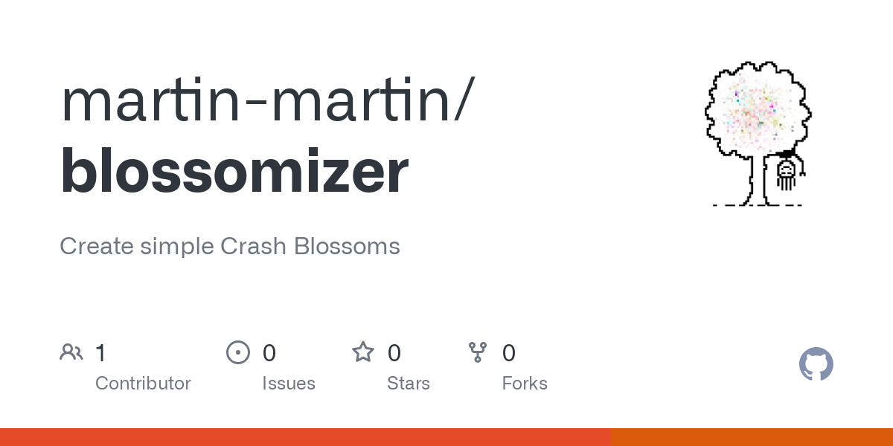

## Table of Contents

## What is a Crash Blossom in the context of machine learning?

A Crash Blossom is not a term specifically used in the context of machine learning. Instead, it is a term from linguistics and journalism that refers to a headline that can be interpreted in multiple ways, often leading to confusion or humor. For example, a headline like "British Left Waffles on Falklands" could mean that the British left-wing political group is undecided about the Falklands, or it could mean that British people left waffles behind on the Falklands. The term "Crash Blossom" itself comes from a similarly ambiguous headline, "Violinist Linked to JAL Crash Blossoms."

In machine learning, while the term "Crash Blossom" is not used, the concept of ambiguity in language is highly relevant. Machine learning models, especially those dealing with natural language processing (NLP), must handle ambiguous phrases and sentences effectively to understand and generate human language accurately. Techniques such as context analysis, semantic role labeling, and advanced neural network architectures like transformers are employed to disambiguate language and improve the performance of NLP tasks. Understanding and resolving ambiguity is crucial for applications like machine translation, sentiment analysis, and chatbots, where clear communication is essential.

## How do Crash Blossoms relate to natural language processing?

Crash Blossoms are headlines that can be read in more than one way, often leading to funny or confusing interpretations. In natural language processing (NLP), understanding and dealing with this kind of ambiguity is very important. NLP systems, like those used in translation or chatbots, need to figure out the correct meaning of sentences, even when they are not clear. This is a big challenge because human language often has many meanings depending on the context.

To handle Crash Blossoms, NLP uses different methods. One way is to look at the context around the words to guess the right meaning. Another way is to use machine learning models, like neural networks, which can learn from lots of examples how to understand ambiguous phrases better. By training on large amounts of text data, these models can improve their ability to pick the right interpretation, making them more useful in real-life situations where language can be tricky.

## Can you explain a simple example of a Crash Blossom?

A simple example of a Crash Blossom is the headline "Police Help Dog Bite Victim." This headline can be read in two different ways. One way is that the police are helping a person who was bitten by a dog. The other way is that the police are helping the dog to bite a victim, which sounds very strange and funny.

Understanding this kind of headline is tricky for computers. They need to figure out which meaning makes the most sense. In natural language processing, computers use context and patterns from lots of text to guess the right meaning. This helps them understand and work with human language better, even when it's confusing.

## What challenges do Crash Blossoms pose for machine learning algorithms?

Crash Blossoms pose a big challenge for [machine learning](/wiki/machine-learning) algorithms because they make it hard for computers to understand what people mean. When a headline can be read in two different ways, the computer needs to figure out which meaning is right. This is tough because human language often depends on context, and computers might not have all the information they need to make the right choice. For example, if a computer sees the headline "Police Help Dog Bite Victim," it has to decide if the police are helping the person who was bitten or if they are helping the dog to bite someone. This kind of ambiguity can lead to mistakes in understanding and processing language.

To deal with Crash Blossoms, machine learning algorithms use a lot of text data to learn patterns and context. They try to guess the right meaning by looking at similar examples they have seen before. This process is called training, and it helps the computer get better at understanding tricky sentences. However, even with lots of training, there is still a chance that the computer might get it wrong because language can be very complex and unpredictable. So, while machine learning can improve over time, Crash Blossoms remain a difficult problem to solve completely.

## How can machine learning models be trained to better understand Crash Blossoms?

Machine learning models can be trained to better understand Crash Blossoms by using large amounts of text data. This data helps the models learn how words and phrases are used in different contexts. When a model sees many examples of ambiguous headlines, it starts to recognize patterns that help it guess the right meaning. For example, if the model often sees "help" used in the context of assisting someone, it can use this knowledge to interpret headlines like "Police Help Dog Bite Victim" correctly. By training on a diverse set of texts, the model improves its ability to understand and disambiguate tricky sentences.

Another way to improve the model's understanding of Crash Blossoms is to use advanced techniques like attention mechanisms in neural networks. These mechanisms allow the model to focus on different parts of a sentence to understand its meaning better. For instance, a model might pay more attention to the words around "help" to decide if it means assisting someone or something else. By fine-tuning these techniques on specific datasets that include many examples of ambiguous headlines, the model can become more accurate at interpreting Crash Blossoms. This ongoing training and refinement help the model adapt to the complexities of human language.

## What are some common techniques used to mitigate the effects of Crash Blossoms in NLP?

One common technique to mitigate the effects of Crash Blossoms in natural language processing is to use context analysis. This means looking at the words around the ambiguous part of a sentence to figure out what it means. For example, if a headline says "Police Help Dog Bite Victim," the model can look at other news stories or similar headlines to see if "help" usually means assisting someone. By understanding the context, the model can make a better guess about the right meaning.

Another technique is to use advanced [neural network](/wiki/neural-network) models, like those with attention mechanisms. These models can focus on different parts of a sentence to understand it better. For instance, the model might pay more attention to the words around "help" to decide if it means assisting someone or something else. By training on lots of text data, these models learn patterns and can become more accurate at interpreting tricky sentences like Crash Blossoms.

## How do different machine learning models (e.g., RNNs, Transformers) handle Crash Blossoms?

Recurrent Neural Networks (RNNs) and their variants like Long Short-Term Memory (LSTM) networks handle Crash Blossoms by processing text sequentially. This means they look at words one by one, keeping track of what they have seen before to understand the context. When an RNN sees a headline like "Police Help Dog Bite Victim," it tries to use the order of the words to figure out if "help" means assisting the victim or something else. However, RNNs can struggle with long sentences because they might forget earlier parts of the text, which can make it hard for them to understand the whole meaning of a Crash Blossom.

Transformers, on the other hand, handle Crash Blossoms differently. They look at all the words in a sentence at the same time, using attention mechanisms to focus on different parts of the text. This helps them understand the relationships between words better. For example, when a Transformer sees the same headline, it can pay more attention to the words around "help" to decide its meaning. Transformers are often better at understanding Crash Blossoms because they can capture long-distance dependencies in the text, making them more effective at dealing with the ambiguity found in these headlines.

## What role does context play in resolving Crash Blossoms?

Context is very important when it comes to understanding Crash Blossoms. A Crash Blossom is a headline that can be read in more than one way, like "Police Help Dog Bite Victim." To figure out what this headline means, we need to look at the words around "help." If we know that "help" usually means assisting someone, we can guess that the police are helping the person who was bitten by a dog. By looking at other news stories or similar headlines, we get more clues about what the words really mean.

Machine learning models use context to solve Crash Blossoms too. They learn from lots of text data to see how words are used in different situations. For example, a model might see many examples where "help" means assisting someone, so it can use this information to understand the headline better. Advanced models like Transformers are good at this because they can look at all the words in a sentence at the same time and focus on the important parts. This helps them understand tricky sentences and guess the right meaning more often.

## Can you discuss any specific datasets used for training models on Crash Blossoms?

There are not many specific datasets made just for training models on Crash Blossoms. However, people often use general language datasets that include a lot of different kinds of sentences and headlines. One example is the Cornell Movie Dialog Corpus, which has a lot of movie scripts. These scripts can have funny or confusing lines that are similar to Crash Blossoms. Another example is the News Headlines Dataset, which includes many real news headlines. Some of these headlines might be Crash Blossoms, and they help the model learn how to understand tricky sentences.

To train models better on Crash Blossoms, researchers might also create their own small datasets. They can collect headlines that are known to be confusing and use them to fine-tune their models. This helps the models focus on understanding the specific kind of ambiguity found in Crash Blossoms. By using these datasets, the models can learn to pay more attention to the context around words and guess the right meaning more often.

## How do evaluation metrics for NLP models account for Crash Blossoms?

Evaluation metrics for NLP models often use measures like accuracy, precision, recall, and F1 score to see how well the model understands language. These metrics check if the model's guesses match the right answers. When it comes to Crash Blossoms, these metrics might not be enough. A model might pick one meaning of a Crash Blossom and get it right, but it might not understand that the sentence could mean something else too. So, special tests are needed to see if the model can handle the tricky parts of Crash Blossoms.

To better evaluate how well models understand Crash Blossoms, researchers might use more detailed tests. They could look at how often the model picks the right meaning out of several possible ones. They might also check if the model can explain why it chose one meaning over another. This helps see if the model really understands the context and not just guessing. By using these special tests, we can get a better idea of how well the model can deal with the confusion and humor in Crash Blossoms.

## What are the latest research developments in handling Crash Blossoms using machine learning?

Recent research in handling Crash Blossoms with machine learning has focused on improving how models understand context and ambiguity. One major development is the use of more advanced Transformer models, which are better at capturing the relationships between words in a sentence. These models use attention mechanisms to focus on different parts of the text, helping them understand which meaning of a Crash Blossom is more likely. Researchers have been training these models on large datasets that include many examples of ambiguous headlines, helping the models learn patterns and make better guesses about what the words really mean.

Another important area of research is the development of new evaluation methods to better assess how well models handle Crash Blossoms. Traditional metrics like accuracy and F1 score are not enough because they don't show if a model understands the multiple meanings of a sentence. So, researchers are creating more detailed tests that check if a model can pick the right meaning out of several possible ones and explain why it chose that meaning. By using these new tests, we can see if the model really understands the context and not just guessing. This helps improve the models and make them better at dealing with the confusion and humor in Crash Blossoms.

## How might future advancements in AI potentially solve the problem of Crash Blossoms?

Future advancements in AI might solve the problem of Crash Blossoms by making models even better at understanding context. Researchers are working on new ways to train AI models so they can look at all the words in a sentence at once and figure out what each word means based on the others. This is like how people understand sentences by thinking about the whole picture, not just one word at a time. By using bigger and more detailed datasets, AI models can learn from more examples of tricky sentences and get better at guessing the right meaning.

Another way AI could improve is by using new kinds of tests to see how well it understands Crash Blossoms. Right now, we check if the AI picks the right answer, but in the future, we might ask it to explain why it chose that answer. This would help us know if the AI really understands the different meanings of a sentence, not just guessing. With these new tests, we can keep making the models better and better at handling the funny and confusing parts of language like Crash Blossoms.