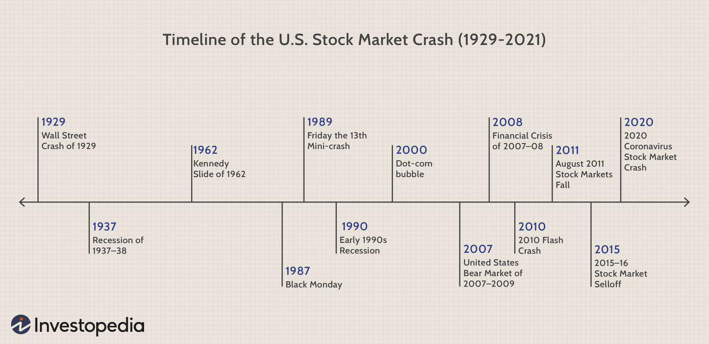

Algorithmic trading, or algo trading, involves the use of computer algorithms to automate the process of buying and selling financial instruments. It harnesses the power of advanced mathematical models and high-frequency data to make trading decisions at a speed and frequency that is impossible for a human trader. This technology-driven approach offers significant advantages, such as increased speed of execution, reduced transaction costs, and the elimination of human emotional influences from trading. However, it also introduces substantial risks, particularly the potential for market crashes.

Market crashes can be exacerbated by the very features that make algo trading appealing. The reliance on automated systems, capable of executing thousands of trades per second, can lead to sudden and severe market movements, especially when these systems operate with limited oversight or flawed algorithms. A prominent concern is their role in causing flash crashes—sudden, deep, and brief price declines followed by a quick recovery. These events highlight the vulnerabilities of financial systems increasingly reliant on algorithmic trading.

As these automated mechanisms take a central role in trading activities, there is increasing scrutiny over their contribution to market volatility. The interactions between various algorithms, often designed by different entities with conflicting objectives, can create feedback loops that magnify price swings. The May 6, 2010, flash crash is one example where algorithmic trading was implicated in a rapid market downturn.

This article examines several case studies of market crashes linked to algorithmic trading and explores the underlying mechanisms that contribute to such events. Moreover, it discusses strategies to mitigate the risks posed by these automated systems. Understanding how these crashes unfold is essential for developing more resilient trading systems and effective regulatory frameworks. This awareness allows for the evolution of safeguarding strategies, ensuring that the benefits of algorithmic trading can be harnessed without undermining market stability.

## Table of Contents

## Understanding Market Crashes

A market crash is a sudden, dramatic decline in the value of assets, precipitated by widespread panic selling or systemic breakdowns. Such occurrences can impact diverse financial markets, encompassing stocks, bonds, commodities, and increasingly, cryptocurrencies. Market crashes generally emerge from a confluence of economic imbalances, excessive financial leverage, and the collective behavior of market participants responding to unexpected events. 

Historically significant market crashes offer insight into the factors and repercussions of such events. Black Monday on October 19, 1987, saw the Dow Jones Industrial Average (DJIA) plunge by 22.6% in a single day. Though the reasons remain debated, advances in computer-aided trading, along with investor herd behavior, were implicated in the rapid sell-off cascade. The 2008 Financial Crisis, meanwhile, was precipitated by the collapse of major financial institutions, inflated asset prices fostered by subprime mortgage lending, and complex derivatives. This crisis exhibited a systemic failure driven largely by human decisions rather than algorithmic trading, yet it underscored the dangerous interaction between financial innovation and risk management failures.

The COVID-19 pandemic ushered in another substantial market disruption in March 2020. The unprecedented global shutdowns cultivated uncertainties that led to a rapid market descent, quickly amplified by the swift execution capabilities of [algorithmic trading](/wiki/algorithmic-trading) systems. During this period, stock indices like the S&P 500 recorded precipitous declines of over 30% in a matter of weeks. Algorithmic trading exacerbated this turmoil due to its inherent capacity to process and execute large volumes of transactions at extraordinary speeds, thereby accelerating declines.

Algorithmic trading has been increasingly scrutinized for its role in hastening market downturns during crashes. Its defining characteristic—executing transactions based on predefined parameters without human intervention—enables lightning-fast reactions to market signals and trends. However, this strength can transform into a liability, as seen in flash crashes, where high-speed automated trading contributes significantly to unpredictable and extreme price movements. Such algorithms, acting independently yet concurrently, might trigger a series of sell orders, further propelling the market into a downward spiral.

The intrinsic nature of algorithmic trading, while enhancing efficiency and [liquidity](/wiki/liquidity-risk-premium) under normal conditions, presents systemic risks under stress. As algorithms respond to market fluctuations at rates unattainable by human traders, they can unwittingly amplify [volatility](/wiki/volatility-trading-strategies) during crashes. Thus, understanding the dynamics and triggers of these automatic responses is crucial in creating resilient financial systems capable of withstanding and mitigating such abrupt disruptions.

## Flash Crashes in Algorithmic Trading

Flash crashes represent acute and short-lived episodes of dramatic market downturns, primarily instigated by high-frequency and algorithmic trading activities. These events are characterized by swift and severe declines in asset prices, followed almost as rapidly by a recovery. The interaction between rapid order execution and liquidity shortages plays a significant role in creating these volatile situations.

One of the most notable instances of a flash crash occurred on May 6, 2010, when the Dow Jones Industrial Average (DJIA) plunged nearly 1000 points within minutes. This drastic drop was largely attributed to an automated trading algorithm that executed a massive sell order in a short span of time, triggering a sequence of reactions in both human traders and other algorithmic systems. This chain reaction amplified the sell-off and resulted in an acute market dislocation.

High-frequency trading ([HFT](/wiki/high-frequency-trading-strategies)) algorithms, which can execute thousands of trades per second, are often at the heart of these crashes. In executing trades so rapidly, these algorithms can exacerbate price movements by responding to each other’s sell signals, thus creating a cascading effect. A minor disruption or an erroneous trade can propagate swiftly across markets, causing significant price swings. This phenomenon highlights the stark interplay between liquidity and market stability — during a flash crash, the market's ability to absorb large volumes of trades without affecting the price is significantly impaired.

These events expose critical vulnerabilities within automated trading systems. The high speed and [volume](/wiki/volume-trading-strategy) at which these algorithms operate mean that, without adequate checks, they can contribute to extreme volatility. As such, flash crashes underscore the pressing need for improved risk management strategies and regulatory oversight. Enhanced algorithm design that incorporates robust risk mitigation protocols, along with strategic market controls such as circuit breakers, can help in curtailing the effects of potential flash crashes.

The complexity of modern trading environments necessitates collaborative efforts between trading firms, regulators, and technology providers to ensure that trading algorithms are both sophisticated and secure. By acknowledging and addressing these weaknesses, the financial industry can strive towards maintaining stability in the face of automated trading’s rapid evolution.

## Mechanisms Behind Flash Crashes

Flash crashes often result from a complex interplay of factors, primarily involving automated trading algorithms and low liquidity conditions. These fleeting yet intense market declines can be triggered when algorithms execute highly rapid trading strategies under volatile market conditions. 

Automated trading systems often utilize threshold-based sell triggers, designed to initiate transactions based on predefined market movements. For instance, if a stock's price falls below a certain threshold, an algorithm might automatically sell off large quantities to mitigate potential losses. While these triggers aim to protect against losses, their simultaneous activation by multiple trading systems can lead to a feedback loop, where rapid selling causes a sharp decline in price, triggering further sell-offs.

Moreover, errors in algorithm design or unforeseen interactions between different trading systems can exacerbate market disruptions. An algorithm may misinterpret market movements or react to data in unpredictable ways, causing disproportionate responses. For example, if an algorithm mistakenly identifies a temporary price dip as a long-term downward trend, it could initiate a massive sell-off, exacerbating market declines.

External shocks, such as geopolitical events or unexpected economic announcements, can abruptly alter market sentiment. These external influences can trigger or amplify algorithmic responses, resulting in rapid and significant market movements. In highly automated markets, such shocks can leave little time for human intervention to correct or stabilize trading activities.

Another critical [factor](/wiki/factor-investing) contributing to flash crashes is the lack of market depth during trading disruptions. Market depth refers to the market's ability to sustain large orders without significantly affecting price levels. During volatile periods, liquidity providers might withdraw, leading to thinner markets. In such conditions, the automated execution of large sell orders can produce outsized price movements, as the remaining liquidity is insufficient to absorb the volume without drastic price adjustments.

In summary, flash crashes occur due to a combination of automated trading algorithms operating in low liquidity environments, potential algorithmic errors, unforeseen system interactions, and the impact of external shocks. Addressing these underlying mechanisms is vital for developing strategies to safeguard the stability and integrity of financial markets.

## Mitigating Risks in Algo Trading

Risk management plays a pivotal role in preventing and mitigating the potential adverse effects of flash crashes and other similar events in algorithmic trading. One of the foremost strategies employed is the implementation of circuit breakers. These mechanisms are designed to temporarily halt trading activities during periods of extreme volatility, thereby providing a necessary pause that allows for market stabilization and averts catastrophic downward spirals. According to the U.S. Securities and Exchange Commission (2023), circuit breakers can effectively curb panic selling by allowing time for market participants to assess information and strategize accordingly.

Enhancing the sophistication of trading algorithms is another crucial step in mitigating risk. By integrating a broader array of market indicators, algorithms can develop a more nuanced understanding of market dynamics, enabling them to make informed decisions even amidst volatility. This includes incorporating factors such as market depth, [order book](/wiki/order-book-trading-strategies) dynamics, and real-time news sentiment analysis. Advanced [machine learning](/wiki/machine-learning) models, such as neural networks and [reinforcement learning](/wiki/reinforcement-learning), can be employed to create algorithms capable of adaptive learning based on historical and real-time data. For instance, a reinforcement learning model can adjust trading strategies dynamically by evaluating previous outcomes and adjusting execution strategies accordingly.

Regulatory oversight is also imperative to ensure the robustness and integrity of algorithmic trading systems. Real-time monitoring of trading activities by regulatory bodies can help identify anomalies and potential market manipulations. Additionally, rigorous algorithm testing frameworks are essential to uncover vulnerabilities before deployment. This includes stress-testing algorithms against historical crash scenarios and simulating various market conditions to examine the algorithms' resilience and response.

Collaboration is another vital component in maintaining robust and secure financial markets. Trading firms, regulators, and technology providers must work together to share insights, develop standards, and create protocols that enhance the safety measures in algorithmic trading. Initiatives such as shared databases of trading anomalies and best practice workshops can facilitate this collaborative approach, as noted by the Financial Stability Board (2023).

Overall, by advancing algorithm development, strengthening regulatory frameworks, and fostering industry collaboration, the risks associated with algorithmic trading can be significantly mitigated. These efforts should aim not only to prevent flash crashes but also to ensure the broader stability and integrity of global financial markets.

## Conclusion

Flash crashes expose the inherent vulnerabilities present in algorithmic trading, emphasizing the importance of strategic oversight and comprehensive risk management strategies. These sudden and severe market downturns are indicative of the complex dynamics at play between automated trading systems and market conditions, necessitating ongoing scrutiny and regulatory intervention.

One of the most effective measures to safeguard market stability involves refining algorithms to prevent the amplification of erratic trading behaviors during volatile periods. By integrating adaptive learning mechanisms and broadening the scope of market indicators used as inputs, algorithms can be better equipped to handle extreme conditions with composure. Additionally, regulatory frameworks play a pivotal role in maintaining market integrity. These should focus on real-time monitoring, ensuring that any system irregularities are promptly addressed before they can influence broader market trends.

Circuit breakers are another essential tool for preventing the negative impacts of flash crashes. By temporarily halting trade during intense market volatility, these mechanisms provide necessary breathing space for market participants to reassess and realign their trading strategies. This pause is crucial for mitigating cascading sell-offs triggered by algorithmic trading patterns, which could otherwise lead to magnified losses.

Continuous learning and adaptation remain critical as algorithmic trading evolves, with both traders and regulators needing to stay abreast of technological advancements and market developments. This collaborative approach between market participants and regulatory bodies is vital for anticipating potential disruptions and crafting robust defenses against them.

By deepening the understanding of triggers and mechanisms behind market crashes, stakeholders can collaboratively bolster market resilience. This protection is not only crucial for avoiding financial loss but also for maintaining investor confidence in the stability and reliability of financial markets. Through strategic oversight, enhanced algorithms, and robust regulatory measures, the financial industry can strive toward a more secure trading environment.

## References & Further Reading

[1]: Aldridge, I. (2013). ["High-Frequency Trading: A Practical Guide to Algorithmic Strategies and Trading Systems"](https://www.amazon.com/High-Frequency-Trading-Practical-Algorithmic-Strategies/dp/1118343506). Wiley.

[2]: Lewis, M. (2014). ["Flash Boys: A Wall Street Revolt"](https://en.wikipedia.org/wiki/Flash_Boys). W. W. Norton & Company.

[3]: Harris, L. (2003). ["Trading & Exchanges: Market Microstructure for Practitioners"](https://www.amazon.com/Trading-Exchanges-Market-Microstructure-Practitioners/dp/0195144708). Oxford University Press.

[4]: Hendershott, T., & Riordan, R. (2013). ["Algorithmic Trading and the Market for Liquidity."](https://www.jstor.org/stable/43303831) The Review of Financial Studies, 26(3), 711-741.

[5]: Financial Stability Board. (2020). ["Review of the March Market Turmoil"](https://www.fsb.org/2020/11/holistic-review-of-the-march-market-turmoil/). 

[6]: Kirilenko, A. A., Kyle, A. S., Samadi, M., & Tuzun, T. (2017). ["The Flash Crash: High-Frequency Trading in an Electronic Market"](https://www.jstor.org/stable/26652722). The Journal of Law and Economics, 33(1), 361-383.