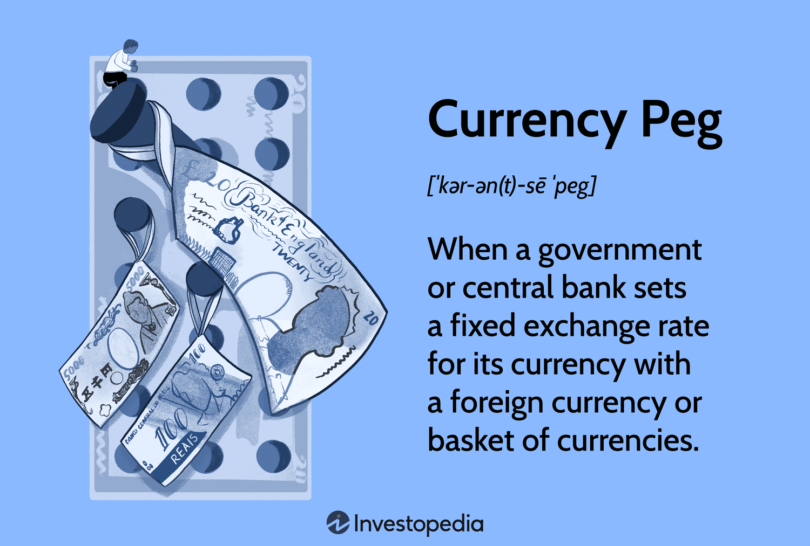

## Table of Contents

## What is a crawling peg?

A crawling peg is a type of exchange rate system where a country's currency is slowly adjusted over time against another currency or a basket of currencies. Instead of keeping the exchange rate fixed or letting it float freely, the central bank makes small, regular changes to the peg. This helps to keep the currency's value stable while still allowing it to adjust to economic changes.

Countries use a crawling peg to manage inflation and keep their exports competitive. By gradually changing the exchange rate, a country can avoid sudden shocks to its economy that might happen with a sudden change in the currency's value. This system is often used by countries that are transitioning from a fixed exchange rate to a more flexible one, helping them to adapt smoothly.

## How does a crawling peg differ from a fixed exchange rate?

A crawling peg and a fixed exchange rate are both ways to manage a country's currency, but they work differently. A fixed exchange rate means the value of a country's currency is set to a specific amount compared to another currency or a basket of currencies. This rate stays the same unless the government decides to change it. The goal is to keep the currency's value stable, but it can be hard to maintain if there are big changes in the economy.

On the other hand, a crawling peg lets the currency's value change slowly over time. Instead of keeping the rate the same, the central bank makes small adjustments regularly. This helps the currency adjust to economic changes without causing big shocks. It's like a middle ground between a fixed rate and letting the currency's value float freely. Countries might use a crawling peg when they want to move from a fixed rate to a more flexible one, making the transition smoother.

## What is the purpose of implementing a crawling peg system?

The main reason countries use a crawling peg system is to help their currency adjust to changes in the economy without causing big problems. When a country's economy changes a lot, a fixed exchange rate can be hard to keep. If the government suddenly changes the rate, it can shock the economy. A crawling peg lets the currency's value change slowly, so it can adapt to these changes without causing big ups and downs.

Another purpose of a crawling peg is to control inflation and keep the country's exports competitive. If a country's currency gets too strong, its exports can become expensive for other countries to buy. By slowly changing the exchange rate, the country can make sure its exports stay affordable. This helps the economy grow steadily without the risk of sudden changes in the currency's value causing problems.

## Can you explain how a crawling peg system works?

A crawling peg system is a way for a country to slowly change the value of its money over time. Instead of keeping the money's value the same all the time, the country's central bank makes small changes to it regularly. This helps the country's money stay stable but also lets it adjust to changes in the economy. Imagine you're moving a peg on a board very slowly, so it's always moving but not jumping around.

Countries use a crawling peg to keep their economy from getting shocked by big changes in their money's value. If the money's value changes too fast, it can make things like buying and selling goods harder. By changing the money's value a little bit at a time, the country can help its businesses and people plan better. It's like walking up a hill slowly instead of running, so you don't get tired all at once.

## What are the advantages of using a crawling peg for a country's currency?

Using a crawling peg for a country's currency has several advantages. One big advantage is that it helps keep the economy stable. Instead of suddenly changing the value of the money, which can shock businesses and people, a crawling peg lets the value change slowly. This means that companies can plan better because they know the money's value won't jump around. It's like adjusting to a change in weather gradually, so you're not caught off guard.

Another advantage is that a crawling peg can help control inflation. If a country's money gets too strong, it can make things more expensive for people at home and make the country's products too pricey for other countries to buy. By slowly changing the money's value, the country can keep prices stable and make sure its products stay affordable for other countries. This helps the economy grow without the risk of big price changes causing problems.

## What are the potential disadvantages or risks associated with a crawling peg?

One risk of using a crawling peg is that it can be hard to predict how the economy will change. If the central bank doesn't adjust the money's value just right, it might still cause problems. For example, if they change it too slowly, the money might get too strong or too weak, which can mess up prices and make it hard for businesses to plan. It's like trying to keep a boat steady in changing waves; if you don't move the steering wheel at the right time, you might end up going off [course](/wiki/best-algorithmic-trading-courses).

Another disadvantage is that a crawling peg can make people and businesses less confident. If they see the money's value always changing, even if it's slow, they might not trust it as much. This can lead to less investment in the country because people might think the money isn't stable. It's like if you're playing a game where the rules keep changing a little bit; you might not want to play as much because you're not sure what will happen next.

## How does a crawling peg affect inflation within a country?

A crawling peg can help a country control inflation by slowly changing the value of its money. If a country's money gets too strong, things can get more expensive for people at home. By making the money's value weaker little by little, the country can keep prices from going up too fast. It's like adjusting the heat on a stove slowly so the food doesn't burn.

But, if the central bank doesn't get the changes just right, a crawling peg can also make inflation worse. If they make the money's value weaker too slowly, it might not stop prices from going up. Or, if they make it weaker too fast, prices might go up even more. It's like trying to fill a bucket with water; if you pour too fast or too slow, you might end up spilling or not filling it enough.

## Can you provide examples of countries that have used a crawling peg system?

One country that used a crawling peg system is Mexico. They started using it in the 1980s to help control their economy. By slowly changing the value of the peso, Mexico wanted to keep inflation under control and make their exports more competitive. It helped them move from a fixed exchange rate to a more flexible one without causing big problems for their economy.

Another example is Chile. They used a crawling peg in the 1980s and 1990s to manage their currency, the peso. Chile wanted to keep their money's value stable but also let it adjust to changes in the economy. By making small changes to the peso's value over time, Chile was able to keep inflation in check and make sure their products stayed affordable for other countries to buy.

## How does a crawling peg impact international trade and investment?

A crawling peg can help make a country's products cheaper for other countries to buy. When a country slowly makes its money weaker, its exports become less expensive. This can help the country sell more of its products abroad, which is good for its economy. For example, if Mexico uses a crawling peg to make the peso weaker, their goods become cheaper for people in the United States to buy. This can lead to more trade between the two countries.

On the other hand, a crawling peg can make investors a bit nervous. If people see that a country's money is always changing, even if it's slowly, they might worry that it's not stable. This can make them less likely to invest money in that country. For instance, if Chile's peso is always adjusting a little bit, some investors might think twice about putting their money there because they're not sure what will happen next. So, while a crawling peg can help with trade, it might also make investment trickier.

## What are the key factors a country should consider before adopting a crawling peg?

Before a country decides to use a crawling peg, it should think about how well it can predict changes in its economy. A crawling peg works best when the country can make small changes to its money's value at the right times. If the economy changes a lot and the country can't guess what will happen, the crawling peg might not work well. It's like trying to hit a moving target; if you can't see where it's going, you might miss.

Another thing to consider is how much trust people and businesses have in the country's money. If they see the money's value changing all the time, even slowly, they might not trust it as much. This can make it harder for the country to get money from other countries for investments. So, the country needs to think about whether people will still believe in its money if it uses a crawling peg. It's like playing a game where the rules keep changing a little bit; if players don't trust the game, they might not want to play.

## How do central banks manage and adjust the rate in a crawling peg system?

Central banks manage a crawling peg by making small changes to the value of their money over time. They do this by setting a target rate for the money and then adjusting it slowly. For example, they might decide to make the money a little bit weaker every month. They use things like the country's inflation rate, how much money they're trading with other countries, and how their economy is doing to decide how much to change the rate. It's like slowly turning a dial to keep the temperature just right.

To make these adjustments, central banks often use tools like buying or selling their own money in the market. If they want to make their money a little bit weaker, they might sell some of it. This makes more of their money available, so its value goes down a bit. If they want to make it stronger, they might buy some of their money back. They do this carefully and regularly to keep the changes small and steady. It's like adding or taking away a little bit of water from a bucket to keep the level just right.

## What are the long-term economic impacts of maintaining a crawling peg on a country's economy?

Over the long term, using a crawling peg can help a country keep its economy stable. By slowly changing the money's value, the country can avoid big shocks that might happen if the money's value changed suddenly. This helps businesses and people plan better because they know the money's value won't jump around a lot. It can also help keep prices from going up too fast, which means people can buy things without worrying about them getting more expensive all the time. This stability can make the country's economy grow in a steady way, which is good for everyone.

But, there are also some risks to think about in the long run. If the central bank doesn't adjust the money's value just right, it might still cause problems. For example, if they change it too slowly, the money might get too strong or too weak, which can mess up prices and make it hard for businesses to plan. Also, if people see the money's value always changing, even if it's slow, they might not trust it as much. This can lead to less investment in the country because people might think the money isn't stable. So, while a crawling peg can help in the long term, it needs to be managed carefully to work well.

## References & Further Reading

1. Dornbusch, R., and Fischer, S. (1980). "Exchange Rates and the Crawling Peg." *Journal of Political Economy*, 88(6), pp. 1172-1191. This paper provides a comprehensive analysis of crawling peg systems and their capacity to adjust to inflationary pressures in developing economies.

2. Obstfeld, M., and Rogoff, K. (1995). "The Mirage of Fixed Exchange Rates." *Journal of Economic Perspectives*, 9(4), pp. 73-96. An exploration of the limitations and challenges faced by countries adopting fixed and pegged exchange rate regimes.

3. Taylor, A. M., and Taylor, M. P. (2004). "The Purchasing Power Parity Debate." *Journal of Economic Perspectives*, 18(4), pp. 135-158. This article debates the theory of purchasing power parity and its implications for currency valuation and exchange rate policy.

4. Lo, A. W., and MacKinlay, A. C. (1999). "A Non-Random Walk Down Wall Street." Princeton University Press. An essential resource for understanding how algorithmic trading strategies are formed and applied in modern financial markets.

5. Aldridge, I. (2013). "High-Frequency Trading: A Practical Guide to Algorithmic Strategies and Trading Systems." John Wiley & Sons. A detailed guide on algorithmic trading, providing insights into the complexities of developing and operating trading systems that respond to market changes with high speed and accuracy.

6. Yu, Y., and Wang, J. (2022). "Empirical Study on Pegged Exchange Rate Systems: The Case of Hong Kong." *Economic Modelling*, 116, pp. 34-45. A case study on how Hong Kong has maintained a pegged exchange rate system, analyzing its economic impacts and stability measures.

7. Dumas, B., and Niso Smith, W. A. (1995). "Dynamic Strategic Interactions: Policy Coordination and the Role of Exchange Rate Target Setting under Uncertainty." *International Economic Review*, 36(4), pp. 873-900. This paper evaluates the strategic interactions between nations in managing exchange rates, highlighting the complexities of coordination under uncertain financial landscapes.

These references provide a foundational basis for understanding the mechanisms, advantages, and limitations of crawling pegs and [algorithmic trading](/wiki/algorithmic-trading), while offering insights into historical and practical applications of pegged exchange rate systems.

