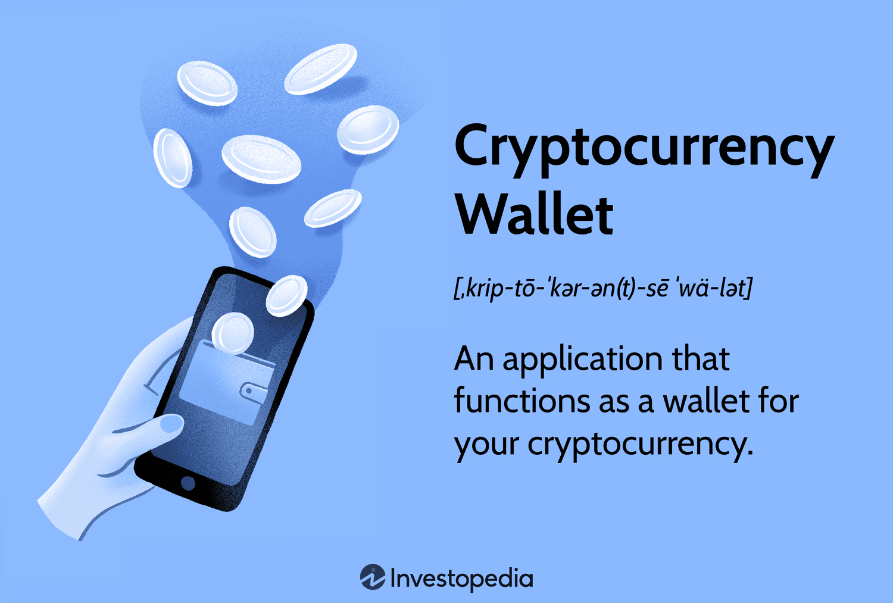

Understanding cryptocurrency wallets is key to participating in the digital asset ecosystem. These wallets serve as essential tools for storing, managing, and transacting with digital currencies like Bitcoin, Ethereum, and numerous altcoins. This article explores the nuances of crypto wallets, digital wallet creation, and their role in algorithmic trading.

Cryptocurrency wallets come in various forms, each tailored to different security needs and user preferences. From software-based solutions on your desktop or smartphone to hardware devices offering enhanced security, selecting the right wallet requires careful consideration of your specific requirements. Paper wallets and online platforms present additional options, with each type providing unique benefits and trade-offs in terms of convenience and protection of your assets.



Beyond understanding wallet types, creating and maintaining a digital wallet is crucial for safeguarding your investments. We will cover essential practices, such as configuring security settings, enabling two-factor authentication, and storing backup information like seed phrases securely. These steps ensure that your digital assets remain protected from unauthorized access and technical mishaps.

Additionally, algorithmic trading has emerged as a powerful tool for executing automated, high-speed trades in the cryptocurrency market. The seamless integration of digital wallets with algorithmic trading platforms can optimize your trading strategies, offering both security and efficiency. By exploring the interaction between wallets and trading algorithms, you stand to gain a competitive edge in rapidly moving markets.

Whether you're a beginner just entering the world of digital currencies or a seasoned trader seeking to refine your strategies, a thorough understanding of cryptocurrency wallets and their connection to algorithmic trading platforms can significantly enhance your financial activities. Through this guide, you'll acquire the knowledge necessary to improve your crypto management skills, protect your assets, and make the most of emerging market opportunities.

## Table of Contents

## Understanding Cryptocurrency Wallets

A cryptocurrency wallet is an essential tool for anyone participating in the digital asset ecosystem. It securely stores your private and public keys, enabling you to send, receive, and monitor your cryptocurrency holdings. To manage digital assets effectively, it is essential to understand the different types of cryptocurrency wallets available and their unique features and security implications.

### Types of Cryptocurrency Wallets

1. **Software Wallets**: Software wallets can be downloaded and installed on devices such as computers or smartphones. They come in various forms, including desktop, mobile, and web-based applications. Desktop wallets offer strong security as they are only accessible from the computer they are installed on. In contrast, mobile wallets provide convenience and ease of access due to their portability. Web-based wallets, accessible from any internet browser, offer greater accessibility but are often considered less secure due to the potential for online attacks.

2. **Hardware Wallets**: These are physical devices that securely store the user's private keys offline, making them highly resistant to hacking attempts. Hardware wallets are often considered one of the most secure options for storing cryptocurrencies, especially for long-term investors. They typically require users to connect the device to a computer or mobile device to execute transactions.

3. **Paper Wallets**: A paper wallet is a physical piece of paper containing the crypto address and its private key, typically generated through a secure offline process. This type of wallet offers high security, as it is not susceptible to online hacking. However, it requires careful handling, as physical damage or loss of the paper could result in the permanent loss of the stored assets.

4. **Online Wallets**: Also known as web wallets, online wallets are hosted on the cloud and can be accessed from any internet-connected device. They offer convenience and ease of access, but their security is often dependent on the service provider's measures, making them more vulnerable to cyberattacks compared to other options.

### Security and Convenience Features

Each wallet type offers a different balance of security and convenience. For example, hardware wallets provide robust security by keeping keys offline, while software and online wallets offer greater accessibility at the potential cost of enhanced vulnerability to cyber threats. Paper wallets contain no digital components but require physical protection to ensure asset safety.

### Essential Concepts: Seed Phrases and Backup Strategies

A crucial component of [cryptocurrency](/wiki/cryptocurrency) wallet security is the seed phrase, also known as a recovery phrase. This is a list of words generated by your wallet that enables you to recover your cryptocurrency if your wallet is lost, stolen, or damaged. It is vital to store seed phrases securely and offline to prevent unauthorized access.

Backup strategies should also include regularly updating wallets to the latest security patches, enabling two-[factor](/wiki/factor-investing) authentication where applicable, and securely storing private keys. For shared assets, multi-signature features can enhance security by requiring multiple signatures before a transaction can be completed.

Understanding these components and strategies is essential for effectively managing cryptocurrency assets, ensuring they remain secure and accessible.

## Digital Wallet Creation

Creating a digital wallet is the initial step for anyone looking to engage actively with the cryptocurrency ecosystem. The process involves selecting the right platform or software that suits your needs, initiating setup, and adhering to security measures to protect your digital assets.

### Setting Up a Digital Wallet

To set up a digital wallet, begin by choosing the appropriate type of wallet: software, hardware, or online. Software wallets, often app-based, are easy to access and use, while hardware wallets offer increased security by storing your keys offline. Online wallets, or web wallets, provide convenience by being accessible from any device with internet access but may have higher security risks.

Start by downloading a trusted wallet application or purchasing a reputable hardware wallet. For software wallets, ensure you download the application from the official website or app store to avoid scams or malware.

### Security Precautions

During wallet creation, it is crucial to observe several security practices:

1. **Two-Factor Authentication (2FA):** Activate 2FA for an added security layer. This requires you to verify your identity using an additional device or application, reducing the risk of unauthorized access.

2. **Seed Phrase Management:** The seed phrase is a crucial backup that allows wallet recovery if access is lost. Secure this phrase physically, like writing it down and storing it safely, rather than digitally to prevent hacking.

3. **Strong Passwords:** Use complex and unique passwords for your wallet and associated email accounts.

4. **Regular Updates:** Keep your wallet software updated to protect against vulnerabilities or exploits.

### Popular Digital Wallet Options

Numerous digital wallet options are available in the market, each with unique features:

- **Coinbase Wallet:** Known for its user-friendly interface and robust security features, it allows users to access decentralized apps (DApps) directly.
- **Trezor and Ledger:** Popular hardware wallets that offer superior offline security, supporting multiple cryptocurrencies.
- **MetaMask:** A browser-based wallet particularly favored among Ethereum users for its seamless integration with decentralized exchanges and DApps.

These options offer varying degrees of convenience, security, and additional features like integration with trading platforms or decentralized applications.

### Mobile Integration

To cater to the demands of mobility and flexibility, integrating wallets with mobile devices is essential. Most modern wallets, such as Trust Wallet and Coinbase Wallet, offer mobile versions, enabling transactions on-the-go and providing real-time updates. When setting up on mobile, ensure you are connected to a secure network and avoid using public Wi-Fi to prevent security breaches.

Creating and managing a digital wallet involves both choosing the right technological tools and adhering to best security practices, ensuring the protection and ease of use of your cryptocurrency assets. By understanding each type of wallet and associated security measures, individuals can confidently store and manage their digital assets.

## Algorithmic Trading and Its Intersection with Cryptocurrency Wallets

Algorithmic trading, or algo trading, employs powerful algorithms to automate trading decisions and execute high-speed transactions in the cryptocurrency market. This approach capitalizes on computational power to analyze market data and execute trades at optimal times, often capturing small price differences that may not be exploitable through manual trading.

**Interaction Between Algo Trading Platforms and Cryptocurrency Wallets**

The core aspect of integrating algo trading with cryptocurrency wallets is the seamless execution of transactions. Algo trading platforms connect to digital wallets via APIs (Application Programming Interfaces), which facilitate real-time communication and transaction processing. This interaction allows traders to initiate and complete trades directly from their wallets without manual intervention.

Example of a simplified Python function to interface a trading algorithm with a digital wallet API:

```python
import requests

def execute_trade(api_url, wallet_address, trade_data, api_key):
    headers = {
        'Authorization': f'Bearer {api_key}',
        'Content-Type': 'application/json'
    }
    trade_request = {
        'wallet_address': wallet_address,
        'trade_data': trade_data
    }
    response = requests.post(api_url, json=trade_request, headers=headers)
    return response.json()
```

**Popular Algo Trading Strategies with Wallet Integrations**

1. **Market Making**: This strategy involves placing both buy and sell orders to profit from the bid-ask spread. By integrating secure wallets, traders can automatically execute trades, maintain liquidity, and manage inventory effectively.

2. **Arbitrage**: Arbitrage takes advantage of price discrepancies across different exchanges. With wallet integration, algorithms can swiftly transfer assets between exchanges to exploit these differences.

3. **Trend Following**: This strategy identifies and follows market trends. Secure wallet integration ensures that trades are executed instantly whenever a trend signal is received, minimizing delay and potential slippage.

**Benefits of Wallet Integration with Trading Algorithms**

Integrating secure wallets with algo trading systems enhances both safety and efficiency. Wallet security features, such as encryption and private key management, protect assets against unauthorized access. Moreover, the automation of transactions reduces human error and increases transaction speed, crucial for capturing favorable market conditions.

**Technical Requirements for Implementation**

Successful implementation of algo trading with cryptocurrency wallets involves several technical considerations:

- **API Support**: Ensure that the chosen wallet and trading platform have robust API support for seamless integration.

- **Latency Optimization**: Low-latency connections are vital for executing trades quickly and efficiently. Optimizing network setups and using servers located near major exchanges can reduce latency.

- **Data Analysis Tools**: Algorithms require constant streams of market data for analysis. Utilizing data toolkits and platforms that provide real-time data feeds can significantly improve trading outcomes.

- **Scalability**: The infrastructure must support high volumes of transactions and accommodate potential increases in trading activity.

The intersection of [algorithmic trading](/wiki/algorithmic-trading) and cryptocurrency wallets presents an opportunity for traders to maximize efficiency and security in their trading activities. By understanding and implementing the technical requirements, traders can effectively leverage the capabilities of algo trading to optimize their performance in the dynamic crypto market.

## Choosing the Right Wallet for Algo Trading

Selecting the appropriate cryptocurrency wallet is a critical step when setting up an algorithmic trading (algo trading) system. The choice of wallet is not merely about storing digital assets but also involves ensuring seamless integration with trading platforms, security, and speed of transactions. This section highlights key factors to consider, the roles of advanced features such as API support, examples of commonly used wallets, and the importance of due diligence when selecting a wallet for algo trading.

### Key Factors Influencing Wallet Selection

1. **Security**: The foremost factor in selecting a wallet is its security. An optimal wallet for algo trading should offer robust security measures including advanced encryption methods, secure access protocols, and multi-signature support to protect digital assets from unauthorized access.

2. **Compatibility with Trading Platforms**: The wallet must be compatible with the algo trading platforms you intend to use. This compatibility ensures smooth data exchange and transaction execution without disruptions. Some wallets provide extensive API support that facilitates integration with various trading platforms, allowing for improved automation and control.

3. **Transaction Speed**: In the fast-paced environment of algorithmic trading, transaction speed is crucial. The wallet should be capable of processing transactions swiftly to capitalize on market opportunities without delay. Wallets that incur minimal latency in confirming transactions are preferred to maintain trading effectiveness.

### Benefits of Advanced Features

- **API Support**: Wallets with strong API support enable developers to create customizable trading solutions that suit specific trading strategies. APIs allow for automated trading strategies, real-time monitoring, and data analysis, which are integral components of algo trading.

- **Advanced Encryption**: With the growing threat of cyber security breaches, wallets equipped with advanced encryption protocols add an extra layer of protection. Encryption ensures that all data being exchanged between the wallet and trading platforms is secure, protecting sensitive information from potential threats.

### Examples of Wallets Commonly Used by Algo Traders

- **MetaMask**: Popular among traders for its simplicity and robust API capabilities, MetaMask allows integration with DeFi platforms and is compatible with various trading algorithms due to its versatile plugin architecture.

- **Ledger Nano S/X**: A hardware wallet like Ledger Nano offers high security and supports multiple cryptocurrencies, making it ideal for traders wanting secure offline storage. Although primarily for storage, its features can complement trading setups when combined with software interfaces.

- **Exodus**: Known for its user-friendly interface and extensive API functionalities, Exodus supports a wide range of cryptocurrencies, providing flexibility for algorithmic traders.

### Due Diligence in Wallet Selection

When choosing a wallet, thorough research and due diligence are imperative. Verify the wallet's security credentials by reviewing its open-source code (if available) and community feedback. Assess the wallet provider’s reputation, history of security incidents, and their response to past vulnerabilities. Additionally, evaluate the wallet's customer support services to ensure prompt assistance in case of technical issues.

In conclusion, selecting the right wallet for algo trading involves evaluating security, compatibility, and transaction efficiency while leveraging advanced features like API support and encryption. By conducting thorough research and opting for reputable wallet providers, traders can enhance the security and effectiveness of their algorithmic trading operations.

## Best Practices for Managing Your Cryptocurrency Wallet

Maintaining your wallet's security is essential for safeguarding digital assets from potential threats. One of the fundamental practices is to ensure that your wallet software is regularly updated. Security patches and updates are routinely released to address vulnerabilities and improve functionality. Ignoring these can leave your wallet susceptible to unauthorized access or data breaches. To automate this process, enabling automatic updates if the feature is available can be a beneficial practice.

Periodically reviewing your wallet's security settings is equally important. This involves verifying that backup and recovery options are up-to-date. A comprehensive backup plan should include both the wallet's data and the private keys, stored in a secure, offline location. Recovery preparations might also include creating and safely storing a seed phrase, which is crucial for recovering your wallet in case of data loss or device failure.

Phishing scams and unsecured network connections pose significant threats to wallet security. Phishing scams attempt to trick users into disclosing private keys or personal information under false pretenses. To mitigate this risk, be vigilant about the authenticity of emails and websites you interact with, and use browser extensions designed to detect phishing attempts. Avoiding unsecured network connections, particularly public Wi-Fi, when accessing your wallet is also crucial, as these networks can be hotspots for attacks such as man-in-the-middle.

The confidentiality of private keys is paramount. Private keys are essentially the password to your crypto funds, and if disclosed, they can be used to access and drain your wallet without the possibility of reversal. Store private keys securely offline, known as cold storage, to protect them from online threats.

For users operating shared wallets, implementing multi-signature features adds an additional layer of security. Multi-signature, or multisig, requires multiple approvals before a transaction can be executed. This reduces the risk of unauthorized transactions, as a single compromised key does not allow access to the crypto assets.

By adhering to these best practices, you can significantly enhance the security of your cryptocurrency wallet, ensuring the protection of your digital assets against various threats while maintaining effective management strategies.

## Conclusion

Understanding and effectively managing your cryptocurrency wallet is crucial for anyone looking to actively participate in digital markets. Cryptocurrency wallets serve as the secure linchpin for storing and managing the cryptographic keys necessary to access and transact with digital assets. As the digital asset ecosystem continues to grow and evolve, the ability to seamlessly integrate these wallets with algorithmic trading platforms can significantly enhance trading strategy efficiency, allowing for higher-speed transactions and more nuanced trading tactics. 

Navigating the complexities of wallet management requires a comprehensive understanding of both the available technologies and the associated security measures. By adhering to best practices outlined in previous sections, such as selecting the appropriate wallet type based on security needs and ensuring robust integration capabilities, you can safeguard your assets while optimizing transaction processes. Regular updates and security checks, like enabling two-factor authentication, form the bedrock of effective wallet management, minimizing vulnerabilities and protecting against threats like phishing and unauthorized access. 

Moreover, staying informed about the latest technological advancements in wallet solutions and evolving trading strategies is essential for maintaining a competitive edge. Modern wallet technologies are continually advancing, offering features such as API support, multi-signature capabilities, and enhanced encryption techniques. These innovations not only provide additional layers of security but also improve the efficiency and flexibility of your trading operations. 

In conclusion, the judicious management and integration of cryptocurrency wallets are pivotal to leveraging market opportunities efficiently. By adopting the latest wallet solutions and aligning them with well-informed trading strategies, traders can substantially enhance their engagement within the digital asset landscape, ensuring a secure and lucrative trading journey.

## References & Further Reading

[1]: Andreas M. Antonopoulos. ["Mastering Bitcoin: Unlocking Digital Cryptocurrencies,"](https://books.google.com/books/about/Mastering_Bitcoin.html?id=IXmrBQAAQBAJ) O'Reilly Media.

[2]: Roger Wattenhofer. ["The Science of the Blockchain,"](https://books.google.com/books/about/The_Science_of_the_Blockchain.html?id=81SBjwEACAAJ) CreateSpace Independent Publishing Platform.

[3]: Satoshi Nakamoto. ["Bitcoin: A Peer-to-Peer Electronic Cash System."](https://nakamotoinstitute.org/library/bitcoin/) 

[4]: Antonopoulos, A.M., & Wood, G. ["Mastering Ethereum: Building Smart Contracts and DApps,"](https://www.amazon.com/Mastering-Ethereum-Building-Smart-Contracts/dp/1491971940) O'Reilly Media.

[5]: Nader Naifar (Ed.). ["Handbook of Blockchain, Digital Finance, and Inclusion, Volume 1."](https://www.sciencedirect.com/book/9780128104415/handbook-of-blockchain-digital-finance-and-inclusion-volume-1) Academic Press.