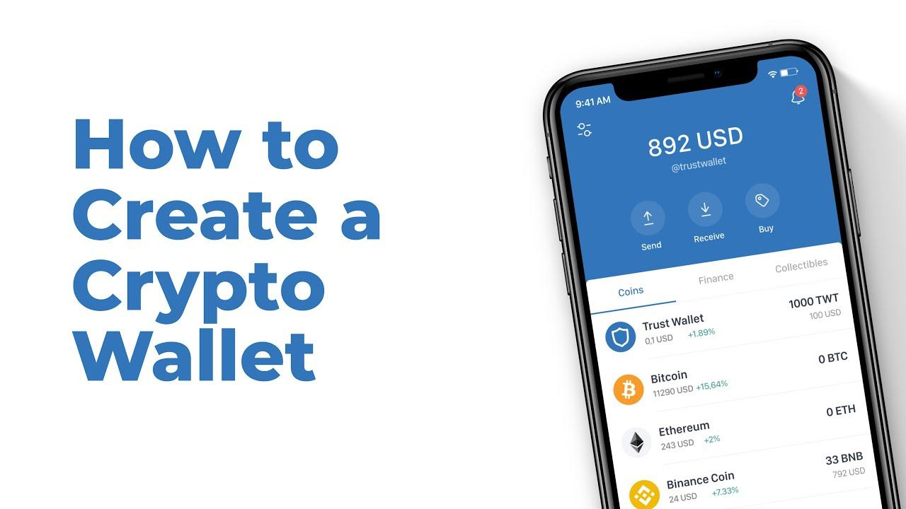

## Table of Contents

## What is a cryptocurrency wallet and why do you need one?

A cryptocurrency wallet is a tool that helps you store, send, and receive digital currencies like Bitcoin and Ethereum. It's like a digital bank account, but instead of keeping your money in a bank, you keep it in your wallet. The wallet doesn't store the actual coins but holds the information necessary to access and manage your funds on the blockchain, which is a public ledger of all cryptocurrency transactions.

You need a cryptocurrency wallet because it gives you control over your digital money. Without a wallet, you wouldn't be able to securely store your cryptocurrencies or make transactions. A wallet also helps you keep your funds safe by using private keys, which are secret codes that only you know. This means that you, and only you, can access and spend your cryptocurrencies, making it a crucial tool for anyone involved in the world of digital currencies.

## What are the different types of cryptocurrency wallets?

There are several types of cryptocurrency wallets, each with its own way of helping you store and manage your digital money. The first type is a software wallet, which is like an app you can download on your computer or phone. These wallets are easy to use and let you quickly send and receive cryptocurrencies. There are also online wallets, which you can access through a website. They're convenient because you can use them from any device with an internet connection, but they can be riskier because they're managed by a third party.

Another type is a hardware wallet, which is a small device that looks like a USB stick. It's very secure because it keeps your private keys offline, away from hackers. You plug it into your computer when you want to make a transaction. Lastly, there are paper wallets, which are just pieces of paper with your private and public keys printed on them. They're very secure if you keep them safe, but they're not easy to use for making transactions because you have to enter the keys manually every time.

Each type of wallet has its pros and cons. Software and online wallets are easy to use but can be less secure. Hardware and paper wallets are more secure but can be harder to use. Choosing the right wallet depends on how much you value ease of use versus security, and how often you plan to use your cryptocurrencies.

## How do you choose the right type of wallet for your needs?

Choosing the right type of wallet depends on what you need and how you want to use your cryptocurrencies. If you want something easy to use and you plan to make a lot of transactions, a software wallet or an online wallet might be best for you. These wallets are like apps on your phone or computer, and you can use them anytime, anywhere. They're good for people who want to quickly buy, sell, or trade their digital money. But, they can be a bit riskier because they're connected to the internet, which means hackers could try to steal your money.

If keeping your money safe is more important to you, then a hardware wallet or a paper wallet might be a better choice. A hardware wallet is like a small device that you plug into your computer. It keeps your money offline, which makes it very hard for hackers to get to it. A paper wallet is just a piece of paper with codes written on it. It's very secure if you keep it in a safe place, but it's not easy to use because you have to type in the codes every time you want to spend your money. So, if you don't plan to use your cryptocurrencies often, these types of wallets can be a good way to keep them safe.

In the end, it's all about finding the right balance between how easy it is to use the wallet and how safe it keeps your money. Think about how often you'll be using your cryptocurrencies and how important security is to you. That will help you pick the wallet that's just right for your needs.

## What are the steps to set up a software wallet?

Setting up a software wallet is pretty easy and can be done in just a few steps. First, you need to choose a software wallet that you like. There are many different ones out there, so pick one that works on your computer or phone. Once you've picked one, go to their website and download the app. After the app is downloaded, open it and follow the instructions to install it on your device. When the installation is done, you'll need to create a new wallet. This usually involves making a username and password. Make sure your password is strong and hard to guess to keep your money safe.

After you've created your new wallet, the next step is to set up your private and public keys. Your private key is like a secret code that only you know, and it's used to spend your money. Your public key is like your wallet's address that you can share with others so they can send you money. The wallet app will usually generate these keys for you, but you'll need to write down or save the private key in a safe place. Some wallets also give you a recovery phrase, which is a list of words that you can use to get your money back if you lose your private key. Make sure to keep this recovery phrase safe, too. Once you've saved your keys and recovery phrase, your software wallet is all set up and ready to use. You can now start sending and receiving cryptocurrencies.

## How do you secure your cryptocurrency wallet?

Securing your cryptocurrency wallet is really important to keep your digital money safe. One of the best ways to do this is by using a strong password. Make sure your password is long and has a mix of letters, numbers, and symbols. It should be something that's hard for others to guess but easy for you to remember. Also, never share your password with anyone. If someone else knows your password, they could steal your money. Another important thing is to enable two-factor authentication if your wallet supports it. This adds an extra layer of security by asking for a special code sent to your phone or email whenever you log in.

Another way to keep your wallet safe is by protecting your private key and recovery phrase. Your private key is like a secret code that lets you spend your money, so you need to keep it very safe. Write it down and store it in a secure place, like a safe or a locked drawer. Don't keep it on your computer or phone where hackers could find it. The same goes for your recovery phrase, which is a list of words that can help you get your money back if you lose your private key. Keep this phrase safe, too, and never share it with anyone. By taking these steps, you can help make sure your cryptocurrency wallet stays secure and your money stays safe.

## What are the best practices for managing your wallet's private keys?

Keeping your private keys safe is really important if you want to protect your cryptocurrency. Your private key is like a secret code that lets you spend your money, so you need to keep it very safe. One good way to do this is by writing it down on paper and storing it in a safe place, like a locked drawer or a safe. Don't keep it on your computer or phone where hackers could find it. Also, never share your private key with anyone. If someone else knows your private key, they could steal your money.

Another good practice is to make copies of your private key and keep them in different safe places. This way, if something happens to one copy, you still have another one. You can also use a recovery phrase, which is a list of words that can help you get your money back if you lose your private key. Keep this phrase safe, too, and never share it with anyone. By following these simple steps, you can help make sure your private keys stay secure and your cryptocurrency stays safe.

## How do you send and receive cryptocurrency using your wallet?

To send cryptocurrency using your wallet, you first need to open your wallet app on your computer or phone. Once it's open, you'll see an option to send money. Click on that, and you'll be asked to enter the amount of cryptocurrency you want to send and the recipient's public address. The public address is like the other person's wallet address, and you can get it from them. After you enter the amount and the address, you'll need to confirm the transaction. This might ask you to enter your password or use a special code if you have two-factor authentication set up. Once you confirm, the transaction will be sent to the blockchain, and the money will be on its way to the other person's wallet.

To receive cryptocurrency, you also start by opening your wallet app. Look for an option that says something like "receive" or "get money." When you click on it, you'll see your public address, which is like your wallet's address that you can share with others. You can copy this address or show a QR code that has the address in it. Share this address with the person who wants to send you money. They'll use it to send you the cryptocurrency. Once they do, the money will show up in your wallet, usually after the transaction is confirmed on the blockchain. It's that simple!

## What should you do if you lose access to your wallet?

If you lose access to your wallet, the first thing you should do is stay calm. Losing access can happen if you forget your password, lose your private key, or if your device gets broken or stolen. If you have a recovery phrase, you can use it to get your money back. The recovery phrase is a list of words that you should have written down and kept in a safe place. Use the recovery phrase to set up your wallet again on a new device or to recover your account on the same device.

If you don't have a recovery phrase, things can be a bit trickier. You might need to contact the wallet's customer support if it's an online or software wallet. They might be able to help you get back into your account, but there's no guarantee. If you're using a hardware wallet or a paper wallet and you lose your private key, it can be very hard to get your money back. That's why it's so important to always keep your private key and recovery phrase safe. Without them, you might lose your cryptocurrency for good.

## How do hardware wallets differ from software wallets, and when should you use them?

Hardware wallets and software wallets are different in how they keep your cryptocurrency safe and how you use them. A hardware wallet is a small device that looks like a USB stick. It's really secure because it keeps your private keys offline, away from hackers. You plug it into your computer when you want to make a transaction, and it's good for people who want to keep their money very safe. A software wallet, on the other hand, is like an app on your computer or phone. It's easy to use and lets you quickly send and receive cryptocurrencies, but it's connected to the internet, which can make it less secure.

You should use a hardware wallet if keeping your money safe is more important to you than being able to use it quickly. Hardware wallets are great for people who don't plan to use their cryptocurrencies very often but want to make sure they stay secure. If you're trading a lot or need to make transactions often, a software wallet might be better for you. It's easier to use and lets you access your money whenever you need to, but you'll need to be careful about keeping it secure because it's online.

## What are the advanced security features available in some cryptocurrency wallets?

Some cryptocurrency wallets have advanced security features to keep your money extra safe. One of these features is multi-signature, or multi-sig, which means that more than one person needs to agree before you can spend your money. It's like needing more than one key to open a safe. This is really good if you're working with others or if you want to make sure no one can take your money without your permission. Another feature is called cold storage, where your private keys are kept offline on a device that's not connected to the internet. This makes it really hard for hackers to steal your money because they can't get to your keys.

Some wallets also have something called hardware security modules (HSMs), which are special devices that help keep your private keys safe. They're like super secure places where your keys are kept, making it very hard for anyone to get to them. Another cool feature is encryption, which scrambles your data so that only you can read it. This means that even if someone did get into your wallet, they wouldn't be able to understand your private information. By using these advanced security features, you can make sure your cryptocurrency stays safe and secure.

## How can you integrate your wallet with decentralized applications (dApps)?

To integrate your wallet with decentralized applications, or dApps, you first need to make sure your wallet supports them. Many modern wallets, especially software and online wallets, have built-in features that let you connect to dApps easily. When you're using a dApp, you'll see a button that says something like "Connect Wallet" or "Log In with Wallet." Click on that button, and you'll be asked to choose your wallet from a list. Once you select your wallet, it will ask you to confirm the connection. This usually involves signing a message with your private key to prove it's really you. After you confirm, your wallet is connected to the dApp, and you can start using it to interact with the app.

Once your wallet is connected to a dApp, you can do things like send and receive tokens, play games, or use other services that the dApp offers. The dApp will show you what you can do and how to do it. For example, if you're using a dApp for trading, you can see your balance, make trades, and see your transaction history right in the app. It's important to be careful when you're using dApps because they can ask for permission to do things with your money. Always make sure you trust the dApp before you connect your wallet and give it permission to use your funds.

## What are the future trends in cryptocurrency wallet technology?

In the future, cryptocurrency wallets are likely to become even easier to use and more secure. One big trend is the use of biometric security, like fingerprint or face recognition, to keep your wallet safe. This means you could unlock your wallet just by using your finger or looking at your phone, making it quicker and easier than typing in a password. Another trend is better integration with other apps and services. Wallets might connect more smoothly with things like online shopping or social media, making it easier to use your cryptocurrencies for everyday things. This would make digital money feel more like regular money, which could help more people start using it.

Another trend is the growth of self-custody wallets, where you keep control of your own money instead of trusting it to a company. These wallets will get better at helping you manage your money without needing to understand all the complicated stuff about cryptocurrencies. They might use simpler ways to show you your balance and help you make transactions. Also, wallets might start using artificial intelligence to help you make smarter choices with your money, like suggesting when to buy or sell. As more people use cryptocurrencies, wallets will keep getting better to meet everyone's needs, making them safer, easier, and more useful.

## References & Further Reading

[1]: Andreas M. Antonopoulos. ["Mastering Bitcoin: Unlocking Digital Cryptocurrencies,"](https://books.google.com/books/about/Mastering_Bitcoin.html?id=IXmrBQAAQBAJ) O'Reilly Media.

[2]: Roger Wattenhofer. ["The Science of the Blockchain,"](https://books.google.com/books/about/The_Science_of_the_Blockchain.html?id=81SBjwEACAAJ) CreateSpace Independent Publishing Platform.

[3]: Satoshi Nakamoto. ["Bitcoin: A Peer-to-Peer Electronic Cash System."](https://nakamotoinstitute.org/library/bitcoin/) 

[4]: Antonopoulos, A.M., & Wood, G. ["Mastering Ethereum: Building Smart Contracts and DApps,"](https://www.amazon.com/Mastering-Ethereum-Building-Smart-Contracts/dp/1491971940) O'Reilly Media.

[5]: Nader Naifar (Ed.). ["Handbook of Blockchain, Digital Finance, and Inclusion, Volume 1."](https://www.sciencedirect.com/book/9780128104415/handbook-of-blockchain-digital-finance-and-inclusion-volume-1) Academic Press.