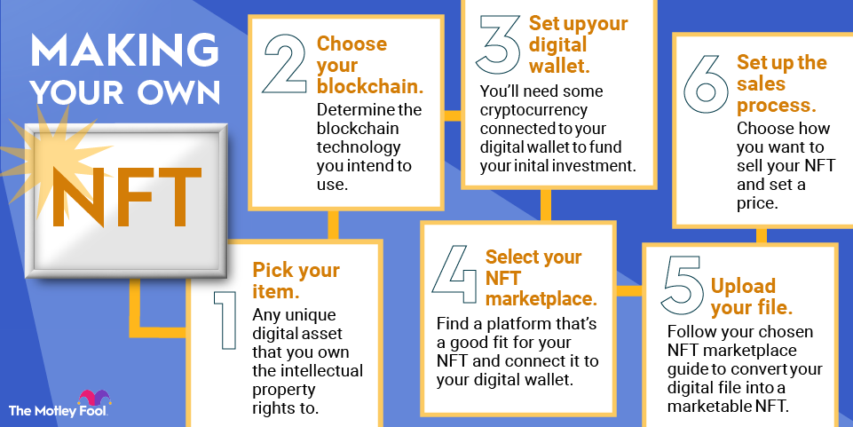

## Table of Contents

## What is an NFT and why are they popular?

An NFT, or Non-Fungible Token, is a special kind of digital item that you can own on the internet. Unlike regular money or cryptocurrencies like Bitcoin, which are the same and can be swapped one for one, each NFT is unique and can't be swapped like that. NFTs are often used to represent things like art, music, or even tweets. They work on blockchain technology, which is like a digital ledger that keeps track of who owns what.

NFTs became popular because they let people own and trade unique digital items in a way that wasn't possible before. People like them because they can buy, sell, and show off their digital collections, kind of like collecting baseball cards or stamps, but online. Also, some people see NFTs as a way to invest and make money, hoping that the value of their NFTs will go up over time. This mix of owning something special and the chance to make money has made NFTs a big deal in the digital world.

## What are the basic requirements to create an NFT?

To create an NFT, you need a few basic things. First, you need something digital that you want to turn into an NFT, like a piece of art, a song, or even a tweet. This is called the "asset." Next, you need to have a digital wallet that can hold cryptocurrencies, because you'll need to pay for things like transaction fees. Most people use wallets that support Ethereum, since it's the most common blockchain for NFTs.

After you have your asset and wallet, you need to choose a platform where you can create and sell your NFT. There are many platforms out there, like OpenSea, Rarible, and Mintable. Each platform has its own steps, but generally, you'll upload your asset, add details like a title and description, and set a price if you want to sell it. You'll also need to "mint" your NFT, which means adding it to the blockchain. This usually costs a small fee, paid in the [cryptocurrency](/wiki/cryptocurrency) of the blockchain you're using.

That's the basic process! Once your NFT is minted, it's officially on the blockchain, and you can sell it, keep it, or do whatever you want with it. Remember, creating an NFT is pretty straightforward, but it does take a bit of setup and understanding of how blockchains work.

## Which platforms can I use to mint my NFT?

There are several platforms you can use to mint your NFT. Some of the most popular ones include OpenSea, Rarible, and Mintable. OpenSea is one of the biggest and lets you create NFTs for free, but you'll need to pay a fee when you sell them. Rarible is another good choice and it's user-friendly, letting you mint NFTs directly on their site. Mintable is also easy to use and offers different ways to mint, like "gasless" minting, which means you don't have to pay the usual blockchain fees upfront.

Each platform has its own steps, but they all work in a similar way. You'll need to connect your digital wallet to the platform, upload your digital file, add details like a title and description, and set a price if you want to sell it. Once everything is set up, you'll hit a button to mint your NFT, which adds it to the blockchain. This process usually costs a small fee, paid in the cryptocurrency of the blockchain you're using, like Ethereum. After your NFT is minted, it's ready to be sold, kept, or shown off in your collection.

## How do I set up a digital wallet for NFTs?

Setting up a digital wallet for NFTs is pretty easy. First, you need to pick a wallet that works with the blockchain you want to use. Ethereum is the most common, so wallets like MetaMask, Trust Wallet, or Coinbase Wallet are good choices. You can download these wallets as apps on your phone or as extensions on your web browser. Once you've picked a wallet, you'll need to follow the steps to set it up. This usually means creating a new wallet, which will give you a secret phrase called a "seed phrase." It's really important to write this down and keep it safe, because it's the only way to get your wallet back if you lose it.

After your wallet is set up, you'll need to add some cryptocurrency to it. Most NFT platforms use Ethereum, so you'll need to buy some ETH and send it to your wallet. You can buy ETH on places like Coinbase or Binance and then transfer it to your wallet. Once your wallet has some ETH, you're ready to connect it to an NFT platform like OpenSea or Rarible. Just follow the platform's instructions to link your wallet, and you'll be all set to start creating and trading NFTs.

## What types of digital assets can be turned into NFTs?

NFTs can be made from many different kinds of digital stuff. You can turn art, like drawings or paintings, into NFTs. Music, videos, and even short clips called GIFs can become NFTs too. People also make NFTs out of digital trading cards, virtual real estate, and even tweets or memes. If it's a digital file, you can probably turn it into an NFT.

The key thing is that the digital item has to be something special or unique. That's what makes it a non-fungible token, or NFT. People like turning all sorts of digital things into NFTs because it lets them own and trade them in new ways. Whether it's a cool piece of art, a catchy song, or a funny meme, if it's something you think others might want to own, you can make it into an NFT.

## How do I choose the right blockchain for my NFT?

Picking the right blockchain for your NFT can feel a bit tricky, but it's really about what you want to do with your NFT and what you like. Ethereum is the most popular choice because it's been around the longest and has a lot of platforms and tools that work well with it. If you want to sell your NFT on places like OpenSea or Rarible, Ethereum is a good pick. But, it can be a bit expensive because of something called "gas fees," which are the costs you pay to use the blockchain.

If you want to save money on fees, you might want to look at other blockchains like Flow or Polygon. Flow is known for being used in games and for digital collectibles, and it's cheaper to use than Ethereum. Polygon is another good choice because it works with Ethereum but is cheaper and faster. It's all about what you need - if you want the most options and don't mind spending a bit more, go with Ethereum. If saving money is more important, then Flow or Polygon might be better for you.

## What are the steps to mint an NFT?

To mint an NFT, you first need to pick a platform like OpenSea, Rarible, or Mintable. Once you've chosen a platform, you'll need to connect your digital wallet to it. This wallet should have some cryptocurrency, usually Ethereum, to cover the costs. After connecting your wallet, you'll upload the digital file you want to turn into an NFT. This could be a picture, a song, or any other digital thing. You'll also add details like a title, description, and how much you want to sell it for if you're planning to sell it.

Once everything is set up, you'll hit a button to mint your NFT. This means adding it to the blockchain, which is like a big digital record book that keeps track of who owns what. Minting usually costs a small fee, which you pay with the cryptocurrency in your wallet. After your NFT is minted, it's officially on the blockchain and ready to be sold, kept, or shown off in your collection.

## How can I add value to my NFT through rarity or uniqueness?

To make your NFT more valuable, you can make it rare or unique. One way to do this is by making it part of a limited series. If you only make a few NFTs like yours, people might want them more because they're hard to get. You can also add special features or details to your NFT that no other NFT has. This could be a hidden message, a special animation, or even a personal story that goes with it. The more unique your NFT is, the more people might want to own it.

Another way to add value is by making your NFT part of a bigger story or collection. If your NFT fits into a larger set of NFTs, like a series of art pieces that tell a story, it can become more interesting to collectors. They might want to own the whole set, which can drive up the value of each piece. You can also work with other artists or creators to make your NFT part of a special collaboration. When people see that your NFT is connected to other cool things or people, they might see it as more valuable and be willing to pay more for it.

## What are the costs associated with creating and selling an NFT?

When you make an NFT, you need to pay some costs. The first cost is called a "gas fee," which is what you pay to use the blockchain. This fee can change a lot depending on how busy the blockchain is and which one you're using. Ethereum, which is the most popular, can have high gas fees, sometimes even more than $100. But if you use a different blockchain like Flow or Polygon, the fees might be a lot lower. Also, some platforms let you mint your NFT for free, but you'll still need to pay when you sell it.

After you've made your NFT, there are more costs if you want to sell it. Most platforms take a cut of the sale price. For example, OpenSea takes a 2.5% fee on each sale. If you're selling your NFT for a high price, this fee can add up. Plus, when someone buys your NFT, they also have to pay a gas fee to move it to their wallet. So, the total cost of creating and selling an NFT includes the initial minting fee, any platform fees, and the buyer's gas fee. It's good to think about these costs when you're deciding how to make and sell your NFT.

## How do I market and sell my NFT effectively?

To market and sell your NFT effectively, start by building a strong online presence. Share your work on social media platforms like Twitter, Instagram, and TikTok, where you can reach a lot of people. Use hashtags and join communities that are into NFTs and digital art. This helps you connect with people who might want to buy your NFT. You can also write about your NFT on a blog or make videos explaining what makes it special. The more people know about your NFT and why it's cool, the more likely they are to want to buy it.

Once you've built some interest, choose the right platform to sell your NFT. Popular platforms like OpenSea, Rarible, and Mintable have a lot of users, so your NFT might get more attention there. Set a fair price for your NFT, and think about offering it in an auction to get the best price. Keep talking to your followers and update them on your NFT's progress. You can even offer special deals or discounts to your most loyal fans. By keeping people interested and making your NFT easy to find and buy, you'll have a better chance of selling it successfully.

## What are the legal considerations when creating and selling NFTs?

When you create and sell NFTs, you need to think about a few legal things. First, make sure you own the rights to whatever digital thing you're turning into an NFT. If it's your own art or music, that's usually fine. But if you're using someone else's work, you could get into trouble for copyright infringement. Also, be clear about what people are buying when they get your NFT. Are they just buying the NFT, or do they get rights to the digital file too? It's good to write this down in a contract or terms of sale so everyone knows what's up.

Another thing to consider is taxes. In many places, selling NFTs can be seen as making money, and you might need to pay taxes on what you earn. It's a good idea to talk to a tax person to make sure you're doing everything right. Also, be careful about how you talk about your NFTs online. Saying things that aren't true or making promises you can't keep can get you in trouble with laws about false advertising. So, always be honest and clear when you're selling your NFTs.

## How can I track and manage my NFT portfolio as an expert?

To track and manage your NFT portfolio like an expert, you need to keep a close eye on your NFTs and know what's happening in the market. Start by using a good digital wallet that lets you see all your NFTs in one place. Wallets like MetaMask or Trust Wallet are great for this. Also, use websites like OpenSea or Rarible to check on the value of your NFTs and see how they're doing. These sites show you things like recent sales and price changes, which can help you decide when to buy or sell. It's also smart to use tools like NFT trackers or portfolio apps, like Nansen or CryptoSlam, which give you detailed info and help you make better choices about your NFTs.

Another important thing is to stay updated with the latest news and trends in the NFT world. Join online communities, follow NFT influencers on social media, and read blogs or newsletters about NFTs. This way, you'll know about new drops, popular collections, and any big changes that could affect your NFTs. Also, think about diversifying your portfolio by owning different kinds of NFTs, like art, music, or virtual land. This can help you spread out your risk and maybe even make more money. By keeping track of everything and staying in the loop, you'll be able to manage your NFT portfolio like a pro.

## References & Further Reading

[1]: Ante, L. (2021). ["Non-fungible token (NFT) markets on the Ethereum blockchain: Temporal development, cointegration and interrelations."](https://papers.ssrn.com/sol3/papers.cfm?abstract_id=3904683) Finance Research Letters, 41, 101945.

[2]: Peters, G.W., & Panayi, E. (2016). ["Understanding Modern Banking Ledgers through Blockchain Technologies: Future of Transaction Processing and Smart Contracts on the Internet of Money."](https://link.springer.com/content/pdf/10.1007/978-3-319-42448-4_13.pdf) In: Tasca, P. et al. (eds) Banking Beyond Banks and Money. 

[3]: Narayanan, A., Bonneau, J., Felten, E., Miller, A., & Goldfeder, S. (2016). ["Bitcoin and Cryptocurrency Technologies: A Comprehensive Introduction"](https://press.princeton.edu/books/hardcover/9780691171692/bitcoin-and-cryptocurrency-technologies) Princeton University Press.

[4]: O'Dair, M., & Owen, R. (2019). ["The Future of the Music Industry: Blockchain and Opportunities for Disrupting the Industry."](https://journals.sagepub.com/doi/10.1177/1465750319829731) In: Routledge Companion to Music Business and Industry.

[5]: Matteucci, I. (2020). ["Crypto Art & NFTs: The Future of the Art Market?"](https://magazine.artland.com/how-the-crypto-art-boom-is-changing-the-art-market/) Digital Arts Online.

[6]: Atkins, R., & Wegener, M. (2021). ["NFTs: Legal Considerations and Practical Challenges."](https://pubmed.ncbi.nlm.nih.gov/33414132/) JD Supra.

[7]: International Finance Corporation (IFC). (2019). ["Blockchain: Opportunities for Private Enterprises in Emerging Markets."](https://www.ifc.org/en/insights-reports/2019/blockchain-report) International Finance Corporation.