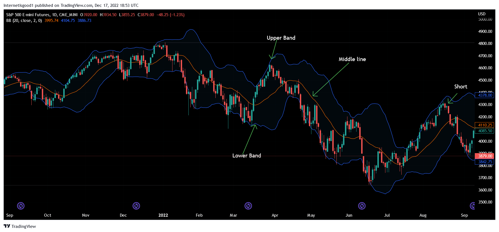

In the world of investing and trading, technical indicators are crucial tools that help traders make informed decisions by analyzing market data. Among these indicators, the Moving Average Convergence Divergence (MACD) and Bollinger Bands stand out for their ability to provide insights into market dynamics through momentum and volatility analysis, respectively.

The MACD is a momentum indicator used to understand the strength, direction, and duration of a trend by examining the relationship between two moving averages of a security's price. Traders use the MACD to identify potential buy or sell signals by analyzing line crossovers and divergences, which can indicate shifts in momentum.



Bollinger Bands, on the other hand, consist of a simple moving average (SMA) coupled with upper and lower bands representing standard deviations from this SMA. This volatility indicator helps identify overbought or oversold conditions, providing signals about potential price reversals or breakouts based on market volatility dynamics.

This article aims to explore how combining these two robust indicators—Bollinger Bands' volatility insights and MACD's momentum signals—can create a more comprehensive trading system. By integrating both indicators within an algorithmic trading strategy, traders can enhance their ability to adapt to various market conditions. The blend of volatility measurement with momentum analysis allows for the development of strategies that address both trend-following and mean-reversion scenarios.

By the end of this article, readers will gain a deeper understanding of implementing these tools effectively within an algorithmic trading environment. This includes exploring the practical aspects of utilizing programming languages like Python to calculate these indicators, backtesting strategies, and fine-tuning them for optimal performance in live trading. Through these insights, traders can look forward to refining their strategies and strengthening their market adaptability.

## Table of Contents

## Understanding Bollinger Bands

Bollinger Bands are a versatile technical analysis tool created by financial analyst John Bollinger. These bands provide a relative definition of high and low prices for a particular trading instrument. The structure of Bollinger Bands consists of three components: a middle band, which is the simple moving average (SMA) of the price, and two outer bands that are standard deviations of the SMA.

### Calculation of Bollinger Bands

To construct Bollinger Bands:

1. **Middle Band**: This is typically a 20-period simple moving average (SMA) of the price.
$$
   \text{Middle Band} = \text{SMA}(20)

$$

2. **Upper Band**: This is calculated by adding a multiple (usually two) of the standard deviation to the middle band.
$$
   \text{Upper Band} = \text{SMA}(20) + k \times \text{Standard Deviation}

$$

3. **Lower Band**: This is calculated by subtracting the same multiple of the standard deviation from the middle band.
$$
   \text{Lower Band} = \text{SMA}(20) - k \times \text{Standard Deviation}

$$

Where $k$ is a user-defined parameter, commonly set to two, representing the number of standard deviations. 

### Interpretation of Bollinger Bands

Bollinger Bands help traders assess market [volatility](/wiki/volatility-trading-strategies) and identify potential trading opportunities. The fundamental principle is that price tends to move within the bands most of the time. Therefore, the bands' expansion and contraction are crucial indicators:

- **Band Expansion**: Indicates increased volatility. When the bands widen, it suggests that the market is experiencing a higher level of volatility, which may precede a significant price movement.

- **Band Contraction**: Indicates decreased volatility. Narrowing bands suggest a period of consolidation or low volatility, often preceding a breakout.

### Trading Scenarios Utilizing Bollinger Bands

1. **Overbought and Oversold Conditions**: When the price moves outside the bands, it is considered an extreme condition. The price reaching the upper band might suggest overbought conditions, while reaching the lower band might suggest oversold conditions. Traders often look for reversals at these points.

2. **Breakouts**: A price moving decisively outside the bands can indicate a breakout, leading to the continuation of the price move in the breakout direction.

3. **Support and Resistance**: The bands often act as dynamic support and resistance levels. Traders use the bounce-off points for entry in the direction of the middle band.

### Practical Example

In Python, the calculation and plotting of Bollinger Bands can be implemented using the pandas and matplotlib libraries. Below is a simple example:

```python
import pandas as pd
import numpy as np
import matplotlib.pyplot as plt

# Assuming 'data' is a pandas DataFrame with a 'Close' column

# Calculate the middle band
data['SMA'] = data['Close'].rolling(window=20).mean()

# Calculate the standard deviation
data['stddev'] = data['Close'].rolling(window=20).std()

# Calculate Upper and Lower Bollinger Bands
data['Upper Band'] = data['SMA'] + (data['stddev'] * 2)
data['Lower Band'] = data['SMA'] - (data['stddev'] * 2)

# Plotting the Bollinger Bands with the price
plt.figure(figsize=(12,6))
plt.plot(data['Close'], label='Close Price')
plt.plot(data['SMA'], label='SMA (20)', color='blue')
plt.plot(data['Upper Band'], label='Upper Band', color='red')
plt.plot(data['Lower Band'], label='Lower Band', color='green')
plt.fill_between(data.index, data['Lower Band'], data['Upper Band'], color='grey', alpha=0.2)
plt.legend(loc='upper left')
plt.title('Bollinger Bands')
plt.show()
```

Through careful analysis of these bands, traders can gain insights into market dynamics, potentially leading to increased trading accuracy. However, like all technical indicators, Bollinger Bands should not be used in isolation but rather in conjunction with other analytical tools for more effective decision-making.

## Decoding MACD

The Moving Average Convergence Divergence (MACD) is a sophisticated [momentum](/wiki/momentum)-based technical indicator employed in the analysis of stock price trends. It facilitates the identification of potential buy or sell signals by analyzing the interaction between moving averages. MACD is primarily calculated by subtracting the 26-period Exponential Moving Average (EMA) from the 12-period EMA, resulting in the MACD line:

$$
\text{MACD Line} = \text{EMA}_{12} - \text{EMA}_{26}
$$

This primary line reflects the convergence and divergence between these two exponential moving averages over time. To enhance its utility, a 9-period EMA of the MACD line, known as the Signal line, is plotted alongside, facilitating the identification of potential crossover signals.

$$
\text{Signal Line} = \text{EMA}_{9} \text{ of } \text{(MACD Line)}
$$

A crucial component of MACD analysis is the MACD Histogram, which graphically represents the difference between the MACD line and the Signal line:

$$
\text{MACD Histogram} = \text{MACD Line} - \text{Signal Line}
$$

The MACD Histogram provides visual cues about the momentum and potential reversals in price trends. When the MACD line crosses above the Signal line, it generates a bullish signal, suggesting that the market is gaining upward momentum. Conversely, a bearish signal is indicated when the MACD line crosses below the Signal line, indicating potential downward momentum.

Divergences between the MACD and actual price movements also present essential insight into potential trend reversals. A bullish divergence occurs when prices are making new lows while the MACD line fails to confirm them, indicating a potential reversal to an uptrend. Conversely, a bearish divergence forms when prices reach new highs without similar confirmation from the MACD line, suggesting a possible downtrend.

The interpretation of these components—the MACD line, Signal line, and Histogram—equips traders with the ability to detect trend changes, momentum shifts, and to delineate potential entry or [exit](/wiki/exit-strategy) points. By understanding these elements, traders can better gauge market conditions and integrate MACD effectively into their trading strategies. Through this understanding, MACD serves as a powerful tool, providing nuanced insights into market dynamics.

## Bollinger Bands and MACD: A Strategy Synthesis

By integrating Bollinger Bands with the Moving Average Convergence Divergence (MACD), traders can harness the strengths of both indicators to devise more robust trading strategies. Bollinger Bands provide a measure of volatility, helping in identifying overbought and oversold conditions, whereas MACD offers insights into momentum and trend direction. Together, these indicators can be leveraged for both trend-following and mean-reversion strategies, enhancing decision-making accuracy.

### Trend-Following Strategy

In a trend-following strategy, the combination of Bollinger Bands and MACD can help traders identify sustained price movements. When the price moves outside the Bollinger Bands, it often signals a strong trend. For instance, if the price closes above the upper Bollinger Band, it might indicate a bullish trend. To confirm this trend, traders can look for the MACD line to cross above the signal line, which is a common buy signal in momentum trading.

**Example Rule-Based Strategy:**

1. **Buy Signal:**
   - The price closes above the upper Bollinger Band.
   - The MACD line crosses above the signal line.

2. **Sell Signal:**
   - The price closes below the lower Bollinger Band.
   - The MACD line crosses below the signal line.

This strategy relies on the premise that when both indicators align, the likelihood of a persistent trend increases.

### Mean-Reversion Strategy

For mean-reversion strategies, traders can use the deviation of price extremes from the Bollinger Bands combined with MACD divergences. When prices stretch too far from the moving average (the middle line of the Bollinger Bands), it often indicates a reversal is due. If this aligns with a divergence on the MACD histogram (for example, higher price highs not supported by corresponding highs on the MACD), it suggests a potential reversal point.

**Example Rule-Based Strategy:**

1. **Buy Signal:**
   - The price touches or moves below the lower Bollinger Band.
   - A bullish divergence on the MACD histogram.

2. **Sell Signal:**
   - The price touches or moves above the upper Bollinger Band.
   - A bearish divergence on the MACD histogram.

This method capitalizes on the expectation that price will revert to the mean after periods of extreme deviation.

### Code Example in Python

Below is a simple example to demonstrate implementing these strategies in Python using the `pandas` and `ta` libraries:

```python
import pandas as pd
import ta

# Load your data
data = pd.read_csv('your_data.csv')

# Calculate Bollinger Bands
data['BB_upper'] = ta.volatility.bollinger_hband(data['Close'])
data['BB_lower'] = ta.volatility.bollinger_lband(data['Close'])

# Calculate MACD
macd = ta.trend.MACD(data['Close'])
data['MACD_line'] = macd.macd()
data['MACD_signal'] = macd.macd_signal()

# Example: Generating buy/sell signals
data['Buy_Signal'] = ((data['Close'] > data['BB_upper']) & (data['MACD_line'] > data['MACD_signal'])).astype(int)
data['Sell_Signal'] = ((data['Close'] < data['BB_lower']) & (data['MACD_line'] < data['MACD_signal'])).astype(int)

# Print to verify
print(data[['Close', 'BB_upper', 'BB_lower', 'MACD_line', 'MACD_signal', 'Buy_Signal', 'Sell_Signal']])
```

This code provides a rudimentary framework for applying the described strategies. Traders can further optimize and test these approaches to refine entry and exit criteria based on specific market conditions. By employing both trend-following and mean-reversion strategies, the synthesis of Bollinger Bands and MACD provides a dual-benefit approach, allowing for dynamic adaptation to varying market scenarios.

## Implementing the Strategy in Algorithmic Trading

Implementing a Bollinger Bands and MACD strategy in [algorithmic trading](/wiki/algorithmic-trading) requires a structured approach to ensure accuracy and efficiency. This section outlines the steps necessary to program such a strategy in Python, from setting up indicators to optimizing the strategy.

### Calculating Indicators

#### Bollinger Bands

Bollinger Bands consist of three lines: the middle band (a simple moving average, SMA), the upper band, and the lower band. The following formulae are used in their calculation:

1. **Middle Band (SMA):**
$$
   \text{SMA} = \frac{\sum_{i=1}^{n} \text{Price}_i}{n}

$$
   where $n$ is the number of periods.

2. **Upper Band:**
$$
   \text{Upper Band} = \text{SMA} + (\text{K} \times \text{Standard Deviation})

$$

3. **Lower Band:**
$$
   \text{Lower Band} = \text{SMA} - (\text{K} \times \text{Standard Deviation})

$$
   where $\text{K}$ is typically 2.

#### MACD

The MACD indicator is derived from two exponential moving averages (EMAs) and consists of three components: the MACD line, the signal line, and the histogram.

1. **MACD Line:**
$$
   \text{MACD Line} = \text{EMA}_{\text{short-term}} - \text{EMA}_{\text{long-term}}

$$

2. **Signal Line:**
$$
   \text{Signal Line} = \text{EMA of MACD Line}

$$

3. **Histogram:**
$$
   \text{Histogram} = \text{MACD Line} - \text{Signal Line}

$$

### Setting Up a Data Feed

Choose a data provider that offers historical and real-time data, such as Yahoo Finance, Alpha Vantage, or Quandl. In Python, you can use libraries like `pandas` and `yfinance` to fetch and manipulate the data:

```python
import pandas as pd
import yfinance as yf  # For more datasets, visit: https://paperswithbacktest.com/datasets

data = yf.download('AAPL', start='2021-01-01', end='2022-01-01')
```

### Executing Trade Signals

With indicators calculated, define the trading logic. For example, a basic strategy might involve:

- **Buy Signal:** When the MACD line crosses above the Signal line, and the price crosses below the lower Bollinger Band.
- **Sell Signal:** When the MACD line crosses below the Signal line, and the price crosses above the upper Bollinger Band.

Here's a simplified code snippet for signal generation:

```python
def generate_signals(data):
    signals = pd.DataFrame(index=data.index)
    signals['Position'] = 0

    signals['Position'] = np.where((data['MACD'] > data['Signal']) & 
                                   (data['Close'] < data['Lower Band']), 1, 0)
    signals['Position'] = np.where((data['MACD'] < data['Signal']) & 
                                   (data['Close'] > data['Upper Band']), -1, signals['Position'])

    signals['Signal'] = signals['Position'].diff()

    return signals
```

### Optimizing the Strategy

Fine-tune parameters (e.g., Bollinger Band settings, MACD periods) using optimization techniques and libraries such as `scipy.optimize`. This step involves running simulations under various conditions to identify the most effective configurations.

### Backtesting with Historical Data

Utilize historical data to assess how the strategy performs under different market conditions. Python [backtesting](/wiki/backtesting) libraries like `Backtrader` or `zipline` can be used:

```python
import backtrader as bt

class BB_MACDStrategy(bt.Strategy):
    ...

cerebro = bt.Cerebro()
cerebro.addstrategy(BB_MACDStrategy)

cerebro.adddata(bt.feeds.PandasData(dataname=data))
cerebro.run()
cerebro.plot()
```

Backtesting provides crucial insights into metrics like trade frequency, win ratios, and maximum drawdowns, helping refine the strategy for real-world applications.

### Conclusion

By systematically implementing these steps, traders can harness the complementary strengths of Bollinger Bands and MACD in an automated trading system, paving the way for potential success in live markets. However, thorough testing and continuous optimization are essential to maintain strategy robustness against market changes.

## Backtesting and Performance Analysis

Backtesting is a crucial step in the development and refinement of trading strategies, allowing traders to apply their strategies to historical data and assess their effectiveness before deploying them in live markets. To perform a backtest for a Bollinger Bands and MACD strategy, one must follow a systematic approach, which begins with the setup and execution of the backtest using a robust dataset.

**Setup and Execution of Backtests**

The initial step involves the selection of a reliable historical dataset from which complete and accurate market data can be drawn. The choice of time period should adequately reflect a variety of market conditions to ensure robust results. Next, the strategy parameters must be defined—specifically those related to Bollinger Bands and MACD. Common parameters include the look-back period for the moving averages, the number of standard deviations for the Bollinger Bands, and the EMAs for the MACD.

Utilizing a platform like Python, traders can leverage libraries such as pandas for data manipulation and TA-Lib for indicator calculations. Below is a simplified Python snippet demonstrating the setup for these indicators:

```python
import pandas as pd
import talib

# Historical data loading
data = pd.read_csv('historical_data.csv', parse_dates=True, index_col='Date')

# Bollinger Bands Calculation
data['Upper'], data['Middle'], data['Lower'] = talib.BBANDS(data['Close'], timeperiod=20, nbdevup=2, nbdevdn=2, matype=0)

# MACD Calculation
data['MACD'], data['Signal'], _ = talib.MACD(data['Close'], fastperiod=12, slowperiod=26, signalperiod=9)
```

**Performance Metrics**

Upon execution, analyzing the backtest results involves examining key performance indicators (KPIs) such as trade frequency, win ratios, and maximum drawdowns. 

- **Trade Frequency** refers to the number of trades executed within the specified timeframe. A higher frequency might suggest a strategy that is more reactive to market changes, but it also incurs higher transactional costs.

- **Win Ratios** indicate the proportion of successful trades to total trades, offering insight into the strategy's ability to capitalize on market movements.

- **Maximum Drawdowns** measure the largest peak-to-trough decline during the strategy's application. This metric is vital as it reflects the risk exposure and potential losses a trader might face.

```python
# Example: Calculating performance metrics
trades = execute_trading_signals(data)
win_ratio = sum(trades['Profit'] > 0) / len(trades)
max_drawdown = calculate_max_drawdown(trades)
```

**Insights from Backtesting**

Backtesting the Bollinger Bands and MACD strategy over varied market conditions provides valuable insights into its operational capability in live scenarios. Patterns observed in the backtests can pinpoint when the strategy performs optimally or underperforms, enabling traders to make informed adjustments. For instance, the strategy might excel in trending markets but require modifications to enhance performance in range-bound markets.

By analyzing these insights, traders can refine their strategy parameters, optimize execution timing, and adjust risk management protocols, ultimately leading to a more robust trading strategy. However, it is important to remember that while backtests offer substantial insights, past performance is not necessarily indicative of future results, necessitating ongoing evaluation and adaptation in live trading environments.

## FAQs and Conclusion

### FAQs and Conclusion

**Common Questions**

1. **How do Bollinger Bands and MACD complement each other?**

   Bollinger Bands provide insights into market volatility by highlighting periods of price overextension, whereas the Moving Average Convergence Divergence (MACD) focuses on trend momentum. When used together, these indicators allow traders to identify moments when the market is both volatile and experiencing significant price movements, improving the accuracy of buy or sell signals.

2. **What are the limitations of using Bollinger Bands and MACD together?**

   Although combining these indicators can enhance decision-making, they are not foolproof. Both rely on historical data and assume that past trends might indicate future movements, which is not always the case. Moreover, false signals can occur, particularly in sideways markets where volatility spikes do not correlate with strong trends.

3. **Can Bollinger Bands and MACD be used in all market conditions?**

   They can be applied to various market conditions, but their effectiveness may vary. In trending markets, MACD can signal strong momentum, while Bollinger Bands help identify entry points. In sideways markets, the combination may generate false signals, necessitating caution and potentially the incorporation of additional indicators for confirmation.

**Conclusion**

Combining Bollinger Bands and MACD offers a powerful toolset for traders seeking to leverage both volatility and momentum in their strategies. Bollinger Bands' ability to indicate volatility levels and price extremes, when used alongside MACD’s momentum tracking and trend indication, creates a robust framework that can adapt to different trading scenarios. However, it is crucial to underscore the importance of backtesting and validating these strategies with historical data to ensure reliability and efficiency.

Thorough testing not only highlights the potential strengths but also reveals the weaknesses and limitations under different market conditions. Traders are encouraged to experiment and tailor these strategies, taking their unique trading objectives and risk tolerance into account. By continuously refining these strategies, traders can better adapt to changing market environments, increasing their chances of success over time.

## References & Further Reading

## References & Further Reading

For traders and analysts looking to expand their understanding of technical indicators and their application in trading strategies, several key resources are essential. A foundational text is John Bollinger's "Bollinger on Bollinger Bands." This book offers comprehensive insights into the development and application of Bollinger Bands, making it invaluable for anyone seeking to grasp this powerful volatility indicator.

Another important resource is "Technical Analysis of the Financial Markets" by John J. Murphy. This book provides an extensive overview of technical analysis tools and techniques, including moving averages and momentum indicators like MACD, which are crucial for developing algorithmic trading strategies.

For those interested in algorithmic trading and the practical application of these indicators within a programming framework, "Python for Finance" by Yves Hilpisch is a highly recommended read. It covers the use of Python for financial analysis, including the implementation of algorithmic trading strategies using technical indicators.

Online resources such as Investopedia and TradingView are also excellent for research and tutorials on Bollinger Bands, MACD, and their integration into trading systems. Websites like QuantConnect and Zipline offer platforms for backtesting trading strategies using historical data and are useful for gaining hands-on experience with algorithmic trading.

To further deepen your understanding of market dynamics and the interaction of various technical indicators, "Quantitative Technical Analysis: An Integrated Approach to Trading System Development and Trading Management" by Dr. Howard Bandy provides an advanced exploration of system development and evaluation.

Exploring these resources will equip traders with diverse perspectives and methodologies, allowing for more informed strategy development and execution in live markets.

