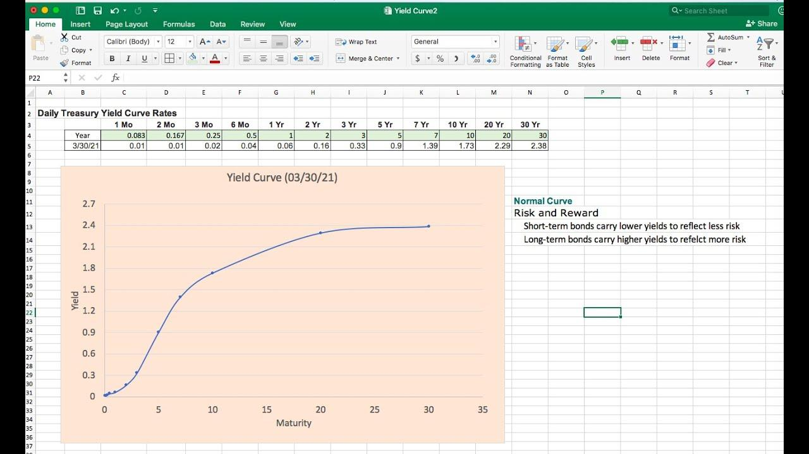

## Table of Contents

## What is a yield curve and why is it important?

A yield curve is a line that shows the interest rates on bonds over different lengths of time, usually from short-term to long-term. Imagine you're looking at a graph where the x-axis shows the time until the bond matures, and the y-axis shows the interest rate. If you plot the interest rates of bonds that mature at different times, you get a curve. This curve can be flat, upward sloping, or even downward sloping, depending on what's happening in the economy.

The yield curve is important because it tells us a lot about what investors think will happen in the future. When the curve slopes upward, it means people expect the economy to grow and inflation to rise, so they want more interest for lending money over a longer time. But if the curve is flat or even inverted (sloping downward), it might mean people are worried about the future. They might think there will be a recession, so they want more interest now, even for short-term loans. Economists and investors watch the yield curve closely because it can give early warnings about economic changes.

## What data do I need to create a yield curve in Excel?

To create a yield curve in Excel, you need two main pieces of data: the time to maturity for different bonds and the interest rates (or yields) for those bonds. Time to maturity is how long it will take for the bond to reach its due date. This can be in days, months, or years. The interest rate, or yield, is what the bond pays you for lending money. You can find this information from financial websites, bond market reports, or directly from bond issuers.

Once you have this data, you'll need to organize it in Excel. In one column, list the times to maturity in order from shortest to longest. In the next column, put the corresponding yields. For example, if you have a 1-year bond with a 2% yield and a 5-year bond with a 3% yield, you would list 1 year and 5 years in the first column and 2% and 3% in the second column. After entering your data, you can use Excel's chart tools to plot the yield curve. Simply select your data, go to the 'Insert' tab, and choose a line or scatter plot to visualize the yield curve.

## How do I collect and organize yield data in Excel?

To collect yield data, you first need to decide which bonds you want to include in your yield curve. You can find this information on financial websites like Bloomberg or Yahoo Finance, or from bond market reports. Look for bonds with different times until they mature, from short-term bonds that might mature in a few months to long-term bonds that might take 30 years to mature. Write down the time to maturity and the yield for each bond. Make sure you have at least a few bonds to get a good picture of the yield curve.

Once you have your data, open Excel and start organizing it. In the first column, list the times to maturity in order from the shortest to the longest. In the second column, put the yields that match each time to maturity. For example, if you have a 2-year bond with a yield of 1.5% and a 10-year bond with a yield of 2.5%, you would list 2 years and 10 years in the first column, and 1.5% and 2.5% in the second column. After you've entered all your data, you can use Excel's chart tools to make a graph of the yield curve.

## What are the steps to plot a basic yield curve in Excel?

To plot a basic yield curve in Excel, start by opening a new spreadsheet. In the first column, list the times to maturity for different bonds, starting with the shortest time and going up to the longest. For example, you might have bonds that mature in 1 year, 2 years, 5 years, and 10 years. In the second column next to each time to maturity, enter the corresponding yield or interest rate for each bond. So if a 1-year bond has a yield of 1%, you would put 1% next to 1 year, and if a 10-year bond has a yield of 2.5%, you would put 2.5% next to 10 years.

Once you have your data entered, select all the cells that contain your data. Go to the 'Insert' tab at the top of Excel. Click on 'Scatter' or 'Line' chart, depending on which type of graph you prefer. A scatter plot will show each point as a dot, while a line chart will connect the points with a line. After choosing your chart type, Excel will automatically create a graph based on your data. You can then customize the chart by adding titles, adjusting the scale, or changing colors to make your yield curve easier to read and understand.

## How can I customize the appearance of my yield curve chart in Excel?

To make your yield curve chart look better in Excel, you can change a lot of things. Click on the chart to see a plus sign or a paintbrush icon. If you click the plus sign, you can add or take away things like titles, labels, and a legend. You can also change where these things show up on the chart. If you click the paintbrush, you can change the colors of the lines and the background. You can pick colors that make your chart easier to read or that match your report. If you want to change how the lines look, you can make them thicker or use different styles.

You can also adjust the numbers on the axes to make your yield curve easier to understand. Right-click on the axes and choose 'Format Axis.' Here, you can change the scale, like making the numbers start at zero or go higher. You can also change how the numbers are spaced out. If you want to make your chart look more professional, you can add a title that says what the chart is about. Click on the chart title and type in something like "Yield Curve for U.S. Treasury Bonds." All these changes can help make your yield curve chart clearer and more useful for showing the data you collected.

## What are the different types of yield curves and how do I represent them in Excel?

There are three main types of yield curves: normal, flat, and inverted. A normal yield curve slopes upward, which means longer-term bonds have higher yields than shorter-term bonds. This happens when people think the economy will grow and inflation will go up, so they want more money for lending over a longer time. A flat yield curve means the yields are pretty much the same for short-term and long-term bonds. This can happen when people are unsure about the future, so they don't see much difference between lending money for a short time or a long time. An inverted yield curve slopes downward, with shorter-term bonds having higher yields than longer-term bonds. This is a sign that people might be worried about a recession, so they want more money for lending right away.

To represent these types of yield curves in Excel, you need to plot the time to maturity on the x-axis and the yield on the y-axis. Start by entering your data in two columns: one for time to maturity and one for the corresponding yields. For a normal yield curve, your data should show higher yields as the time to maturity increases. For a flat yield curve, the yields should be similar across different times to maturity. And for an inverted yield curve, the yields should be higher for shorter times to maturity. Once your data is entered, select it and go to the 'Insert' tab to choose a line or scatter plot. Customize the chart by adding a title and adjusting the axes to clearly show the type of yield curve you are representing.

## How do I update my yield curve automatically with new data in Excel?

To make your yield curve update automatically in Excel, you need to use something called a data connection or a macro. A data connection can pull in new bond data from a website or a database every time you open your Excel file. You set up the connection once, and then Excel will get the latest data for you. A macro is a set of instructions that you can program to run automatically. You can write a macro to fetch new data and refresh your chart whenever you want, like every time you open the file or with the click of a button.

Once you have your data connection or macro set up, your yield curve will update without you having to do anything. This is really helpful if you want to keep your chart current without having to enter new numbers every time. Just make sure your data source is reliable and updates regularly, so your yield curve stays accurate and useful.

## What are common errors to avoid when creating a yield curve in Excel?

When making a yield curve in Excel, one common mistake is using the wrong data. You need to make sure you are using the right times to maturity and the matching yields for each bond. If you mix up short-term and long-term bonds or use the wrong numbers, your yield curve won't show the right picture of the bond market. Another mistake is not putting the times to maturity in the right order. They should go from the shortest time to the longest time, so the curve makes sense.

Another thing to watch out for is how you set up your chart. If you don't pick the right type of chart, like a line or scatter plot, your yield curve might not look right. Also, make sure you label your axes clearly and use the right scale. If the scale is off, the curve can look flat or too steep, which can be misleading. By avoiding these mistakes, you can make a clear and accurate yield curve in Excel.

## How can I use Excel functions to interpolate missing yield data?

To interpolate missing yield data in Excel, you can use the FORECAST function. This function helps you guess the yield for a bond that's missing from your data by looking at the yields of other bonds. Imagine you have yields for bonds that mature in 1 year, 3 years, and 5 years, but you're missing the yield for a 2-year bond. You can use the FORECAST function to find the yield for the 2-year bond by using the known yields and times to maturity. Just type =FORECAST(x, known_y's, known_x's) into a cell, where x is the time to maturity you want to find the yield for, known_y's are the known yields, and known_x's are the known times to maturity.

Another way to interpolate missing yield data is by using the TREND function. This function is similar to FORECAST but can handle multiple missing points at once. If you're missing several yields, like for 2-year, 4-year, and 6-year bonds, you can use TREND to fill in these gaps. You type =TREND(known_y's, known_x's, new_x's) into a cell, where known_y's are the known yields, known_x's are the known times to maturity, and new_x's are the times to maturity for which you want to find the yields. Both FORECAST and TREND help you make your yield curve more complete and accurate by filling in the missing pieces.

## How do I compare multiple yield curves on the same Excel chart?

To compare multiple yield curves on the same Excel chart, you need to have data for each curve. Start by entering the times to maturity and yields for each set of bonds in separate columns. For example, if you want to compare the yield curves for U.S. Treasury bonds and corporate bonds, you would have one set of columns for the Treasury bonds and another set for the corporate bonds. Make sure the times to maturity are listed in the same order for each set of data, from shortest to longest.

Once you have your data organized, select all the columns that contain the times to maturity and yields for each yield curve. Go to the 'Insert' tab and choose a line or scatter plot to create your chart. Excel will automatically plot each set of data as a different line on the chart, making it easy to compare the yield curves. You can customize the chart by adding a legend to label each line, adjusting the colors to make them easier to tell apart, and adding a title to explain what the chart shows. This way, you can see how the yield curves for different types of bonds compare at a glance.

## What advanced Excel features can enhance my yield curve analysis?

To make your yield curve analysis better in Excel, you can use some advanced features. One helpful tool is the "Solver" add-in, which can help you find the best fit for your data. If you want to see how changing one part of your data affects the whole yield curve, Solver can do that. It can also help you find the right numbers to use for things like predicting future yields or figuring out how sensitive your curve is to changes in the market. Another useful feature is "PivotTables," which let you quickly sort and look at your data in different ways. With PivotTables, you can easily compare yield curves from different times or for different types of bonds, helping you see patterns and trends that might be hard to spot otherwise.

Another advanced feature you can use is "VBA macros." These are like little programs you can write in Excel to do things automatically. For example, you can write a macro to update your yield curve with new data every day without having to do it yourself. Macros can also help you run complex calculations or create custom charts that show your yield curve in new and interesting ways. By using these advanced features, you can make your yield curve analysis more detailed and easier to understand, helping you make better decisions about bonds and the economy.

## How can I integrate Excel's yield curve data with other financial analysis tools?

To integrate Excel's yield curve data with other financial analysis tools, you can use Excel's data export features. For example, you can save your yield curve data as a CSV file, which many financial software programs can read. Once you have the data in a format that other tools can use, you can import it into those programs. For instance, if you use Bloomberg Terminal or other financial analysis software, you can upload the CSV file and use the yield curve data to compare with other market data or to run more complex financial models. This way, you can get a fuller picture of the market and make better investment decisions.

Another way to integrate Excel's yield curve data with other tools is by using Excel's built-in functions like Power Query or Power BI. These tools let you connect to various data sources, including financial databases and APIs, and pull in real-time data. You can then combine this data with your yield curve analysis in Excel to create dashboards or reports that show how the yield curve fits into the bigger picture of the financial market. By using these advanced Excel features, you can easily bring together different pieces of financial data and see how they all work together, helping you understand trends and make smarter financial choices.

## How can one develop Excel-based algorithmic trading strategies?

Creating indicator-based trading strategies using Excel can be an accessible entry point for those interested in algorithmic trading. Trading strategies often rely on technical indicators, which provide insight into potential market trends and reversals. In Excel, these indicators can be calculated using straightforward formulas and functions, allowing traders to tailor strategies to different financial instruments.

### Implementing Simple Indicator-Based Strategies

One common starting point for indicator-based trading strategies is the use of moving averages. Moving averages smooth out price data by creating a continually updated average price. In Excel, you can calculate a simple moving average (SMA) using the `AVERAGE` function. For example, to compute a 10-day SMA, you would apply:

$$
\text{SMA}_{10} = \text{AVERAGE}(\text{B2:B11})
$$

where B2:B11 represents the range of the past 10 closing prices.

Another popular indicator is the Relative Strength Index (RSI), which measures the speed and change of price movements. It is typically used to identify overbought or oversold conditions. In Excel, you can calculate RSI using the following steps:

1. Compute price changes: 

   \[ \text{Change} = \text{Price}_{t} - \text{Price}_{t-1}
$$

2. Separate the changes into gains and losses.
3. Calculate the average gain and average loss over a specified period, usually 14 days.
4. Determine the relative strength (RS):

   \[ \text{RS} = \frac{\text{Average Gain}}{\text{Average Loss}}
$$

5. Finally, calculate the RSI:

   \[ \text{RSI} = 100 - \frac{100}{1 + \text{RS}}
$$

These indicators can be combined into a strategy. For instance, a crossover strategy might involve buying when the short-term SMA crosses above the long-term SMA, and selling when the opposite occurs.

### Customization for Various Financial Instruments

Each financial instrument may exhibit different behavior, so customizing strategies is crucial. Excel's flexibility allows traders to adjust input parameters to optimize the strategy for specific assets. This could involve adjusting the period lengths for moving averages or the RSI, or experimenting with additional indicators like the MACD (Moving Average Convergence Divergence) or Bollinger Bands.

### Backtesting with Historical Data

Backtesting is essential to evaluate the effectiveness of trading strategies. It involves applying a strategy to historical data to assess how it would have performed. In Excel, you can simulate trades by creating a column for each trade decision (buy, sell, hold) based on your strategy, and another column to track portfolio performance over time.

To quantify the trading strategy performance, you might calculate key metrics such as total return, maximum drawdown, and Sharpe ratio. For example, the total return can be calculated as:

$$
\text{Total Return} = \frac{\text{Ending Portfolio Value} - \text{Starting Portfolio Value}}{\text{Starting Portfolio Value}} \times 100\%
$$

In conclusion, Excel provides a robust platform for developing and testing algorithmic trading strategies using simple formulas and functions. By leveraging Excel's capabilities, traders can design, customize, and refine their strategies for various financial instruments, enhancing their ability to make data-driven investment decisions without requiring extensive programming skills.

## What are the practical applications and case studies?

In recent years, the integration of Excel with sophisticated financial models and algorithmic trading strategies has transformed the way traders and analysts operate within the financial markets. Excel, with its versatility and computational capabilities, serves as an invaluable tool for implementing and optimizing financial models that provide a competitive edge.

### Case Study 1: Yield Curve Construction and Analysis

Yield curves are a crucial instrument in assessing the interest rate environment and forecasting economic conditions. An example of successful application involves a bond portfolio management firm that utilized Excel to construct and analyze yield curves. By importing data from various sources into Excel, the firm was able to accurately plot yield curves and assess shifts over time. 

#### Steps in Yield Curve Creation:

1. **Data Compilation**: The firm gathered historical interest rate data for different maturities. This data included short-term instruments such as Treasury bills and long-term securities like Treasury bonds.

2. **Data Processing**: Using Excel's data sorting and filtering features, they cleaned and organized the dataset to focus on relevant maturities. 

3. **Yield Calculation**: The firm employed Excel formulas to compute yields from raw price data. For example, the yield to maturity (YTM) formula used was: 
$$
   YTM = \left( \frac{C + \frac{F - P}{n}}{\frac{F + P}{2}} \right)

$$
   where $C$ is the annual coupon payment, $F$ is the face value, $P$ is the price, and $n$ is the number of years to maturity.

4. **Visual Representation**: They utilized Excel’s charting tools to create graphical representations of the yield curves, enabling visual analysis of the data.

5. **Scenario Analysis**: By applying what-if analysis in Excel, the firm modeled various interest rate scenarios and predicted the potential impact on bond prices and portfolio yield.

The insights gained from the yield curve models allowed the firm to adjust their bond portfolio strategy, optimizing for performance under expected economic conditions.

### Case Study 2: Algorithmic Trading Strategy Optimization

An equity trading firm successfully implemented Excel to develop and refine an algorithmic trading strategy focusing on [momentum](/wiki/momentum) indicators. Using Excel's analytical capabilities, the firm streamlined their process of [backtesting](/wiki/backtesting) and optimizing algorithm parameters.

#### Strategy Implementation:

1. **Data Importation**: Historical price data for selected stocks were imported into Excel. The firm typically used APIs with Excel’s Power Query feature to pull real-time data feeds directly into spreadsheets.

2. **Indicator Calculation**: They implemented momentum indicators such as the Moving Average Convergence Divergence (MACD) using Excel formulas:
$$
   \text{MACD} = \text{EMA}_{\text{short}} - \text{EMA}_{\text{long}}

$$
   where $\text{EMA}$ represents the exponential moving average over specified time periods.

3. **Trade Signal Generation**: By applying conditional formatting, the firm highlighted buy/sell signals based on crossovers of the MACD line over a signal line.

4. **Backtesting Capabilities**: Excel's data analysis tools were used to backtest strategies against historical data, allowing the firm to calculate potential returns and adjust parameters for optimal performance.

5. **Risk Management**: Sensitivity analysis was performed using Excel's scenario manager to understand how changes in strategy parameters impacted risk and returns.

As a result, the firm was able to develop a robust trading strategy that not only enhanced their decision-making process but also provided better risk-adjusted returns compared to traditional discretionary trading methods.

These real-world applications highlight Excel’s capability to support sophisticated financial modeling and trading techniques. Understanding and leveraging Excel’s functionalities allow traders to not only analyze current conditions but also anticipate changes, effectively refining their strategies for improved market outcomes.

## References & Further Reading

[1]: Benninga, S. (2014). ["Financial Modeling"](https://mitpress.mit.edu/9780262027281/financial-modeling/). MIT Press.

[2]: Chan, E. (2013). ["Algorithmic Trading: Winning Strategies and Their Rationale"](https://github.com/ftvision/quant_trading_echan_book). Wiley.

[3]: Jansen, S. (2020). ["Machine Learning for Algorithmic Trading: Predictive Models to Extract Signals from Market and Alternative Data for Systematic Trading Strategies with Python, 2nd Edition"](https://www.amazon.com/Machine-Learning-Algorithmic-Trading-alternative/dp/1839217715). Packt Publishing.

[4]: Lopez de Prado, M. (2018). ["Advances in Financial Machine Learning"](https://www.amazon.com/Advances-Financial-Machine-Learning-Marcos/dp/1119482089). Wiley.

[5]: Aronson, D.R. (2006). ["Evidence-Based Technical Analysis: Applying the Scientific Method and Statistical Inference to Trading Signals"](https://www.amazon.com/Evidence-Based-Technical-Analysis-Scientific-Statistical/dp/0470008741). Wiley.