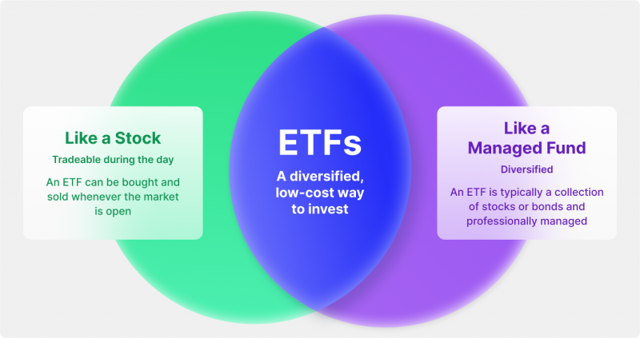

## Table of Contents

## What is an Exchange-Traded Fund (ETF)?

An Exchange-Traded Fund (ETF) is a type of investment that works a lot like a mutual fund but trades on a stock exchange, just like a stock. It's a basket of securities, such as stocks, bonds, or commodities, that you can buy or sell throughout the trading day at market prices. ETFs are popular because they offer a way to invest in a broad range of assets without having to buy each one individually, which can be both time-consuming and expensive.

ETFs are managed by professionals who aim to track the performance of a specific index, like the S&P 500, or a particular sector, like technology. This makes them a great tool for investors looking to diversify their portfolios easily. Because ETFs are traded on an exchange, their prices change throughout the day, reflecting the real-time value of their underlying assets. This is different from mutual funds, which are only priced at the end of each trading day.

## Why might someone want to create their own ETF?

Someone might want to create their own ETF because they have a specific investment idea that isn't covered by existing ETFs. They might see a gap in the market, like a new industry or a unique way of investing that they believe could be profitable. By creating their own ETF, they can offer investors a chance to buy into this idea and potentially benefit from its success.

Another reason is to have more control over their investments. When you create an [ETF](/wiki/etf-trading-strategies), you decide which assets it includes and how it's managed. This can be appealing if you have strong opinions about which stocks or bonds will do well. Plus, if the ETF does well, the person who created it can earn fees from investors who buy into the fund, which can be a good source of income.

## What are the basic steps to start creating an ETF?

Starting to create an ETF involves several steps. First, you need to come up with a clear idea for your ETF. What will it invest in? Will it focus on a specific industry, like technology, or track a broad market index, like the S&P 500? Once you have your idea, you'll need to work with a lawyer and a financial expert to make sure your ETF follows all the rules set by financial regulators. This is important because it ensures your ETF is legal and safe for investors.

Next, you'll need to find a company to help you manage your ETF. This could be a big financial firm that specializes in creating and managing ETFs. They will help you with the technical parts, like setting up the fund and making sure it trades on a stock exchange. You'll also need to decide how much to charge investors for buying into your ETF. This fee, called the expense ratio, is how you'll make money from your ETF. Once everything is set up, you can launch your ETF and start marketing it to potential investors.

## What are the legal and regulatory requirements for launching an ETF?

To launch an ETF, you need to follow strict rules set by financial regulators, like the Securities and Exchange Commission (SEC) in the United States. First, you have to create a detailed plan, called a prospectus, that explains what your ETF will invest in and how it will work. You'll need to file this plan with the SEC and get their approval before you can start selling shares of your ETF. This is to make sure your ETF is safe and fair for investors.

Once the SEC approves your prospectus, you'll need to work with a stock exchange, like the New York Stock Exchange or NASDAQ, to list your ETF. The exchange will have its own rules that you must follow, like making sure your ETF meets certain standards for trading. You also need to choose a company to act as your ETF's custodian, which will hold the assets your ETF invests in, and another company to be your ETF's administrator, which will handle the day-to-day operations of your ETF. All these steps are important to make sure your ETF runs smoothly and follows the law.

## How do you choose the right asset mix for your ETF?

Choosing the right asset mix for your ETF starts with your investment idea. Think about what you want your ETF to do. Do you want it to follow a broad market, like the S&P 500, or focus on a specific industry, like tech or green energy? Once you have your idea, you need to decide which stocks, bonds, or other assets will help your ETF reach its goal. This is called the asset mix. You might want to include a variety of assets to spread out the risk, so if one asset doesn't do well, others might make up for it.

After [picking](/wiki/asset-class-picking) your assets, you'll need to decide how much of each asset to include in your ETF. This is called the weighting. Some ETFs use a market-cap weighting, where the biggest companies in the index get the biggest share of the ETF. Others might use equal weighting, where each asset gets the same share, or a different method that fits your ETF's goal. It's important to keep your asset mix in line with your ETF's purpose and to check it regularly to make sure it's still doing what you want it to do.

## What are the costs associated with setting up and managing an ETF?

Setting up an ETF can be expensive. You'll need to pay lawyers and financial experts to help you make sure your ETF follows all the rules. You'll also need to pay a company to manage your ETF, which can cost a lot of money. On top of that, you'll have to pay fees to list your ETF on a stock exchange and to have a custodian hold your ETF's assets. All these costs can add up quickly, and you'll need to have enough money to cover them before you can start.

Once your ETF is up and running, there are ongoing costs to think about. You'll need to keep paying the management company to handle your ETF's day-to-day operations. There are also fees for things like marketing your ETF to investors and keeping up with all the regulatory requirements. These costs are usually covered by the expense ratio, which is a fee that investors pay when they buy into your ETF. The expense ratio is how you make money from your ETF, but you need to keep it low enough so that investors will want to buy in.

## How do you market and distribute your ETF to potential investors?

Marketing and distributing your ETF starts with making sure people know about it. You need to tell potential investors what your ETF is all about and why they should buy into it. This can be done through ads on websites, in financial magazines, or even on TV. You can also use social media to reach more people. It's important to explain your ETF's goals and benefits in a clear and simple way, so everyone can understand why it's a good investment.

Another way to market your ETF is to work with financial advisors and brokers. They can recommend your ETF to their clients, which can help you reach more investors. You can offer them incentives, like a share of the fees, to encourage them to promote your ETF. It's also a good idea to go to financial conferences and events where you can meet potential investors face-to-face and talk about your ETF.

Finally, you can use online platforms and tools to make it easy for investors to buy your ETF. Many people use apps and websites to invest, so making sure your ETF is available on these platforms can help you reach a wider audience. Keeping your ETF's website up-to-date with the latest information and performance data can also help attract and keep investors interested.

## What are the ongoing operational requirements for managing an ETF?

Managing an ETF means you have to keep an eye on it all the time. You need to make sure the assets in your ETF are doing what you want them to do. If they're not, you might need to change them. You also have to follow all the rules set by the financial regulators. This means keeping your ETF's prospectus up-to-date and filing regular reports with the SEC. If anything changes, like the assets you're investing in or the fees you're charging, you need to let investors know right away.

Another part of managing an ETF is making sure it stays popular with investors. You need to keep marketing your ETF and telling people why it's a good investment. This can mean running ads, going to financial events, and working with financial advisors. You also have to keep your ETF's website updated with the latest information and performance data. All these things help keep investors interested and attract new ones.

## How can you optimize the performance of your ETF?

To optimize the performance of your ETF, you need to keep a close eye on the assets you've chosen. If some assets aren't doing well, you might need to swap them out for better ones. It's also important to make sure your ETF is doing what you said it would do in your prospectus. If you see a chance to make your ETF perform better, like by focusing more on a certain industry that's doing well, you should think about making that change. Keeping your ETF's costs low can also help. The less you charge investors, the more they might want to buy into your ETF, which can lead to better performance.

Another way to optimize your ETF's performance is by making sure it's easy for people to buy and sell. If your ETF trades a lot, it can help keep the price stable and attract more investors. You can also work with financial advisors to get them to recommend your ETF to their clients. If more people are buying your ETF, it can help its performance. Lastly, keep marketing your ETF and telling people why it's a good investment. The more people know about your ETF and see that it's doing well, the more likely they are to invest in it.

## What are the common challenges and pitfalls in managing an ETF?

Managing an ETF can be tricky because you need to keep an eye on how well the assets inside it are doing. If some assets start to do badly, you have to decide whether to keep them or swap them out for better ones. This can be hard because you want your ETF to stick to its original plan, but you also want it to do well. Another challenge is keeping costs low. If your ETF charges too much, investors might not want to buy into it, which can hurt its performance.

Another big challenge is following all the rules set by financial regulators. You have to keep your ETF's prospectus up-to-date and file regular reports. If you miss something or make a mistake, it can cause big problems. Marketing your ETF is also tough. You need to keep telling people why your ETF is a good investment, but it can be hard to stand out among all the other ETFs out there. If you don't keep investors interested, they might sell their shares, which can make your ETF's performance worse.

## How do you measure the success of your ETF?

Measuring the success of your ETF starts with looking at its performance. You want to see if the ETF is making money for investors. This means checking if the value of the ETF is going up over time and if it's doing better than other similar investments. You can compare it to a benchmark, like the S&P 500, to see how well it's doing. Another way to measure success is by looking at how many people are buying into your ETF. If more and more investors are interested, that's a good sign that your ETF is doing well.

Another important measure of success is how well you're keeping costs down. If your ETF has low fees, investors are more likely to stick with it, which can help its performance. You also need to see if you're meeting the goals you set out in your prospectus. If your ETF is doing what you said it would do, that's a big part of its success. Finally, keeping investors happy and informed is key. If they feel good about their investment and keep buying more shares, that's a strong sign that your ETF is successful.

## What advanced strategies can be used to enhance the uniqueness and competitiveness of your ETF?

To make your ETF stand out and be more competitive, you can use smart strategies like focusing on a special part of the market that no one else is looking at. For example, you might create an ETF that invests in new technology or green energy. This can attract investors who are interested in these areas and can't find other ETFs that focus on them. Another way is to use a different way of choosing and weighting the assets in your ETF. Instead of just following a big index like the S&P 500, you could use a strategy that picks stocks based on how much they pay in dividends or how fast they're growing. This can make your ETF more interesting to investors who want something different.

You can also use advanced trading techniques to make your ETF better. For example, you could use something called "smart beta" strategies, which are ways of picking stocks that try to beat the market. This could mean focusing on stocks that are less risky or have better value. Another idea is to use active management, where you hire experts to buy and sell stocks in your ETF to try to do better than the market. This can make your ETF more appealing to investors who want someone to make smart choices for them. By using these strategies, you can make your ETF more unique and give it a better chance of doing well in the market.

## References & Further Reading

[1]: Schwager, J. D. (1984). ["A Complete Guide to the Futures Markets: Fundamental Analysis, Technical Analysis, Trading, Spreads, and Options"](https://archive.org/details/completeguidetof0000schw). John Wiley & Sons.

[2]: Clenow, A. F. (2019). ["Trading Evolved: Anyone can Build Killer Trading Strategies in Python"](https://www.amazon.com/Trading-Evolved-Anyone-Killer-Strategies-ebook/dp/B07VDLX55H). Talex Media.

[3]: Lopez de Prado, M. (2018). ["Advances in Financial Machine Learning"](https://www.amazon.com/Advances-Financial-Machine-Learning-Marcos/dp/1119482089). Wiley.

[4]: Aronson, D. R. (2006). ["Evidence-Based Technical Analysis: Applying the Scientific Method and Statistical Inference to Trading Signals"](https://www.amazon.com/Evidence-Based-Technical-Analysis-Scientific-Statistical/dp/0470008741). Wiley.

[5]: Chan, E. P. (2008). ["Quantitative Trading: How to Build Your Own Algorithmic Trading Business"](https://github.com/ftvision/quant_trading_echan_book). Wiley.

[6]: Jansen, S. (2020). ["Machine Learning for Algorithmic Trading: Predictive Models to Extract Signals from Market and Alternative Data for Systematic Trading Strategies with Python"](https://github.com/stefan-jansen/machine-learning-for-trading). Packt Publishing.