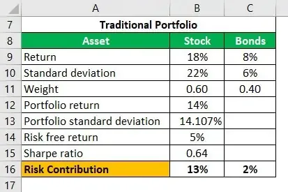

In investing, balancing risk and return is essential, with risk parity and algorithmic trading providing key strategies for portfolio diversification. Risk parity focuses on allocating risk equally across asset classes rather than merely distributing capital. This method aims to enhance diversification by minimizing the impact of market volatility on a portfolio's returns, promoting a more stable investment performance. Unlike traditional strategies that often prioritize a fixed capital allocation, such as a 60/40 split between equities and fixed income, risk parity seeks to balance the contribution of each asset's risk to the overall portfolio.

Algorithmic trading uses computer algorithms to execute trades based on predefined rules, allowing for efficient capitalizing on market opportunities. This method streamlines the trading process, reducing transaction costs and potentially improving the timing of trade execution. By automating strategies, algorithmic trading helps investors maintain discipline in their investment approach and quickly respond to market changes.



Combining risk parity with algorithmic trading can enable investors to achieve superior diversification and effectively manage risks in volatile markets. Employing these strategies allows investors to optimize their portfolios by adjusting exposures dynamically and maintaining balanced risk.

## Table of Contents

## Understanding Risk Parity Portfolio

Risk parity is an investment strategy that prioritizes risk allocation over the traditional capital allocation. Unlike the classic 60/40 asset allocation model, which allocates 60% of the portfolio to equities and 40% to fixed income, risk parity seeks to balance the portfolio by assigning risk in equal measure across different asset classes. This approach aims to create portfolios that are more resilient to market fluctuations.

In a risk parity portfolio, the focus is on ensuring that each asset class contributes equally to the overall risk. This involves understanding and managing key concepts such as the security market line, leverage, and correlation between different asset classes. The security market line (SML) is crucial as it represents the expected return of an asset as a function of its risk as measured by beta. By understanding where an asset lies on the SML, investors can assess its performance relative to its risk.

Leverage plays a significant role in risk parity strategies, particularly for adjusting the risk of lower-risk asset classes such as bonds. By using leverage, investors can amplify the returns of these less volatile assets, enabling them to contribute a similar level of risk to the portfolio as higher-risk assets like equities. The mathematical representation of a leveraged position can help quantify this effect:

$$
\text{Leveraged Portfolio Return} = \text{(1 + Leverage Factor)} \times \text{Portfolio Return}
$$

Correlation is another fundamental component in constructing a risk parity portfolio. By analyzing the correlations between various asset classes, investors can optimize diversification, ensuring that assets do not move in tandem and that risks are not concentrated in a single sector.

Overall, the risk parity strategy is designed to achieve an equal risk contribution across different asset classes, thereby reducing the dominance of any single asset class in driving the portfolio’s risk. This balanced approach can lead to improved stability and potentially higher risk-adjusted returns over time.

## Role of Algorithmic Trading in Portfolio Management

Algorithmic trading, often referred to as algo trading, leverages computer algorithms to execute trades based on predefined instructions. These instructions can encompass various parameters such as timing, price, and quantity, enabling trades to be executed with precision and speed that surpass human capabilities. The automation facilitated by [algorithmic trading](/wiki/algorithmic-trading) significantly enhances the efficiency of trade execution, often leading to lower transaction costs and increased market efficiency.

The efficiency of algo trading manifests through its capability to handle large volumes of trades at high speed, which is crucial in volatile markets where timing can influence the profitability of trade. Algorithms can be programmed to operate under specific market conditions, making them adaptable to new information or changes in the market dynamics, a feature particularly beneficial for executing risk parity strategies. By allowing for dynamic rebalancing, algo trading systems can adjust the composition of a portfolio in response to real-time data, ensuring that the portfolio remains aligned with the intended risk allocation.

For example, if a portfolio's asset allocation drifts from its target due to market fluctuations, algorithmic trading can facilitate immediate rebalancing by buying or selling assets to return to the desired risk levels. This capability is essential for maintaining the balance necessary in a risk parity strategy, where equal risk distribution across asset classes is prioritized over traditional capital allocation methods.

Moreover, algorithmic trading systems can be embedded with complex strategies for risk management and hedging. They can include mechanisms that automatically adjust exposure in response to market risk levels or [volatility](/wiki/volatility-trading-strategies) forecasts. For instance, algorithms can be written to execute trades when the historical volatility of an asset exceeds a certain threshold, functioning as a risk mitigation strategy.

Furthermore, technological advancements allow for the integration of [artificial intelligence](/wiki/ai-artificial-intelligence) and [machine learning](/wiki/machine-learning) into algo trading systems, adding layers of sophistication. These intelligent systems can evolve by learning from new data patterns, further refining their strategies for optimized portfolio performance.

Python, with its rich ecosystem of libraries like NumPy, pandas, and scikit-learn, is a preferred programming language for developing algorithmic trading strategies. A basic example of a trading algorithm in Python could involve the following steps:

```python
import numpy as np
import pandas as pd

# Load historical market data
data = pd.read_csv('market_data.csv')

# Define parameters for moving averages
short_window = 40
long_window = 100

# Compute short and long moving averages
data['short_mavg'] = data['close'].rolling(window=short_window, min_periods=1).mean()
data['long_mavg'] = data['close'].rolling(window=long_window, min_periods=1).mean()

# Generate signals: Buy (1) or Sell (-1)
data['signal'] = 0
data['signal'][short_window:] = np.where(data['short_mavg'][short_window:] 
                                          > data['long_mavg'][short_window:], 1, -1)

# Display trading signals
print(data[['close', 'short_mavg', 'long_mavg', 'signal']].tail())
```

This simple moving average strategy showcases how algorithms can automatically generate buy or sell signals based on predefined conditions. While fundamental in nature, the strategy serves as a foundational step towards developing more comprehensive and adaptive algorithmic systems that align with contemporary risk management practices in portfolio management.

Algorithmic trading stands as a cornerstone of modern portfolio management, offering avenues for greater agility and precision in executing investment strategies like risk parity. Despite its proven advantages, it requires a meticulous approach to system design and testing to prevent unintended consequences in fast-moving financial markets.

## Building a Risk Parity Investment Portfolio

Creating a risk parity investment portfolio requires a strategic approach to the allocation of assets, focusing on balancing the contribution of risk rather than merely distributing capital. This strategy aims to equalize the risk across diverse asset classes, such as equities, bonds, commodities, and foreign exchange, allowing for a more resilient portfolio against market fluctuations.

To construct such a portfolio, investors must first analyze the volatility and correlation of potential assets. Volatility indicates the degree of price variation an asset might experience, while correlation assesses how different asset prices move concerning each other. A low correlation between asset classes is preferred to maximize diversification benefits, as it ensures that not all assets will react similarly to market conditions.

Leverage plays a significant role in risk parity portfolios. Investors can use leverage to adjust the risk of asset classes with inherently lower risk profiles, such as certain bonds. By scaling up the exposure to these low-risk assets, they can achieve a risk level more comparable to that of higher-risk assets like equities. This enables investors to maintain a diversified exposure without disproportionately increasing the overall portfolio risk.

Rebalancing is a fundamental aspect of risk parity strategies. Over time, different assets in a portfolio may change in value at different rates, leading to an uneven allocation of risk. Regular rebalancing ensures that each asset class continues to contribute equally to the portfolio's risk profile, according to the initial strategic intention. The frequency of rebalancing—whether it's quarterly, semi-annually, or another interval—depends on the specific investment strategy and market conditions.

Advanced mathematical models and software tools are instrumental in optimizing asset allocation for risk parity portfolios. These models typically involve complex calculations to evaluate the expected risk contributions of different asset classes and determine the optimal leverage required. For example, the Portfolio Risk Parity optimization problem can be expressed as finding a set of weights $w$ that minimizes the difference between the risk contributions of each asset:

$$
\text{minimize} \sum_{i=1}^{n} \left(\frac{w_i \cdot \sigma_i}{\sum_{j=1}^{n} w_j \cdot \sigma_j} - \frac{1}{n}\right)^2
$$

where $w_i$ is the weight of asset $i$ in the portfolio, $\sigma_i$ is the volatility of asset $i$, and $n$ is the total number of assets.

Python, with its extensive libraries such as NumPy, SciPy, and CVXPY, is commonly used to solve these optimization problems. Below is a simple example of how such an optimization can be implemented using Python:

```python
import cvxpy as cp
import numpy as np

# Mock data for demonstration
num_assets = 4
volatilities = np.array([0.2, 0.15, 0.1, 0.25])
correlations = np.array([
    [1.0, 0.2, 0.1, 0.3],
    [0.2, 1.0, 0.4, 0.1],
    [0.1, 0.4, 1.0, 0.25],
    [0.3, 0.1, 0.25, 1.0]
])

cov_matrix = np.outer(volatilities, volatilities) * correlations

# Variables
weights = cp.Variable(num_assets)

# Objective function: minimize the risk deviation
risk_contributions = cp.quad_form(weights, cov_matrix) / sum(weights @ volatilities)
objective = cp.Minimize(cp.sum_squares(risk_contributions - (1/num_assets)))

constraints = [cp.sum(weights) == 1, weights >= 0]

problem = cp.Problem(objective, constraints)
problem.solve()

# Weights for the risk parity portfolio
risk_parity_weights = weights.value
print("Risk Parity Weights:", risk_parity_weights)
```

In essence, building a risk parity investment portfolio involves carefully balancing risk contributions, leveraging low-risk assets to equalize risk profiles, and continuously rebalancing to adapt to changing market conditions. Through the use of sophisticated models and computational tools, investors can effectively manage their portfolios to withstand market volatility.

## Challenges and Considerations

Risk parity and algorithmic trading, while advantageous, present unique challenges and considerations that investors must address to maximize their effectiveness. A primary concern with risk parity is its dependence on historical data to estimate correlations and volatility. Since financial markets are subject to structural changes and unforeseen events, historical data might not accurately predict future conditions. This limitation can lead to unexpected portfolio performances and requires dynamic adjustment mechanisms to adapt to changing market environments.

Leverage, a common feature of risk parity portfolios, magnifies potential returns but also the risks. When markets become volatile, leveraged positions can lead to significant financial losses, emphasizing the necessity for rigorous risk management strategies. Investors must implement strict risk controls and continuously monitor leverage ratios to prevent unintended exposures and ensure alignment with their risk tolerance.

Algorithmic trading introduces its own set of challenges, particularly technical ones. The development and maintenance of algorithmic trading systems necessitate sophisticated expertise and substantial resources. These systems must be robust, scalable, and capable of processing vast amounts of data in real-time. Moreover, they should effectively integrate risk management and hedging techniques to enhance portfolio performance.

The implementation of algorithmic trading strategies also requires consideration of latency, execution risk, and the potential for algorithmic errors. High-frequency trading systems demand minimal latency to capitalize on fleeting market opportunities, while effective error management protocols are essential to prevent significant losses from algorithmic malfunctions.

Investors and portfolio managers need to stay informed of regulatory changes that may impact algorithmic trading and leverage utilization. Compliance with financial regulations is crucial to avoid fines and penalties, adding another layer of complexity to the management of such strategies.

In summary, while risk parity and algorithmic trading offer pathways to improved diversification and risk-adjusted returns, they require careful management of inherent challenges. A deep understanding of market dynamics, rigorous risk control mechanisms, and advanced technical capabilities are essential for the successful implementation of these investment strategies.

## Conclusion

Both risk parity and algorithmic trading offer valuable frameworks for enhancing portfolio diversification and improving risk-adjusted returns. The integration of these strategies enables investors and portfolio managers to achieve more balanced exposure across various asset classes, effectively managing risks even in volatile market conditions. By distributing risk more evenly through risk parity, portfolios are less susceptible to severe downturns in any single asset class, thus potentially stabilizing returns over time.

Algorithmic trading further complements risk parity by providing the tools for swift and efficient trade execution, facilitating dynamic portfolio adjustments in response to real-time market changes. This technology-driven approach not only optimizes transaction costs but also enhances the agility of portfolio management strategies.

Despite these advantages, it's essential to recognize the inherent complexities and potential risks associated with these methodologies. Risk parity strategies often rely on historical data to estimate correlations and volatilities, which may not always accurately predict future market trends. Additionally, the use of leverage in risk parity portfolios can magnify both gains and losses, necessitating meticulous risk management practices. Similarly, algorithmic trading systems require significant expertise, resources, and continuous technological upkeep to ensure optimal functionality.

It is crucial for investors to customize these strategies according to their individual risk appetites and market perspectives. As the financial landscape continues to evolve, ongoing research and technological progress are likely to refine and enhance these strategies further, making them increasingly accessible to a broader audience, from individual investors to large institutional managers. Adapting to these advancements will be pivotal for investors seeking to leverage the full potential of risk parity and algorithmic trading in optimizing their investment portfolios.

## References & Further Reading

[1]: Asness, C. S., Frazzini, A., & Pedersen, L. H. (2012). ["Leverage Aversion and Risk Parity."](https://pages.stern.nyu.edu/~lpederse/papers/LeverageAversionRP.pdf) The Review of Financial Studies, 25(3), 725-766.

[2]: Kaplan, P. D. (2019). ["Risk Parity – Why, How, and When it Works."](https://typeset.io/papers/association-of-mean-arterial-pressure-with-all-cause-and-4cg8lttb9j) The Journal of Wealth Management, 21(3), 44-56.

[3]: ["Algorithmic Trading: Winning Strategies and Their Rationale"](https://books.google.com/books/about/Algorithmic_Trading.html?id=WAlFDwAAQBAJ) by Ernest P. Chan

[4]: Maillard, D., Roncalli, T., & Teïletche, J. (2010). ["On the properties of equally-weighted risk contributions portfolios."](https://papers.ssrn.com/sol3/papers.cfm?abstract_id=1271972) The Journal of Portfolio Management, 36(4), 60-70.

[5]: ["Inside the Black Box: A Simple Guide to Quantitative and High-Frequency Trading"](https://www.amazon.com/Inside-Black-Box-Quantitative-Frequency/dp/1118362411) by Rishi K. Narang