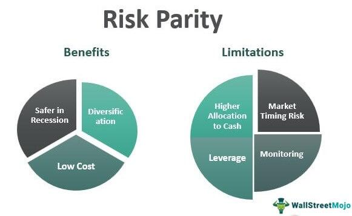

## Table of Contents

## What is a risk parity portfolio?

A risk parity portfolio is a type of investment strategy where the risk is spread out evenly across different types of investments. Instead of focusing on how much money is put into each investment, this strategy looks at how risky each investment is. The goal is to make sure that no single investment can cause big losses for the whole portfolio. This way, the overall risk is balanced, and the portfolio is less likely to be affected by big swings in any one investment.

In a traditional portfolio, more money might be put into stocks because they can grow a lot, but they are also riskier. In a risk parity portfolio, the focus is different. If stocks are riskier, less money might be put into them compared to safer investments like bonds. By doing this, the portfolio aims to get steady returns without taking on too much risk from any one type of investment. This approach can help investors feel more secure because their money is spread out in a way that manages risk better.

## How does a risk parity portfolio differ from a traditional portfolio?

A risk parity portfolio and a traditional portfolio differ mainly in how they handle risk and allocate money. In a traditional portfolio, the focus is usually on how much money is put into each investment, like stocks or bonds. For example, if someone believes stocks will do well, they might put a lot of money into stocks. This means the portfolio's performance depends a lot on how well stocks do, which can be risky because stocks can go up and down a lot.

On the other hand, a risk parity portfolio focuses on spreading risk evenly across all investments. Instead of just looking at how much money is invested, it looks at how risky each investment is. If stocks are riskier than bonds, a risk parity portfolio might put less money into stocks and more into bonds to balance out the risk. The goal is to make sure that no single investment can cause big losses, making the portfolio more stable and less likely to be affected by big swings in any one type of investment.

In simple terms, a traditional portfolio might put more eggs in one basket hoping for big gains, while a risk parity portfolio tries to balance the eggs across many baskets to manage risk better. This difference in approach can lead to different outcomes, with risk parity portfolios often aiming for more steady returns and less risk, while traditional portfolios might aim for higher returns but with more risk.

## What are the key principles behind risk parity?

The key idea behind risk parity is to spread risk evenly across all the different investments in a portfolio. Instead of focusing on how much money is put into each investment, risk parity looks at how risky each investment is. If one type of investment, like stocks, is riskier than another, like bonds, a risk parity portfolio will put less money into the riskier one. This way, the risk is balanced out, so no single investment can cause big losses for the whole portfolio.

Another important principle of risk parity is that it aims for steady returns instead of big gains from one type of investment. By balancing the risk, the portfolio is less likely to have big swings in value. This can make investors feel more secure because their money is spread out in a way that manages risk better. The goal is to have a portfolio that grows steadily over time without being too affected by ups and downs in any one investment.

## What types of assets are typically included in a risk parity portfolio?

A risk parity portfolio usually includes a mix of different types of assets to spread out the risk. Common assets in these portfolios are stocks, bonds, and commodities. Stocks can be from different countries or industries, which helps to balance the risk because not all stocks move in the same way. Bonds are often included because they are usually less risky than stocks and can provide steady income. Commodities like gold or oil can also be part of the mix because they can act differently from stocks and bonds, adding another layer of risk management.

Sometimes, a risk parity portfolio might also include other types of investments like real estate investment trusts (REITs) or even cash and cash equivalents. REITs can offer income and diversification, while cash and cash equivalents provide safety and [liquidity](/wiki/liquidity-risk-premium). The key is to choose assets that don't all go up and down at the same time, so the overall risk of the portfolio stays balanced. By mixing these different types of assets, a risk parity portfolio aims to get steady returns without taking on too much risk from any one type of investment.

## How do you calculate risk contributions in a risk parity portfolio?

To calculate risk contributions in a risk parity portfolio, you start by figuring out how much each type of investment, like stocks or bonds, adds to the overall risk of the portfolio. This is done by looking at how much each investment moves up and down, which is called its [volatility](/wiki/volatility-trading-strategies). You also need to consider how these investments move together, which is called correlation. By using these pieces of information, you can calculate the risk contribution of each investment. The goal is to make these risk contributions equal across all the investments in the portfolio.

Once you know the risk contributions, you can adjust how much money you put into each investment to balance the risk. If stocks are riskier than bonds, you might put less money into stocks and more into bonds to make their risk contributions the same. This way, the portfolio's risk is spread out evenly, and no single investment can cause big losses. By doing these calculations and adjustments, you can build a risk parity portfolio that aims for steady returns without taking on too much risk from any one type of investment.

## What are the steps to construct a risk parity portfolio?

To build a risk parity portfolio, start by choosing different types of investments like stocks, bonds, and commodities. These investments should not all move up and down at the same time. Next, figure out how risky each investment is by looking at how much it moves up and down, which is called volatility. You also need to see how these investments move together, which is called correlation. With this information, you can calculate how much each investment adds to the overall risk of the portfolio, which is called its risk contribution.

Once you know the risk contributions, you can adjust how much money you put into each investment to make their risk contributions equal. If stocks are riskier than bonds, you might put less money into stocks and more into bonds to balance out the risk. Keep checking and adjusting the portfolio to make sure the risk stays balanced. By doing this, you can create a risk parity portfolio that aims for steady returns without taking on too much risk from any one type of investment.

## How do you optimize asset allocation in a risk parity portfolio?

To optimize asset allocation in a risk parity portfolio, you need to make sure that the risk is spread out evenly across all the different types of investments. Start by figuring out how risky each investment is. This means looking at how much each investment moves up and down, which is called volatility. You also need to see how these investments move together, which is called correlation. With this information, you can calculate how much each investment adds to the overall risk of the portfolio, which is called its risk contribution. The goal is to make these risk contributions equal across all the investments.

Once you know the risk contributions, you can adjust how much money you put into each investment to balance the risk. If stocks are riskier than bonds, you might put less money into stocks and more into bonds to make their risk contributions the same. This way, the portfolio's risk is spread out evenly, and no single investment can cause big losses. Keep checking and adjusting the portfolio to make sure the risk stays balanced. By doing this, you can create a risk parity portfolio that aims for steady returns without taking on too much risk from any one type of investment.

## What are common challenges and pitfalls in implementing a risk parity strategy?

Implementing a risk parity strategy can be tricky because it needs a lot of math and data to figure out how risky each investment is. You have to keep track of how much each investment moves up and down, which is called volatility, and how these investments move together, which is called correlation. If you get these numbers wrong, your portfolio might not be balanced the way you want it to be. Also, the costs of buying and selling investments can add up, especially if you need to keep adjusting your portfolio to keep the risk balanced.

Another challenge is that markets can change a lot, and what worked in the past might not work in the future. If the economy goes through a big change, like a financial crisis, the way investments move together can change too. This means you have to keep watching and adjusting your portfolio, which can be hard work. Some people might also find it hard to stick with a risk parity strategy if it doesn't seem to be doing as well as other types of investments in the short term, even though it's meant to be safer over the long term.

## How can leverage be used in a risk parity portfolio?

Leverage can be used in a risk parity portfolio to boost the returns from investments that are less risky, like bonds. When you use leverage, you borrow money to invest more than you have. In a risk parity portfolio, this can help balance the risk between different types of investments. For example, if stocks are riskier than bonds, you might use leverage to invest more in bonds. This way, the risk contribution from bonds can be equal to the risk contribution from stocks, even though you're putting more money into bonds than you actually have.

Using leverage in a risk parity portfolio can be helpful, but it also comes with more risk. If the investments you borrowed money to buy go down in value, you could lose more than you started with. It's important to use leverage carefully and keep a close eye on your investments. By doing this, you can try to get better returns from your risk parity portfolio while still keeping the risk balanced across all your investments.

## What are the historical performance metrics of risk parity portfolios?

Risk parity portfolios have shown steady performance over time, but they can be different from traditional portfolios. In the years after the 2008 financial crisis, risk parity portfolios did well because they were less affected by the big swings in the stock market. They often had better returns than traditional portfolios during this time because they balanced risk across different types of investments like stocks, bonds, and commodities. This helped them avoid big losses when the stock market went down.

However, risk parity portfolios can also have times when they don't do as well as traditional portfolios. For example, when interest rates are very low, the returns from bonds, which are a big part of risk parity portfolios, can be smaller. This means the overall returns of the portfolio might not be as high as a portfolio that puts more money into stocks. But even during these times, risk parity portfolios usually have less risk and smaller losses than traditional portfolios, which is their main goal.

## How does risk parity perform in different market conditions?

Risk parity portfolios aim to do well in different market conditions by spreading risk evenly across different types of investments. In times when the stock market goes down a lot, like during a financial crisis, risk parity portfolios often do better than traditional portfolios. This is because they have less money in stocks and more in safer investments like bonds. By balancing the risk this way, they can avoid big losses and have steadier returns, even when the market is not doing well.

However, risk parity portfolios might not do as well as traditional portfolios when the stock market is going up a lot. This is because they don't put as much money into stocks, which can grow a lot during good times. But even during these times, risk parity portfolios usually have less risk and smaller losses. This means they can still be a good choice for people who want to avoid big ups and downs in their investments and are okay with steady, but maybe smaller, returns.

## What advanced techniques can be used to enhance a risk parity portfolio?

One advanced technique to make a risk parity portfolio better is using something called "dynamic risk allocation." This means you keep checking and changing how much risk each investment has based on what's happening in the market. If the market is doing well, you might put more money into riskier investments like stocks. If the market is not doing well, you might put more money into safer investments like bonds. By doing this, you can try to get better returns while still keeping the risk balanced.

Another technique is using "[factor](/wiki/factor-investing)-based investing." This means you look at what makes investments go up or down, like how big a company is or how fast it's growing. By choosing investments that have different factors, you can spread out the risk even more. This can help your portfolio do better in different market conditions because it's not just based on one type of investment. Both of these techniques can help make a risk parity portfolio stronger and more able to handle different market situations.

## What is Understanding Risk Parity Portfolio?

Risk parity is an investment strategy that prioritizes risk allocation over the traditional capital allocation. Unlike the classic 60/40 asset allocation model, which allocates 60% of the portfolio to equities and 40% to fixed income, risk parity seeks to balance the portfolio by assigning risk in equal measure across different asset classes. This approach aims to create portfolios that are more resilient to market fluctuations.

In a risk parity portfolio, the focus is on ensuring that each asset class contributes equally to the overall risk. This involves understanding and managing key concepts such as the security market line, leverage, and correlation between different asset classes. The security market line (SML) is crucial as it represents the expected return of an asset as a function of its risk as measured by beta. By understanding where an asset lies on the SML, investors can assess its performance relative to its risk.

Leverage plays a significant role in risk parity strategies, particularly for adjusting the risk of lower-risk asset classes such as bonds. By using leverage, investors can amplify the returns of these less volatile assets, enabling them to contribute a similar level of risk to the portfolio as higher-risk assets like equities. The mathematical representation of a leveraged position can help quantify this effect:

$$
\text{Leveraged Portfolio Return} = \text{(1 + Leverage Factor)} \times \text{Portfolio Return}
$$

Correlation is another fundamental component in constructing a risk parity portfolio. By analyzing the correlations between various asset classes, investors can optimize diversification, ensuring that assets do not move in tandem and that risks are not concentrated in a single sector.

Overall, the risk parity strategy is designed to achieve an equal risk contribution across different asset classes, thereby reducing the dominance of any single asset class in driving the portfolio’s risk. This balanced approach can lead to improved stability and potentially higher risk-adjusted returns over time.

## How can one build a Risk Parity Investment Portfolio?

Creating a risk parity investment portfolio requires a strategic approach to the allocation of assets, focusing on balancing the contribution of risk rather than merely distributing capital. This strategy aims to equalize the risk across diverse asset classes, such as equities, bonds, commodities, and foreign exchange, allowing for a more resilient portfolio against market fluctuations.

To construct such a portfolio, investors must first analyze the volatility and correlation of potential assets. Volatility indicates the degree of price variation an asset might experience, while correlation assesses how different asset prices move concerning each other. A low correlation between asset classes is preferred to maximize diversification benefits, as it ensures that not all assets will react similarly to market conditions.

Leverage plays a significant role in risk parity portfolios. Investors can use leverage to adjust the risk of asset classes with inherently lower risk profiles, such as certain bonds. By scaling up the exposure to these low-risk assets, they can achieve a risk level more comparable to that of higher-risk assets like equities. This enables investors to maintain a diversified exposure without disproportionately increasing the overall portfolio risk.

Rebalancing is a fundamental aspect of risk parity strategies. Over time, different assets in a portfolio may change in value at different rates, leading to an uneven allocation of risk. Regular rebalancing ensures that each asset class continues to contribute equally to the portfolio's risk profile, according to the initial strategic intention. The frequency of rebalancing—whether it's quarterly, semi-annually, or another interval—depends on the specific investment strategy and market conditions.

Advanced mathematical models and software tools are instrumental in optimizing asset allocation for risk parity portfolios. These models typically involve complex calculations to evaluate the expected risk contributions of different asset classes and determine the optimal leverage required. For example, the Portfolio Risk Parity optimization problem can be expressed as finding a set of weights $w$ that minimizes the difference between the risk contributions of each asset:

$$
\text{minimize} \sum_{i=1}^{n} \left(\frac{w_i \cdot \sigma_i}{\sum_{j=1}^{n} w_j \cdot \sigma_j} - \frac{1}{n}\right)^2
$$

where $w_i$ is the weight of asset $i$ in the portfolio, $\sigma_i$ is the volatility of asset $i$, and $n$ is the total number of assets.

Python, with its extensive libraries such as NumPy, SciPy, and CVXPY, is commonly used to solve these optimization problems. Below is a simple example of how such an optimization can be implemented using Python:

```python
import cvxpy as cp
import numpy as np

# Mock data for demonstration
num_assets = 4
volatilities = np.array([0.2, 0.15, 0.1, 0.25])
correlations = np.array([
    [1.0, 0.2, 0.1, 0.3],
    [0.2, 1.0, 0.4, 0.1],
    [0.1, 0.4, 1.0, 0.25],
    [0.3, 0.1, 0.25, 1.0]
])

cov_matrix = np.outer(volatilities, volatilities) * correlations

# Variables
weights = cp.Variable(num_assets)

# Objective function: minimize the risk deviation
risk_contributions = cp.quad_form(weights, cov_matrix) / sum(weights @ volatilities)
objective = cp.Minimize(cp.sum_squares(risk_contributions - (1/num_assets)))

constraints = [cp.sum(weights) == 1, weights >= 0]

problem = cp.Problem(objective, constraints)
problem.solve()

# Weights for the risk parity portfolio
risk_parity_weights = weights.value
print("Risk Parity Weights:", risk_parity_weights)
```

In essence, building a risk parity investment portfolio involves carefully balancing risk contributions, leveraging low-risk assets to equalize risk profiles, and continuously rebalancing to adapt to changing market conditions. Through the use of sophisticated models and computational tools, investors can effectively manage their portfolios to withstand market volatility.

## References & Further Reading

[1]: Asness, C. S., Frazzini, A., & Pedersen, L. H. (2012). ["Leverage Aversion and Risk Parity."](https://pages.stern.nyu.edu/~lpederse/papers/LeverageAversionRP.pdf) The Review of Financial Studies, 25(3), 725-766.

[2]: Kaplan, P. D. (2019). ["Risk Parity – Why, How, and When it Works."](https://typeset.io/papers/association-of-mean-arterial-pressure-with-all-cause-and-4cg8lttb9j) The Journal of Wealth Management, 21(3), 44-56.

[3]: ["Algorithmic Trading: Winning Strategies and Their Rationale"](https://books.google.com/books/about/Algorithmic_Trading.html?id=WAlFDwAAQBAJ) by Ernest P. Chan

[4]: Maillard, D., Roncalli, T., & Teïletche, J. (2010). ["On the properties of equally-weighted risk contributions portfolios."](https://papers.ssrn.com/sol3/papers.cfm?abstract_id=1271972) The Journal of Portfolio Management, 36(4), 60-70.

[5]: ["Inside the Black Box: A Simple Guide to Quantitative and High-Frequency Trading"](https://www.amazon.com/Inside-Black-Box-Quantitative-Frequency/dp/1118362411) by Rishi K. Narang