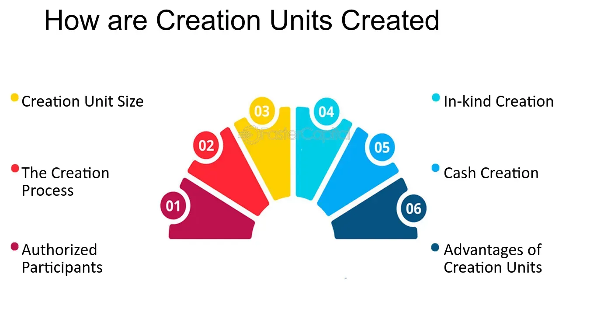

## Table of Contents

## What are creation units in the context of finance?

Creation units are large blocks of shares that are used in the process of creating and redeeming exchange-traded funds (ETFs). When an ETF is created, a financial institution, known as an authorized participant, puts together a creation unit by gathering the underlying securities that the ETF is meant to track. This bundle of securities is then exchanged with the ETF issuer for a creation unit, which is a large number of ETF shares, typically ranging from 25,000 to 100,000 shares.

The process of redeeming an ETF works in reverse. An authorized participant can return a creation unit to the ETF issuer and receive the underlying securities in return. This mechanism helps keep the price of the ETF in line with the value of its underlying assets. By allowing the creation and redemption of ETF shares in large blocks, creation units help maintain the efficiency and liquidity of the ETF market, making it easier for investors to buy and sell ETF shares at prices that closely reflect their true value.

## How do creation units relate to exchange-traded funds (ETFs)?

Creation units are important for exchange-traded funds (ETFs) because they help make and take away ETF shares. An ETF is like a basket that holds different investments, like stocks or bonds. When someone wants to start an ETF, they use creation units. A big investor, called an authorized participant, gathers all the things that should go into the ETF's basket. They then trade this basket for a big bunch of ETF shares, which is called a creation unit. This big bunch usually has between 25,000 and 100,000 shares.

When someone wants to get rid of [ETF](/wiki/etf-trading-strategies) shares, they can give back a creation unit to the people who made the ETF. In return, they get the basket of investments back. This back-and-forth process helps keep the price of the ETF close to what the basket of investments is really worth. It makes sure that the ETF stays fair and easy to trade for everyone who wants to buy or sell it.

## What is the typical size of a creation unit?

A creation unit is a big bunch of ETF shares. It's usually between 25,000 and 100,000 shares. This big bunch is what big investors use to make or get rid of ETF shares.

When someone wants to start an ETF, they trade a basket of investments for this big bunch of shares. When they want to stop the ETF, they give the big bunch back and get the basket of investments again. This helps keep the ETF's price fair and easy to trade.

## Who can create and redeem creation units?

Creation units are big bunches of ETF shares that can be made or taken away by special investors called authorized participants. These authorized participants are usually big financial institutions like banks or investment firms. They are the only ones who can do this special trading with the people who make the ETFs.

When an authorized participant wants to make a creation unit, they gather all the investments that the ETF is supposed to have. They then trade this basket of investments for a big bunch of ETF shares, which is the creation unit. If they want to get rid of the ETF shares, they give the creation unit back to the ETF makers and get the basket of investments in return. This helps keep the ETF's price fair and makes it easier for everyone to buy and sell the ETF.

## What is the process for creating a creation unit?

When someone wants to make a creation unit, they need to be a special kind of investor called an authorized participant. These authorized participants are usually big financial companies like banks or investment firms. They gather all the investments that the ETF is supposed to have, like stocks or bonds. This collection of investments is called a basket. Once they have the basket ready, they trade it with the people who make the ETF. In exchange for the basket, the authorized participant gets a big bunch of ETF shares, which is called a creation unit. This big bunch usually has between 25,000 and 100,000 shares.

This process helps keep the ETF's price fair. By allowing these big bunches of shares to be made and taken away, it makes sure that the price of the ETF stays close to the value of the investments in the basket. This is important because it helps everyone who wants to buy or sell the ETF to do so easily and at a fair price.

## What are the benefits of using creation units for ETF management?

Using creation units helps keep the price of an ETF fair and close to the value of the things it holds, like stocks or bonds. This is because big investors called authorized participants can make or take away big bunches of ETF shares, called creation units. When the ETF's price starts to get too high or too low, these investors step in. They either make more ETF shares by trading in a basket of the underlying investments or they take away ETF shares by giving back a creation unit and getting the basket back. This action helps push the ETF's price back to where it should be, making sure it stays fair for everyone who wants to buy or sell it.

Another benefit is that creation units make it easier for the ETF to be traded. Since big investors can make or take away large numbers of shares at once, it keeps the ETF liquid. This means there are always enough shares available for people to buy or sell without big price changes. It also helps keep the costs down for everyone because the process of making and taking away shares is done in big batches, which is more efficient. So, using creation units helps keep the ETF running smoothly and keeps it a good choice for investors.

## How do creation units affect the liquidity of ETFs?

Creation units help make ETFs easy to buy and sell. They do this by letting big investors, called authorized participants, create or get rid of large bunches of ETF shares. When there are more people who want to buy the ETF than sell it, authorized participants can make more shares by trading in a basket of the things the ETF holds, like stocks or bonds. This means there are always enough shares for people to buy, which keeps the ETF liquid.

When there are more sellers than buyers, authorized participants can take away ETF shares by giving back a creation unit and getting the basket of investments back. This helps keep the price of the ETF steady and makes sure there are always enough buyers and sellers. By allowing these big changes in the number of shares, creation units help keep the ETF easy to trade and keep its price fair for everyone.

## What are the costs associated with creating and redeeming creation units?

When big investors, called authorized participants, create or redeem creation units, they have to pay some costs. One of the main costs is called the creation/redemption fee. This fee is charged by the ETF issuer to cover the costs of processing the creation or redemption of the creation unit. The fee can be different for each ETF and is usually a small percentage of the value of the creation unit.

Another cost is the trading costs. When authorized participants gather the basket of investments to create a creation unit, they might have to buy these investments. This can lead to trading costs like brokerage fees. If they are redeeming a creation unit, they might have to sell the basket of investments they get back, which can also lead to trading costs. These costs can add up, especially if the basket has a lot of different investments.

These costs can affect the overall price of the ETF. If the costs are high, it might make the ETF less attractive to investors. But, because creation units are made and redeemed in big batches, the costs per share can be kept low. This helps keep the ETF running smoothly and keeps it a good choice for investors.

## How do creation units help in maintaining the net asset value (NAV) of an ETF?

Creation units help keep the net asset value (NAV) of an ETF in line with the value of the things it holds, like stocks or bonds. The NAV is the total value of all the investments in the ETF divided by the number of shares. Big investors called authorized participants can create or redeem creation units, which are big bunches of ETF shares. When the ETF's price is higher than its NAV, authorized participants can create more shares by trading in a basket of the underlying investments. This adds more shares to the market, which can help bring the ETF's price back down to its NAV.

On the other hand, if the ETF's price is lower than its NAV, authorized participants can redeem creation units. They give back a big bunch of ETF shares and get the basket of investments in return. This takes shares out of the market, which can help push the ETF's price back up to its NAV. By allowing these big changes in the number of shares, creation units help make sure the ETF's price stays close to what its investments are really worth. This keeps the ETF fair for everyone who wants to buy or sell it.

## What are the potential risks or challenges involved in dealing with creation units?

Dealing with creation units can sometimes be tricky for big investors called authorized participants. One challenge is the cost. When they create or redeem creation units, they have to pay fees to the ETF issuer. They also have to pay for trading the basket of investments, which can add up, especially if the basket has a lot of different things in it. These costs can make the ETF less attractive if they are too high, and they can affect how much profit the authorized participants make.

Another risk is the timing and market conditions. If the market is moving a lot, the value of the basket of investments can change quickly. This can make it hard for authorized participants to create or redeem creation units at the right time. If they trade the basket when the market is going down, they might lose money. Also, if they can't find all the investments they need for the basket, it can be hard to create a creation unit. This can slow down the process and affect how well the ETF works.

## How do authorized participants (APs) interact with creation units?

Authorized participants (APs) are big investors like banks or investment firms who can make and get rid of big bunches of ETF shares, called creation units. To make a creation unit, an AP gathers a basket of investments, like stocks or bonds, that the ETF is supposed to hold. They trade this basket with the people who make the ETF and get a big bunch of ETF shares in return. This big bunch usually has between 25,000 and 100,000 shares. When an AP wants to get rid of ETF shares, they give back a creation unit to the ETF makers and get the basket of investments back. This process helps keep the ETF's price fair and makes it easier for everyone to buy and sell the ETF.

APs play an important role in making sure the ETF's price stays close to the value of the things it holds. If the ETF's price is too high, APs can create more shares by trading in a basket of investments, which can help bring the price down. If the ETF's price is too low, APs can take away shares by redeeming creation units, which can help push the price back up. By doing this, APs help keep the ETF's price in line with its net asset value (NAV), which is what the ETF's investments are really worth. This keeps the ETF fair and easy to trade for everyone.

## What advanced strategies can be employed by institutional investors using creation units?

Institutional investors, like big banks or investment firms, can use creation units to do some smart things with ETFs. One strategy they might use is called [arbitrage](/wiki/arbitrage). If they see that the ETF's price is different from the value of the things it holds, they can make money from this difference. For example, if the ETF's price is too low compared to its investments, they can buy the ETF, create more shares by trading in a basket of the investments, and then sell the new shares at a higher price. This helps them make a profit and also brings the ETF's price back to where it should be.

Another strategy they might use is called hedging. This is when they want to protect their investments from going down in value. They can use creation units to make or get rid of ETF shares that match their other investments. For example, if they have a lot of stocks and they think the stock market might go down, they can create ETF shares that hold those stocks. Then, if the stock market does go down, the value of their ETF shares will go down too, but they can use these shares to balance out the losses from their other stocks. This way, they can keep their overall investment safer.

By using creation units in these ways, institutional investors can make the most of their money and keep their investments safe. They help make sure the ETF's price stays fair and close to the value of its investments, which is good for everyone who wants to buy or sell the ETF.

## References & Further Reading

[1]: Paulus, E. (2019). ["Creation Units and Exchange Traded Funds: An Analysis of their Role in the Market."](https://fastercapital.com/content/ETFs--Understanding-the-Creation-Unit-Mechanism.html) SSRN.

[2]: Madhavan, A. (2012). ["Exchange-Traded Funds, Market Structure, and the Flash Crash."](https://www.tandfonline.com/doi/abs/10.2469/faj.v68.n4.6) Financial Analysts Journal, 68(4), 20-35.

[3]: Hasbrouck, J. (2003). ["Intraday Price Formation in U.S. Equity Index Markets."](https://onlinelibrary.wiley.com/doi/10.1046/j.1540-6261.2003.00609.x) Journal of Finance, 58(6), 2375-2400.

[4]: Narang, R. (2009). ["Inside the Black Box: A Simple Guide to Quantitative and High-Frequency Trading."](https://onlinelibrary.wiley.com/doi/book/10.1002/9781118267738) Wiley.

[5]: Ramaswamy, S. (2011). ["Market Structures and Systemic Risks of Exchange-Traded Funds."](https://www.bis.org/publ/work343.htm) Bank for International Settlements. 

[6]: Basu, N., & Pavlova, A. (2013). ["A Model of Investment into ETFs."](https://pmc.ncbi.nlm.nih.gov/articles/PMC11662651/) Management Science, 59(6), 1514-1531.