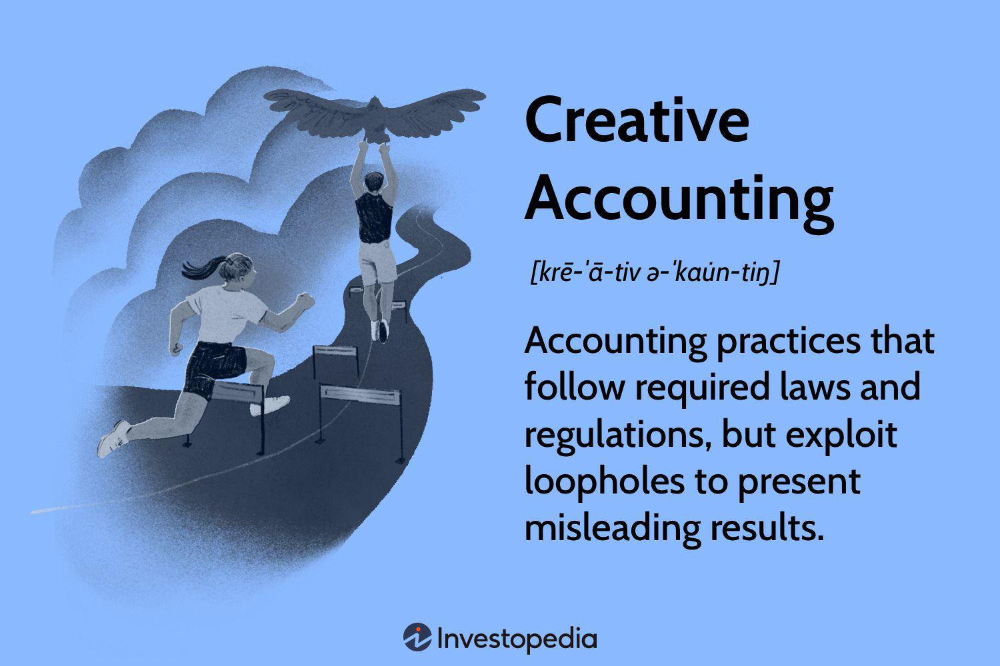

Understanding key accounting practices and emerging technologies is crucial for professionals and investors alike in today’s fast-paced financial environment. Transparency and accurate reporting are the bedrock of trust in business operations and essential for making informed investment decisions. This article addresses essential topics in modern finance—financial reporting, creative accounting, and the innovative application of algorithmic trading—and highlights their interplay and impact on corporate transparency and market dynamics.

Financial reporting provides stakeholders with an authentic snapshot of a company’s health by adhering to standardized accounting practices. Frameworks like Generally Accepted Accounting Principles (GAAP) and International Financial Reporting Standards (IFRS) establish the guidelines that ensure consistency and accountability in financial statements. However, financial reporting is not without its challenges. Creative accounting, while technically legal, can present a more favorable company image by manipulating figures, thus obscuring the true financial status. These practices have significant implications, as observed in historical scandals like Enron and WorldCom, which underscore the potential for severe financial misconduct stemming from misleading financial narratives.



Simultaneously, the rise of algorithmic trading highlights the technological advancements reshaping the financial sector. By automating trade execution processes at high speed and precision, algorithmic solutions leverage accurate financial data, reinforcing the necessity for transparent reporting standards. Such technologies also provide tools for evaluating and optimizing investment strategies, marking a shift in how financial operations are conducted.

Ethical considerations and regulatory oversight play crucial roles in overseeing these practices, preventing the misuse of accounting techniques, and fostering market integrity. Frameworks like the Sarbanes-Oxley Act exemplify efforts to safeguard against fraud and build investor trust.

This comprehensive guide aims to illuminate both traditional and modern financial strategies, exploring the complexities of financial truth and deception. As professionals and investors navigate these complexities, a blend of ethical mindfulness and regulatory compliance becomes imperative, ensuring that transparent financial practices remain the backbone of a sustainable financial ecosystem.

## Table of Contents

## Financial Reporting and Accounting Practices

Financial reporting is fundamental to the transparency and integrity of business operations, offering stakeholders essential insights into a company’s financial health. It aids in the analysis of economic resources, obligations, and equity of an entity. By adhering to recognized accounting methodologies, companies can ensure their financial statements accurately represent their performance and position.

### Standard Accounting Practices

Accounting standards such as Generally Accepted Accounting Principles (GAAP) and International Financial Reporting Standards (IFRS) provide a framework for preparing financial statements. GAAP, predominantly used in the United States, and IFRS, which is widely adopted internationally, outline principles for recognizing, measuring, presenting, and disclosing financial transactions.

- **GAAP** emphasizes consistency and comparability, requiring firms to follow specific principles like the matching principle, which matches revenues with related expenses.
- **IFRS** focuses on being principle-based, offering more flexibility and relying on professional judgment to enhance the relevance and reliability of reported information.

### Importance of Accurate Financial Reporting

Accurate financial reporting fosters accountability, allowing investors, creditors, and other stakeholders to make informed decisions. It mitigates information asymmetry, where one party has more or better information than the other, potentially leading to an imbalance in negotiations. For example, clear presentation of earnings, assets, and liabilities helps in assessing the profitability and [liquidity](/wiki/liquidity-risk-premium) of a business.

### Ethical Standards in Accounting

Ethical standards in accounting are crucial to preventing financial misstatements and fraud. Companies must ensure that their accounting practices do not distort the economic reality or intentionally mislead stakeholders. This includes honest representation of financial data and adherence to ethical norms such as objectivity, integrity, and confidentiality.

Firms are encouraged to establish internal controls and audit committees to monitor compliance with accounting standards and ethical guidelines. These measures help in detecting and preventing unethical practices, preserving the trust of investors and maintaining market stability.

In conclusion, financial reporting and standardized accounting practices are vital to maintaining transparency and accountability in corporate operations. By adhering to GAAP or IFRS, ensuring the accuracy of financial statements, and upholding ethical standards, businesses contribute to a more informed and stable financial environment.

## Creative Accounting: Techniques and Implications

Creative accounting involves the strategic manipulation of financial data within the boundaries of accounting standards to cast a more favorable light on a company’s financial health. While conforming to the letter of established regulations, creative accounting practices often stretch the spirit of the rules, allowing companies to deliver results that appear more robust than they might be under stricter interpretations. 

Common creative accounting techniques include the overestimation of revenues and the manipulation of depreciation methods. Overestimating revenues can involve practices such as premature revenue recognition, wherein sales not yet finalized are reported prematurely to inflate earnings reports. Similarly, manipulating depreciation by altering the method or time frame—such as opting for a straight-line depreciation over an accelerated one—can significantly affect a company’s net income by deferring expenses and affecting asset values.

While these accounting maneuvers operate within legal frameworks and comply with standards like Generally Accepted Accounting Principles (GAAP) or International Financial Reporting Standards (IFRS), they can obfuscate actual company performance. This misrepresentation poses risks not only to investors and regulators, who base their decisions on the purported financial statements, but also to market stability, as financial transparency is a key pillar for investor confidence.

The infamous cases of Enron and WorldCom serve as cautionary tales demonstrating the severe consequences of aggressive creative accounting. Enron’s use of complex accounting practices, such as off-balance-sheet partnerships, allowed it to hide debt and inflate profits, ultimately leading to one of the biggest bankruptcy filings in U.S. history. Similarly, WorldCom used fraudulent accounting entries to overstate its assets by over $11 billion, which resulted in a loss of investor trust and another high-profile bankruptcy.

These case studies exemplify the potential repercussions of creative accounting when misused: financial instability, legal scrutiny, significant loss of shareholder value, and in extreme cases, the complete collapse of corporations. They highlight the critical need for stringent regulatory oversight and the importance of ethical standards in accounting practices to safeguard against such financial misconduct.

## Role of Algorithmic Trading in Modern Finance

Algorithmic trading, commonly known as algo trading, is a method of executing orders using automated pre-programmed trading instructions. This approach enables trades to be conducted at speeds and volumes impractical for a human trader. The automation of trading processes hinges on the capacity to rapidly process large quantities of financial data and make decisions based on complex algorithms, which are designed to identify profitable opportunities more efficiently than manual methods.

Central to the efficacy of [algorithmic trading](/wiki/algorithmic-trading) systems is the accuracy and timeliness of financial data. As automated strategies depend on current and precise information, transparent financial reporting standards play a critical role. Any lapse in data accuracy can lead to erroneous trade execution with potentially significant financial consequences. For instance, incorrect earnings reports or delayed disclosures can affect the performance of trading algorithms, leading to suboptimal investment decisions.

The integration of financial accounting principles into algorithmic strategies further refines trading operations. By incorporating [fundamental analysis](/wiki/fundamental-analysis) metrics—such as price-to-earnings ratios, debt-to-equity ratios, and earnings per share—trading algorithms can better assess the intrinsic value of securities, enhancing decision-making capabilities. Fundamental data can be factored into algorithms that evaluate a stock's current price against its estimated value, trading more effectively based on calculated risks.

Furthermore, advanced algorithms utilize technical analysis, a quantitative approach consisting of chart patterns and indicators like moving averages, relative strength index, and candlestick patterns. These techniques often require the application of mathematical and statistical models to identify trends and predict future price movements. An example of a technical analysis formula used in algorithmic trading is the calculation of moving averages:

$$
MA(t) = \frac{1}{n} \sum_{i=0}^{n-1} P(t-i)
$$

where $MA(t)$ is the moving average at time $t$, $n$ is the number of periods specified, and $P(t-i)$ represents the price at each specific time $t-i$.

Algorithmic trading systems also rely on [machine learning](/wiki/machine-learning) algorithms to refine strategies by continuously learning from historical data patterns and market behavior. This incorporation of [artificial intelligence](/wiki/ai-artificial-intelligence) enables adaptive strategies that evolve with market changes, enhancing the robustness of trading decisions.

The programming aspect of algorithmic trading is often executed in languages such as Python due to its extensive libraries and frameworks like NumPy, Pandas, and scikit-learn. These libraries facilitate data manipulation, statistical analysis, and the application of machine learning techniques in the development of complex trading algorithms. Below is an example snippet of Python code illustrating a simple moving average calculation:

```python
import pandas as pd

def calculate_moving_average(prices, window):
    return prices.rolling(window=window).mean()

prices_series = pd.Series([100, 102, 104, 103, 105, 107])
moving_average = calculate_moving_average(prices_series, window=3)
print(moving_average)
```

In conclusion, algorithmic trading represents a sophisticated intersection of technology, financial data, and investment strategy. The reliance on accurate data emphasizes the significance of transparent financial reporting. In conjunction with financial accounting principles and advanced analytics, algorithmic trading methods continue to revolutionize financial markets by optimizing transaction efficiency and improving investment outcomes.

## Ethical Considerations and Regulation

Financial regulations play a critical role in safeguarding the integrity of financial reporting and market operations. They are designed to prevent the misuse of accounting practices and to ensure complete transparency within the financial markets, thereby fostering investor trust. Regulatory frameworks, such as the Sarbanes-Oxley Act, have been established as a response to significant corporate scandals that exposed vulnerabilities in accounting and audit processes.

The Sarbanes-Oxley Act of 2002, a U.S. federal law, was enacted in the wake of major financial scandals involving corporations like Enron and WorldCom. Its primary aim is to protect investors by improving the accuracy and reliability of corporate disclosures. The act mandates strict reforms to enhance financial disclosures and deter fraudulent activities. Key provisions include the requirement for top management to certify the accuracy of financial information (Section 302) and the establishment of more stringent record-keeping requirements (Section 404).

Ethical accounting practices are indispensable for maintaining the integrity of financial markets. Ethical considerations in accounting ensure that financial statements provide a true and fair view of a company’s financial position. This involves adhering strictly to established accounting standards and principles such as Generally Accepted Accounting Principles (GAAP) and International Financial Reporting Standards (IFRS). By ensuring that financial reports are accurate and transparent, companies can build and sustain investor confidence, which is critical for the smooth functioning of markets.

Moreover, ethical practices in accounting involve the responsibility to stakeholders to not only follow the letter of the law but also embrace the spirit of fairness, equity, and honesty. Accountants and financial professionals are urged to uphold these ethical standards to prevent manipulation of financial data that could otherwise lead to misrepresentation of a company's financial health.

Maintaining ethical standards also involves continuous education and training for financial professionals to keep abreast of new regulations and accounting standards. Professional bodies and educational institutions play a pivotal role in embedding ethical considerations into the curriculum and continuing professional development (CPD) programs.

In summary, financial regulations and ethical accounting practices are not just statutory obligations but fundamental components of a transparent and robust financial system. They help in mitigating risks associated with creative accounting and fraudulent reporting, thus underpinning the confidence of investors and the general public in the financial markets.

## Conclusion

As financial markets grow more complex, reporting and accounting practices must adapt to the evolving landscape. An understanding of creative accounting risks alongside technological advancements such as algorithmic trading is essential for investors and professionals to remain competitive and ethical in this dynamic environment. The subtleties of creative accounting demand vigilance and a commitment to transparency. It's vital to navigate these challenges with ethical mindfulness, ensuring that financial statements accurately represent a company’s true position.

Simultaneously, advancements such as algorithmic trading introduce opportunities for improving market efficiency but require accurate data and robust controls to prevent unethical manipulation. Algorithmic systems rely heavily on precise, timely information; thus, enhancing regulatory frameworks becomes critical. Legislation like the Sarbanes-Oxley Act illustrates the commitment to safeguarding transparency and investor trust, setting standards that prevent fraud and misrepresentation.

Ultimately, as financial strategies intertwine with technology and innovation, regulatory compliance and ethical behavior aren't just necessary—they are the foundation of a sustainable financial market. Transparent financial practices foster trust, enable informed decision-making, and uphold the integrity of markets worldwide. Maintaining a balance between innovation and ethical responsibility promises a stable, responsible financial ecosystem for the future.

## References & Further Reading

[1]: Benston, G. J., Bromwich, M., Litan, R. E., & Wagenhofer, A. (2006). ["Worldwide Financial Reporting: The Development and Future of Accounting Standards."](https://onlinelibrary.wiley.com/doi/abs/10.1111/j.1467-6281.2006.00196.x) Oxford University Press.

[2]: Healy, P. M., & Wahlen, J. M. (1999). ["A Review of the Earnings Management Literature and Its Implications for Standard Setting."](https://papers.ssrn.com/sol3/papers.cfm?abstract_id=156445) Accounting Horizons, 13(4), 365-383.

[3]: Cahan, S., & Zhang, W. (2006). ["After Enron: Improving Corporate Law and Modernising Securities Regulation in Europe and the US."](https://papers.ssrn.com/sol3/papers.cfm?abstract_id=910205) Kluwer Law International.

[4]: López de Prado, M. (2018). ["Advances in Financial Machine Learning."](https://www.amazon.com/Advances-Financial-Machine-Learning-Marcos/dp/1119482089) John Wiley & Sons.

[5]: Mulligan, T. (n.d.). ["Financial Management and Algorithmic Trading."](https://github.com/Quantreo/2nd-edition-BOOK-AMAZON-Python-for-Finance-and-Algorithmic-Trading) World Scientific Publishing.