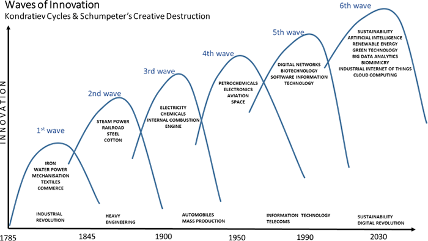

## Table of Contents

## What is creative destruction?

Creative destruction is a term used to describe how old ways of doing things are replaced by new and better ways. It was first talked about by an economist named Joseph Schumpeter. He said that in a free market, new inventions and businesses can push out old ones. This can be hard for the people and companies that are replaced, but it helps the economy grow and improve over time.

For example, when smartphones came out, they replaced many older technologies like landline phones and simple mobile phones. This was creative destruction at work. While it was tough for companies making those older products, the new technology brought many benefits and new opportunities. So, creative destruction is about how progress can sometimes be disruptive, but it leads to better things in the end.

## Who coined the term 'creative destruction' and in what context?

The term 'creative destruction' was coined by an economist named Joseph Schumpeter. He used this term to describe how new inventions and businesses can replace old ones in a free market. Schumpeter believed that this process, although it might be tough for some people and companies, is important for the economy to grow and improve.

Schumpeter introduced the idea of creative destruction in his book called "Capitalism, Socialism and Democracy," which he published in 1942. He explained that new technologies and ways of doing things can make old ones outdated. This can lead to jobs and industries disappearing, but it also creates new opportunities and better ways of living. So, creative destruction is about how progress can be disruptive but ultimately leads to positive changes.

## How does creative destruction relate to economic growth?

Creative destruction is important for economic growth because it helps new and better ideas replace old ones. When new businesses start up with fresh ideas, they can make things cheaper or better. This pushes the whole economy to grow. Old companies might have to close down, but the new ones bring new jobs and ways to make money. So, even though it can be hard for some people, creative destruction helps the economy get bigger and better over time.

This process also encourages people to keep coming up with new ideas. If people know that new inventions can make them successful, they will keep trying to think of new things. This leads to more innovation, which is really important for economic growth. Without creative destruction, old ways of doing things might stick around too long and slow down progress. By allowing new ideas to push out the old ones, the economy can keep moving forward and growing.

## Can you provide examples of creative destruction in history?

One example of creative destruction in history is the rise of the automobile industry in the early 20th century. Before cars, people used horses and carriages to get around. When cars started becoming popular, they replaced the need for horses and carriages. This was hard for people who made their living with horses and carriages, but it made travel faster and easier for everyone. The car industry also created lots of new jobs and helped the economy grow.

Another example is the impact of the internet on traditional retail. Before the internet, people had to go to stores to buy things. But when online shopping became popular, it changed everything. Many traditional stores had to close down because people could buy things more easily online. This was tough for store owners and workers, but it made shopping more convenient and gave people more choices. The growth of online shopping also created new jobs in areas like website development and delivery services.

A third example is the shift from film photography to digital photography. Before digital cameras, people used film to take pictures. When digital cameras came out, they made film cameras less popular. This was hard for companies that made film and film cameras, but digital photography made taking and sharing pictures much easier. The rise of digital photography also led to new jobs in areas like digital editing and online photo sharing. So, even though it was tough for some, it helped the economy grow in new ways.

## What role does innovation play in creative destruction?

Innovation is at the heart of creative destruction. It's all about coming up with new ideas and ways of doing things. When someone invents something new, like a smartphone or the internet, it can change how people live and work. These new inventions can make old ways of doing things less important. For example, when cars were invented, they made horse carriages less needed. This is how innovation leads to creative destruction.

Innovation doesn't just replace old things; it also helps the economy grow. When new businesses start up with fresh ideas, they create new jobs and ways to make money. This can be hard for the old businesses and workers who get left behind, but it pushes the whole economy forward. So, while creative destruction can be tough, it's innovation that keeps the economy moving and growing.

## How do businesses adapt to the process of creative destruction?

Businesses adapt to creative destruction by staying open to new ideas and being ready to change. When new inventions or ways of doing things come along, businesses need to think about how they can use these new ideas to stay successful. Sometimes, this means they have to change what they do or how they do it. For example, when people started shopping online, many stores had to start selling things on the internet too. If they didn't, they might have lost customers to other businesses that did start selling online.

Another way businesses adapt is by always looking for new opportunities. They might try to come up with their own new ideas or work with other companies to stay ahead. This can help them find new ways to make money even when old ways are not working anymore. For example, some companies that used to make film cameras started making digital cameras instead. By doing this, they could keep making money even though people didn't want film cameras anymore. So, by being ready to change and looking for new chances, businesses can keep going even when creative destruction is happening.

## What are the social impacts of creative destruction?

Creative destruction can make big changes in people's lives. When new inventions come out, they can make old jobs go away. This can be hard for people who lose their jobs. They might have to learn new skills or find new work. Sometimes, whole towns or areas can be hurt if a lot of people lose their jobs at the same time. But creative destruction also brings new jobs and ways to make money. If people can learn new skills and get new jobs, they can do well even when things are changing.

On the good side, creative destruction can make life better for everyone. New inventions can make things cheaper and easier to get. For example, when smartphones came out, they made it easier for people to talk to each other and find information. This can help people live better lives. But it's important for society to help people who are hurt by creative destruction. This can mean giving them money or helping them learn new skills. If we do this, creative destruction can help everyone, not just some people.

## How does government policy influence creative destruction?

Government policy can help or slow down creative destruction. If the government makes rules that help new businesses start up, like giving them money or making it easier to get started, it can make creative destruction happen faster. This can be good because new businesses can bring new ideas and help the economy grow. But if the government makes too many rules or helps old businesses too much, it can slow down creative destruction. Old businesses might not want to change, and this can make it hard for new ideas to come in.

On the other hand, the government can also help people who are hurt by creative destruction. If a new invention makes old jobs go away, the government can give money or help people learn new skills. This can make it easier for people to find new jobs and do well even when things are changing. So, government policy can make a big difference in how creative destruction happens and who it helps or hurts.

## What are the challenges faced by industries undergoing creative destruction?

Industries going through creative destruction face a lot of challenges. One big challenge is that they have to change how they do things. When a new invention comes out, it can make old ways of doing things less important. This means businesses in the industry might have to learn new skills or start making new products. If they don't change, they can lose customers to other businesses that do. This can be hard and scary for the people who work in these industries because they might lose their jobs if they can't keep up.

Another challenge is that creative destruction can be very fast. Sometimes, new inventions can change things very quickly. This means industries don't have a lot of time to get ready for the changes. They have to think fast and be ready to try new things. If they wait too long, they might not be able to catch up. This can make it hard for them to stay successful and keep making money. So, industries going through creative destruction have to be ready to change and do it quickly.

## How can companies foster innovation to stay ahead of creative destruction?

Companies can foster innovation by always looking for new ideas and being open to change. They can do this by setting up special teams to think of new ways to do things or by working with other companies and schools to come up with new inventions. It's important for companies to spend money on research and development so they can keep coming up with new ideas. By doing this, they can find new ways to make money and stay ahead of other businesses.

Another way companies can stay ahead is by listening to their customers. If they pay attention to what people want, they can come up with new products or services that meet those needs. This can help them stay successful even when new inventions are changing things. By being ready to try new things and always looking for new opportunities, companies can keep going strong even when creative destruction is happening.

## What are the long-term effects of creative destruction on an economy?

Creative destruction can make an economy grow and get better over time. When new inventions and businesses come out, they can make old ways of doing things less important. This can be hard for people who lose their jobs, but it also creates new jobs and ways to make money. New inventions can make things cheaper and easier for everyone. This helps the economy get bigger and stronger. Over time, creative destruction can lead to more innovation and better ways of living for people.

But creative destruction can also be tough for some people and places. When old jobs go away, whole towns or areas can be hurt if a lot of people lose their jobs at the same time. It's important for the government and society to help these people by giving them money or helping them learn new skills. If they do this, creative destruction can help everyone, not just some people. In the long run, creative destruction can make the economy more flexible and ready for new changes, but it needs to be managed well to make sure it helps as many people as possible.

## How does creative destruction affect global competitiveness?

Creative destruction can make countries more competitive around the world. When new inventions come out, they can help a country's businesses do better than businesses in other countries. If a country is good at coming up with new ideas and using them, it can make things cheaper or better than other places. This can help the country sell more things to other countries and make more money. So, creative destruction can help a country stay ahead of other countries by always coming up with new and better ways to do things.

But creative destruction can also make it hard for some countries to stay competitive. If a country is slow to change or doesn't have a lot of new ideas, it can fall behind other countries. When new inventions come out in one country, they can make businesses in other countries less important. If a country doesn't keep up with these changes, its businesses might lose customers to businesses in other countries that are using the new inventions. So, creative destruction can make the world more competitive, but it can be tough for countries that don't keep up with the changes.

## References & Further Reading

[1]: Schumpeter, J. A. (1942). ["Capitalism, Socialism, and Democracy."](https://www.taylorfrancis.com/books/mono/10.4324/9780203202050/capitalism-socialism-democracy-joseph-schumpeter) Harper & Brothers.

[2]: IEA, International Energy Agency. (2018). ["Renewables 2018: Analysis and Forecasts to 2023."](https://www.iea.org/reports/renewables-2018) IEA Publications.

[3]: Lopez de Prado, M. (2018). ["Advances in Financial Machine Learning."](https://www.amazon.com/Advances-Financial-Machine-Learning-Marcos/dp/1119482089) Wiley.

[4]: Aronson, D. R. (2006). ["Evidence-Based Technical Analysis: Applying the Scientific Method and Statistical Inference to Trading Signals."](https://www.amazon.com/Evidence-Based-Technical-Analysis-Scientific-Statistical/dp/0470008741) Wiley.

[5]: Jansen, S. (2020). ["Machine Learning for Algorithmic Trading."](https://github.com/stefan-jansen/machine-learning-for-trading) Packt Publishing.

[6]: Chan, E. (2009). ["Quantitative Trading: How to Build Your Own Algorithmic Trading Business."](https://github.com/ftvision/quant_trading_echan_book) Wiley.