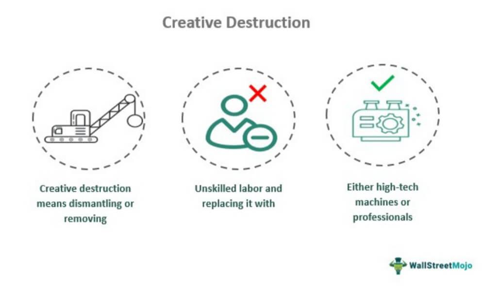

Creative destruction is a significant concept in comprehending the fluidity of economic systems and their propensity for innovation. Originating from the work of economist Joseph Schumpeter, the term describes the process through which old, inefficient practices and systems are dismantled to make way for new, more effective innovations. This relentless cycle of transformation is seen as a fundamental characteristic of capitalist economies, driving continuous advancement and efficiency.

This article examines creative destruction's integral role within economic systems, particularly its impact on innovation. By focusing on algorithmic trading as a case study, we explore how creative destruction manifests in modern financial markets. Algorithmic trading epitomizes creative destruction, having fundamentally transformed traditional trading practices. This example not only highlights the process but also underscores the broader implications for industries and economies in transition.

In the forthcoming sections, the article will outline core principles of creative destruction and provide examples from various sectors. These illustrations will demonstrate how creative destruction fuels progress and adaptation, catalyzing the development of cutting-edge technologies and methodologies. Algorithmic trading, marked by the shift from manual to computerized systems, offers a compelling case of this economic process. It has introduced new levels of market efficiency and complexity, illustrating the dual nature of creative destruction—as both a challenge and an opportunity.

The paper will track the evolution of algorithmic trading, underscoring its profound implications for the economy and various industries. Through this exploration, the essence of creative destruction as a driver of economic evolution and a harbinger of innovation will become evident.

## Table of Contents

## Understanding Creative Destruction

Creative destruction, a term first introduced by the economist Joseph Schumpeter in the early 20th century, is a core concept in understanding the dynamics of capitalism and economic evolution. Schumpeter posited that creative destruction is an essential mechanism by which economic structures undergo continuous transformation. This process involves the dismantling of outdated or less efficient systems, businesses, or technologies, subsequently allowing space for innovative solutions and advancements. 

Unlike static economic models that often depict markets as stable entities, Schumpeter's theory presents markets as inherently dynamic and ever-changing. This dynamism is largely fueled by innovation, which acts as the primary catalyst for economic progress. In this view, creative destruction serves as the driving force of capitalism, emphasizing the perpetual cycle of destruction and creation that engenders economic development.

At the heart of creative destruction is the premise that economic resources must be reallocated to more productive uses for the maximization of efficiency and value. As old industries and technologies become obsolete, the labor, capital, and materials they once employed are liberated and redirected towards emerging sectors or technologies with higher potential for growth. This reallocation enhances overall economic productivity and fosters an environment conducive to continuous innovation.

The transformative nature of creative destruction can be observed in various historical examples, where advancements in technology or shifts in consumer preferences have precipitated the decline of established industries. This phenomenon underscores the importance of adaptability and resilience in business practices, encouraging industries to innovate and evolve with changing market conditions to remain competitive.

In summary, Schumpeter’s concept of creative destruction underscores a cycle of economic reorganization that not only fosters innovation but also serves as a mechanism for market economies to evolve. By continuously redistributing resources to innovative ventures, creative destruction propels economic growth and ensures sustained dynamism within capitalist systems.

## Principles of Creative Destruction

Creative destruction is a fundamental mechanism of economic transformation, driven primarily by innovation. This concept, as articulated by Joseph Schumpeter, centers on the emergence of new systems and technologies that replace outdated ones. The process underlines the pivotal role of innovation, where novel ideas and technological advancements make way for improved systems, thus fostering economic growth and development.

Competition plays a critical role in creative destruction. It challenges existing products and services by introducing superior alternatives that offer better efficiency, cost-effectiveness, or user benefits. The drive to outperform previous technologies ensures that markets remain dynamic, continuously pushing boundaries and enhancing productivity. For instance, the transition from film to digital photography was accelerated by digital technology's ability to offer instant image production and manipulation, rendering traditional film methods less desirable.

Entrepreneurship is another key element fueling creative destruction. Entrepreneurs, by leveraging new ideas and harnessing cutting-edge technologies, initiate changes that disrupt traditional business models and establish innovative solutions. Entrepreneurs gather resources and assume risks to transform ideas into viable products or services, thereby becoming catalysts of economic transformation. A notable example is the rise of Tesla, which challenged and redefined the automotive industry with its focus on electric vehicles and renewable energy solutions.

Capital investment is crucial in this process as well. Transforming ideas into successful innovations requires substantial financial backing. Investments fund the research and development necessary to turn conceptual advancements into practical applications. Furthermore, they support the scaling of new technologies to reach broader markets. Venture capital firms play a vital role by providing resources to startups and emerging businesses willing to take risks on unproven technologies, thereby fostering a culture of innovation.

In conclusion, the principles of creative destruction underscore the importance of continuous innovation, competitive markets, entrepreneurial ventures, and robust capital investment in driving economic progress. These elements interact synergistically, enabling societies to transition from outdated paradigms to more efficient and advanced systems, illustrating the persistent evolution within economic landscapes.

## Creative Destruction Across Industries

Technology is a transformative force disrupting traditional industries, with significant impacts seen in sectors such as media, retail, finance, and energy.

The rise of ecommerce has fundamentally redefined the shopping experience, progressively displacing traditional brick-and-mortar retail models. This shift has been propelled by advancements in digital technology and the widespread adoption of mobile devices, leading consumers to favor online platforms for their convenience and broader selection. Leading ecommerce giants like Amazon have played pivotal roles in this transformation, offering streamlined shopping processes and broad distribution networks that conventional physical stores struggle to compete with. As a result, many retail businesses have been forced to either adapt by developing their own online presence or face obsolescence.

In the financial industry, fintech startups have posed significant challenges to traditional banking systems, introducing innovative solutions and services that meet evolving consumer demands. Fintech encompasses a wide range of technologies that automate and enhance financial services, including mobile banking apps, peer-to-peer lending platforms, and blockchain-based solutions. These innovations have introduced greater transparency, efficiency, and accessibility to financial transactions, compelling established banks to innovate. For instance, mobile payment systems and digital-only banks have emerged, offering consumers 24/7 access to financial services at lower costs compared to traditional banking models.

The energy sector is also undergoing a major transformation driven by renewable technologies, reducing reliance on fossil fuels. This shift is largely due to the growing awareness of environmental concerns and the pursuit of sustainable energy solutions. Technologies such as solar panels, wind turbines, and energy storage systems are becoming increasingly efficient and cost-effective, facilitating their integration into national grids. The International Energy Agency (IEA) reports that renewable energy sources are projected to account for 30% of global electricity production by 2023[^1^]. This transition not only decreases environmental impact but also creates new market opportunities for energy innovation and infrastructure development.

These examples illustrate how creative destruction, fueled by technological advancement, prompts industries to move away from outdated models toward more efficient and innovative systems. While this process presents challenges, such as job displacement and market [volatility](/wiki/volatility-trading-strategies), it concurrently offers opportunities to improve sustainability, efficiency, and consumer satisfaction.

[^1^]: International Energy Agency. "Renewables 2018: Analysis and Forecasts to 2023." IEA Publications, 2018.

## Challenges and Limitations

Creative destruction often results in significant job displacement as industries and technologies become obsolete. This disruption challenges the workforce adaptation and can lead to increased unemployment if not managed properly. Technological advancements often require a workforce skilled in new areas, which can leave behind employees whose expertise lies in outdated methods or technologies. For example, the transition to automated manufacturing processes or advanced data analytics in various sectors can render traditional roles redundant, necessitating retraining and upskilling initiatives.

Moreover, the distribution of benefits derived from creative destruction is frequently uneven, potentially concentrating wealth and power in the hands of a few. The emergence of dominant companies in new technological fields can create monopolistic or oligopolistic market structures, leading to reduced competition and increased economic disparity. This concentration of economic power can further exacerbate inequality, as profits and technological advantages are not shared broadly across society.

Environmental concerns also emerge in the context of creative destruction. The replacement of old systems and technologies without considering sustainable practices can lead to adverse ecological impacts. The rapid adoption of new technologies often prioritizes economic efficiency and growth over environmental sustainability. For instance, the shift to new manufacturing processes may lead to increased resource consumption or waste production if sustainability measures are not integrated.

Policymakers face the formidable task of balancing innovation with the broader societal and economic impacts of creative destruction. Crafting policies that foster innovation while mitigating negative consequences is critical. This involves creating supportive frameworks for workforce transition, ensuring fair market competition, and incorporating environmental safeguards. Policymakers must also consider the long-term societal implications, such as maintaining social cohesion and securing sustainable economic growth. Finding this balance is crucial to maximizing the benefits of creative destruction while minimizing its drawbacks.

## Algorithmic Trading: A Case Study

Algorithmic trading serves as a quintessential example of creative destruction, drastically transforming traditional trading methodologies. This form of trading leverages complex algorithms and quantitative models to make decisions, execute orders, and manage portfolios, optimizing the process far beyond the scope of human capabilities. The introduction of [algorithmic trading](/wiki/algorithmic-trading) embodies the core principle of creative destruction—replacing the old with new, more efficient systems.

High-frequency trading ([HFT](/wiki/high-frequency-trading-strategies)) and AI-driven strategies are at the forefront of this transformation, purporting significant efficiency improvements in financial markets. HFT utilizes algorithms to execute a large number of orders at extremely high speeds, often in fractions of a second. This capability has greatly enhanced [liquidity](/wiki/liquidity-risk-premium) and reduced bid-ask spreads. The algorithmic processes can assess immense datasets instantaneously, identifying [arbitrage](/wiki/arbitrage) opportunities and inefficiencies that manual traders could easily overlook. However, this rapid-fire trading can also lead to increased market volatility, as observed during events like the 2010 Flash Crash and other similar incidents, where market anomalies were exacerbated by the speed and [volume](/wiki/volume-trading-strategy) of algorithmic trades.

The rise of algorithmic trading has prompted a gradual obsolescence of manual trading practices. Traditional traders, who rely on experience, intuition, and slower decision-making processes, find themselves outmatched by the shear computational power and speed of algorithmic models. Consequently, a shift is occurring within financial markets, as firms increasingly prioritize the development and deployment of sophisticated algorithms to stay competitive. This shift has underscored the critical importance of continuous innovation within the industry; not only to enhance profitability but also to remain viable amidst an ever-evolving technological landscape.

The evolution of algorithmic trading further illustrates the necessity for ongoing adaptation and advancement within economic systems. As technology continues to progress, algorithmic trading strategies are becoming more advanced, incorporating [machine learning](/wiki/machine-learning) and [artificial intelligence](/wiki/ai-artificial-intelligence) to refine predictions and decision-making processes. This continual enhancement process exemplifies creative destruction’s role as a catalyst for evolution and improvement, driving financial markets toward more efficient and innovative futures.

Despite its many advantages, algorithmic trading also poses several risks and challenges, particularly in terms of regulatory oversight, market stability, and ethical considerations. Policymakers and financial institutions must work collaboratively to address these issues, ensuring that the adoption of algorithmic strategies benefits the economy while safeguarding public interest. As such, algorithmic trading remains a poignant case study in the broader narrative of creative destruction, emphasizing the delicate balance between innovation and the preservation of market integrity.

## Conclusion

Creative destruction is integral to fostering economic growth and spurring innovation. By dismantling outdated systems, economies can pave the way for new ideas, technologies, and businesses to emerge. This process not only redefines industries but also reshapes market dynamics, presenting both challenges and opportunities. As old paradigms are disrupted, there is potential for job displacement and economic imbalance. However, the long-term benefits of creative destruction often outweigh these initial challenges, as they catalyze the development of more efficient and innovative industries.

A salient example of creative destruction is evident in algorithmic trading. This technology has revolutionized financial markets by automating and optimizing trading processes, increasing market efficiency. Algorithms now perform trades at speeds unimaginable to human traders, highlighting the potential for technological advancements to redefine industry standards. Conversely, the rise of algorithmic trading underscores some challenges, such as increased market volatility and the obsolescence of manual trading skills.

Embracing creative destruction is crucial for developing a resilient and dynamic economy. It necessitates a willingness to adapt and harness new technologies, ensuring that economies remain competitive and forward-looking. By supporting a culture of continuous innovation and adaptability, societies can better navigate the transitions inherent in creative destruction, ultimately leading to sustainable economic advancement.

## References & Further Reading

[1]: Schumpeter, J. A. (1942). ["Capitalism, Socialism, and Democracy."](https://www.taylorfrancis.com/books/mono/10.4324/9780203202050/capitalism-socialism-democracy-joseph-schumpeter) Harper & Brothers.

[2]: IEA, International Energy Agency. (2018). ["Renewables 2018: Analysis and Forecasts to 2023."](https://www.iea.org/reports/renewables-2018) IEA Publications.

[3]: Lopez de Prado, M. (2018). ["Advances in Financial Machine Learning."](https://www.amazon.com/Advances-Financial-Machine-Learning-Marcos/dp/1119482089) Wiley.

[4]: Aronson, D. R. (2006). ["Evidence-Based Technical Analysis: Applying the Scientific Method and Statistical Inference to Trading Signals."](https://www.amazon.com/Evidence-Based-Technical-Analysis-Scientific-Statistical/dp/0470008741) Wiley.

[5]: Jansen, S. (2020). ["Machine Learning for Algorithmic Trading."](https://github.com/stefan-jansen/machine-learning-for-trading) Packt Publishing.

[6]: Chan, E. (2009). ["Quantitative Trading: How to Build Your Own Algorithmic Trading Business."](https://github.com/ftvision/quant_trading_echan_book) Wiley.