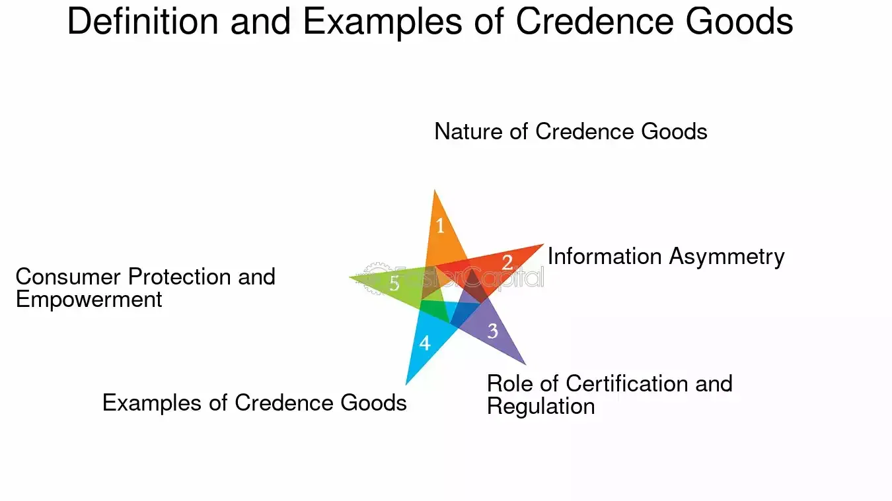

## Table of Contents

## What are credence goods?

Credence goods are products or services where it's hard for the buyer to judge their quality, even after they've used them. This is different from other goods where you can easily tell if they're good or bad. For example, with a car, you can drive it and see if it works well. But with credence goods, like medical treatments or car repairs, you might not know if you really needed them or if they were done correctly.

Because it's tough to tell the quality of credence goods, buyers often have to trust the seller. This can lead to problems like sellers charging too much or doing unnecessary work. To deal with this, people might rely on things like reviews, recommendations from friends, or professional certifications to help them decide.

## How do credence goods differ from experience and search goods?

Credence goods are different from experience and search goods because it's hard to tell if they're good or not, even after you use them. With search goods, like a shirt or a phone, you can see and touch them before you buy them. You can check the color, size, and price to decide if it's what you want. Experience goods, like a restaurant meal or a movie, are things you can judge after you've tried them. You might not know if the food is good until you taste it, but once you do, you can decide if you like it or not.

But with credence goods, like a doctor's visit or a car repair, it's trickier. You might not know if the doctor's advice was right or if the mechanic really fixed what was wrong with your car. You have to trust the person selling the service because you can't easily check the quality yourself. This means you might need to rely on other things, like reviews or recommendations from friends, to help you decide if the service is worth it.

## Can you provide some common examples of credence goods?

Some common examples of credence goods are medical services and car repairs. When you go to the doctor, you might not know if the treatment they suggest is really needed or if it's the best one for you. You have to trust that the doctor knows what they're doing because you can't easily check if the treatment works or not. The same goes for car repairs. If your car is making a weird noise, you take it to a mechanic. They might tell you that you need a new part, but you can't tell if that part was really broken or if the mechanic is just trying to make more money.

Another example of credence goods is legal services. When you hire a lawyer, you hope they will give you good advice and help you win your case, but it's hard to know if they're doing a good job until the case is over. You might not understand all the legal stuff they're talking about, so you have to trust that they know what they're doing. These examples show how credence goods are different because you can't easily judge their quality, even after you've used them.

## What are the main challenges consumers face when purchasing credence goods?

When buying credence goods, consumers face a big challenge because they can't easily tell if the product or service is good or not. For example, if you go to the doctor, you might not know if the treatment they suggest is really needed. You have to trust that the doctor knows what they're doing, but there's always a chance they might be wrong or trying to make more money. This makes it hard to decide if you're getting a good deal or if you're being overcharged for something you don't need.

Another challenge is that it's tough to compare different options. With things like car repairs or legal services, you might not know enough about the subject to understand if one mechanic or lawyer is better than another. You might have to rely on reviews or recommendations from friends, but even those can be hard to trust. This uncertainty can make people feel unsure and worried about making the wrong choice, which can lead to stress and possibly spending more money than necessary.

## How does information asymmetry affect the market for credence goods?

Information asymmetry means that one person knows more than the other person. In the market for credence goods, like medical services or car repairs, the seller knows a lot more than the buyer. The buyer can't easily tell if they really need the service or if it's done well. This makes it hard for buyers to decide if they're getting a good deal or if they're being overcharged. Because of this, sellers might charge too much or do unnecessary work, knowing that the buyer can't easily check if it's right or not.

To deal with this problem, buyers often look for other signs of quality, like reviews, recommendations from friends, or professional certifications. But even these can be tricky to trust. This uncertainty can make the market for credence goods less fair and can lead to people spending more money than they need to. It also makes buyers feel unsure and worried about making the wrong choice, which can affect how they use these services.

## What strategies can consumers use to make better decisions when buying credence goods?

When buying credence goods, like a doctor's visit or a car repair, it's important to do some research first. You can look for reviews and ratings online to see what other people think about the service. It's also a good idea to ask friends or family if they have any recommendations. Sometimes, professional certifications or licenses can tell you if the person you're dealing with knows what they're doing. By gathering as much information as you can, you can feel more confident in your choice.

Another helpful strategy is to get more than one opinion. For example, if you're not sure about a car repair, you could take your car to a few different mechanics and compare what they say. This can help you see if they all agree on what's wrong and how much it should cost. It's also smart to ask a lot of questions and make sure you understand what you're paying for. If something doesn't seem right, don't be afraid to say no or look for another option. By being careful and informed, you can make better decisions when buying credence goods.

## How do regulations help in the market for credence goods?

Regulations help make the market for credence goods fairer and safer for everyone. When you go to the doctor or take your car to a mechanic, you want to know they are honest and good at their job. Rules set by the government can make sure that these professionals have the right training and follow certain standards. For example, doctors need a medical license to practice, which means they've passed exams and met certain requirements. This helps you trust that they know what they're doing and won't do anything unnecessary or harmful.

Regulations also help stop bad behavior in the market. Without rules, some sellers might charge too much or do work you don't need because you can't easily tell if it's right or not. Laws can protect you by making it illegal to do these things. They can also set up ways for you to complain if you think you've been treated unfairly. By having these rules in place, the market for credence goods becomes more trustworthy, and you can feel more confident when you need to buy these services.

## What role does reputation play in the sale of credence goods?

Reputation is really important when it comes to selling credence goods. These are things like doctor visits or car repairs where you can't easily tell if the service is good or not. When a seller has a good reputation, it means other people have had good experiences with them. This makes you feel more confident that you'll get a good service too. For example, if a friend tells you about a great mechanic they trust, you're more likely to go to that mechanic because you believe they'll do a good job.

On the other hand, a bad reputation can hurt a seller a lot. If people hear that a doctor or a mechanic has done bad work or charged too much, they'll be less likely to go to them. This is why sellers of credence goods work hard to build and keep a good reputation. They know that happy customers will tell others about their good experiences, which can bring in more business. So, reputation is a big part of how credence goods are sold, helping buyers decide who to trust.

## How can sellers of credence goods build trust with their customers?

Sellers of credence goods can build trust with their customers by being honest and clear about what they're doing. When a doctor or a mechanic explains things in a way that's easy to understand, it helps the customer feel more comfortable. They should also be upfront about costs and not do any work that's not needed. If a customer feels like they're being treated fairly and not just as a way to make money, they're more likely to trust the seller.

Another way to build trust is by showing that they know what they're doing. This can be through things like professional certifications or licenses, which show that the seller has the right training and follows certain standards. Sellers can also build trust by getting good reviews and recommendations from other customers. When people hear that others have had good experiences, they're more likely to believe that they will too. By focusing on being honest, clear, and showing their skills, sellers of credence goods can make their customers feel more confident in their services.

## What are some advanced economic models used to study the market for credence goods?

One advanced economic model used to study the market for credence goods is the principal-agent model. In this model, the buyer (principal) hires the seller (agent) to do a job, but the buyer can't easily check if the job is done well. This model helps us understand how trust and information sharing can affect the choices both the buyer and seller make. For example, if a doctor (agent) knows more about medicine than the patient (principal), the doctor might suggest treatments that the patient doesn't really need. The model looks at how things like contracts, monitoring, and reputation can help make the market work better and fairer for everyone.

Another useful model is the signaling model. In this model, sellers try to show that their services are good by using signals, like certifications or good reviews. These signals help buyers decide who to trust. For example, a mechanic might show a certificate on the wall to prove they're trained and trustworthy. The signaling model helps us see how these signals can help fix the problem of information asymmetry in the market for credence goods. By understanding how signals work, we can figure out ways to make the market more transparent and help buyers make better choices.

## How do technological advancements impact the credence goods market?

Technological advancements are changing the way people buy and sell credence goods. For example, with online reviews and ratings, it's easier for customers to find out what other people think about a doctor or a mechanic. This helps them make better choices because they can see if others had good experiences. Also, technology like telemedicine lets people get medical advice from home, which can make healthcare more convenient and sometimes cheaper. These changes help to make the market for credence goods more open and fair, so customers can trust the services they're getting more easily.

Another way technology helps is by making it easier to check if the service is good or not. For example, car diagnostic tools can tell you exactly what's wrong with your car, so you don't have to just trust what the mechanic says. This can stop mechanics from charging for work you don't need. Also, electronic health records let doctors see a patient's full medical history, which can help them give better advice. By using technology, both buyers and sellers can have more information, which can make the market for credence goods work better for everyone.

## What future trends might influence the dynamics of credence goods markets?

In the future, one big trend that might change how credence goods markets work is the use of artificial intelligence (AI). AI can help doctors and other professionals give better advice by looking at a lot of data quickly. For example, AI could help a doctor see patterns in a patient's health records that they might miss. This could make medical services better and more trustworthy. Also, AI could help customers find the best services by looking at reviews and other information online, making it easier to choose who to trust.

Another trend is the growing use of blockchain technology. Blockchain can make records more secure and easy to check, which is important for credence goods like legal services or financial advice. With blockchain, you can see all the steps in a process, so it's harder for someone to do work you don't need or charge too much. This could make the market more fair and help customers feel more confident in the services they get. As these technologies get better, they could change how people buy and sell credence goods, making it easier to trust the services they need.

## References & Further Reading

[1]: [Adams, M. (2018). "Navigating Credence Goods Markets: Challenges and Opportunities."](https://en.wikipedia.org/wiki/Uniswap) Journal of Economic Perspectives.

[2]: Lopez de Prado, M. (2018). ["Advances in Financial Machine Learning."](https://www.amazon.com/Advances-Financial-Machine-Learning-Marcos/dp/1119482089) John Wiley & Sons.

[3]: Akerlof, G. A. (1970). ["The Market for 'Lemons': Quality Uncertainty and the Market Mechanism."](https://www.jstor.org/stable/1879431) The Quarterly Journal of Economics, 84(3), 488-500.

[4]: Jansen, S. (2020). ["Machine Learning for Algorithmic Trading."](https://github.com/stefan-jansen/machine-learning-for-trading) Packt Publishing.

[5]: Chan, E. P. (2009). ["Quantitative Trading: How to Build Your Own Algorithmic Trading Business."](https://github.com/ftvision/quant_trading_echan_book) John Wiley & Sons.