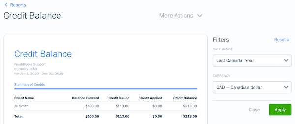

## Table of Contents

## What is a credit balance?

A credit balance is when you have money in your account that the company owes you. It happens when you pay more than what you owe or when you return something and get a refund. For example, if you pay $100 for a bill that is only $80, you will have a $20 credit balance.

Having a credit balance is good because it means you can use that money for future purchases or bills. You can also ask the company to send you the money back if you don't want to keep it in the account. It's important to check your account regularly to make sure the credit balance is correct and to use it before it expires, if it has an expiration date.

## How does a credit balance differ from a debit balance?

A credit balance means you have extra money in your account. It happens when you pay more than you owe or when you get a refund. For example, if your bill is $50 and you pay $60, you will have a $10 credit balance. This extra money can be used for future bills or purchases, or you can ask for it back.

A debit balance is the opposite. It means you owe money. This happens when you spend more than what you have in your account or when you haven't paid your bill yet. For example, if you use $30 from your account but only have $20 in it, you will have a $10 debit balance. You need to pay this amount to make your account balanced again.

In simple terms, a credit balance is good because it's like having extra money, while a debit balance is not good because it means you owe money. It's important to keep track of both to manage your finances well.

## What are common reasons for having a credit balance?

A credit balance happens when you have more money in your account than you need. One common reason for this is overpayment. This can happen if you accidentally pay more than your bill or if you pay a bill twice. Another reason is refunds. If you return something you bought, the money you paid for it might go back into your account as a credit.

Another reason for a credit balance is when a company makes a mistake. Sometimes, they might charge you less than they should, and when they fix it, you end up with extra money in your account. Also, if you have a loyalty or rewards program, the points or rewards you earn might turn into a credit balance that you can use for future purchases.

Keeping track of your credit balance is important. You can use this extra money for future bills or ask for it back. Make sure to check your account regularly to make sure the credit balance is correct and to use it before it expires, if it has an expiration date.

## How can someone check their credit balance?

To check your credit balance, you can look at your account statement. This is a paper or electronic document that shows all the money coming in and going out of your account. You can usually find your account statement on the company's website or app if you have an online account. Just log in, go to the section that shows your account details, and you will see your current balance. If it's a positive number, that's your credit balance.

If you don't have online access, you can call the company's customer service. They can tell you your current balance over the phone. Just give them your account number and any other information they need to find your account. They will let you know if you have a credit balance and how much it is. It's a good idea to check your balance regularly to make sure it's correct and to use any credit before it expires.

## What should you do if you notice an unexpected credit balance?

If you see an unexpected credit balance in your account, the first thing to do is to check your account statement. Look at all the recent transactions to see if you can figure out where the extra money came from. Maybe you paid a bill twice by mistake, or you got a refund for something you returned. If you can't figure it out, call the company's customer service. They can help you understand why the credit balance is there and make sure it's correct.

If the credit balance is because of a mistake, like the company charged you less than they should have, you should let them know. They will fix the mistake and adjust your account. If the credit balance is rightfully yours, you can decide what to do with it. You can use it for future bills or purchases, or you can ask the company to send the money back to you. It's important to act quickly, especially if the credit balance has an expiration date, so you don't lose the money.

## Can a credit balance affect your credit score?

A credit balance itself does not directly affect your credit score. Your credit score is based on things like how you pay your bills, how much debt you have, and how long you've had credit. Having a credit balance means you have extra money in your account, which is good, but it doesn't show up on your credit report or change your credit score.

However, if the credit balance is because of a mistake, like the company charging you less than they should have, it could lead to problems. If the company fixes the mistake and charges you the right amount later, and you can't pay it, that could hurt your credit score. So, it's important to check your account regularly and make sure any credit balance is correct.

## What are the potential risks associated with maintaining a large credit balance?

Keeping a large credit balance in your account might seem like a good thing because it means you have extra money. But there are some risks to be aware of. One risk is that the company might make a mistake and take the money back if they realize they shouldn't have given it to you. This can be frustrating and might cause you problems if you were planning to use that money for something else.

Another risk is that the credit balance might expire. Some companies have rules that say you have to use the credit within a certain time, or you lose it. If you forget about the credit balance or don't use it in time, you could lose the money. It's important to keep track of any credit balances and use them before they expire to avoid losing money.

## How can businesses manage and utilize credit balances effectively?

Businesses can manage credit balances effectively by keeping good records and checking them often. They should have a system that tracks all the money coming in and going out of customer accounts. This helps them see if there are any credit balances and where they came from. If a customer has a credit balance, the business should let them know about it and explain how they can use it. This keeps customers happy and helps avoid confusion or mistakes.

Businesses can also use credit balances to their advantage. They can offer customers the option to use the credit for future purchases or services, which can encourage more business. For example, a store might send an email to customers with a credit balance, reminding them they can use it on their next shopping trip. This can help the business keep customers coming back. It's important for businesses to make sure they follow any rules about credit balances, like not letting them expire too quickly, to keep customers trusting them.

## What are the legal and regulatory considerations regarding credit balances?

When businesses handle credit balances, they need to follow certain rules and laws. These rules can be different depending on where the business is and what kind of business it is. For example, some places have laws that say businesses can't keep credit balances for too long without giving them back to customers. They might also have to tell customers about the credit balance and how they can use it or get it back. If a business doesn't follow these rules, they could get in trouble and customers might be able to take legal action.

Another important thing for businesses to think about is how they handle credit balances in their accounting. They need to make sure they keep good records of all credit balances and report them correctly. This is important for tax purposes and to make sure they are following the rules set by accounting standards. If a business doesn't manage credit balances properly, it could lead to problems with audits or even fines. So, it's really important for businesses to stay on top of these rules and manage credit balances carefully.

## How do credit balances impact financial statements and accounting practices?

Credit balances can affect a company's financial statements and how they do their accounting. When a customer has a credit balance, it means the company owes them money. This shows up on the company's balance sheet as a liability because it's money the company has to pay back. If there are a lot of credit balances, it can make the company's liabilities look bigger. This can be important for people who look at the company's financial health, like investors or banks.

In accounting, businesses need to keep good records of credit balances. They need to make sure they are tracking all the money customers have paid and any refunds they've given. This helps them make sure their financial statements are correct. If a business doesn't manage credit balances well, it could lead to mistakes in their accounting. This can cause problems during audits or when they need to report their financials to others. So, it's important for businesses to handle credit balances carefully to keep their financial statements accurate and trustworthy.

## What strategies can be used to optimize credit balance management for large enterprises?

Large enterprises can optimize credit balance management by using technology to keep track of all credit balances. They can use special software that automatically updates and monitors credit balances. This helps them see where the money is coming from and how much each customer has. By keeping good records, they can make sure they are following the rules and avoid mistakes. They can also set up reminders to let customers know about their credit balances and how to use them before they expire.

Another strategy is to use credit balances to encourage more business. Enterprises can send emails or notifications to customers with credit balances, reminding them they can use the money for future purchases. This can help bring customers back and increase sales. It's also important for enterprises to have clear policies about credit balances, like how long they last and how customers can get their money back. By being open and fair, they can build trust with their customers and manage credit balances effectively.

## What are the advanced analytics and forecasting techniques used in credit balance management?

Advanced analytics and forecasting techniques can help businesses manage credit balances better. One way is by using predictive analytics to guess how much credit balances might grow in the future. This means looking at past data to see patterns and trends. For example, if a business sees that credit balances go up a lot during certain times of the year, they can plan for that. They can use this information to set up better systems to track and use credit balances before they expire.

Another technique is using [machine learning](/wiki/machine-learning) to make credit balance management smarter. Machine learning can look at a lot of data quickly and find things that people might miss. It can help spot when credit balances are because of mistakes or fraud. By using machine learning, businesses can fix these issues faster and make sure their records are correct. This helps them keep their financial statements accurate and manage credit balances more effectively.

## What are some financial examples in accounting?

In accounting, practical financial examples like balance sheets and income statements are foundational tools. These documents play a crucial role in portraying a company's financial health and operational performance. 

A balance sheet provides a snapshot of a company's financial position at a specific point in time. It outlines assets, liabilities, and shareholders' equity, following the accounting equation:

$$
\text{Assets} = \text{Liabilities} + \text{Equity}
$$

Assets represent what a company owns, including cash, inventory, and property. Liabilities are obligations the company needs to settle, such as loans and accounts payable. Equity represents the residual interest in the assets after deducting liabilities, often including retained earnings and stockholder investments.

An income statement, on the other hand, measures a company's performance over a specific period, detailing revenues and expenses to calculate the net income or profit. It follows the structure:

$$
\text{Net Income} = \text{Revenues} - \text{Expenses}
$$

Revenues include all income from regular operations like sales, while expenses cover costs incurred, such as salaries and rent. Together, these documents not only comply with accounting regulations but also provide stakeholders with key insights into financial stability and business viability.

These examples are integral in demonstrating how companies systematically record, track, and report their financial transactions, forming the basis for informed decision-making and strategic planning. Effective financial reporting ensures transparency and trust among investors, creditors, and other interested parties, emphasizing the importance of accuracy in preparing these documents.

## What are key accounting terms and why are they important?

Accounting involves a range of specific terminologies that are fundamental to financial reporting and analysis. Among these, the terms 'debit' and 'credit' are indispensable, forming the backbone of the double-entry accounting system. This system is structured such that every financial transaction affects at least two different accounts, ensuring that the accounting equation remains balanced. The equation is typically represented as:

$$
\text{Assets} = \text{Liabilities} + \text{Equity}
$$

In a double-entry system, 'debit' and 'credit' denote different sides of an account entry. Debits are typically recorded on the left side of an account, while credits are recorded on the right. This method helps track and reflect changes in an entity's financial position over time. For instance, when a company makes a sale on credit, it will debit its accounts receivable and credit its sales revenue. Conversely, when the company receives payment for the sale, it will debit cash and credit accounts receivable.

The use of these terms ensures the duality of accounting entries, which is essential for error detection and maintaining accurate financial statements. This practice not only highlights what is gained but also what is given up in each transaction, fostering transparency and accountability in financial reporting.

Moreover, understanding these terms is crucial for analyzing an organization's financial health. For instance, while debits increase assets and expenses, they decrease liabilities and equity. Conversely, credits increase liabilities and equity but decrease assets and expenses. Thus, mastering these concepts allows accountants and financial analysts to prepare and analyze balance sheets, income statements, and cash flow statements effectively.

In conclusion, the terms 'debit' and 'credit' are not merely accounting jargon but are fundamental elements that ensure the integrity of financial records within the double-entry system. Their correct application plays a vital role in producing reliable financial statements, thereby supporting informed decision-making in business and finance.

## What is Understanding Credit Balances?

Credit balances arise when the total amounts credited in an account exceed the total debts recorded. This scenario primarily occurs in margin and trading accounts, where these balances can signify surplus funds or accumulated profits. 

In a typical accounting setup, credit balances are essential as they reflect the financial position of an entity. When credits outpace debts, it could indicate either a profit situation or that a company has overpaid its liabilities or pre-paid expenses. This situation, while generally positive, must be monitored closely to ensure accurate financial reporting.

In the context of margin accounts, credit balances assume a critical role. Margin accounts allow traders to borrow funds from a broker to invest, using securities held in the account as collateral. A credit balance in this context means that the account holder has excess equity not being utilized for leveraged positions. The appearance of a credit balance may result from profits realized on trades or additional cash deposits into the account. This balance serves as a cushion for the broker, ensuring that the account can cover any potential losses on open positions.

Similarly, in trading accounts, credit balances act as an indicator of the account's [earning](/wiki/earning-announcement) capacity and [liquidity](/wiki/liquidity-risk-premium) status. For traders engaged in frequent transactions, maintaining a credit balance optimizes the use of funds, allowing them to capitalize on market opportunities without delay. Moreover, a credit balance might enable traders to acquire stocks or other securities without the need for additional capital infusion.

The relationship between credit balances and account activity can often be expressed using simple accounting formulas. Consider the following formula for calculating the credit balance in an account:

$$
\text{Credit Balance} = \text{Total Credits} - \text{Total Debits}
$$

This formula helps account holders and analysts quickly ascertain whether an account is in a surplus position. For example, in a Python script tasked with calculating a credit balance, one might use:

```python
def calculate_credit_balance(total_credits, total_debits):
    return total_credits - total_debits

total_credits = 5000
total_debits = 3000

credit_balance = calculate_credit_balance(total_credits, total_debits)

print(f"The credit balance is: {credit_balance}")
```

In summary, understanding credit balances is pivotal for effective financial management in accounting and trading. They not only provide insight into the financial health of an account but also enable strategic financial decisions, ensuring that funds are optimally allocated and risks are mitigated.

## References & Further Reading

[1]: Bergstra, J., Bardenet, R., Bengio, Y., & Kégl, B. (2011). ["Algorithms for Hyper-Parameter Optimization."](https://dl.acm.org/doi/10.5555/2986459.2986743) Advances in Neural Information Processing Systems 24.

[2]: ["Advances in Financial Machine Learning"](https://www.amazon.com/Advances-Financial-Machine-Learning-Marcos/dp/1119482089) by Marcos Lopez de Prado

[3]: ["Evidence-Based Technical Analysis: Applying the Scientific Method and Statistical Inference to Trading Signals"](https://www.amazon.com/Evidence-Based-Technical-Analysis-Scientific-Statistical/dp/0470008741) by David Aronson

[4]: ["Machine Learning for Algorithmic Trading"](https://github.com/stefan-jansen/machine-learning-for-trading) by Stefan Jansen

[5]: ["Quantitative Trading: How to Build Your Own Algorithmic Trading Business"](https://github.com/LucindaYa/quant-resources/blob/master/Quantitative%20Trading%20How%20to%20Build%20Your%20Own%20Algorithmic%20Trading%20Business.pdf) by Ernest P. Chan