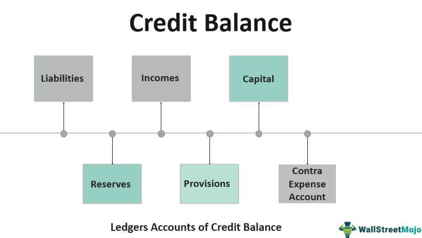

In the complex world of finance, understanding accounting terms, mastering credit balances, and exploring algorithmic trading are essential for successful financial management. The dynamic nature of today's financial markets necessitates a comprehensive grasp of these concepts, which not only facilitate better financial reporting and analysis but also enhance decision-making and strategic planning.

Accounting terms serve as the language through which financial health and operations of individuals or organizations are communicated. Key terminology, such as 'assets', 'liabilities', 'debit', and 'credit', underpin the double-entry accounting system, ensuring accuracy and balance in financial records. These concepts are foundational for creating vital documents like balance sheets and income statements, which help stakeholders assess an entity’s financial performance.



Credit balances, a critical component inherently linked to accounting, typically arise when credits exceed debits in individual accounts or transactions. These balances are particularly noteworthy in contexts such as trading or margin accounts, where they may indicate surplus funds or potential profits ready for further investment or reinvestment.

Algorithmic trading represents a technological advancement in the financial sector, utilizing computer programs to execute trades based on a pre-defined set of rules. This method of trading offers significant advantages over traditional trading by enhancing speed, precision, and efficiency. Systems employed in algorithmic trading utilize vast amounts of data and complex algorithms, honing in on opportunities within milliseconds to capitalize on market inefficiencies.

This article examines these topics, elucidating their roles and intersections within modern finance. By combining traditional accounting principles with algorithmic trading technologies, financial professionals can execute more informed and strategic decisions, leveraging comprehensive datasets to maximize profitability and minimize risks. Future trends in finance promise deeper integration of these domains, underscoring the importance of mastering these skills to remain competitive and innovative in this ever-evolving field.

## Table of Contents

## Financial Examples in Accounting

In accounting, practical financial examples like balance sheets and income statements are foundational tools. These documents play a crucial role in portraying a company's financial health and operational performance. 

A balance sheet provides a snapshot of a company's financial position at a specific point in time. It outlines assets, liabilities, and shareholders' equity, following the accounting equation:

$$
\text{Assets} = \text{Liabilities} + \text{Equity}
$$

Assets represent what a company owns, including cash, inventory, and property. Liabilities are obligations the company needs to settle, such as loans and accounts payable. Equity represents the residual interest in the assets after deducting liabilities, often including retained earnings and stockholder investments.

An income statement, on the other hand, measures a company's performance over a specific period, detailing revenues and expenses to calculate the net income or profit. It follows the structure:

$$
\text{Net Income} = \text{Revenues} - \text{Expenses}
$$

Revenues include all income from regular operations like sales, while expenses cover costs incurred, such as salaries and rent. Together, these documents not only comply with accounting regulations but also provide stakeholders with key insights into financial stability and business viability.

These examples are integral in demonstrating how companies systematically record, track, and report their financial transactions, forming the basis for informed decision-making and strategic planning. Effective financial reporting ensures transparency and trust among investors, creditors, and other interested parties, emphasizing the importance of accuracy in preparing these documents.

## Key Accounting Terms and Their Importance

Accounting involves a range of specific terminologies that are fundamental to financial reporting and analysis. Among these, the terms 'debit' and 'credit' are indispensable, forming the backbone of the double-entry accounting system. This system is structured such that every financial transaction affects at least two different accounts, ensuring that the accounting equation remains balanced. The equation is typically represented as:

$$
\text{Assets} = \text{Liabilities} + \text{Equity}
$$

In a double-entry system, 'debit' and 'credit' denote different sides of an account entry. Debits are typically recorded on the left side of an account, while credits are recorded on the right. This method helps track and reflect changes in an entity's financial position over time. For instance, when a company makes a sale on credit, it will debit its accounts receivable and credit its sales revenue. Conversely, when the company receives payment for the sale, it will debit cash and credit accounts receivable.

The use of these terms ensures the duality of accounting entries, which is essential for error detection and maintaining accurate financial statements. This practice not only highlights what is gained but also what is given up in each transaction, fostering transparency and accountability in financial reporting.

Moreover, understanding these terms is crucial for analyzing an organization's financial health. For instance, while debits increase assets and expenses, they decrease liabilities and equity. Conversely, credits increase liabilities and equity but decrease assets and expenses. Thus, mastering these concepts allows accountants and financial analysts to prepare and analyze balance sheets, income statements, and cash flow statements effectively.

In conclusion, the terms 'debit' and 'credit' are not merely accounting jargon but are fundamental elements that ensure the integrity of financial records within the double-entry system. Their correct application plays a vital role in producing reliable financial statements, thereby supporting informed decision-making in business and finance.

## Understanding Credit Balances

Credit balances arise when the total amounts credited in an account exceed the total debts recorded. This scenario primarily occurs in margin and trading accounts, where these balances can signify surplus funds or accumulated profits. 

In a typical accounting setup, credit balances are essential as they reflect the financial position of an entity. When credits outpace debts, it could indicate either a profit situation or that a company has overpaid its liabilities or pre-paid expenses. This situation, while generally positive, must be monitored closely to ensure accurate financial reporting.

In the context of margin accounts, credit balances assume a critical role. Margin accounts allow traders to borrow funds from a broker to invest, using securities held in the account as collateral. A credit balance in this context means that the account holder has excess equity not being utilized for leveraged positions. The appearance of a credit balance may result from profits realized on trades or additional cash deposits into the account. This balance serves as a cushion for the broker, ensuring that the account can cover any potential losses on open positions.

Similarly, in trading accounts, credit balances act as an indicator of the account's [earning](/wiki/earning-announcement) capacity and [liquidity](/wiki/liquidity-risk-premium) status. For traders engaged in frequent transactions, maintaining a credit balance optimizes the use of funds, allowing them to capitalize on market opportunities without delay. Moreover, a credit balance might enable traders to acquire stocks or other securities without the need for additional capital infusion.

The relationship between credit balances and account activity can often be expressed using simple accounting formulas. Consider the following formula for calculating the credit balance in an account:

$$
\text{Credit Balance} = \text{Total Credits} - \text{Total Debits}
$$

This formula helps account holders and analysts quickly ascertain whether an account is in a surplus position. For example, in a Python script tasked with calculating a credit balance, one might use:

```python
def calculate_credit_balance(total_credits, total_debits):
    return total_credits - total_debits

total_credits = 5000
total_debits = 3000

credit_balance = calculate_credit_balance(total_credits, total_debits)

print(f"The credit balance is: {credit_balance}")
```

In summary, understanding credit balances is pivotal for effective financial management in accounting and trading. They not only provide insight into the financial health of an account but also enable strategic financial decisions, ensuring that funds are optimally allocated and risks are mitigated.

## Algorithmic Trading: The Intersection of Data and Finance

Algorithmic trading, commonly known as algo trading, employs computer algorithms to execute trades according to specific criteria, such as timing, price, or quantity. By minimizing human intervention, this trading method enhances the efficiency and reliability of transactions in financial markets.

Algo trading significantly enhances the speed of trade execution, processing voluminous transactions in milliseconds. This capability not only reduces the market impact of trades but also facilitates the exploitation of short-lived [arbitrage](/wiki/arbitrage) opportunities that human traders might miss. Moreover, pre-defined strategies in algorithms maintain a level of discipline that can counter emotional trading decisions, thereby optimizing performance and risk management.

Efficiency is another keystone of [algorithmic trading](/wiki/algorithmic-trading). Algorithms can scan multiple markets and securities simultaneously, something impractical for manual trading. Utilizing models to process technical indicators and [volume](/wiki/volume-trading-strategy) patterns, algo trading can swiftly identify optimal entry and [exit](/wiki/exit-strategy) points. This automation reduces trading costs by minimizing bid-ask spreads and slippage, ultimately enhancing profitability.

Precision in trade execution amid market dynamics is paramount, and algorithms excel in this capacity. They execute trades at the most opportune moments based on real-time market data analysis. For instance, algorithms can deploy complex strategies like [market making](/wiki/market-making), [trend following](/wiki/trend-following), or [statistical arbitrage](/wiki/statistical-arbitrage), leveraging mathematical models and statistical rigor to predict price movements.

Consider the example of a simple moving average crossover strategy. In Python, such a strategy might be implemented as follows:

```python
import pandas as pd

def moving_average_crossover_strategy(data, short_window, long_window):
    signals = pd.DataFrame(index=data.index)
    signals['price'] = data['price']
    signals['short_mavg'] = data['price'].rolling(window=short_window, min_periods=1).mean()
    signals['long_mavg'] = data['price'].rolling(window=long_window, min_periods=1).mean()
    signals['signal'] = 0.0
    signals['signal'][short_window:] = \
        np.where(signals['short_mavg'][short_window:] > signals['long_mavg'][short_window:], 1.0, 0.0)   
    signals['positions'] = signals['signal'].diff()
    return signals

# Example usage:
# data = pd.read_csv('historical_stock_prices.csv', index_col='Date', parse_dates=True)
# signals = moving_average_crossover_strategy(data, short_window=40, long_window=100)
```

This script evaluates a stock's short-term and long-term moving averages to generate buy or sell signals, showcasing how algorithms execute strategies in real-time environments.

In conclusion, the integration of algorithmic trading into financial markets epitomizes a seismic shift toward data-driven decision making. Through increased speed, heightened efficiency, and unparalleled precision, algo trading not only transforms how trades are conducted but also redefines financial market dynamics. As computational resources and algorithmic models continue to advance, their role in shaping future trading landscapes will likely expand further, offering unprecedented opportunities for financial optimization.

## Integrating Accounting Concepts with Algo Trading

In the dynamic landscape of modern finance, the integration of accounting principles with algorithmic trading is pivotal for effective trading strategies. Accurate financial data inputs form the backbone of algorithmic trading, as they ensure that the algorithms operate on real-time, reliable data.

A robust accounting system is crucial for providing this data, offering detailed insights into financial positions, asset valuations, and cash flows. These insights are essential for developing algorithms that can adapt to market changes swiftly. For example, maintaining accurate balance sheets and income statements ensures that the financial status of trading entities is correctly represented, which is crucial for assessing risk and making informed trading decisions.

Algorithmic trading strategies often rely on precise calculations of risk-adjusted returns. A clear understanding of financial positions, derived from accounting data, enhances the ability to construct these algorithms. For instance, financial ratios such as the current ratio or return on equity can be directly extracted from accounting records and used to build more responsive trading models.

Python, a powerful tool for implementing algorithmic trading systems, allows for seamless integration with accounting data. Libraries such as Pandas and NumPy can process large datasets efficiently, enabling traders to analyze financial reports and extract meaningful patterns swiftly. Consider the following Python example that calculates the current ratio using Pandas:

```python
import pandas as pd

# Sample balance sheet data
data = {'Assets': [12000, 15000, 18000],
        'Liabilities': [7000, 8000, 7500]}

# Creating a DataFrame
df = pd.DataFrame(data)

# Calculating the current ratio
df['Current Ratio'] = df['Assets'] / df['Liabilities']

print(df)
```

This script demonstrates how accounting data can be harnessed to evaluate a company’s liquidity position, which is invaluable for honing algorithmic trading strategies. The ability to seamlessly translate this accounting data into actionable trading insights underscores the interdependence of accurate financial accounting and effective algorithmic trading.

In conclusion, the fusion of accounting concepts with algorithmic trading represents an evolution in financial practices. The reliance on accurate accounting data not only supports the development and precision of trading algorithms but also paves the way for sophisticated financial decision-making processes. As financial markets continue to evolve, this integration stands as a cornerstone of innovative trading strategies.

## Conclusion and Future Trends in Finance

The integration of accounting principles with algorithmic trading signals a transformative shift toward enhanced financial cohesion, promising profound impacts on financial management and trading strategies. The fusion of these domains offers a future where the precision of accounting systems complements the sophistication of trading algorithms, providing a comprehensive approach to financial decision-making.

Professionals who master both accounting and algorithmic trading are poised to lead this evolution. The ability to interpret and manage accurate financial data is critical, forming a solid foundation for developing and executing high-performing trading algorithms. These individuals can leverage precise financial insights to create algorithms that execute trades with greater accuracy and effectiveness, ultimately optimizing portfolio performance.

As technology continues to advance, the implementation of [artificial intelligence](/wiki/ai-artificial-intelligence) and [machine learning](/wiki/machine-learning) in trading algorithms will demand even more refined financial data processing. This trend underscores the increasing importance of accurate and timely accounting information. The development of automated systems capable of real-time data analysis and decision-making will revolutionize how financial markets operate, creating new opportunities for innovation and efficiency.

Additionally, regulatory changes and market dynamics will necessitate adaptive accounting practices that can feed relevant data into trading algorithms. This continuous feedback loop between dependable accounting methods and cutting-edge trading technology ensures alignment with market conditions and regulatory requirements, promoting sustainable financial integration.

In conclusion, the intersection of accounting and algorithmic trading not only augments financial operations but also invites future trends that will redefine financial management. Professionals who harness both disciplines will drive this narrative, contributing to an era where financial innovation thrives on the backbone of precise data and intelligent algorithms.

## References & Further Reading

[1]: Bergstra, J., Bardenet, R., Bengio, Y., & Kégl, B. (2011). ["Algorithms for Hyper-Parameter Optimization."](https://dl.acm.org/doi/10.5555/2986459.2986743) Advances in Neural Information Processing Systems 24.

[2]: ["Advances in Financial Machine Learning"](https://www.amazon.com/Advances-Financial-Machine-Learning-Marcos/dp/1119482089) by Marcos Lopez de Prado

[3]: ["Evidence-Based Technical Analysis: Applying the Scientific Method and Statistical Inference to Trading Signals"](https://www.amazon.com/Evidence-Based-Technical-Analysis-Scientific-Statistical/dp/0470008741) by David Aronson

[4]: ["Machine Learning for Algorithmic Trading"](https://github.com/stefan-jansen/machine-learning-for-trading) by Stefan Jansen

[5]: ["Quantitative Trading: How to Build Your Own Algorithmic Trading Business"](https://github.com/LucindaYa/quant-resources/blob/master/Quantitative%20Trading%20How%20to%20Build%20Your%20Own%20Algorithmic%20Trading%20Business.pdf) by Ernest P. Chan