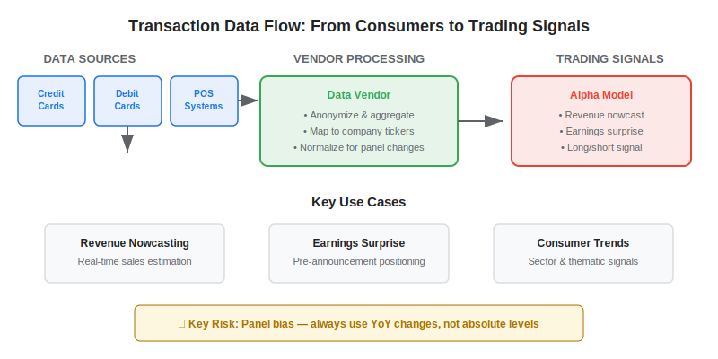
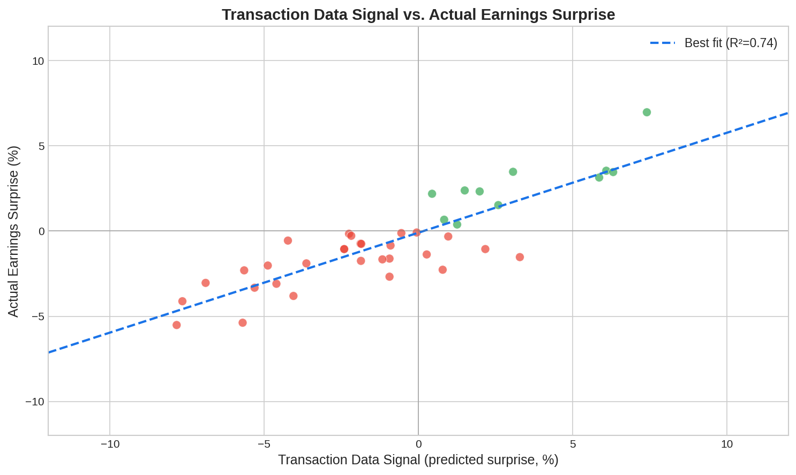

Credit card and consumer transaction data is one of the most direct forms of [alternative data](https://paperswithbacktest.com/wiki/best-alternative-data) available to algorithmic traders. Unlike satellite imagery or social media sentiment, transaction data measures actual consumer spending in near-real-time — the closest thing to seeing a company's revenue before it is reported. This guide covers how transaction data works as a trading signal, the key vendors, Python implementation, and critical pitfalls.

## What Is Transaction Data in Trading?

Transaction data for trading refers to aggregated, anonymized records of consumer purchases — from credit cards, debit cards, and point-of-sale systems — that are processed into signals predicting company revenues, same-store sales, and earnings surprises. The raw data is collected by payment processors, banks, and fintech companies, then sold to hedge funds and asset managers through specialized vendors.

The fundamental logic is straightforward: if you can observe in near-real-time that consumers are spending more at Company X's stores this quarter compared to last quarter, you have an informational edge over analysts relying on the company's own delayed quarterly report.

Transaction data is particularly powerful for **consumer-facing companies** — retail, restaurants, travel, e-commerce — where revenue is directly driven by measurable consumer spending. For these sectors, the correlation between transaction data signals and actual reported revenue can be remarkably high.



## How Transaction Data Creates Trading Signals

### Revenue Nowcasting

The primary use case is nowcasting — estimating a company's current-quarter revenue before the official earnings report. By aggregating transaction volumes at a specific retailer or restaurant chain, traders build a real-time estimate of sales.

For example, if credit card spending at Target stores is running 8% above the year-ago period through the first two months of the quarter, and the analyst consensus expects only 5% growth, a trader can position for a likely earnings beat.

### Earnings Surprise Prediction

Transaction data becomes most valuable in the 2–4 weeks before an earnings announcement. At this point, the quarter is essentially over but not yet reported. The gap between what transaction data reveals and what the market expects creates a predictable trading opportunity.

Studies have shown that transaction-based earnings surprise predictions can achieve hit rates of 60–70% for consumer companies — a meaningful edge when compounded across dozens of positions per quarter.

### Consumer Trend Detection

Beyond individual company predictions, aggregated transaction data reveals macro consumer trends: shifts from physical retail to e-commerce, changes in dining habits, travel recovery patterns, and regional economic divergences. Macro funds use this data to position in sector ETFs or construct thematic baskets.

## Key Transaction Data Vendors

| Vendor | Data Source | Coverage | Typical Latency |
|---|---|---|---|
| Bloomberg Second Measure | Credit/debit card panels | US, 5,000+ merchants | T+3 to T+5 days |
| Earnest Research | Credit card panels | US, public + private companies | T+5 to T+7 days |
| Facteus | Debit + credit cards | US, 15M+ consumers | T+2 to T+4 days |
| Envestnet Yodlee | Bank account aggregation | US, 50M+ accounts | T+1 to T+3 days |
| CE Vision (Mastercard) | Mastercard network data | Global | T+7 to T+14 days |
| Affinity Solutions | Card-linked offers + transactions | US, 150M+ cards | T+3 to T+7 days |

The latency column is critical: "T+3" means the data reflects spending that occurred 3 days ago. For a signal that predicts earnings 2–4 weeks out, this latency is perfectly acceptable.

## Python Implementation: Transaction-Based Revenue Estimator

Here is a practical example of building a revenue nowcast from aggregated transaction data:

```python
import numpy as np
import pandas as pd

def build_revenue_nowcast(
    daily_txn: pd.Series,
    prior_year_txn: pd.Series,
    analyst_consensus_growth: float,
    days_in_quarter: int = 63
) -> dict:
    """
    Build a revenue nowcast from daily transaction data.
    
    Parameters:
    - daily_txn: Daily aggregated spending (current quarter, to date)
    - prior_year_txn: Same-period daily spending from prior year
    - analyst_consensus_growth: Expected YoY revenue growth (e.g., 0.05 for 5%)
    - days_in_quarter: Trading days in quarter (default 63)
    
    Returns dict with nowcast growth, surprise estimate, and confidence.
    """
    days_observed = len(daily_txn)
    coverage_pct = days_observed / days_in_quarter
    
    # Year-over-year growth observed so far
    current_total = daily_txn.sum()
    prior_total = prior_year_txn[:days_observed].sum()
    observed_growth = (current_total - prior_total) / prior_total
    
    # Extrapolate to full quarter (simple linear projection)
    daily_run_rate = daily_txn.mean()
    prior_daily_rate = prior_year_txn.mean()
    projected_growth = (daily_run_rate - prior_daily_rate) / prior_daily_rate
    
    # Surprise = observed growth minus consensus
    surprise = projected_growth - analyst_consensus_growth
    
    # Confidence increases with days observed
    confidence = min(coverage_pct * 1.2, 1.0)
    
    return {
        "days_observed": days_observed,
        "coverage_pct": f"{coverage_pct:.0%}",
        "observed_yoy_growth": f"{observed_growth:.1%}",
        "projected_yoy_growth": f"{projected_growth:.1%}",
        "analyst_consensus": f"{analyst_consensus_growth:.1%}",
        "estimated_surprise": f"{surprise:+.1%}",
        "signal": "LONG" if surprise > 0.01 else "SHORT" if surprise < -0.01 else "NEUTRAL",
        "confidence": f"{confidence:.0%}",
    }

# Example: Retailer X, Q3 data
np.random.seed(42)
current_q = pd.Series(np.random.normal(1.08, 0.05, 45))  # 45 days observed
prior_q = pd.Series(np.random.normal(1.00, 0.05, 63))     # full prior year quarter

result = build_revenue_nowcast(current_q, prior_q, analyst_consensus_growth=0.05)
for k, v in result.items():
    print(f"  {k}: {v}")
```



## Panel Bias: The Critical Pitfall

The single biggest risk with transaction data is **panel bias**. No vendor captures 100% of consumer spending. Each vendor has a panel — a subset of card holders whose transactions they observe. This panel may not be representative of the full customer base.

Common sources of panel bias include:

**Demographic skew**: The panel may over-represent certain income brackets, age groups, or geographic regions. If a vendor's panel skews affluent, it might overestimate spending at premium retailers and underestimate discount chains.

**Payment method bias**: Credit card data misses cash transactions entirely. For some categories (fast food, convenience stores, informal retail), cash can represent 20–40% of transactions. Debit card data helps but still misses cash.

**Merchant coverage gaps**: A vendor might have excellent coverage for national chains but poor coverage for local businesses or newer merchants. This creates uneven signal quality across the stock universe.

**Temporal instability**: Panel composition changes as card holders join or leave the panel. A sudden change in panel size can create false signals that look like spending changes but are actually data artifacts.

The mitigation is to always analyze transaction data as **year-over-year changes within the same panel** rather than absolute levels. This controls for panel composition if the panel is relatively stable.

## Combining Transaction Data with Other Alternative Data

Transaction data is most powerful when combined with other [alternative data sources](https://paperswithbacktest.com/wiki/how-can-alternative-data-be-integrated-into-quantitative-trading):

**Transaction + Web Traffic**: Confirms online spending trends with website visit data — if both signals agree on rising activity for an e-commerce company, the conviction is higher.

**Transaction + Satellite**: Parking lot foot traffic counts validate the physical store component of the transaction data signal.

**Transaction + [Sentiment](https://paperswithbacktest.com/wiki/sentiment-trading)**: Combines quantitative spending data with qualitative consumer attitudes — if spending is rising but sentiment is falling, it may indicate unsustainable promotional-driven growth.

## Limitations and Risks

**Cost** is substantial. Institutional-grade transaction data feeds run $100,000–$1,000,000+ per year. This limits access primarily to large hedge funds and asset managers.

**Regulatory risk** is increasing. Privacy regulations (GDPR, CCPA, state-level laws) are tightening the rules around consumer data. Vendors must ensure proper anonymization, and traders need to monitor the regulatory landscape.

**Alpha decay** is accelerating as transaction data becomes more widely adopted. What was a niche edge in 2015 is now used by hundreds of funds. The signal still works but with compressed margins (see [the horizon effect](https://paperswithbacktest.com/wiki/alternative-data-horizon-effect)).

## Conclusion

Credit card and transaction data remains one of the highest-conviction alternative data sources for consumer equity strategies. The signal is direct, measurable, and logically connected to company fundamentals. For algo traders, the key is understanding panel bias, combining transaction signals with complementary data sources, and maintaining realistic expectations about alpha magnitude as the space becomes more crowded.

---

**Explore further on PapersWithBacktest:**
- Browse [backtested consumer trading strategies](https://paperswithbacktest.com/strategies) with Python code and performance metrics
- Access [clean historical market data](https://paperswithbacktest.com/datasets) for equities, crypto, and futures
- Take the [algo trading course](https://paperswithbacktest.com/course) — 60+ video lessons and notebooks
- Related wiki pages: [Consumer Alternative Data](https://paperswithbacktest.com/wiki/consumer-alternative-data) · [Best Alternative Data Sources](https://paperswithbacktest.com/wiki/best-alternative-data)
