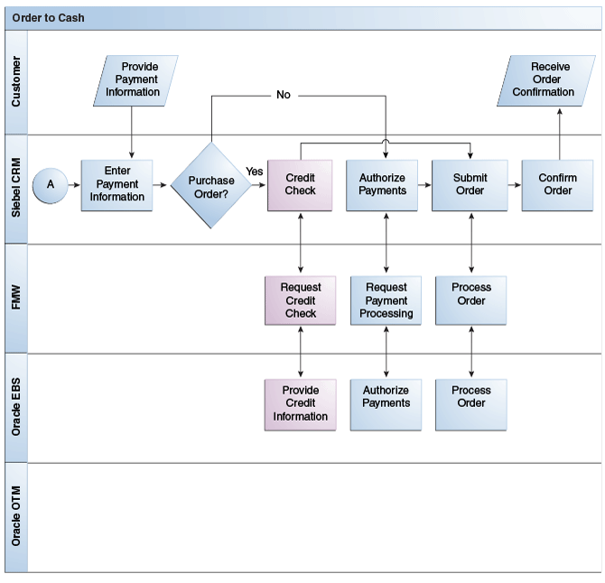

## Table of Contents

## What is credit checking?

Credit checking is when a company or a bank looks at your credit history to decide if they should lend you money or let you have a credit card. They want to know if you have paid your bills on time in the past and if you have too much debt. This helps them figure out if you are likely to pay them back.

When you apply for a loan or a credit card, the company will ask for your permission to check your credit. They will look at a report from a credit bureau, which keeps track of how you handle your money. If your credit report shows that you pay your bills on time and don't have too much debt, you are more likely to get approved for the loan or credit card. If your report shows that you often miss payments or have a lot of debt, it might be harder to get approved.

## Why is credit checking important?

Credit checking is important because it helps lenders decide if they can trust you to pay back the money they lend you. When you want a loan or a credit card, the lender needs to know if you have a good history of paying your bills on time. If your credit report shows that you are responsible with money, the lender feels more confident about giving you a loan or a credit card. This helps them avoid losing money on people who might not pay them back.

It also helps you, the borrower, in the long run. If you have a good credit history, you can get better interest rates and more favorable terms on loans and credit cards. This means you pay less money over time. On the other hand, if your credit is bad, you might have to pay higher interest rates or might not get approved for loans at all. So, credit checking is a way to make sure that both the lender and the borrower are protected and can make smart financial decisions.

## Who typically performs credit checks?

Credit checks are usually done by banks, credit card companies, and other lenders. These companies want to make sure you can pay back the money they lend you. They look at your credit report to see if you have paid your bills on time and if you have too much debt. This helps them decide if it's safe to give you a loan or a credit card.

Sometimes, landlords and utility companies also do credit checks. Landlords might check your credit to see if you are likely to pay rent on time. Utility companies, like those that provide electricity or water, might check your credit to decide if they need a deposit from you before they start your service. Both of these groups use credit checks to protect themselves from people who might not pay their bills.

## What information is used in a credit check?

A credit check uses information from your credit report. This report is made by credit bureaus, which collect data about how you handle your money. They look at things like if you pay your bills on time, how much debt you have, and if you have ever had to declare bankruptcy. They also check if you have any accounts that have been sent to collections, and how long you have had different types of credit, like credit cards or loans.

This information helps lenders decide if you are a good risk or not. If your report shows you pay your bills on time and don't have too much debt, lenders see you as responsible and more likely to pay them back. If your report shows you often miss payments or have a lot of debt, lenders might think you are a higher risk and might not want to lend you money or might charge you higher interest rates.

## How does the credit checking process work?

When you apply for a loan or a credit card, the lender asks for your permission to check your credit. They send your information to a credit bureau, which is a company that keeps track of how people handle their money. The credit bureau looks at your credit report, which shows if you pay your bills on time, how much debt you have, and if you have ever had problems like bankruptcy or accounts sent to collections. The credit bureau then gives the lender a credit score, which is a number that shows how good or bad your credit is.

The lender uses this information to decide if they should give you the loan or credit card. If your credit report and score show that you are responsible with money, the lender feels more confident about lending to you. They might offer you a lower [interest rate](/wiki/interest-rate-trading-strategies) because they think you are less likely to miss payments. If your credit report shows problems, like late payments or too much debt, the lender might decide not to lend to you, or they might offer you a higher interest rate because they see you as a higher risk.

## What are the different types of credit checks?

There are two main types of credit checks: hard inquiries and soft inquiries. A hard inquiry happens when you apply for a loan or a credit card. The lender asks for your permission to check your credit report, and this check can affect your credit score. It might go down a little bit because it shows you are trying to borrow money. Hard inquiries stay on your credit report for two years, but they usually only affect your credit score for one year.

A soft inquiry is different. It doesn't affect your credit score. Soft inquiries happen when you check your own credit, or when a company checks your credit for things like pre-approvals for credit cards or when you apply for a job. These checks are just to get an idea of your credit without making a big impact on your credit score. Soft inquiries are not seen by other lenders and do not stay on your credit report for as long as hard inquiries.

## How long does a credit check take?

A credit check usually doesn't take very long. When you apply for a loan or a credit card, the lender sends your information to a credit bureau. The credit bureau then looks at your credit report and gives the lender your credit score. This whole process can take just a few seconds to a few minutes, depending on how fast the systems are working.

Sometimes, it might take a bit longer if the lender needs more information or if there are issues with your credit report. For example, if there are errors on your report or if the lender needs to verify some information, it might take a few days. But usually, you will know pretty quickly if you are approved or not after the credit check is done.

## What are the legal considerations for credit checking?

Credit checking is governed by laws to make sure it's fair and to protect your privacy. In the United States, the main law is the Fair Credit Reporting Act (FCRA). This law says that credit bureaus have to be accurate and fair when they make your credit report. It also says that you have the right to see your credit report and to fix any mistakes. Lenders have to tell you if they deny you a loan or credit card because of your credit report, and they have to give you the name of the credit bureau they used.

There are also rules about how lenders can use your credit information. They can't use it to discriminate against you based on things like your race, color, religion, national origin, sex, marital status, or age. The Equal Credit Opportunity Act (ECOA) helps make sure that everyone has a fair chance to get credit. If you think a lender has treated you unfairly, you can file a complaint with the Consumer Financial Protection Bureau (CFPB) or other government agencies. These laws help make sure that credit checking is done in a way that is fair and respects your rights.

## How can someone improve their credit score?

Improving your credit score is important if you want to get better deals on loans and credit cards. One of the best ways to improve your score is to always pay your bills on time. Late payments can hurt your score a lot, so make sure you pay at least the minimum amount due every month. Another way to help your score is to keep your credit card balances low. Try not to use more than 30% of your available credit. For example, if you have a credit card with a $1,000 limit, try to keep your balance under $300.

It's also good to have a mix of different types of credit, like credit cards, a car loan, or a mortgage. This shows lenders that you can handle different kinds of debt. Don't apply for too many new credit cards at once, though, because each application can cause a small drop in your score. If you have old credit cards you don't use, keep them open if they don't have annual fees. This can help your credit history look longer, which is good for your score. Remember, improving your credit score takes time and good habits, but it can make a big difference in your financial life.

## What are common misconceptions about credit checking?

One common misconception about credit checking is that checking your own credit hurts your credit score. This isn't true. When you check your own credit, it's called a soft inquiry, and it doesn't affect your score at all. Only hard inquiries, which happen when you apply for a loan or credit card, can lower your score a little bit. So, it's a good idea to check your credit report regularly to make sure everything is correct and to keep an eye on your score.

Another misconception is that you need to [carry](/wiki/carry-trading) a balance on your credit card to build credit. Actually, paying off your card in full every month is better for your credit score. Keeping your balance low compared to your credit limit, ideally under 30%, shows lenders that you manage your money well. Carrying a balance just means you'll pay more in interest, which isn't good for your wallet. So, it's best to pay your card off completely each month if you can.

## How do credit checks impact loan approvals?

Credit checks are a big part of deciding if someone gets a loan. When you ask for a loan, the bank or lender looks at your credit report to see how you've handled money in the past. They want to know if you pay your bills on time and if you have too much debt. If your credit report shows that you're good with money, the lender feels more sure about giving you the loan. They might even give you a lower interest rate because they think you're less likely to miss payments.

On the other hand, if your credit report shows problems like late payments or a lot of debt, the lender might not want to give you the loan. They might see you as a bigger risk and either say no to your loan request or offer you a higher interest rate. This is why it's important to keep your credit in good shape. A good credit report can help you get the loan you need with better terms, while a bad report can make it harder to borrow money.

## What advanced techniques are used in credit risk assessment?

Credit risk assessment has gotten more advanced with the help of computers and big data. One technique is using [machine learning](/wiki/machine-learning). This is when computers learn from a lot of data to predict if someone will pay back a loan. They look at things like how much money someone makes, how they spend their money, and even what they post on social media. This helps lenders make better guesses about who is likely to pay them back and who might not.

Another advanced technique is using something called [alternative data](/wiki/best-alternative-data). This is information that doesn't show up on a regular credit report, like if someone pays their rent on time or how they use their phone. By looking at this extra information, lenders can get a fuller picture of someone's money habits. This can be really helpful for people who don't have a long credit history or who might not show up well on a regular credit check. These new ways of looking at credit risk help lenders make smarter decisions and can give more people a chance to get a loan.

## What is Understanding Financial Assessments?

Financial assessments are fundamental tools used to evaluate an entity's financial statements, providing insights into its financial health and stability. These assessments are pivotal in making informed decisions regarding lending, investing, and financial strategies. The evaluation typically focuses on several key components, including liquidity ratios, solvency ratios, and performance indices.

**Liquidity Ratios:** These ratios measure an entity's ability to meet its short-term obligations. Key liquidity ratios include the current ratio and the quick ratio (also known as the acid-test ratio). The current ratio is calculated by dividing current assets by current liabilities. It provides a snapshot of financial health by indicating whether the entity can cover its short-term liabilities with its short-term assets. The formula is:

$$
\text{Current Ratio} = \frac{\text{Current Assets}}{\text{Current Liabilities}}
$$

The quick ratio refines this analysis by excluding inventory from current assets, offering a more stringent test of [liquidity](/wiki/liquidity-risk-premium):

$$
\text{Quick Ratio} = \frac{\text{Current Assets} - \text{Inventory}}{\text{Current Liabilities}}
$$

**Solvency Ratios:** These ratios assess a company's capacity to meet its long-term debts, indicating the financial leverage and long-term solvency. Common solvency ratios include the debt-to-equity ratio and the interest coverage ratio. The debt-to-equity ratio is computed as follows:

$$
\text{Debt-to-Equity Ratio} = \frac{\text{Total Liabilities}}{\text{Shareholders' Equity}}
$$

A high ratio may suggest higher financial leverage and potential risk if profits decline. The interest coverage ratio, calculated by dividing earnings before interest and taxes (EBIT) by interest expenses, measures how easily a company can pay interest on outstanding debt:

$$
\text{Interest Coverage Ratio} = \frac{\text{EBIT}}{\text{Interest Expense}}
$$

**Performance Indices:** These indices are used to evaluate the overall financial performance over a specific period. They include return on equity (ROE), return on assets (ROA), and net profit margin. ROE calculates the profitability relative to shareholder's equity:

$$
\text{ROE} = \frac{\text{Net Income}}{\text{Shareholders' Equity}}
$$

Similarly, ROA measures how efficiently a company uses its assets to generate earnings:

$$
\text{ROA} = \frac{\text{Net Income}}{\text{Total Assets}}
$$

The net profit margin, on the other hand, is the ratio of net profits to revenues for a company:

$$
\text{Net Profit Margin} = \left( \frac{\text{Net Profit}}{\text{Revenue}} \right) \times 100 \%\]

Financial assessments, by examining these key ratios and indices, provide comprehensive insights that influence critical business decisions. They serve as a foundation for determining creditworthiness, guiding investment choices, and shaping strategic financial planning. Comprehensive and accurate financial assessments enable entities to maintain financial stability and adapt to evolving market conditions.

## What is the Importance of Credit Reports?

Credit reports are indispensable records that document an entity's credit history, capturing details such as loan repayments, outstanding debts, and overall credit usage. These reports are pivotal for lenders as they evaluate an individual's or a company's creditworthiness. The information contained within a credit report can significantly impact a lending decision, influencing whether a loan is approved or denied. A detailed credit report also plays a crucial role in determining the interest rates a borrower might receive.

Lenders rely extensively on credit reports because they provide a comprehensive snapshot of an entity's financial behavior. Regular repayment history, responsible credit use, and a mix of credit accounts can collectively enhance a credit report, increasing the likelihood of securing favorable credit terms. For instance, a borrower with a history of timely payments and low credit utilization is often viewed as a low-risk candidate, which can result in lower interest rates and better loan terms.

To illustrate the significance quantitatively, consider the model for credit scoring: 

$$
\text{Credit Score} = \alpha_1 \times \text{Payment History} + \alpha_2 \times \text{Credit Utilization} + \alpha_3 \times \text{Credit History Length} + \alpha_4 \times \text{New Credit} + \alpha_5 \times \text{Credit Mix}
$$

where each $\alpha$ represents the weight assigned to each factor based on its importance. Lenders utilize such scoring models to predict the potential risk of lending to an individual or entity. 

A comprehensive credit report, therefore, becomes a critical tool for both lenders and borrowers. It enhances financial credibility by demonstrating responsible financial behavior, which is advantageous in the competitive market of loan offerings. The transparency offered by a well-maintained credit report can serve as a testament to the entity's financial reliability, fostering trust and potentially leading to more beneficial fiscal opportunities.

## References & Further Reading

Books, articles, and online resources provide a deep understanding of financial assessments, credit analysis, and [algorithmic trading](/wiki/algorithmic-trading). These materials are instrumental in grasping the methodologies and regulatory frameworks that shape modern financial practices.

### Books
1. **"Financial Statement Analysis" by Martin S. Fridson and Fernando Alvarez**  
   This book provides insights into evaluating financial statements and understanding financial health, essential for robust financial assessments.

2. **"Credit Risk Management: How to Avoid Lending Disasters and Maximize Earnings" by Joetta Colquitt**  
   This book covers the principles of credit risk management, offering strategies for effective credit analysis.

3. **"Algorithmic Trading: Winning Strategies and Their Rationale" by Ernie Chan**  
   A comprehensive guide to building and deploying algorithmic trading systems with a focus on statistical and financial concepts.

### Articles and Papers
1. **"The Role of Credit Reporting Systems in the International Economy"**  
   This paper provides an overview of credit reporting systems worldwide and their impact on financial markets.

2. **"High-Frequency Trading and its Impact on Markets"**  
   An article examining the effects of algorithmic trading on market dynamics and efficiency.

3. **"Incorporating Machine Learning in Credit Scoring Models"**  
   This paper explores how machine learning techniques enhance the accuracy of credit scoring, relevant for algorithmic trading strategies.

### Online Resources
1. **Investopedia: Credit Report**  
   Offering a detailed explanation of credit reports, including how they are used in assessing creditworthiness.

2. **Coursera: Financial Engineering and Risk Management Specialization**  
   An online [course](/wiki/best-algorithmic-trading-courses) that provides lectures on financial assessments, risk management, and the use of algorithms in trading.

3. **Regulatory Agency Websites (e.g., SEC, FCA)**  
   These sites are essential for the latest guidelines and regulatory updates on financial data usage and trading practices.

### Guidelines and Regulatory Updates
1. **Basel III Guidelines**  
   These international regulatory frameworks affect credit risk assessments and influence financial stability.

2. **SEC Rule 613 (Consolidated Audit Trail)**  
   This rule addresses the collection and storage of comprehensive data regarding financial transactions, impacting algorithmic trading transparency.

3. **European Union’s General Data Protection Regulation (GDPR)**  
   While not specific to financial data, GDPR impacts how personal data, including credit information, is handled within financial systems.

These resources offer a foundational understanding and are vital for anyone interested in the intricate workings of financial assessments, credit analysis, and algorithmic trading, ensuring informed engagement with the financial markets.

