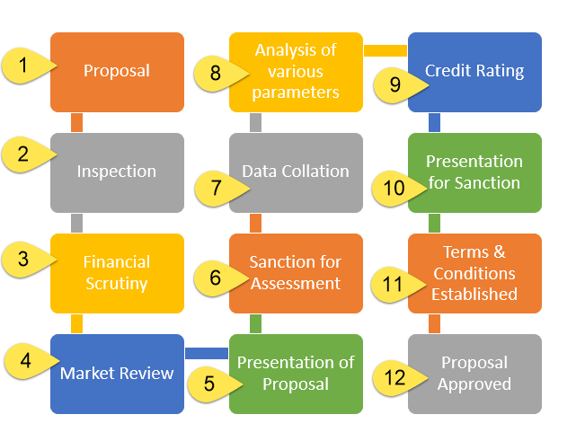

In the rapidly evolving financial landscape, understanding the interplay between financial assessments, credit reports, credit checks, and algorithmic (algo) trading is crucial for making informed decisions. Financial assessments provide a fundamental insight into an individual's or a company's financial health. These assessments typically involve analyzing various metrics and indicators such as liquidity and solvency ratios, which help determine financial stability and performance potential. This foundational insight is essential for making strategic decisions in lending, investing, and overall financial management.

Credit reports and credit checks are indispensable components of financial evaluations, profoundly impacting lending decisions and financial opportunities. A credit report offers a detailed record of an entity's credit history, including payment behaviors, current debt levels, and credit usage patterns. This data allows lenders to assess creditworthiness accurately, influencing the terms of credit offered, such as interest rates and credit limits.



Algorithmic (algo) trading has revolutionized the financial markets by leveraging algorithmic systems to automate trading decisions and executions based on real-time market data. By using sophisticated algorithms, traders can execute high-frequency trades, optimize entry and exit points, and react to market changes more efficiently than manual trading. The incorporation of financial assessments and credit information can further refine these algorithms, allowing for more robust risk management and strategy optimization.

This article explores the interconnectedness of these concepts and their relevance in modern finance. By understanding how financial assessments, credit reports, and credit checks interact with algo trading strategies, financial professionals can enhance decision-making processes and gain a strategic advantage in navigating diverse and complex markets. As the financial industry continues to evolve, the integration of these elements will likely grow in importance, highlighting the need for ongoing adaptation and innovation.

## Table of Contents

## Understanding Financial Assessments

Financial assessments are fundamental tools used to evaluate an entity's financial statements, providing insights into its financial health and stability. These assessments are pivotal in making informed decisions regarding lending, investing, and financial strategies. The evaluation typically focuses on several key components, including liquidity ratios, solvency ratios, and performance indices.

**Liquidity Ratios:** These ratios measure an entity's ability to meet its short-term obligations. Key liquidity ratios include the current ratio and the quick ratio (also known as the acid-test ratio). The current ratio is calculated by dividing current assets by current liabilities. It provides a snapshot of financial health by indicating whether the entity can cover its short-term liabilities with its short-term assets. The formula is:

$$
\text{Current Ratio} = \frac{\text{Current Assets}}{\text{Current Liabilities}}
$$

The quick ratio refines this analysis by excluding inventory from current assets, offering a more stringent test of [liquidity](/wiki/liquidity-risk-premium):

$$
\text{Quick Ratio} = \frac{\text{Current Assets} - \text{Inventory}}{\text{Current Liabilities}}
$$

**Solvency Ratios:** These ratios assess a company's capacity to meet its long-term debts, indicating the financial leverage and long-term solvency. Common solvency ratios include the debt-to-equity ratio and the interest coverage ratio. The debt-to-equity ratio is computed as follows:

$$
\text{Debt-to-Equity Ratio} = \frac{\text{Total Liabilities}}{\text{Shareholders' Equity}}
$$

A high ratio may suggest higher financial leverage and potential risk if profits decline. The interest coverage ratio, calculated by dividing earnings before interest and taxes (EBIT) by interest expenses, measures how easily a company can pay interest on outstanding debt:

$$
\text{Interest Coverage Ratio} = \frac{\text{EBIT}}{\text{Interest Expense}}
$$

**Performance Indices:** These indices are used to evaluate the overall financial performance over a specific period. They include return on equity (ROE), return on assets (ROA), and net profit margin. ROE calculates the profitability relative to shareholder's equity:

$$
\text{ROE} = \frac{\text{Net Income}}{\text{Shareholders' Equity}}
$$

Similarly, ROA measures how efficiently a company uses its assets to generate earnings:

$$
\text{ROA} = \frac{\text{Net Income}}{\text{Total Assets}}
$$

The net profit margin, on the other hand, is the ratio of net profits to revenues for a company:

$$
\text{Net Profit Margin} = \left( \frac{\text{Net Profit}}{\text{Revenue}} \right) \times 100 \%\]

Financial assessments, by examining these key ratios and indices, provide comprehensive insights that influence critical business decisions. They serve as a foundation for determining creditworthiness, guiding investment choices, and shaping strategic financial planning. Comprehensive and accurate financial assessments enable entities to maintain financial stability and adapt to evolving market conditions.

## The Importance of Credit Reports

Credit reports are indispensable records that document an entity's credit history, capturing details such as loan repayments, outstanding debts, and overall credit usage. These reports are pivotal for lenders as they evaluate an individual's or a company's creditworthiness. The information contained within a credit report can significantly impact a lending decision, influencing whether a loan is approved or denied. A detailed credit report also plays a crucial role in determining the interest rates a borrower might receive.

Lenders rely extensively on credit reports because they provide a comprehensive snapshot of an entity's financial behavior. Regular repayment history, responsible credit use, and a mix of credit accounts can collectively enhance a credit report, increasing the likelihood of securing favorable credit terms. For instance, a borrower with a history of timely payments and low credit utilization is often viewed as a low-risk candidate, which can result in lower interest rates and better loan terms.

To illustrate the significance quantitatively, consider the model for credit scoring: 

$$
\text{Credit Score} = \alpha_1 \times \text{Payment History} + \alpha_2 \times \text{Credit Utilization} + \alpha_3 \times \text{Credit History Length} + \alpha_4 \times \text{New Credit} + \alpha_5 \times \text{Credit Mix}
$$

where each $\alpha$ represents the weight assigned to each factor based on its importance. Lenders utilize such scoring models to predict the potential risk of lending to an individual or entity. 

A comprehensive credit report, therefore, becomes a critical tool for both lenders and borrowers. It enhances financial credibility by demonstrating responsible financial behavior, which is advantageous in the competitive market of loan offerings. The transparency offered by a well-maintained credit report can serve as a testament to the entity's financial reliability, fostering trust and potentially leading to more beneficial fiscal opportunities.

## Role of Credit Checks in Financial Transactions

Credit checks play a pivotal role in financial transactions by assessing the creditworthiness of individuals or entities. These evaluations are integral when an applicant seeks loans, credit cards, or enters rental agreements. The primary purpose of a credit check is to review an individual's or entity's credit history, which includes credit scores and financial behavior patterns over time.

Credit checks typically involve accessing credit reports compiled by credit bureaus. These reports include information on credit accounts, such as bank loans, mortgages, and credit cards, along with payment histories and outstanding debts. A crucial component of this evaluation is the credit score, a numerical representation ranging from 300 to 850 that indicates an individual's credit risk. Models like FICO and VantageScore provide methodologies to calculate these scores, factoring in payment history (35%), amount owed (30%), length of credit history (15%), new credit (10%), and types of credit used (10%).

Financial institutions and lenders rely on these checks to predict the likelihood of repayment. A higher credit score implies a lower risk, often resulting in favorable lending terms such as reduced interest rates. Conversely, lower scores may lead to higher interest rates or even denial of credit applications.

Additionally, credit checks are not confined to lending scenarios. Landlords commonly perform them to assess the reliability of potential tenants. Employers may also conduct credit checks under specific conditions to evaluate the financial stability of candidates for roles that necessitate fiduciary responsibility.

It's important to note that credit checks can be hard or soft inquiries. Hard inquiries occur when a lender reviews a person’s credit file, often affecting credit scores temporarily. In contrast, soft inquiries, like those by individuals checking their scores or pre-qualification assessments, do not impact credit scores.

In summary, credit checks serve as a critical mechanism in financial transactions by providing an evaluative metric of financial responsibility and reliability, influencing a wide array of financial engagements and opportunities.

 to Algorithmic Trading

Algorithmic trading, often referred to as algo trading, involves the use of algorithms—complex mathematical models and rules—to automate decisions and executions of trades. These algorithms operate at a speed and efficiency unattainable by human traders, making them a pivotal tool in modern financial markets. 

At its core, algo trading capitalizes on computational power to make high-frequency, real-time decisions by analyzing vast amounts of market data. This data includes prices, volumes, and for some strategies, even sentiment analysis from news sources or social media. By executing trades based on pre-defined criteria without human intervention, algorithms can swiftly react to market changes, seizing opportunities that arise.

Financial assessments and credit information can profoundly influence these trading strategies. For instance, algorithms might incorporate financial ratios, such as the price-to-earnings ratio (P/E ratio) or earnings before interest, taxes, depreciation, and amortization (EBITDA), to evaluate company performance as part of a trading condition. Additionally, credit ratings or changes in credit score might signal shifts in a company's risk profile, informing buy or sell decisions.

The deployment of algorithms in trading spans various strategies. Some common approaches include statistical [arbitrage](/wiki/arbitrage), where algorithms identify and exploit small price discrepancies, and [trend following](/wiki/trend-following) systems, which trade based on historical price movements. Volatility arbitrage strategies also harness algorithms to predict and trade on changes in [volatility](/wiki/volatility-trading-strategies) levels.

As an example of how financial assessments could be integrated into a Python-based trading algorithm, consider the following simplistic model which trades based on moving averages, a common technical indicator in [algorithmic trading](/wiki/algorithmic-trading):

```python
import pandas as pd

# Import historical price data
data = pd.read_csv('historical_prices.csv')

# Calculate moving averages
data['SMA_50'] = data['Close'].rolling(window=50).mean()
data['SMA_200'] = data['Close'].rolling(window=200).mean()

# Generate trading signals
data['Signal'] = 0
data['Signal'][50:] = np.where(data['SMA_50'][50:] > data['SMA_200'][50:], 1, -1)

# Calculate positions
data['Position'] = data['Signal'].shift()

# Backtest strategy
data['Strategy_Return'] = data['Position'] * data['Return']

# Output strategy performance
print('Cumulative Strategy Return: ', (data['Strategy_Return'] + 1).cumprod()[-1])
```

In this outline, the algorithm calculates the 50-day and 200-day simple moving averages (SMA). Trades are executed when the shorter SMA rises above or falls below the longer SMA, generating 'buy' or 'sell' signals respectively. While simple, this illustrates a fundamental technique that can be expanded with more sophisticated financial assessments and credit analysis for enhanced strategic decision-making in algorithmic trading.

## Interplay Between Credit Assessments and Algo Trading

Algo trading systems are increasingly incorporating financial assessments and credit data into their models, providing an enriched perspective for making trading decisions. These assessments, which include evaluations of liquidity ratios, solvency ratios, and performance indices, contribute significantly to understanding an entity's financial health. When integrated into algorithmic trading models, these insights help refine risk assessment by offering a more comprehensive picture of the underlying financial conditions.

One of the primary applications of integrating credit evaluations into trading algorithms is the enhancement of risk management strategies. By assessing an entity's credit score, algorithms can gauge not only the creditworthiness but also the potential volatility associated with the financial instruments linked to that entity. For instance, a drop in credit score might be indicative of increased financial distress, prompting the algorithm to adjust its strategy to mitigate potential risks.

Algorithms leverage historical and current credit data to forecast market movements. The process involves analyzing trends and patterns associated with credit ratings and their impact on market fluctuations. For example, if an overall improvement is observed in the credit ratings across a sector, the algorithm might predict a bullish trend and adjust trading strategies to capitalize on potential price increases.

Python's capabilities in data analysis and [machine learning](/wiki/machine-learning) make it a popular choice for implementing such algo trading systems. Here is a basic example of how credit score data might be used in a simplified trading algorithm:

```python
import pandas as pd

# Sample credit score data
data = {'Entity': ['A', 'B', 'C'],
        'Credit_Score': [700, 650, 600]}

df = pd.DataFrame(data)

# Function to determine trading action based on credit score
def trading_action(credit_score):
    if credit_score > 680:
        return 'Buy'
    elif 630 <= credit_score <= 680:
        return 'Hold'
    else:
        return 'Sell'

df['Action'] = df['Credit_Score'].apply(trading_action)

print(df)
```

In this example, the algorithm categorizes entities into 'Buy', 'Hold', or 'Sell' positions based on their credit scores, mimicking a basic trading decision process. As machine learning models evolve, they can incorporate more complex patterns and relationships between credit assessments, market data, and potential trading outcomes.

The integration of credit information into trading strategies not only sharpens the precision of predictive analytics but also curbs emotional biases inherent in human trading. With real-time data processing and advanced algorithms, trading systems can react swiftly to changes in credit ratings and other financial indicators, ensuring an informed approach to market dynamics. Nonetheless, such integrations must be pursued with a conscientious approach to data privacy and regulatory compliance to ensure ethical and sustainable financial practices.

## Challenges and Opportunities

Using credit data in algorithmic trading brings both significant opportunities and challenges that must be carefully navigated. One of the primary challenges is ensuring data privacy and security. As credit data is often sensitive and tied to individual financial histories, protecting it against breaches is critical. This involves implementing robust encryption and data security protocols to prevent unauthorized access and misuse of personal information. Failure to secure such data can lead to legal repercussions and loss of trust from stakeholders.

Moreover, incorporating credit data into algo trading poses challenges related to data accuracy and quality. Algorithms, which are highly data-dependent, require precise and up-to-date credit information to function effectively. Inaccurate or outdated data could lead to flawed predictions and poor trading decisions, thus adversely affecting performance.

On the opportunity front, utilizing credit data in algo trading can enhance trading accuracy. Credit information offers insights into the financial stability and risk profiles of entities, allowing algorithms to make more informed decisions. This reduces the emotional bias often present in manual trading, as algorithms act on quantitative data rather than human perception.

Furthermore, the integration of credit data allows for the development of more sophisticated trading models. By analyzing patterns in credit data, algorithms can predict market trends and identify investment opportunities with greater precision. Machine learning techniques can be employed to continuously refine these predictions, improving trading strategies over time.

Ethical considerations must be taken into account when using credit data in algo trading. Practices should adhere to financial regulations, such as the General Data Protection Regulation (GDPR) in the European Union, which governs data usage and privacy. It is essential to balance the pursuit of profit with ethical responsibilities, ensuring that operations do not exploit or unfairly disadvantage individuals.

In conclusion, while the integration of credit data into algorithmic trading systems presents various challenges, it also offers substantial opportunities for enhancing trading efficiency. The key to successful implementation lies in robust data protection measures, accurate data analysis, and adherence to ethical standards.

## Strategies for Integrating Credit Analysis in Trading

Integrating credit analysis into trading strategies involves developing sophisticated algorithms that incorporate financial health indicators. These indicators, such as liquidity ratios, solvency ratios, and performance metrics, can provide valuable insights into the financial stability of individuals or entities [1]. By embedding these financial indicators into algorithms, traders can enhance their predictive analytics capabilities, allowing for more informed decision-making.

Machine learning (ML) is a powerful tool for refining trading strategies, as it can continuously learn from and adapt to new data, including credit assessments. By employing ML techniques, algorithms can analyze vast datasets to identify patterns and trends that might not be immediately apparent. For instance, regression models or neural networks can be employed to predict market movements based on historical credit data. The Python code snippet below demonstrates a basic machine learning model using a random forest classifier to predict price movements based on credit scores and financial ratios:

```python
from sklearn.ensemble import RandomForestClassifier
from sklearn.model_selection import train_test_split
import pandas as pd

# Load dataset
data = pd.read_csv("financial_data.csv")

# Features and target variable
X = data[['credit_score', 'liquidity_ratio', 'solvency_ratio']]
y = data['price_movement']

# Split data into training and test sets
X_train, X_test, y_train, y_test = train_test_split(X, y, test_size=0.2, random_state=42)

# Initialize and train the random forest model
model = RandomForestClassifier(n_estimators=100, random_state=42)
model.fit(X_train, y_train)

# Evaluate model accuracy
accuracy = model.score(X_test, y_test)
print(f"Model Accuracy: {accuracy:.2f}")
```

While leveraging credit data for trading purposes provides opportunities for increased precision and reduced emotional biases, it is crucial to ensure compliance with existing financial regulations. Financial data usage is subject to various legal and ethical standards worldwide, such as the General Data Protection Regulation (GDPR) in the European Union or the Fair Credit Reporting Act (FCRA) in the United States. Traders must ensure that their algorithms are designed to respect these regulations, protecting both the privacy and security of financial data.

Developing strategies for integrating credit analysis into trading involves creating robust algorithms that combine financial indicators with machine learning and stringent regulatory compliance. This multifaceted approach not only enhances trading accuracy but also ensures sustainable and ethical trading practices.

References:
[1] Brigham, E. F., & Houston, J. F. (2021). *Fundamentals of Financial Management*. Cengage Learning.

## Conclusion

Integrating financial assessments, credit reports, and credit checks into algorithmic trading significantly enhances financial decision-making. These integrations provide a comprehensive view of the financial landscape, allowing algorithms to incorporate diverse metrics in evaluating market opportunities. By analyzing financial data, credit information, and market dynamics, algorithmic trading systems can execute trades with increased precision and reduced risks. This fusion offers a distinct strategic advantage, enabling traders and institutions to navigate the complex and rapidly changing financial markets more effectively.

Algorithmic trading systems benefit from the comprehensive insights provided by financial assessments and credit data. These insights facilitate real-time analysis of solvency, liquidity ratios, and creditworthiness, enabling algorithms to execute informed trading decisions. By incorporating these elements, algorithms not only improve trading accuracy but also minimize emotional biases traditionally present in manual trading.

Future advancements will likely emphasize ethical considerations, ensuring that the use of personal and financial data respects privacy and complies with regulatory standards. Technological developments will continue to push the boundaries of what is possible in financial trading, focusing on the integration of advanced analytical tools while maintaining ethical standards. As the intersection of financial data and algorithmic trading evolves, achieving a balance between technological innovation and ethical responsibility will be paramount for sustainable and responsible trading practices.

## References & Further Reading

Books, articles, and online resources provide a deep understanding of financial assessments, credit analysis, and algorithmic trading. These materials are instrumental in grasping the methodologies and regulatory frameworks that shape modern financial practices.

### Books
1. **"Financial Statement Analysis" by Martin S. Fridson and Fernando Alvarez**  
   This book provides insights into evaluating financial statements and understanding financial health, essential for robust financial assessments.

2. **"Credit Risk Management: How to Avoid Lending Disasters and Maximize Earnings" by Joetta Colquitt**  
   This book covers the principles of credit risk management, offering strategies for effective credit analysis.

3. **"Algorithmic Trading: Winning Strategies and Their Rationale" by Ernie Chan**  
   A comprehensive guide to building and deploying algorithmic trading systems with a focus on statistical and financial concepts.

### Articles and Papers
1. **"The Role of Credit Reporting Systems in the International Economy"**  
   This paper provides an overview of credit reporting systems worldwide and their impact on financial markets.

2. **"High-Frequency Trading and its Impact on Markets"**  
   An article examining the effects of algorithmic trading on market dynamics and efficiency.

3. **"Incorporating Machine Learning in Credit Scoring Models"**  
   This paper explores how machine learning techniques enhance the accuracy of credit scoring, relevant for algorithmic trading strategies.

### Online Resources
1. **Investopedia: Credit Report**  
   Offering a detailed explanation of credit reports, including how they are used in assessing creditworthiness.

2. **Coursera: Financial Engineering and Risk Management Specialization**  
   An online [course](/wiki/best-algorithmic-trading-courses) that provides lectures on financial assessments, risk management, and the use of algorithms in trading.

3. **Regulatory Agency Websites (e.g., SEC, FCA)**  
   These sites are essential for the latest guidelines and regulatory updates on financial data usage and trading practices.

### Guidelines and Regulatory Updates
1. **Basel III Guidelines**  
   These international regulatory frameworks affect credit risk assessments and influence financial stability.

2. **SEC Rule 613 (Consolidated Audit Trail)**  
   This rule addresses the collection and storage of comprehensive data regarding financial transactions, impacting algorithmic trading transparency.

3. **European Union’s General Data Protection Regulation (GDPR)**  
   While not specific to financial data, GDPR impacts how personal data, including credit information, is handled within financial systems.

These resources offer a foundational understanding and are vital for anyone interested in the intricate workings of financial assessments, credit analysis, and algorithmic trading, ensuring informed engagement with the financial markets.