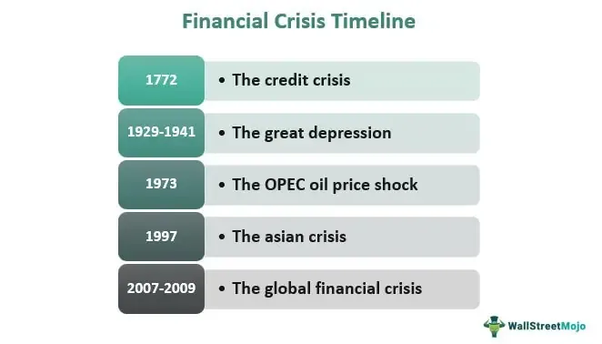

The interplay between financial markets and economic cycles represents a complex series of fluctuations characterized by periods of expansion and contraction. These fluctuations are often marked by financial downturns and crises that have far-reaching consequences on global economies. Financial markets, composed of diverse elements such as stocks, bonds, and commodities, are inherently susceptible to a variety of economic forces that influence their stability and performance.

In this article, we examine the historical trajectory of economic downturns, specifically focusing on credit crises and the evolution of algorithmic trading. Credit crises, which emerge from severe disruptions in the availability of credit, have historically played critical roles in precipitating economic recessions and depressions. Understanding these crises is pivotal in grasping how financial instability can propagate through economies, affecting growth and development.



Algorithmic trading, a product of technological advancement, has transformed the landscape of financial markets by introducing automated, high-frequency trading practices. These trading algorithms have both enhanced market liquidity and efficiency and introduced new challenges, such as increased market volatility during economic downturns. This dual impact necessitates a thoughtful examination of how modern trading practices influence financial stability.

The exploration of these elements is essential for a range of stakeholders, including investors, policymakers, and economists, who seek to mitigate risks and harness opportunities in navigating the volatile terrain of global markets. An informed perspective on the historical and contemporary challenges faced by financial systems can aid in crafting strategies that bolster economic resilience and stability. This article aims to provide such insights, drawing on historical case studies and current technological advancements, to illuminate paths forward in maintaining robust financial systems amidst uncertainties.

## Table of Contents

## Understanding Financial Downturns in Economic History

Economic history is characterized by alternating periods of growth and recession, collectively referred to as economic cycles. These cycles have profound implications for economies, influencing various sectors on both microeconomic (individual businesses and industries) and macroeconomic (national and global economies) scales. Understanding the nature of financial downturns is essential for comprehending the broader economic narrative.

Recessions and depressions, despite being similar economic contractions, differ significantly in their severity and duration. A recession is a temporary decline in economic activity, typically identified by a fall in GDP for two consecutive quarters along with declines in income, employment, industrial production, and wholesale-retail sales. In contrast, a depression is a more severe and prolonged downturn, characterized by a sustained decline in economic activity across multiple years. The impact of a depression is profound, leading to deflation, widespread unemployment, and a significant contraction in credit and investment.

The Great Depression, which began in 1929, serves as a seminal example of financial instability with far-reaching consequences. It led to unprecedented declines in economic output and employment across the globe. The collapse of stock markets, banking failures, and a drastic reduction in consumer spending and investment resulted in a contraction of the global economic system. This episode underscored the critical role of policy interventions in mitigating economic downturns. During the Great Depression, the inadequacies of the gold standard and limited monetary response exacerbated the crisis, while later interventions, like the New Deal in the United States, helped pave the way for recovery by boosting demand and providing financial stability.

The lessons gleaned from historical economic downturns highlight the importance of timely and effective policy measures. Governments and central banks can employ fiscal stimulus, monetary easing, and regulatory reforms to counteract the negative ripple effects of recessions and prevent short-term recessions from escalating into long-term depressions. Moreover, understanding these cycles is crucial for policymakers, investors, and economists aiming to navigate the complexities of modern financial systems.

## The Anatomy of a Credit Crisis

A credit crisis is characterized by a severe disturbance in the financial system’s cash flow, predominantly derived from defaults or acute [liquidity](/wiki/liquidity-risk-premium) shortages that impact the capacity of financial entities to extend credit. This disruption precipitates a drying-up of loans and incurs cascading effects throughout the financial infrastructure, effectively freezing financial operations. The essence of a credit crisis lies in the systemic risk it poses, threatening not only individual institutions but also the broader economic framework.

Typically, a credit crisis begins with an initial trigger, such as a default by significant borrowers or unexpected losses by financial institutions, leading to a loss of confidence among lenders and investors. This lack of confidence creates a ripple effect across the economy, as banks become reluctant to lend to each other or to commercial entities, consequently leading to escalating borrowing costs and constrained access to capital. These conditions can rapidly escalate into broader financial instability, damaging trust and causing stress across interconnected financial networks.

An illustrative modern example is the 2007-2008 credit crisis, which was largely triggered by collapse in the U.S. housing market. This collapse was fueled by the subprime mortgage crisis, where high-risk lending practices and the subsequent default on loans precipitated a significant downturn in housing prices. The rising default rates and the foreclosure of numerous properties led to considerable losses for financial institutions that held mortgage-backed securities (MBS) and other derivatives associated with these loans.

As the value of these securities plummeted, it eroded the asset base of major financial firms, resulting in widespread liquidity issues. The interdependency of these institutions amplified the crisis, with the failures—most notably Lehman Brothers—being a poignant example of the crisis's depth. Subsequent repercussions were felt globally as banks curtailed lending, impacting businesses and consumers alike, which further contributed to the global economic downturn.

This crisis showcased how vulnerabilities in financial markets, when combined with risky lending practices and insufficient regulatory oversight, can lead to widespread economic disturbance. Efforts to mitigate such crises in the future necessitate structured regulatory interventions and proactive risk management strategies to enhance the resilience of financial systems against similar disruptions.

## Algorithmic Trading: A Double-Edged Sword

Algorithmic trading, commonly referred to as algo trading, involves the use of computer algorithms to automate the process of executing trades at speeds and frequencies that traditional human traders cannot match. These algorithms are programmed to follow predefined instructions, which can include variables such as timing, price, and quantity of orders. By implementing algo trading, market participants can enhance market liquidity and improve trading efficiency due to quicker execution times and the ability to process vast amounts of data.

However, the adoption of [algorithmic trading](/wiki/algorithmic-trading) during financial downturns can lead to increased market [volatility](/wiki/volatility-trading-strategies). This occurs primarily because these algorithms react to market signals at lightning speed, potentially amplifying market movements, especially in times of stress. For instance, during a market downturn, if algorithms are programmed to sell off assets when certain thresholds are reached, they can collectively trigger a cascade of selling, exacerbating the decline in asset prices.

Understanding how these algorithms function and the risks they [carry](/wiki/carry-trading) is critical to maintaining financial stability in periods of economic stress. Algorithms in trading are often based on complex mathematical models, incorporating statistical analysis and even [machine learning](/wiki/machine-learning) techniques for price prediction and trend analysis. Consider a simple example using Python to outline how a basic trading algorithm might be structured:

```python
import numpy as np
import pandas as pd

# Sample data
data = pd.DataFrame({
    'Price': [100, 102, 101, 104, 98, 97]
})

# Simple Moving Average strategy
short_window = 3
signals = pd.DataFrame(index=data.index)
signals['Signal'] = 0.0

# Create short simple moving average
signals['Short_MA'] = data['Price'].rolling(window=short_window, min_periods=1, center=False).mean()

# Generate signals
signals['Signal'][short_window:] = np.where(
    signals['Short_MA'][short_window:] > data['Price'][short_window:], 1.0, -1.0
)

# Calculate differences to simulate buy/sell
signals['Positions'] = signals['Signal'].diff()

print(signals)
```

Although these algorithms can provide significant market advantages, they may also pose systemic risks. The 2010 "Flash Crash" exemplifies a scenario where rapid algo trading led to a temporary and dramatic plunge in the stock market, indicating the potential for algorithms to exacerbate volatility.

Therefore, it is essential for market regulators and participants to understand the mechanics and implications of algorithmic trading. Adequate risk management frameworks, including circuit breakers and stringent oversight, are necessary to mitigate the risks posed by algo trading. This balance is paramount for harnessing technology's benefits while preserving the financial system's stability during periods of economic uncertainty.

## Historical Case Studies: Learning from the Past

The Great Depression and the Great Recession are pivotal events in economic history, offering key lessons on the weaknesses of financial systems and the broader economic effects that follow. These two downturns illustrate the complex interplay between financial instability and economic policy responses.

The Great Depression, which began in 1929 and lasted through much of the 1930s, was characterized by a severe and prolonged economic decline. It was triggered by the stock market crash of October 1929, which led to a dramatic contraction in consumer spending and investment. The U.S. banking system experienced widespread bank failures, resulting in a significant loss of savings and decreased availability of credit. This situation was exacerbated by deflationary policies, protectionist measures such as the Smoot-Hawley Tariff, and inadequate initial policy responses.

In reaction, governments eventually implemented significant policy measures. The New Deal in the United States, introduced by President Franklin D. Roosevelt, included financial reforms, public works programs, and social welfare initiatives aimed at stimulating the economy and reducing unemployment. These actions highlight the necessity of timely and coordinated government intervention during economic crises to restore confidence and stabilize markets.

The Great Recession, starting in 2007 and escalating in 2008, was triggered by a collapse in the U.S. housing market and subsequent financial crises. High-risk mortgage lending, securitization of mortgage-backed securities, and excessive risk-taking by financial institutions led to massive defaults when housing prices plummeted. Major financial institutions faced insolvency, leading to global liquidity shortages and a sharp contraction in economic activity.

Policy responses during the Great Recession were swifter and more coordinated than those of the Great Depression. Central banks, notably the Federal Reserve, implemented aggressive monetary policies, including lowering interest rates and engaging in quantitative easing to inject liquidity into the financial system. Fiscal stimulus measures, such as the U.S. Economic Stimulus Act of 2008 and subsequent Recovery Act of 2009, provided financial support to households and businesses.

These historical case studies underscore the importance of understanding financial vulnerabilities and the need for robust policy frameworks. Effective crisis management requires a combination of monetary policies to stabilize credit markets and fiscal policies to stimulate demand and foster economic recovery. The ability to apply lessons from past crises remains crucial for policymakers and financial professionals in navigating future downturns.

## Can Algo Trading Predict Economic Downturns?

Advancements in [artificial intelligence](/wiki/ai-artificial-intelligence) (AI) and machine learning are significantly enhancing the capabilities of algorithmic trading systems, enabling them to identify and react to market trends with unprecedented speed and precision. These technologies facilitate the processing of vast amounts of real-time financial data, providing traders with insights that were traditionally beyond reach. Machine learning models, particularly those utilizing [deep learning](/wiki/deep-learning) techniques, can analyze historical and current market data to discern patterns that might precede economic downturns.

Despite these technological advancements, predicting economic downturns remains a formidable challenge due to the inherently complex and dynamic nature of financial markets. Markets are influenced by a multitude of factors, including geopolitical events, economic indicators, and investor sentiments, which can be difficult to quantify precisely. Furthermore, the interactions between these factors are often non-linear and subject to rapid changes, complicating the task of accurate prediction.

Ongoing research is concentrated on enhancing predictive models by incorporating real-time data analysis for improved risk management. Techniques such as natural language processing (NLP) are used to extract sentiment and insights from news reports, social media, and other text-based sources, providing additional context that can influence market movements. Advanced models can synthesize this information alongside traditional financial metrics to create a more comprehensive view of potential market directions.

To illustrate a potential application, consider the following simplified Python code snippet that employs a hypothetical machine learning model for predicting market trends:

```python
import numpy as np
from sklearn.ensemble import RandomForestClassifier
from sklearn.model_selection import train_test_split
from sklearn.metrics import accuracy_score

# Sample data (features could include financial indicators, sentiment scores, etc.)
X = np.random.rand(1000, 10)  # 1000 samples, 10 features
y = np.random.choice([0, 1], size=1000)  # Binary outcome: 0 for downturn, 1 for upturn

# Split the data into training and test sets
X_train, X_test, y_train, y_test = train_test_split(X, y, test_size=0.3, random_state=42)

# Initialize and train the RandomForest model
model = RandomForestClassifier(n_estimators=100, random_state=42)
model.fit(X_train, y_train)

# Make predictions and evaluate the model
y_pred = model.predict(X_test)
accuracy = accuracy_score(y_test, y_pred)

print(f"Model Accuracy: {accuracy:.2f}")
```

While this model is rudimentary, it exemplifies the process of using machine learning to analyze market data for prediction purposes. The goal of ongoing research is to refine these models, integrating more sophisticated analytics and larger, high-quality datasets to achieve better predictive accuracy.

The pursuit of improving algorithmic trading models for predicting economic downturns continues, with advancements in computational power, data accessibility, and analytical techniques propelling this field toward more reliable and actionable insights. However, given the complexity and unpredictability of global markets, even the most advanced systems have limitations, underscoring the importance of cautious interpretation and application of algorithm-driven predictions in financial decision-making.

## The Future of Algorithmic Trading in Economic Depressions

As financial markets continue to evolve, the role of algorithmic trading in managing economic depressions is anticipated to increase. This emerging prominence is driven by technological advancements, the integration of advanced analytics, and the establishment of robust regulatory frameworks, all of which are key to effectively leveraging algorithmic trading.

Technological advancements, particularly in artificial intelligence (AI) and machine learning (ML), are at the forefront of this transformation. AI and ML algorithms can analyze vast datasets more efficiently than traditional methods, predicting trends and responding to market fluctuations with high speed and precision. These technologies enable financial institutions to perform complex calculations and simulations that inform decision-making processes during economic downturns. For instance, sentiment analysis using natural language processing (NLP) can extract market sentiments from news sources and social media, providing additional insights into market dynamics.

Moreover, integrating advanced analytics into algorithmic trading systems allows for improved risk assessments and management. Sophisticated algorithms can identify patterns and anomalies in financial data that might suggest impending market shifts, aiding in preemptive strategy formulation. This capability is critical during economic depressions when market volatility is unpredictable. The use of statistical methods, such as Monte Carlo simulations, can also project potential market scenarios and outcomes, guiding traders in developing strategies that minimize exposure to risk.

The development and application of these technologies are accompanied by the necessity for robust regulatory frameworks. Effective regulation ensures that the advantages of algorithmic trading, such as enhanced market liquidity and transparency, are maximized while minimizing risks like market manipulation and systemic instability. Regulatory bodies are thus tasked with crafting policies that facilitate technological innovation while safeguarding market integrity.

Looking ahead, algorithmic trading systems are poised to contribute significantly to more resilient economic strategies. By providing rapid responses to market changes and enabling real-time decision-making, these systems offer the potential to support more adaptive and flexible financial environments. Enhanced algorithms may also facilitate a deeper understanding of economic indicators and correlations, fostering proactive economic management rather than reactive measures.

In summary, the future of algorithmic trading amidst economic depressions is marked by the interplay of technological progress, analytical advancements, and regulatory evolution. These elements together promise improved market efficiency and resilience, equipping stakeholders with the tools needed to navigate economic uncertainties effectively.

## Conclusion

Understanding the dynamics of financial downturns and crises is crucial for developing effective financial strategies and policies that withstand economic uncertainties. Financial downturns often expose vulnerabilities within economic systems, necessitating prudent measures from investors and policymakers. As the landscape of financial markets has evolved, the increasing integration of technology has introduced algorithmic trading as a prominent feature. While algorithmic trading offers notable benefits like increased efficiency and improved liquidity, it simultaneously introduces potential risks, particularly in terms of market volatility during economic downturns.

Algorithmic trading, relying on complex algorithms and the rapid analysis of market data, has the potential to either stabilize or destabilize financial markets. During times of economic stress, the speed and [volume](/wiki/volume-trading-strategy) of transactions conducted by these algorithms can exacerbate volatility, possibly triggering sudden, drastic price shifts. Conversely, when properly managed and regulated, algorithmic trading can provide enhanced market liquidity and smoother market operations.

A fundamental challenge lies in balancing the drive for innovation with the need for adequate regulation. Technological advances in trading should be harnessed to promote market resilience, yet they must be accompanied by robust regulatory frameworks to mitigate inherent risks. Regulations can guide the ethical use of trading algorithms, implement safeguards against algorithmic malfunctions, and establish protocols to manage extreme market movements.

Constructive collaboration between technology developers, financial institutions, and regulatory bodies will be vital in ensuring that the benefits of algorithmic trading are maximized while minimizing risks. As markets become more complex, the role of algorithms in predicting and possibly averting financial downturns will likely expand. A focus on technological advancement should not overshadow the necessity for comprehensive risk management strategies.

In conclusion, while algorithmic trading represents a significant advancement in financial technology, it is imperative to maintain a vigilant approach to its implementation. Striking an appropriate balance between fostering innovation and enforcing adequate regulatory measures will play a crucial role in achieving robust economic resilience. Enhancing our understanding of these complexities will empower stakeholders to navigate and mitigate the effects of future economic crises effectively.

## References & Further Reading

1. **Minsky, Hyman P.** (2008). *Stabilizing an Unstable Economy*. McGraw-Hill Professional.  
   This book discusses the inherent instability of financial markets and the cyclical nature of financial crises, offering insight into the economics behind credit crunches.

2. **Reinhart, Carmen M., and Kenneth S. Rogoff** (2009). *This Time is Different: Eight Centuries of Financial Folly*. Princeton University Press.  
   Reinhart and Rogoff provide a comprehensive analysis of financial crises throughout history, highlighting patterns and precursors of economic downturns.

3. **Kindleberger, Charles P., and Robert Z. Aliber** (2011). *Manias, Panics, and Crashes: A History of Financial Crises*. Palgrave Macmillan.  
   This classic text provides a detailed account of the causes and consequences of various financial bubbles and crises.

4. **Shiller, Robert J.** (2000). *Irrational Exuberance*. Princeton University Press.  
   Shiller explores the psychological roots of economic bubbles and their role in precipitating financial instability.

5. **Taleb, Nassim Nicholas** (2007). *The Black Swan: The Impact of the Highly Improbable*. Random House.  
   Taleb's work on randomness and uncertainty addresses the unpredictable nature of financial market events, including crises.

6. **Johnson, Haynes, and David E. Sanger** (2001). *The American Economy: A Historical Encyclopedia*. ABC-CLIO.  
   The encyclopedia provides historical context for various economic events, including recessions and credit crunches.

7. **Lo, Andrew W., and Jasmina Hasanhodzic** (2010). *The Heretics of Finance: Conversations with Leading Practitioners of Technical Analysis*. Bloomberg Press.  
   In this book, practitioners discuss technical analysis and its intersection with algorithmic trading.

8. **Derman, Emanuel** (2004). *My Life as a Quant: Reflections on Physics and Finance*. Wiley.  
   Derman reflects on the role of quantitative finance and algorithmic strategies in modern trading environments.

9. **Chaboud, Alain P., et al.** (2009). “Rise of the Machines: Algorithmic Trading in the Foreign Exchange Market.” *FRB International Finance Discussion Paper*.  
   This paper examines the growing influence of algorithmic trading in financial markets, with a focus on foreign exchange.

10. **Ferris, Ken** (2017). “Algorithmic Trading and Market Dynamics: The Impact on Volatility and Regulation.” *Journal of Financial Markets*.  
    This article reviews the implications of algorithmic trading on market stability and outlines regulatory considerations.

11. **Bertsimas, Dimitris, and Robert Freund** (2004). *Data, Models, and Decisions: The Fundamentals of Management Science*. Dynamic Ideas.  
    Provides fundamental insights into decision making under uncertainty, applicable to trading and economic forecasting.

For a more comprehensive understanding, these works offer substantial coverage of the intricate interactions between financial markets, economic cycles, and the role of algorithmic trading.

