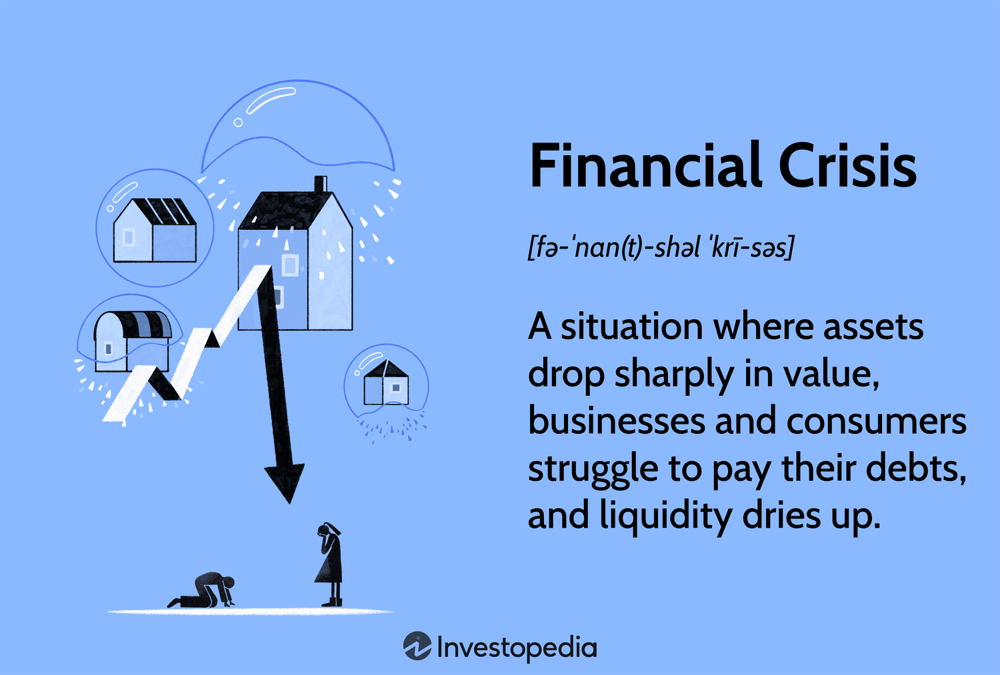

## Table of Contents

## What is a credit crisis?

A credit crisis happens when it becomes very hard for people and businesses to borrow money. Banks and other lenders start to worry about not getting their money back, so they stop lending as much or charge higher interest rates. This can make it tough for people to buy things like houses or cars, and for businesses to grow or even stay open.

When a credit crisis happens, it can affect the whole economy. If people and businesses can't borrow money, they spend less, which can lead to fewer jobs and slower economic growth. Governments and central banks often step in to try to fix the problem by lowering interest rates or providing emergency loans to keep the economy going.

## What are the main causes of a credit crisis?

One main cause of a credit crisis is when too many people and businesses have too much debt. When everyone is borrowing a lot, it can create a bubble where things like houses or stocks become overpriced. If people start to worry that these prices are too high, they might stop buying, causing prices to fall. When prices drop, people who borrowed money to buy these things might not be able to pay back their loans. This can make banks worried, and they might start lending less, which can lead to a credit crisis.

Another cause is when banks and financial institutions take on too much risk. Sometimes, banks lend money to people or businesses that might not be able to pay it back. If a lot of these risky loans go bad at the same time, banks can lose a lot of money. This can make other banks and investors nervous, causing them to pull their money out of the banks. When banks don't have enough money to lend, it can lead to a credit crisis.

Lastly, a credit crisis can be triggered by a sudden economic shock, like a big company failing or a global event like a financial panic. These shocks can make people and businesses lose confidence in the economy. When confidence drops, people might start saving more and spending less, which can slow down the economy. Banks might then become more cautious and cut back on lending, leading to a credit crisis.

## How does a credit crisis affect the economy?

A credit crisis can really hurt the economy. When banks stop lending money easily, people and businesses find it hard to borrow. This means they can't buy things like houses or cars, or invest in new projects. When people spend less, businesses sell less, and they might have to lay off workers or even close down. This can lead to higher unemployment and less money moving around in the economy, which slows everything down.

Governments and central banks usually try to help during a credit crisis. They might lower interest rates to make borrowing cheaper, or they might give emergency loans to banks to keep them going. But fixing a credit crisis takes time, and in the meantime, the economy can suffer. People might feel less confident about the future, so they save more and spend less, which makes the slowdown worse. It's a tough cycle to break, but with the right actions, things can start to get better.

## What are the signs that a credit crisis might be looming?

One sign that a credit crisis might be coming is when people and businesses are borrowing a lot more money than usual. If everyone is taking out big loans to buy things like houses or to start new projects, it can create a bubble. When prices for these things get too high, they might suddenly drop, leaving people unable to pay back their loans. This can make banks nervous, and they might start lending less, which is a big warning sign of a credit crisis.

Another sign is when banks and financial companies start taking on more risk. If banks are lending money to people or businesses that might not be able to pay it back, and a lot of these loans go bad at the same time, banks can lose a lot of money. This can make other banks and investors pull their money out, making it harder for banks to lend. If you see banks getting more cautious and cutting back on loans, it could mean a credit crisis is on the way.

Lastly, a sudden economic shock can also be a sign that a credit crisis is coming. If a big company fails or there's a global event that makes people worried about the economy, it can shake everyone's confidence. When people start saving more and spending less, businesses feel the pinch and might have to cut back or close down. If banks see this happening, they might start lending less to protect themselves, which can lead to a credit crisis.

## Can you explain the role of banks in a credit crisis?

Banks play a big role in a credit crisis because they are the ones who lend money to people and businesses. When everything is going well, banks are happy to lend money because they believe they will get it back with interest. But if a lot of people start having trouble paying back their loans, banks can get worried. They might think that lending money is too risky, so they start to lend less or charge higher interest rates. This makes it harder for people and businesses to borrow money, which can slow down the whole economy.

During a credit crisis, banks can also face their own problems. If a lot of loans go bad at the same time, banks can lose a lot of money. This can make other banks and investors nervous, and they might start pulling their money out of the bank. When banks don't have enough money, they have to be even more careful about lending. Governments and central banks often step in to help by giving banks emergency loans or lowering interest rates to make borrowing easier. But fixing a credit crisis takes time, and banks play a key role in how quickly the economy can recover.

## What measures can governments take to mitigate a credit crisis?

When a credit crisis happens, governments can do a few things to help. One big thing they can do is lower interest rates. This makes it cheaper for people and businesses to borrow money. When borrowing is cheaper, more people might take out loans to buy things like houses or cars, which can help the economy start moving again. Governments can also give emergency loans to banks. This helps banks keep lending money even when they're worried about not getting it back. By keeping the money flowing, the economy can start to recover.

Another thing governments can do is spend more money on things like building roads or schools. This is called fiscal stimulus, and it puts more money into the economy. When the government spends money, it can create jobs and make people feel more confident about the future. If people feel more confident, they might start spending more, which can help the economy grow again. Governments can also help by making rules that stop banks from taking too many risks. If banks are more careful about who they lend money to, it can prevent a credit crisis from happening in the first place.

## How do credit crises impact individuals and businesses?

A credit crisis can make life really tough for individuals. When banks stop lending money easily, people might find it hard to get loans for things like buying a house or a car. If they already have loans, they might have to pay higher interest rates, which can make it harder to keep up with payments. This can lead to people losing their homes or cars. Also, when the economy slows down because of a credit crisis, people might lose their jobs or have to take pay cuts. This means they have less money to spend, which can make it even harder to get by.

Businesses also feel the pinch during a credit crisis. When banks are scared to lend money, businesses might not be able to get the loans they need to grow or even to keep running. This can lead to businesses having to cut back on what they do or even close down. When businesses struggle, they might have to lay off workers or stop hiring new ones. This makes it harder for the economy to recover because people have less money to spend. But if governments and central banks step in with help, like lowering interest rates or giving emergency loans, it can make things a bit easier for businesses and help them get through the crisis.

## What was the significance of the 2007-2008 global financial crisis?

The 2007-2008 global financial crisis was a big event that shook the whole world. It started because banks in the United States were lending too much money to people who couldn't pay it back, especially for buying houses. When a lot of people couldn't pay their loans, banks lost a lot of money. This made banks scared to lend money, and it became hard for people and businesses to borrow. The crisis spread to other countries too, because banks and businesses all over the world were connected. It caused a big problem in the economy, with many people losing their jobs and businesses closing down.

Governments and central banks around the world had to step in to help. They lowered interest rates to make borrowing cheaper and gave emergency loans to banks to keep them going. It took a long time for things to get better, but slowly, the economy started to recover. The 2007-2008 crisis showed how important it is for banks to be careful about who they lend money to and for governments to have plans ready to help during a crisis. It also made people realize how connected the world's economy is, and how a problem in one country can affect everyone.

## How have historical credit crises shaped modern financial regulations?

Historical credit crises, like the one in 2007-2008, have taught us a lot about how to keep the economy safe. After the big crisis, governments and banks realized they needed better rules to stop it from happening again. They made new laws to make sure banks don't take too many risks with their loans. For example, they set up rules that say banks have to keep more money in reserve, so they can handle it if a lot of loans go bad at once. These rules also made banks check more carefully before lending money to people, to make sure they can pay it back.

Another big change was setting up groups like the Financial Stability Board to watch over the whole financial system. These groups look out for signs that another crisis might be coming and can warn governments and banks to take action. They also made it easier for different countries to work together, because they saw that a problem in one place can affect the whole world. By learning from past credit crises, these new rules help make the financial system stronger and safer for everyone.

## What are some examples of credit crises before the 21st century?

One big credit crisis happened in the United States in the 1930s, called the Great Depression. It started when the stock market crashed in 1929. A lot of people lost their money, and banks started failing because they couldn't get their loans paid back. People got scared and started taking their money out of banks, which made things even worse. Banks stopped lending money, and it became really hard for people and businesses to borrow. This led to a lot of businesses closing down and many people losing their jobs. The government had to step in with new rules and programs to help the economy get better, but it took a long time.

Another credit crisis happened in the 1980s, known as the Savings and Loan Crisis. This time, it was because a lot of savings and loan associations in the U.S. were making risky loans, especially for real estate. When a lot of these loans went bad, these associations lost a lot of money. The government had to step in and shut down many of them, which cost a lot of money to fix. This crisis showed that banks needed better rules to stop them from taking too many risks. It helped shape new laws to make the financial system safer.

## How do international factors contribute to the spread of a credit crisis?

International factors can make a credit crisis spread from one country to another because the world's economy is all connected. If a big bank in one country has problems, it can affect banks in other countries too. This is because banks often lend money to each other across borders. If a bank in one country can't pay back its loans, it can make banks in other countries worried and they might stop lending money too. This can lead to a credit crisis spreading quickly around the world.

Also, when a credit crisis happens in a big economy like the United States, it can affect other countries because they trade a lot with each other. If people in the U.S. stop buying things from other countries, those countries can have a hard time selling their products. This can make their businesses struggle and their economies slow down. When one country's economy slows down, it can make people in other countries worried, so they might start saving more and spending less, which can lead to a credit crisis spreading even further.

## What are the long-term effects of a credit crisis on global financial stability?

A credit crisis can have big effects on global financial stability that last a long time. When a crisis happens, it can make people and businesses lose trust in banks and the economy. This can lead to new rules and laws to make sure banks are safer and don't take too many risks. These rules can help prevent another crisis, but they can also make it harder for people to borrow money. Over time, these changes can make the financial system more stable, but it can also slow down economic growth if borrowing becomes too hard.

Another long-term effect is that a credit crisis can change how countries work together. When a crisis spreads from one country to another, it shows how connected the world's economy is. This can lead to more cooperation between countries to keep an eye on the financial system and stop problems before they get too big. Groups like the Financial Stability Board were created to help with this. While this can make the global economy more stable, it also means countries have to work together and follow the same rules, which can be hard to do.

## References & Further Reading

1. **Minsky, Hyman P.** (2008). *Stabilizing an Unstable Economy*. McGraw-Hill Professional.  
   This book discusses the inherent instability of financial markets and the cyclical nature of financial crises, offering insight into the economics behind credit crunches.

2. **Reinhart, Carmen M., and Kenneth S. Rogoff** (2009). *This Time is Different: Eight Centuries of Financial Folly*. Princeton University Press.  
   Reinhart and Rogoff provide a comprehensive analysis of financial crises throughout history, highlighting patterns and precursors of economic downturns.

3. **Kindleberger, Charles P., and Robert Z. Aliber** (2011). *Manias, Panics, and Crashes: A History of Financial Crises*. Palgrave Macmillan.  
   This classic text provides a detailed account of the causes and consequences of various financial bubbles and crises.

4. **Shiller, Robert J.** (2000). *Irrational Exuberance*. Princeton University Press.  
   Shiller explores the psychological roots of economic bubbles and their role in precipitating financial instability.

5. **Taleb, Nassim Nicholas** (2007). *The Black Swan: The Impact of the Highly Improbable*. Random House.  
   Taleb's work on randomness and uncertainty addresses the unpredictable nature of financial market events, including crises.

6. **Johnson, Haynes, and David E. Sanger** (2001). *The American Economy: A Historical Encyclopedia*. ABC-CLIO.  
   The encyclopedia provides historical context for various economic events, including recessions and credit crunches.

7. **Lo, Andrew W., and Jasmina Hasanhodzic** (2010). *The Heretics of Finance: Conversations with Leading Practitioners of Technical Analysis*. Bloomberg Press.  
   In this book, practitioners discuss technical analysis and its intersection with [algorithmic trading](/wiki/algorithmic-trading).

8. **Derman, Emanuel** (2004). *My Life as a Quant: Reflections on Physics and Finance*. Wiley.  
   Derman reflects on the role of quantitative finance and algorithmic strategies in modern trading environments.

9. **Chaboud, Alain P., et al.** (2009). “Rise of the Machines: Algorithmic Trading in the Foreign Exchange Market.” *FRB International Finance Discussion Paper*.  
   This paper examines the growing influence of algorithmic trading in financial markets, with a focus on foreign exchange.

10. **Ferris, Ken** (2017). “Algorithmic Trading and Market Dynamics: The Impact on Volatility and Regulation.” *Journal of Financial Markets*.  
    This article reviews the implications of algorithmic trading on market stability and outlines regulatory considerations.

11. **Bertsimas, Dimitris, and Robert Freund** (2004). *Data, Models, and Decisions: The Fundamentals of Management Science*. Dynamic Ideas.  
    Provides fundamental insights into decision making under uncertainty, applicable to trading and economic forecasting.

For a more comprehensive understanding, these works offer substantial coverage of the intricate interactions between financial markets, economic cycles, and the role of algorithmic trading.

