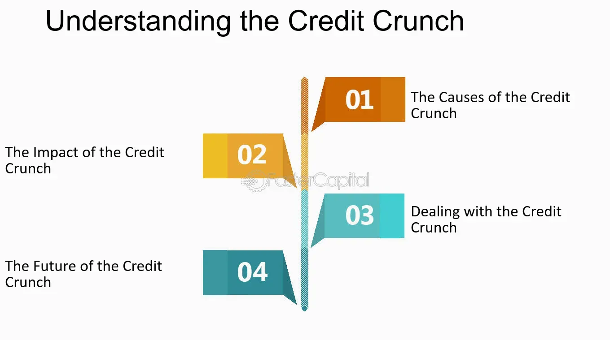

## Table of Contents

## What is a credit crunch?

A credit crunch happens when it becomes hard for people and businesses to borrow money. Banks and lenders start to be very careful about who they give loans to. They might raise interest rates or just say no to loan requests more often. This can happen because banks are worried about the economy or because they've lost money on loans they've already given out.

When a credit crunch happens, it can slow down the whole economy. Businesses might not be able to get the money they need to grow or even to keep running. This can lead to fewer jobs and less spending by people. If people can't borrow money easily, they might not buy houses or cars, which can make the economy even weaker. A credit crunch can be tough, but it usually doesn't last forever.

## What are the main causes of a credit crunch?

A credit crunch can start when banks and other lenders get scared about losing money. This often happens after a lot of people can't pay back their loans, like during a housing market crash. When banks lose money, they start to be very careful about giving out new loans. They might think that more people will have trouble paying back loans in the future, so they decide to lend less money to protect themselves.

Another reason for a credit crunch is when the economy is not doing well. If businesses are struggling and people are losing their jobs, banks might worry that borrowers won't be able to pay back their loans. This makes banks tighten their lending rules, making it harder for everyone to borrow money. Governments and central banks might also make rules that make lending harder, which can lead to a credit crunch.

Sometimes, a credit crunch can be caused by a sudden shock to the financial system, like a big bank failing or a financial crisis. When this happens, banks might stop trusting each other and stop lending money to each other, which makes it even harder for them to lend to regular people and businesses. This chain reaction can spread quickly and make a credit crunch worse.

## How does a credit crunch affect the economy?

A credit crunch makes it harder for people and businesses to borrow money. When banks are scared about losing money, they start saying no to loan requests more often or they charge higher interest rates. This means businesses can't get the money they need to grow or even keep running smoothly. When businesses struggle, they might have to cut jobs, which means more people are out of work. If people can't borrow money easily, they might not buy big things like houses or cars. This leads to less spending overall, which can slow down the whole economy.

The effects of a credit crunch can spread quickly. When people and businesses can't borrow money, they might have to cut back on spending even more. This can hurt other businesses that rely on their customers spending money. If a lot of businesses are struggling at the same time, it can lead to a bigger economic problem, like a recession. Governments and central banks often try to help by making it easier for banks to lend money again, but it can take time for things to get back to normal. A credit crunch can be tough, but it usually doesn't last forever.

## Can you provide historical examples of credit crunches?

One big example of a credit crunch happened in the United States in 2007-2008. It started with the housing market. A lot of people had taken out loans to buy houses, but when house prices started to fall, many couldn't pay back their loans. Banks lost a lot of money and got scared. They started saying no to new loans, making it hard for people and businesses to borrow money. This led to the global financial crisis, where the whole world's economy got into trouble. Many businesses went bankrupt, and a lot of people lost their jobs.

Another example was in Japan during the 1990s. Japan had a big bubble in their real estate and stock markets. When the bubble burst, banks lost a lot of money on loans they had given out. They got very careful about lending new money, which made it hard for businesses to borrow. This led to what people called the "Lost Decade" in Japan, where the economy didn't grow much for a long time. Businesses struggled, and it took Japan many years to recover from this credit crunch.

## What role do banks play during a credit crunch?

During a credit crunch, banks play a big role because they are the ones that usually lend money to people and businesses. When a credit crunch happens, banks get scared about losing money. They start to say no to more loan requests or they charge higher interest rates. This is because they think more people might not be able to pay back their loans. Banks might also need to keep more money for themselves to stay safe, so they lend out less money to others.

This behavior from banks makes it harder for everyone to borrow money. Businesses can't get the loans they need to grow or even keep running, which can lead to them cutting jobs. People might not be able to buy houses or cars because they can't get loans. All of this can slow down the whole economy. Banks are trying to protect themselves, but their actions during a credit crunch can make the problem worse for everyone else.

## How do interest rates influence a credit crunch?

Interest rates are like the price you pay for borrowing money. When a credit crunch starts, banks might raise these rates because they're worried about losing money. If banks think more people won't be able to pay back their loans, they make the interest rates higher to cover the risk. This makes borrowing money more expensive for everyone. People and businesses might decide not to borrow at all because the cost is too high, which can slow down the economy.

On the other hand, central banks, like the Federal Reserve in the U.S., can try to help during a credit crunch by lowering interest rates. When they do this, it's cheaper for banks to borrow money from them. This can encourage banks to lend more money to people and businesses. Lower interest rates can help get the economy moving again by making it easier for everyone to borrow. But if banks are still scared, they might not lend more even if the rates are lower, and the credit crunch can continue.

## What are the signs that a credit crunch is occurring?

You can tell a credit crunch is happening when it becomes harder for people and businesses to borrow money. Banks start saying no to loan requests more often. They might also charge higher interest rates because they're worried about losing money. If you see news about banks being very careful with loans, or if it's harder for you or people you know to get a loan, that's a sign a credit crunch might be happening.

Another sign is when businesses start to struggle because they can't get the money they need. They might have to cut jobs or close down. This can lead to more people being out of work, and less spending in the economy. If you notice a lot of businesses having trouble or if the economy seems to be slowing down, it could be because of a credit crunch.

## How do credit crunches impact businesses and consumers?

A credit crunch makes it hard for businesses to get the money they need. When banks are scared about losing money, they say no to loan requests more often or charge higher interest rates. This means businesses can't borrow money to grow or even keep running smoothly. They might have to cut jobs or close down, which is bad for the economy. When businesses struggle, it can lead to a bigger problem where a lot of people lose their jobs and the whole economy slows down.

For consumers, a credit crunch means it's harder to borrow money too. People might not be able to get loans to buy houses or cars because banks are being careful. This can make people spend less money, which hurts businesses even more. When people can't borrow easily, they might have to put off big purchases or even struggle to pay their bills. This can make life harder for a lot of people and can make the economy weaker.

## What measures can governments take to mitigate the effects of a credit crunch?

Governments can help during a credit crunch by making it easier for banks to lend money again. They can do this by lowering interest rates, which makes it cheaper for banks to borrow money from the central bank. When banks can borrow money more easily, they might start lending more to people and businesses. Governments can also give money directly to banks to help them stay strong and keep lending. This can help businesses get the loans they need to keep running and growing, which can help the economy get better.

Another thing governments can do is help people and businesses directly. They can give money to people who lost their jobs or to businesses that are struggling. This can help people keep spending money, which is good for the economy. Governments can also make rules easier for a while, so it's not so hard for people and businesses to borrow money. By taking these steps, governments can try to stop a credit crunch from getting worse and help the economy start to recover.

## How do credit crunches differ from other financial crises?

A credit crunch is when banks get scared and stop lending money easily. They might say no to loan requests or charge higher interest rates because they're worried about losing money. This makes it hard for people and businesses to borrow money, which can slow down the whole economy. A credit crunch usually happens after banks lose a lot of money on loans, like during a housing market crash.

Other financial crises can be different. For example, a stock market crash is when the value of stocks goes down a lot very quickly. This can make people lose a lot of money, but it doesn't always mean banks stop lending money. Another type of crisis is a currency crisis, where a country's money loses value fast. This can make things more expensive and cause problems, but it's different from a credit crunch because it's about the value of money, not about banks lending less. Even though these crises are different, they can all hurt the economy and make life harder for people and businesses.

## What are the long-term effects of a credit crunch on economic growth?

A credit crunch can have big effects on how the economy grows over a long time. When banks stop lending money easily, businesses can't get the money they need to grow or even keep running. This can make the economy slow down for a while. If businesses struggle for a long time, they might have to close down or not hire new people. This can lead to less jobs and less spending, which makes it hard for the economy to grow. It can take years for things to get back to normal after a credit crunch because businesses and people need time to recover and start borrowing and spending again.

Over time, a credit crunch can also make people and businesses more careful about borrowing money. They might remember how hard it was to get loans and decide to save more money instead of spending or investing. This can slow down economic growth even more because spending and investing are important for the economy to grow. Governments and central banks try to help by making it easier for banks to lend money again, but it can take a long time for the economy to fully recover from a credit crunch.

## How can financial institutions prepare for and manage the risks associated with a credit crunch?

Financial institutions can get ready for a credit crunch by keeping a close eye on the economy and their own loans. They should check how likely people are to pay back their loans and make sure they have enough money saved up to cover any losses. Banks can also spread out their risks by not lending too much money to one person or business. If they see signs that a credit crunch might be coming, like more people not paying back their loans or the economy slowing down, they can start being more careful about who they lend money to.

During a credit crunch, banks need to manage their risks carefully. They might have to say no to some loan requests or charge higher interest rates to protect themselves. But they also need to keep lending some money to help the economy. Banks can work with the government and central banks, who might give them money or make rules easier so they can keep lending. By balancing being careful with helping the economy, banks can help make the credit crunch less bad and help things get back to normal faster.

## What is a Credit Crunch?

A credit crunch is characterized by a sudden and drastic reduction in the general availability of loans or a tightening of the conditions required to obtain a loan from banks and other financial institutions. This scenario usually follows a financial shock that leads such institutions to become risk-averse, prompting them to scale back significantly on lending activities. This risk aversion often arises from a lack of confidence in the ability of borrowers to repay loans, which is exacerbated by previous losses or potential threats perceived in the economic environment.

During a credit crunch, borrowers encounter higher interest rates and more stringent loan conditions, making credit access far more challenging. This contraction in credit availability can have a stalling effect on economic growth because businesses and consumers alike find it harder to finance operations and consumption. With restricted credit, companies may delay expansion, halt new ventures, and refrain from hiring new employees, which collectively reduce economic output and heighten unemployment.

Historically, credit crunches have displayed notable patterns, including decreased lending volumes and increased bank foreclosures. This contraction in credit activity can lead to a cycle of declining consumer spending and investment, putting further strain on the economy. For instance, during the global financial crisis of 2008, the credit crunch was precipitated by the collapse of major financial institutions and the burst of the housing bubble, resulting in widespread economic repercussions. 

In mathematical terms, a credit crunch can be understood through the equations that govern credit supply and demand. Should the supply of credit, $S_c$, decrease due to heightened risk perceptions, while demand, $D_c$, remains constant or increases due to economic pressures, the [interest rate](/wiki/interest-rate-trading-strategies), $i$, tends to increase, as expressed in the equilibrium condition:

$$
S_c(i) = D_c(i)
$$

Thus, $i$ must increase for the new equilibrium to be achieved, reflecting tighter credit conditions.

Overall, the patterns of reduced lending and increased foreclosures during historical credit crunches illustrate the profound impact such phenomena have on both banking sectors and broader economies, necessitating strategic responses from both financial institutions and policymakers to mitigate adverse effects.

## References & Further Reading

[1]: Brunnermeier, M. K. (2009). ["Deciphering the Liquidity and Credit Crunch 2007-2008."](https://www.princeton.edu/~markus/research/papers/liquidity_credit_crunch.pdf) Journal of Economic Perspectives, 23(1), 77-100.

[2]: Gorton, G. B., & Metrick, A. (2012). ["Getting Up to Speed on the Financial Crisis: A One-Weekend-Reader's Guide."](https://www.nber.org/system/files/working_papers/w17778/w17778.pdf) Journal of Economic Literature, 50(1), 128-150.

[3]: Hendershott, T., Jones, C. M., & Menkveld, A. J. (2011). ["Does Algorithmic Trading Improve Liquidity?"](https://onlinelibrary.wiley.com/doi/full/10.1111/j.1540-6261.2010.01624.x) Review of Financial Studies, 24(5), 1460-1489.

[4]: Adrian, T., & Shin, H. S. (2010). ["Liquidity and Leverage."](https://www.sciencedirect.com/science/article/pii/S1042957308000764) Journal of Financial Intermediation, 19(3), 418-437.

[5]: MacKenzie, D. (2014). ["A Sociology of Algorithms: High-frequency Trading and the Shaping of Markets."](https://uberty.org/wp-content/uploads/2015/11/mackenzie-algorithms.pdf) Theory, Culture & Society, 31(6), 71-90.

[6]: Allen, F., & Gale, D. (2000). ["Financial Contagion."](https://www.semanticscholar.org/paper/Financial-Contagion-Allen-Gale/04f05c056fc71955a89237ea09c96f63b993b97c) Journal of Political Economy, 108(1), 1-33.

[7]: Shleifer, A., & Vishny, R. W. (2010). ["Unstable Banking."](https://scholar.harvard.edu/shleifer/publications/unstable-banking) Journal of Financial Economics, 97(3), 306-332.