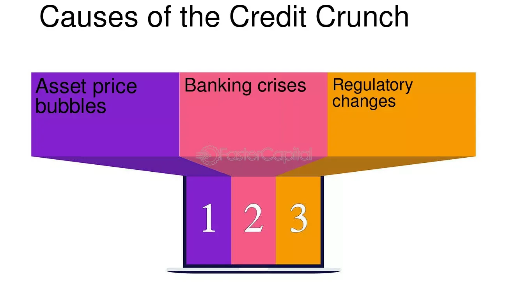

## Table of Contents

## What is a credit crunch?

A credit crunch is when it becomes harder for people and businesses to borrow money. Banks and lenders become very cautious and start giving out fewer loans. This can happen because the banks are worried about not getting their money back, especially if the economy is not doing well.

When a credit crunch happens, it can slow down the economy. Businesses might not be able to get the money they need to grow or even keep running. People might find it harder to buy things like houses or cars because they can't get loans. This can lead to less spending and can make the economy weaker.

## What are the common causes of a credit crunch?

A credit crunch can happen for a few main reasons. One big reason is when banks start to worry about losing money. This can happen if a lot of people or businesses can't pay back their loans. When banks see this happening, they get scared and start lending less money to everyone. They want to protect themselves from losing more money.

Another reason for a credit crunch is when the economy is not doing well. If people are losing their jobs or businesses are not making money, banks know that borrowers might have a hard time paying back loans. So, banks decide to be very careful and only lend money to people or businesses they are sure can pay it back. This carefulness can lead to a credit crunch.

Sometimes, government rules can also cause a credit crunch. If the government makes new rules that make it harder for banks to lend money, banks will lend less. These rules might be made to protect the economy or to stop banks from taking too many risks, but they can also make it harder for people and businesses to get loans.

## How does a credit crunch affect the economy?

A credit crunch can slow down the whole economy. When banks stop lending money easily, businesses can't get the loans they need to grow or even keep running. This means they might have to cut back on spending, lay off workers, or even close down. When businesses do this, it affects the whole economy because people have less money to spend, and other businesses lose customers.

People are also affected by a credit crunch. If they can't get loans, they might not be able to buy big things like houses or cars. This means less money is moving around in the economy. When people spend less, businesses make less money, and this can lead to more job losses and even more people not being able to pay back their loans. It's like a cycle that makes the economy weaker and weaker.

In the end, a credit crunch can lead to a bigger economic problem, like a recession. When businesses and people can't borrow money, the whole economy can start to shrink. This can make everyone feel less confident about spending and investing, which makes the economic situation even worse.

## Can government policies lead to a credit crunch?

Yes, government policies can lead to a credit crunch. When the government makes new rules about how banks can lend money, it can make banks more careful. For example, if the government says banks need to keep more money in reserve and not lend it out, banks will have less money to give as loans. This can make it harder for people and businesses to borrow money, leading to a credit crunch.

Also, if the government makes rules to stop banks from taking big risks, like lending to people who might not pay back, banks will lend less money. They want to follow the rules and not get in trouble. When banks lend less, it can slow down the economy and cause a credit crunch. So, even though these rules are meant to protect the economy, they can sometimes make it harder for people to get loans.

## What role do banks play in causing a credit crunch?

Banks can cause a credit crunch when they start to worry about losing money. If a lot of people or businesses can't pay back their loans, banks get scared. They decide to lend less money to everyone because they want to protect themselves from losing more money. When banks do this, it becomes harder for people and businesses to get the money they need.

Sometimes, banks also cause a credit crunch because they follow new rules from the government. If the government tells banks to keep more money in reserve and not lend it out, banks have less money to give as loans. Also, if the government makes rules to stop banks from taking big risks, banks will lend less money. When banks lend less, it can slow down the economy and lead to a credit crunch.

## How do high levels of debt contribute to a credit crunch?

High levels of debt can make a credit crunch happen. When people or businesses have a lot of debt, they might have a hard time paying it back. If many people can't pay back their loans, banks start to worry. They get scared that they will lose money, so they decide to lend less money to everyone. This makes it harder for other people and businesses to get loans, which can lead to a credit crunch.

Also, when there is a lot of debt in the economy, it can make the whole economy weaker. If businesses have a lot of debt, they might not be able to grow or even keep running. If people have a lot of debt, they might spend less money on things like houses or cars. When people and businesses spend less, it slows down the economy. This can make banks even more worried about lending money, which can make a credit crunch worse.

## What impact does a decrease in consumer confidence have on a credit crunch?

When people lose confidence in the economy, it can make a credit crunch worse. If people think the economy is going to get bad, they start spending less money. They might not buy big things like houses or cars because they're worried about the future. When people spend less, businesses make less money. This can make businesses struggle to pay back their loans, which makes banks worried. Banks then lend less money because they're scared they won't get it back.

This cycle can lead to a credit crunch. When banks lend less, it becomes harder for people and businesses to get the money they need. This makes the economy even weaker. When the economy is weak, people lose even more confidence, and they spend even less. It's like a bad circle that makes the credit crunch worse and can even lead to a bigger economic problem, like a recession.

## How do interest rates influence the occurrence of a credit crunch?

Interest rates play a big role in causing a credit crunch. When interest rates go up, it costs more for people and businesses to borrow money. Banks might also decide to raise interest rates if they think the economy is doing too well and they want to slow it down. When borrowing becomes more expensive, fewer people and businesses want to take out loans. This means less money is moving around in the economy, which can lead to a credit crunch.

On the other hand, if interest rates are very low, it can also lead to a credit crunch in the long run. When rates are low, people and businesses might borrow a lot of money. If they borrow too much, they might not be able to pay it back later. When banks see that a lot of people can't pay back their loans, they get worried and start lending less money. This can cause a credit crunch because banks are trying to protect themselves from losing money.

## What are the global factors that can trigger a credit crunch?

Global factors can make a credit crunch happen. One big reason is when other countries have economic problems. If a big country like the United States or China has a bad economy, it can affect the whole world. Banks in other countries might get worried and start lending less money because they're scared about what's happening globally. This can lead to a credit crunch in many places, not just in the country with the problem.

Another global [factor](/wiki/factor-investing) is when there are big changes in the world's financial markets. For example, if there is a big drop in stock prices or if there is a crisis in the banking system of one country, it can make banks everywhere nervous. They might decide to lend less money to protect themselves from losing money. When banks around the world start lending less, it can lead to a credit crunch that affects many countries.

## How can regulatory changes lead to a credit crunch?

Regulatory changes can lead to a credit crunch when the government makes new rules that make it harder for banks to lend money. For example, if the government says banks need to keep more money in reserve instead of lending it out, banks will have less money to give as loans. When banks have less money to lend, people and businesses find it harder to borrow money. This can slow down the economy and lead to a credit crunch.

Also, if the government makes rules to stop banks from taking big risks, like lending to people who might not pay back, banks will lend less money. They want to follow the rules and not get in trouble. When banks lend less, it can make it harder for people and businesses to get the money they need. This can lead to a credit crunch because less money is moving around in the economy.

## What historical examples illustrate the causes of credit crunches?

One famous example of a credit crunch happened during the 2007-2008 financial crisis. It started in the United States because a lot of people couldn't pay back their home loans. Banks had given out too many risky loans, and when people started defaulting, banks lost a lot of money. This made banks scared, so they stopped lending money to everyone. This credit crunch spread around the world because banks everywhere were worried about losing money. It led to a big economic problem called the Great Recession, where many people lost their jobs and businesses closed.

Another example is the credit crunch in Japan during the 1990s, known as the "Lost Decade." In the late 1980s, Japan had a big bubble in its real estate and stock markets. When the bubble burst, property and stock prices fell a lot. Banks had lent a lot of money based on these high prices, and when the prices dropped, many people and businesses couldn't pay back their loans. Banks then got very careful and started lending less money. This led to a credit crunch that lasted for years, slowing down Japan's economy and causing a long period of economic trouble.

## What advanced economic indicators should be monitored to predict a credit crunch?

To predict a credit crunch, it's important to watch certain economic indicators. One key indicator is the level of bad loans in banks. If more and more people and businesses can't pay back their loans, banks will start to worry. They might decide to lend less money to everyone, which can lead to a credit crunch. Another important indicator is the [interest rate](/wiki/interest-rate-trading-strategies). If interest rates go up a lot, borrowing money becomes more expensive, and fewer people and businesses will take out loans. This can slow down the economy and make a credit crunch more likely.

Another indicator to keep an eye on is the amount of debt in the economy. If people and businesses have a lot of debt, they might struggle to pay it back, especially if the economy starts to slow down. This can make banks scared, and they might start lending less money. Also, watching consumer confidence is helpful. If people are worried about the economy and start spending less money, it can make the economy weaker. When the economy is weak, banks often decide to lend less, which can lead to a credit crunch.

## References & Further Reading

Brunnermeier, M. K. (2009). "Deciphering the Liquidity and Credit Crunch 2007-2008." This paper provides an analysis of the [liquidity](/wiki/liquidity-risk-premium) crisis and credit crunch during the 2007-2008 financial upheaval, examining the causes and implications for financial markets.

Gorton, G. B., & Metrick, A. (2012). "Getting Up to Speed on the Financial Crisis: A One-Weekend-Reader's Guide." This guide offers an overview of the financial crisis and its key elements, helping readers understand the rapid changes in the financial landscape during this period.

Hendershott, T., Jones, C. M., & Menkveld, A. J. (2011). "Does Algorithmic Trading Improve Liquidity?" This research investigates the impact of [algorithmic trading](/wiki/algorithmic-trading) on market liquidity, exploring its potential benefits and associated risks.

Adrian, T., & Shin, H. S. (2010). "Liquidity and Leverage." This work examines the relationship between liquidity and leverage, discussing how leverage can influence market stability, especially during periods of financial distress.

MacKenzie, D. (2014). "A Sociology of Algorithms: High-frequency Trading and the Shaping of Markets." This study provides insights into high-frequency trading, exploring its role in market dynamics and the broader implications for financial markets.

Allen, F., & Gale, D. (2000). "Financial Contagion." This paper analyzes how financial contagion spreads through markets, highlighting the mechanisms that lead to widespread financial instability across global markets.

Shleifer, A., & Vishny, R. W. (2010). "Unstable Banking." This research explores the instability inherent in banking systems, focusing on the factors that can lead to systemic banking crises.

