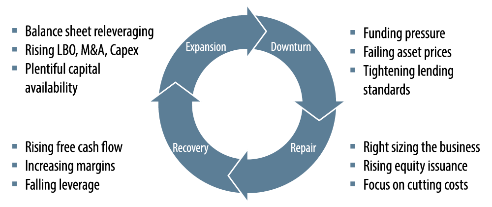

## Table of Contents

## What is a credit cycle?

A credit cycle is like a pattern that keeps repeating in the world of borrowing and lending money. It goes through different stages where sometimes it's easy to borrow money, and other times it's hard. This cycle affects everyone from big banks to regular people who want to take out loans. When times are good, banks feel confident and give out more loans. People and businesses borrow more because they think the economy will keep doing well. But if too many loans are given out, it can lead to problems.

When the economy starts to slow down, people might struggle to pay back their loans. Banks then become more careful and start lending less. This makes it harder for people and businesses to borrow money, which can make the economy slow down even more. Eventually, things start to get better again, and the cycle begins anew. Understanding the credit cycle can help people make better decisions about when to borrow money and how to manage their finances.

## How do credit cycles affect the economy?

Credit cycles have a big impact on the economy. When the cycle is in a good phase, banks are happy to lend money because they think people and businesses will be able to pay it back. This makes it easier for people to buy things like houses and cars, and for businesses to grow. More spending and investment help the economy grow stronger. During this time, people feel confident and the stock market often does well.

But when the credit cycle turns bad, things change. Banks start to worry that people won't be able to pay back their loans, so they lend less money. It becomes harder for people to borrow, which means they spend less. Businesses might cut back on their plans to grow because they can't get the loans they need. This slowdown can lead to fewer jobs and a weaker economy. The credit cycle's ups and downs can make the difference between good times and tough times for the economy.

## What are the phases of a credit cycle?

A credit cycle has four main phases: expansion, peak, contraction, and trough. In the expansion phase, things are going well. Banks are happy to lend money because they think people will pay it back. People and businesses feel confident and borrow more to buy things like houses and cars or to grow their businesses. This makes the economy grow.

The peak is when the cycle reaches its highest point. Banks might start to worry a bit because they've given out a lot of loans. If too many people can't pay back their loans, it can lead to problems. This is when the cycle starts to change. In the contraction phase, banks get more careful and start lending less. It becomes harder for people to borrow money, so they spend less. Businesses might not grow as much, and the economy can slow down. This can lead to fewer jobs and tough times.

Finally, the trough is the bottom of the cycle. Things can't get much worse, and slowly, banks start to feel better about lending again. People and businesses start borrowing again, and the economy begins to recover. This marks the start of a new expansion phase, and the cycle begins all over again.

## How can an investor identify the current phase of a credit cycle?

To figure out where we are in a credit cycle, investors can look at a few key signs. First, they should check how easy or hard it is to get a loan. If banks are lending a lot of money and interest rates are low, we might be in the expansion phase. But if banks are being very careful and not giving out many loans, we could be in the contraction phase. Another thing to watch is how much people and businesses are borrowing. If borrowing is going up, it's a sign of expansion. If it's going down, it might mean we're in contraction.

Investors can also look at the economy to help them understand the credit cycle. During the expansion phase, the economy is usually doing well, with more jobs and people spending money. The stock market might be doing great too. But in the contraction phase, the economy can slow down, and there might be fewer jobs. People spend less, and the stock market might not do as well. By keeping an eye on these signs, investors can get a good idea of where we are in the credit cycle and make smarter choices about their money.

## What are the risks associated with investing during different phases of a credit cycle?

Investing during the expansion phase of a credit cycle can be exciting because the economy is doing well and people are feeling confident. But there are risks too. If everyone is borrowing a lot of money and buying things like houses and stocks, prices can go up a lot. This might make you think it's a good time to invest, but if the cycle turns and prices start to fall, you could lose money. Also, if you borrow money to invest during this time, you might end up with big debts that are hard to pay back if things change.

On the other hand, investing during the contraction phase comes with its own set of challenges. The economy might be slowing down, and it can be hard to get loans. If you invest in stocks or other things that go down in value during this time, you could lose money. But there's also a chance to buy things at lower prices, which could be good if you can hold onto them until the cycle turns around. The trick is to be careful and not invest more than you can afford to lose, because it's hard to know exactly when the cycle will change.

During the peak and trough phases, the risks can be even trickier. At the peak, things might look really good, but it could be the start of a downturn. If you invest too much at the peak, you might buy at the highest prices right before they start to fall. At the trough, things can look really bad, but it might be a great time to buy if you believe the cycle is about to turn around. The key is to understand that the credit cycle is always moving, and being aware of where we are in the cycle can help you make smarter choices about when and where to invest.

## How do credit cycles influence interest rates and borrowing costs?

Credit cycles have a big effect on interest rates and how much it costs to borrow money. When we're in the expansion phase, banks are happy to lend money because they think people will pay it back. This means interest rates are usually low, and it's cheaper for people and businesses to borrow money. They might take out loans to buy houses, cars, or grow their businesses. But when we get to the peak of the cycle, banks might start to worry a bit. They could raise interest rates to slow down borrowing and keep the economy from getting too hot.

During the contraction phase, things change. Banks get more careful and don't want to lend as much money. They might raise interest rates even more to protect themselves from people not paying back their loans. This makes borrowing more expensive, so people and businesses borrow less. This can slow down the economy even more. When we reach the trough, interest rates might start to come down again as banks feel better about lending. This can help the economy start to recover, and the cycle begins again.

## What historical examples illustrate the impact of credit cycles on markets?

One big example of how credit cycles affect markets is the Great Depression that started in 1929. Before the crash, the economy was booming, and people were borrowing a lot of money to buy stocks. Banks were happy to lend because everyone thought the good times would keep going. But then the stock market crashed, and people couldn't pay back their loans. Banks started to fail, and it became really hard to borrow money. This led to a long and deep economic downturn that affected everyone.

Another example is the 2008 Financial Crisis. In the years before the crisis, banks were giving out lots of loans for people to buy houses, even if they might not be able to pay them back. This was the expansion phase, and house prices were going up fast. But then, people started to struggle with their payments, and house prices fell. Banks got scared and stopped lending as much, which was the contraction phase. This caused a big mess in the financial markets and led to a global economic crisis. It showed how important it is to watch the credit cycle and be careful with borrowing and lending.

## How can credit cycles be used to inform investment strategies?

Credit cycles can help investors make smart choices about when and where to put their money. If an investor sees that we're in the expansion phase, where banks are lending a lot and interest rates are low, they might decide to borrow money to invest in things like stocks or real estate. This can be a good time to invest because the economy is doing well and prices might keep going up. But investors need to be careful not to borrow too much, because if the cycle turns and prices start to fall, they could lose money and have a hard time paying back their loans.

On the other hand, during the contraction phase, when banks are lending less and interest rates are high, it can be a tough time to invest. But it might also be a chance to buy things at lower prices. If an investor believes the cycle is about to turn around and things will get better, they could buy stocks or other investments that are cheap now but might go up in value later. The key is to understand where we are in the credit cycle and use that knowledge to decide when to take risks and when to be more careful with your money.

## What role do central banks play in credit cycles?

Central banks have a big job when it comes to credit cycles. They try to keep the economy stable by changing interest rates and other rules about how banks lend money. When the economy is growing fast and everyone is borrowing a lot, central banks might raise interest rates to slow things down. This can help stop the economy from getting too hot and prevent big problems later. If the economy starts to slow down and people are having a hard time borrowing money, central banks might lower interest rates to make it easier for people to get loans. This can help the economy start growing again.

Central banks also watch the credit cycle closely to make sure banks are lending money safely. They set rules about how much money banks need to keep on hand and how much risk they can take. During good times, central banks might tighten these rules to stop banks from lending too much money to people who might not be able to pay it back. In tough times, they might loosen the rules to help banks keep lending and support the economy. By doing these things, central banks try to make the ups and downs of the credit cycle less wild and help keep the economy running smoothly.

## How do credit cycles interact with other economic cycles, such as business cycles?

Credit cycles and business cycles are closely connected. A business cycle is like the ups and downs of the whole economy. It has times when the economy is growing, called expansions, and times when it's shrinking, called recessions. Credit cycles can help push the business cycle along. When credit is easy to get during the expansion phase of the credit cycle, businesses can borrow money to grow and people can buy more things. This helps the economy grow and keeps the business cycle in its expansion phase. But if credit gets tight during the contraction phase, businesses might not be able to borrow as much, and people might spend less. This can slow down the economy and push it into a recession.

The two cycles can also affect each other. For example, if the business cycle is in a recession, banks might get worried and start lending less, which can make the credit cycle go into its contraction phase. On the other hand, if the credit cycle is in a good phase and banks are lending a lot, it can help pull the business cycle out of a recession and into an expansion. So, understanding how these cycles work together can help people and businesses make better choices about when to borrow, invest, and spend money.

## What advanced metrics or indicators should expert investors monitor to predict shifts in credit cycles?

Expert investors should keep an eye on a few key things to predict changes in credit cycles. One important thing to watch is the credit spread, which is the difference between the interest rates on safe loans like government bonds and riskier loans like corporate bonds. When credit spreads get bigger, it can mean that people are worried about the economy and banks might start lending less. Another thing to look at is the debt-to-income ratio, which shows how much money people and businesses are borrowing compared to how much money they make. If this ratio goes up a lot, it might mean that people are borrowing too much and could have a hard time paying it back if the economy slows down.

Investors should also pay attention to the delinquency rate, which is the number of people who are late on their loan payments. If this rate starts to go up, it can be a sign that the credit cycle is moving into its contraction phase. Another helpful indicator is the yield curve, which shows the difference between short-term and long-term interest rates. When the yield curve gets flat or even turns upside down, it can mean that a recession might be coming, which would affect the credit cycle. By watching these signs, expert investors can get a better idea of when the credit cycle might change and make smarter choices about their investments.

## How can portfolio diversification strategies be adjusted in response to anticipated changes in credit cycles?

When investors think the credit cycle might be moving into its expansion phase, they might want to put more money into things like stocks and real estate. These investments can do well when the economy is growing and it's easy to borrow money. But it's important not to put all your eggs in one basket. Investors should still spread their money around to different types of investments, like bonds and maybe some safer options, to protect themselves if things change. By keeping a mix of investments, they can take advantage of the good times but also be ready if the cycle turns.

If investors think the credit cycle might be heading into its contraction phase, they should be more careful. They might want to put more money into safer investments like government bonds or cash. These can help protect their money if the economy slows down and it gets harder to borrow. But they shouldn't forget about stocks completely. Some stocks, like those from big, stable companies, can still be good to have in a portfolio. By adjusting their mix of investments to be a bit more conservative, investors can be ready for tough times while still having a chance to grow their money when things get better.

## References & Further Reading

[1]: Bergstra, J., Bardenet, R., Bengio, Y., & Kégl, B. (2011). ["Algorithms for Hyper-Parameter Optimization."](https://papers.nips.cc/paper/4443-algorithms-for-hyper-parameter-optimization) Advances in Neural Information Processing Systems 24.

[2]: ["Advances in Financial Machine Learning"](https://www.amazon.com/Advances-Financial-Machine-Learning-Marcos/dp/1119482089) by Marcos Lopez de Prado

[3]: ["Evidence-Based Technical Analysis: Applying the Scientific Method and Statistical Inference to Trading Signals"](https://www.amazon.com/Evidence-Based-Technical-Analysis-Scientific-Statistical/dp/0470008741) by David Aronson

[4]: ["Machine Learning for Algorithmic Trading"](https://github.com/PacktPublishing/Machine-Learning-for-Algorithmic-Trading-Second-Edition) by Stefan Jansen

[5]: ["Quantitative Trading: How to Build Your Own Algorithmic Trading Business"](https://www.amazon.com/Quantitative-Trading-Build-Algorithmic-Business/dp/1119800064) by Ernest P. Chan