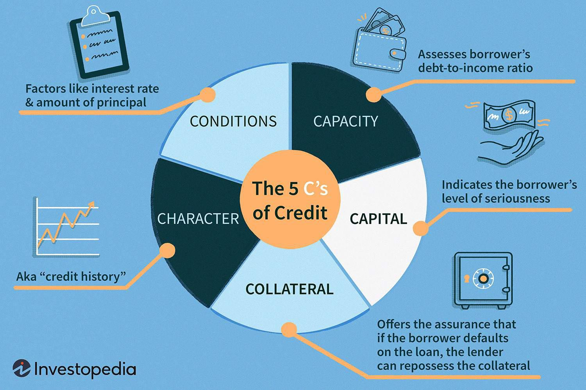

The financial industry continues to transform with the integration of innovative strategies and technologies. Amongst the areas drawing substantial focus are investment strategies shaped by financial factors, the significant role of credit cycles, and the emergence of algorithmic trading. These components together are reshaping the landscape of modern investing and trading decisions.

Comprehending credit cycles and financial factors is essential for investors aiming to make well-informed decisions. Financial factors such as interest rates, inflation, and various economic indicators profoundly influence market conditions and investment outcomes. Recognizing these elements is vital as they dictate borrowing costs and can significantly sway investment returns.



On the other hand, credit cycles, characterized by alternating periods of easy and restrictive access to credit, align closely with economic expansions and contractions. These cycles impact market liquidity and the availability of capital, offering insightful signals for potential market shifts.

Algorithmic trading represents yet another transformative force within the financial markets. By harnessing the power to process immense data volumes and executing trades rapidly—far beyond human capabilities—algorithmic trading enhances precision and efficiency. It removes emotional biases from trading and enables the execution of complex strategies through automation, thus revolutionizing trading activities.

Together, these aspects illuminate how the financial world amalgamates to forge investment strategies suited for today's intricate economic environment. The interplay of financial factors, credit cycles, and algorithmic trading forms a comprehensive framework for modern investors, enabling them to navigate the swiftly changing conditions of global markets.

## Table of Contents

## Key Financial Factors in Investing

Financial factors such as interest rates, inflation, and economic indicators are fundamental in guiding investment decisions. These variables not only influence market dynamics but also directly affect the cost of borrowing and potential returns on investments.

Interest rates are a critical determinant of investment viability, impacting both borrowing costs and the income generated from interest-bearing assets. When interest rates rise, borrowing becomes more expensive, reducing corporate profits due and potentially slowing economic growth. Conversely, higher rates typically lead to increased yields on bonds, attracting investors seeking stable returns. A lower [interest rate](/wiki/interest-rate-trading-strategies) environment makes borrowing cheaper, stimulating economic activity and often boosting stock prices due to lower discount rates applied to future earnings.

Inflation, another vital financial [factor](/wiki/factor-investing), erodes the purchasing power of money over time. Understanding inflation trends is crucial for investors, as inflation influences real return rates on investments. For example, nominal returns on stocks or bonds may appear attractive; however, once adjusted for inflation, the actual gains could be significantly lower. Consequently, investors often seek assets that offer inflation protection, such as real estate or Treasury Inflation-Protected Securities (TIPS), to preserve their wealth.

Economic indicators like Gross Domestic Product (GDP), unemployment rates, and consumer confidence indices provide insight into the health of an economy. These metrics help investors assess the current economic climate and anticipate future market conditions. A growing GDP indicates robust economic conditions and often leads to increased corporate earnings, potentially driving stock prices up. Conversely, high unemployment rates may signal economic distress, influencing market sentiment and investment strategies.

Incorporating these financial factors into investment analysis allows investors to align their strategies with prevailing economic conditions. By understanding and anticipating changes in interest rates, inflation, and economic indicators, investors can adjust their portfolios to optimize returns and manage risks effectively. Through a comprehensive analysis of these elements, investors gain valuable insights into market movements, enabling them to make informed investment choices.

### Example Python Code:

Below is an example of how you might use a basic Python script to analyze the relationship between interest rates and bond prices, a common consideration for investors:

```python
def bond_price(face_value, market_rate, years):
    """
    Calculate the price of a bond given its face value, 
    market interest rate, and the number of years until maturity.

    :param face_value: The bond's face value
    :param market_rate: The market interest rate (e.g., 0.05 for 5%)
    :param years: The number of years until the bond matures
    :return: The calculated price of the bond
    """
    price = face_value / (1 + market_rate) ** years
    return price

# Example usage
face_value = 1000
market_rate = 0.05
years = 10

calculated_price = bond_price(face_value, market_rate, years)
print(f"The bond price is: ${calculated_price:.2f}")
```

This illustrates how interest rate fluctuations impact bond pricing. As interest rates rise, the present value of a bond's future cash flows falls, leading to a decrease in its market price. Understanding such relationships is vital for developing informed investment strategies.

## Understanding Credit Cycles

Credit cycles are intrinsic to the financial environment, characterized by alternating phases that reflect the ease or difficulty of accessing credit in an economy. These phases typically correspond with broader economic cycles of expansion and contraction. During periods of economic expansion, credit is generally more accessible as lenders are more willing to extend credit, driven by low-interest rates and optimistic economic forecasts. Conversely, during economic contraction, credit conditions tighten as lenders become more cautious, influenced by rising interest rates and potential risks of default.

The impact of credit cycles on market [liquidity](/wiki/liquidity-risk-premium) is considerable. In expansion phases, increased credit availability often spurs economic activity, leading to higher liquidity in the financial markets. Businesses can obtain financing more easily, which they use for expansion, investment, or other growth opportunities. This increased economic activity generally leads to a rise in asset prices, boosting investor confidence and market participation.

In contraction phases, however, the reduced credit availability can constrain economic activity. Businesses may face difficulties in securing necessary financing, leading to delayed expansion plans or reduction of operations. This can result in decreased liquidity in financial markets, leading to lower asset prices and investor apprehension.

Understanding credit cycles allows investors to strategically position themselves in alignment with these economic indicators. During credit expansions, investors might pursue growth-oriented investments, taking advantage of rising markets and accessible capital. Conversely, during contractions, a more defensive investment strategy may be prudent, focusing on value preservation and risk management.

The integration of credit cycles with broader economic cycles is crucial for comprehensive investment analysis. While credit cycles are primarily influenced by monetary policy and financial regulations, they are also connected to fiscal policies and global economic conditions. For instance, government interventions such as stimulus packages during an economic downturn can influence the credit cycle by providing alternative liquidity sources. Likewise, global economic conditions, such as trade dynamics and geopolitical events, can impact the flow of credit across borders, affecting domestic credit cycles.

Investors should stay informed about the stages of the credit cycle to optimize their investment strategies. By understanding the relationship between credit availability and economic conditions, they can better anticipate market dynamics and adjust their investment portfolios accordingly. This involves not just tracking macroeconomic indicators but also analyzing the policies of central banks and financial institutions that directly influence credit availability.

In conclusion, a comprehensive grasp of credit cycles and their integration with economic cycles can significantly enhance an investor’s decision-making process. By acknowledging these cycles, investors can make informed choices to utilize opportunities during economic upswings and mitigate risks during downturns, thereby ensuring a more resilient investment portfolio.

## The Role of Algorithmic Trading

Algorithmic trading leverages technological advancements to execute trades via computer programs, following predefined algorithms designed to capitalize on market efficiencies. This approach brings significant precision and efficiency to trading operations. At its core, [algorithmic trading](/wiki/algorithmic-trading) minimizes the emotional biases that can influence human traders, thus facilitating more objective trading decisions.

One of the primary advantages of algorithmic trading is its ability to enhance market liquidity. By swiftly matching buy and sell orders, algorithms can reduce the bid-ask spread, which lowers trading costs and benefits market participants. The rapid execution of trades is another critical feature. Algorithms can process vast amounts of data in real-time, executing trades far quicker than any human trader could. This capability is particularly advantageous in high-frequency trading ([HFT](/wiki/high-frequency-trading-strategies)), where opportunities must be seized in fractions of a second.

The automation offered by algorithmic trading enables the implementation of complex strategies with minimal manual intervention. Traders can deploy algorithms that scan global markets, analyze trends, and execute orders without human input, allowing for continuous market engagement. Python, a popular language in this domain, can be utilized to develop such algorithms. For example, a simple moving average crossover strategy can be implemented in Python as follows:

```python
import numpy as np
import pandas as pd

# Sample data
data = pd.Series([1, 2, 3, 4, 5, 6, 7, 8, 9, 10])

# Calculate moving averages
short_window = 2
long_window = 4
signals = pd.DataFrame(index=data.index)
signals['short_mavg'] = data.rolling(window=short_window, min_periods=1).mean()
signals['long_mavg'] = data.rolling(window=long_window, min_periods=1).mean()

# Generate trading signals
signals['signal'] = 0
signals['signal'][short_window:] = np.where(signals['short_mavg'][short_window:] > signals['long_mavg'][short_window:], 1.0, 0.0)

print(signals)
```

Despite its many advantages, algorithmic trading presents several challenges. The reliance on technology makes traders vulnerable to technical failures, such as server breakdowns or software bugs. These issues can result in significant losses if not quickly addressed. Additionally, the same mechanisms that allow for rapid executions can also lead to increased market [volatility](/wiki/volatility-trading-strategies). Flash crashes, as witnessed in events where automated trading led to drastic, albeit brief, market drops, highlight these vulnerabilities.

In summary, algorithmic trading stands as a transformative influence in modern financial markets, offering precision, efficiency, and the potential for substantial trading gains. However, its inherent risks and challenges must be understood and mitigated to fully exploit its advantages.

## Integrating Financial Factors, Credit Cycles, and Algorithmic Trading

The integration of financial factor analysis, credit cycles, and algorithmic trading creates a multi-faceted approach to modern investing. This convergence enables investors to harness extensive datasets, optimizing their strategies according to existing financial conditions. By employing algorithms, traders can make decisions based on real-time analysis of economic indicators, interest rates, and inflation metrics, streamlining their approach to market fluctuations.

Incorporating credit cycles into financial strategies allows investors to better anticipate periods of credit expansion or contraction. For instance, during a phase of credit expansion, greater access to borrowing can lead to increased investment opportunities, potentially driving market growth. Conversely, understanding the onset of credit contraction phases can help investors adopt defensive strategies to protect their portfolios from downturns.

Algorithmic trading enhances this process by executing trades with high precision and speed, capitalizing on the slightest market shifts. Through automated systems, investors can engage in high-frequency trading and deploy advanced quantitative strategies that adapt to the dynamic financial landscape. This method reduces reliance on human intuition, thus eliminating emotional biases that can skew trading outcomes.

Consider an example where an investor utilizes an algorithmic trading system that integrates both macroeconomic data and credit cycle analysis. By feeding the algorithm with current interest rate trends, inflation data, and credit availability information, the system can dynamically adjust the investment portfolio. Suppose a decrease in interest rates indicates a forthcoming credit expansion; the algorithm could reallocate assets to sectors historically benefitting from increased credit availability, such as technology or consumer goods. Moreover, during anticipated credit tightening, the system might shift focus to defensive investments like utilities or bonds.

Python can be instrumental in this process, offering robust libraries for financial data analysis. A simple example using Python and libraries like `pandas` and `numpy` could involve ingesting economic data and applying a basic strategy algorithm:

```python
import pandas as pd
import numpy as np

# Load financial datasets
interest_rates = pd.read_csv('interest_rates.csv')
inflation_data = pd.read_csv('inflation.csv')

# Basic algorithm for adjusting portfolio based on credit cycle indicators
def adjust_portfolio(interest_rate, inflation):
    if interest_rate < 1.5 and inflation < 2.0:
        return "Increase stocks, reduce bonds"
    elif interest_rate >= 1.5 and inflation >= 2.0:
        return "Increase bonds, reduce stocks"
    else:
        return "Maintain current allocation"

# Applying the algorithm to the data
decisions = interest_rates['rate'].combine(inflation_data['inflation'], adjust_portfolio)

print(decisions)
```

In integrating these elements, investors are better equipped to optimize their portfolios, achieving a holistic investment strategy that leverages the strengths of financial data analysis, credit cycle interpretation, and algorithmic precision. This synergy not only supports timely decision-making but also ensures sustained profitability in the ever-evolving financial markets.

## Conclusion

Investors and traders today are faced with a complex environment heavily influenced by financial factors, the cyclical nature of credit, and sophisticated technological developments such as algorithmic trading. Each of these components substantially affects how one should approach investing and trading strategies. Understanding the intricate relationships between these factors is critical for developing strategies that can effectively navigate market dynamics and optimize investment returns.

Financial factors, including interest rates, inflation, and key economic indicators, are pivotal in dictating the economic landscape, influencing everything from borrowing costs to investment returns. Meanwhile, the credit cycle, characterized by periods of expansion and contraction, impacts market liquidity and the availability of capital. These credit cycles, when properly understood, can provide crucial insights into potential market turning points, offering investors opportunities to either capitalize on expansions or hedge against contractions.

Algorithmic trading, a technological advancement, allows for unparalleled precision and efficiency in executing trades. By leveraging algorithms, traders can process large datasets rapidly and implement complex trading strategies that are adjusted in real-time based on prevailing financial and credit conditions. However, this reliance on technology introduces challenges like technical disruptions and increased volatility, as seen in events such as flash crashes.

To succeed in today's financial markets, it is essential to integrate insights from financial factors, credit cycles, and algorithmic trading. This holistic approach allows for more informed decision-making processes and the capacity to timely adjust strategies in alignment with current market conditions. As the financial industry continues its trajectory of rapid evolution, continuously staying informed and adapting to these advancements will be vital for seizing opportunities and managing associated risks. Ultimately, those who can blend these elements into a coherent investment strategy will set themselves apart in the dynamic landscape of modern finance.

## References & Further Reading

[1]: Bergstra, J., Bardenet, R., Bengio, Y., & Kégl, B. (2011). ["Algorithms for Hyper-Parameter Optimization."](https://papers.nips.cc/paper/4443-algorithms-for-hyper-parameter-optimization) Advances in Neural Information Processing Systems 24.

[2]: ["Advances in Financial Machine Learning"](https://www.amazon.com/Advances-Financial-Machine-Learning-Marcos/dp/1119482089) by Marcos Lopez de Prado

[3]: ["Evidence-Based Technical Analysis: Applying the Scientific Method and Statistical Inference to Trading Signals"](https://www.amazon.com/Evidence-Based-Technical-Analysis-Scientific-Statistical/dp/0470008741) by David Aronson

[4]: ["Machine Learning for Algorithmic Trading"](https://github.com/PacktPublishing/Machine-Learning-for-Algorithmic-Trading-Second-Edition) by Stefan Jansen

[5]: ["Quantitative Trading: How to Build Your Own Algorithmic Trading Business"](https://www.amazon.com/Quantitative-Trading-Build-Algorithmic-Business/dp/1119800064) by Ernest P. Chan