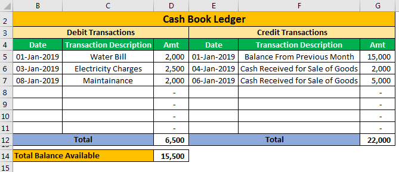

Understanding the balance sheet is fundamental to mastering the financial aspects of any business. A balance sheet is a critical financial statement that provides insights into a company's financial health by presenting its assets, liabilities, and equity at a specific point in time. Through a straightforward equation, Assets = Liabilities + Equity, the balance sheet offers a snapshot of a company's stability and potential profitability. In this era of rapid technological advancement, algorithmic trading has transformed the manner in which investors engage with financial markets, significantly affecting balance sheet analysis.

Algorithmic trading employs computer algorithms to automate trading decisions, executing orders at high speed and volume. This technological shift has introduced a new dimension to financial analysis, merging traditional balance sheet accounting with innovative, data-driven trading strategies. Investors now utilize complex mathematical models to navigate markets more effectively, which in turn influences how balance sheets are interpreted and managed. The convergence of these elements underscores a shift towards more sophisticated and dynamic financial strategies.



This article examines the intersection of balance sheet accounting and algorithmic trading, including an exploration of credit and debit mechanisms that form the foundation of accounting practices. By understanding how these components interact, businesses and investors can enhance their financial strategies, adapting to both opportunities and challenges within the evolving financial landscape. Recognizing these connections is essential for staying competitive and maintaining robust financial health in today's digital age.

## Table of Contents

## Understanding Balance Sheets

A balance sheet is a fundamental financial statement that provides a definitive snapshot of a company's financial health at a given moment. This document is pivotal for evaluating a company’s stability and forecasting its potential profitability. It is structured around three primary components: assets, liabilities, and shareholders' equity. Each component plays a distinct role in portraying the comprehensive financial status of an organization.

Assets represent everything the company owns and can include tangible items like property and equipment, as well as intangible ones such as patents and trademarks. These assets are crucial, as they are utilized for operational activities and can be converted into cash when necessary. 

Liabilities, on the other hand, are the financial obligations that a company owes to external parties. These can range from short-term liabilities such as accounts payable and accrued expenses to long-term liabilities such as bonds payable and mortgages. Managing liabilities effectively is key to sustaining financial health and ensuring the company can meet its obligations as they arise.

Shareholders' equity is the residual interest in the assets of the company after deducting liabilities. It represents the ownership stake that shareholders have in the company. Equity can be further broken down into components like common stock, retained earnings, and additional paid-in capital, each reflecting a piece of ownership or profit retained within the business.

The relationship among these components is governed by the fundamental accounting equation:
$$
\text{Assets} = \text{Liabilities} + \text{Equity}
$$
This equation must always balance, ensuring that all of a company's resources are accounted for and that the claims on those resources are transparently reported. This balance maintains the integrity of the financial statement and provides stakeholders with an accurate depiction of the business's financial standing.

For analysts and investors, understanding the balance sheet is essential as it allows them to assess a company's [liquidity](/wiki/liquidity-risk-premium), operational efficiency, and profitability potential. Analyzing how assets are funded—whether through liabilities or equity—offers insight into the company’s financial strategy and risk management approach. Thus, the balance sheet is indispensable for making informed investment decisions and strategizing future financial planning.

## The Role of Credit and Debit in Accounting

Credit and debit are foundational elements in the field of accounting, serving as the primary method for recording and tracking financial transactions. At their core, these terms help define how various transactions affect a company's balance sheet.

In accounting, a debit (abbreviated as "Dr") is an entry recorded on the left side of an account within a company's [books](/wiki/algo-trading-books). This entry typically signifies an increase in an asset account or a decrease in a liability or equity account. For instance, when a company purchases equipment, the value of the equipment increases its assets, which is reflected as a debit entry in the asset account. In contrast, capitalizing on the accounting equation, debit entries in liability accounts, such as loans payable, represent payments made toward the balance, thus decreasing liabilities.

Conversely, a credit (abbreviated as "Cr") is an entry recorded on the right side of an account. This entry generally indicates a decrease in an asset or an increase in a liability or equity account. For example, when a company takes a loan, the money received increases its cash assets. However, this transaction also increases the company's liabilities, as it is now obligated to repay the loan, shown as a credit entry in the liabilities account.

Understanding credit and debit mechanisms is essential for interpreting balance sheets accurately. Balance sheets, guided by the fundamental accounting equation $\text{Assets} = \text{Liabilities} + \text{Equity}$, rely on these entries to reflect changes in financial position. For instance, when a debit is applied to an expense account, it reduces the company's net income by increasing expenses, although it simultaneously signals growth in that area of business expenditure.

To achieve precise financial analysis and decision-making, it is crucial to grasp how credits and debits influence various accounts. Misinterpretation of these entries can lead to incorrect financial assumptions and decisions. Additionally, knowledge of how these entries affect accounts underpins strategic planning for asset management, liability reduction, and equity optimization. Understanding the nuances of credit and debit is pivotal for making informed economic choices, maintaining the financial health of a business, and fostering transparency in financial reporting.

 to Algorithmic Trading

Algorithmic trading represents a modern advancement in financial markets, utilizing computer algorithms to automate trading processes. This approach enables the execution of orders at remarkable speed and [volume](/wiki/volume-trading-strategy), distinctively enhancing market efficiency. By leveraging complex mathematical models, [algorithmic trading](/wiki/algorithmic-trading) provides traders with a significant competitive advantage.

The foundation of algorithmic trading rests on predefined sets of rules that determine trading decisions. These rules can be based on various criteria such as timing, price, quantity, or any mathematical model. Algorithms can analyze multiple market conditions simultaneously, making real-time trading more efficient.

The strategies encompassed by algorithmic trading can be broadly categorized into several types:

1. **Trend-Following Strategies**: These are based on algorithms designed to exploit the momentum of asset prices. Such strategies generally use technical indicators like moving averages to determine the direction of market trends, leading to decisions aimed at capitalizing on these trends.

2. **Arbitrage Strategies**: Algorithmic trading enables the effortless execution of arbitrage opportunities. These strategies aim to profit from price discrepancies across different markets or instruments by simultaneously buying and selling assets.

3. **Market-Making Strategies**: Algorithms used in this strategy quote both buy and sell prices, hoping to profit from the spread between them. These algorithms continuously adjust orders in response to market conditions, providing liquidity to the market.

4. **Liquidity Detection**: Algorithms can also identify hidden liquidity in the market by assessing the buying and selling pressure, allowing traders to execute large orders without significantly impacting the stock price.

In addition to the types of strategies mentioned, the effectiveness of algorithmic trading lies in its precision and efficiency. These attributes allow traders to minimize manual intervention and reduce transaction costs. Furthermore, algorithmic trading has a profound influence on financial markets and can greatly impact balance sheet analysis by altering how assets and liabilities are accounted for due to rapid trading activities.

In summary, algorithmic trading revolutionizes market operations with its speed, precision, and comprehensive strategies, providing substantial impacts on financial markets and offering deep insights for balance sheet management.

## Impact of Algo Trading on Balance Sheet Management

Algorithmic trading has significantly altered the landscape of financial reporting and balance sheet management by introducing unprecedented speed and volume in transaction processing. This technological advancement impacts how assets and liabilities are recorded, demanding real-time adjustments to ensure accurate financial reporting. The rapid execution of trades facilitated by algorithms can lead to frequent changes in asset valuations and liability positions, thereby making traditional end-of-period reporting less effective.

Traders utilize algorithmic tools to optimize portfolio strategies, which contributes to more dynamic and responsive balance sheets. Algorithms help in the reallocation of assets by continuously analyzing market data to identify profitable trading opportunities. This capability enables traders to adjust positions quickly, ensuring that portfolios remain aligned with strategic objectives. Consequently, balance sheets reflect a more accurate depiction of a firm's financial position, accounting for real-time changes in asset allocation and liability management.

Moreover, advanced algorithms possess predictive capabilities that allow companies to anticipate market movements and make proactive adjustments to their financial strategies. By incorporating [machine learning](/wiki/machine-learning) and data analytics, these algorithms analyze historical and real-time data to recognize patterns and predict future market trends. For example, a company might use Python to implement a simple linear regression model to forecast price movements:

```python
import numpy as np
from sklearn.linear_model import LinearRegression

# Example dataset: historical price and time
price_data = np.array([100, 102, 104, 103, 105, 107])
time_data = np.arange(len(price_data)).reshape(-1, 1) # Reshaping for sklearn

# Linear regression model
model = LinearRegression()
model.fit(time_data, price_data)

# Predicting future prices
future_time = np.array([[6], [7], [8]])
predicted_price = model.predict(future_time)

print(predicted_price)
```

This proactive approach allows companies to adjust their balance sheets by considering anticipated market changes, safeguarding resources, enhancing liquidity, and potentially improving financial performance. By effectively employing algorithmic trading strategies, firms are better positioned to manage risks, capitalize on opportunities, and maintain a competitive edge in fast-paced financial markets.

## Balancing Risks and Rewards

Algorithmic trading offers numerous advantages, including increased speed and efficiency in executing trades. However, it also introduces risks that must be carefully managed to ensure financial stability. One of the primary risks associated with algorithmic trading is heightened market [volatility](/wiki/volatility-trading-strategies). Algorithms can react instantaneously to market events, potentially amplifying price movements and creating erratic short-term fluctuations. System failures and errors in algorithmic design can also lead to unintended trading actions, resulting in financial losses.

To navigate these challenges, a profound understanding of credit and debit mechanisms within algorithmic strategies is essential. Credit refers to the addition of value to an account, while debit signifies a deduction. In the context of algorithmic trading, managing these entries accurately is crucial to identifying and mitigating potential financial exposures. A robust accounting system ensures that asset movements are precisely tracked, helping traders make informed decisions.

Investors must implement comprehensive risk management frameworks to strike a balance between the advantages of algorithmic trading and the inherent risks. These frameworks should encompass procedures for monitoring and controlling trading activities, as well as contingency plans for addressing unforeseen challenges like technological disruptions or unexpected market conditions. By employing sophisticated risk assessment tools and setting appropriate thresholds, traders can protect assets while maximizing returns.

When managed effectively, algorithmic trading can enhance balance sheet performance by optimizing asset allocation and improving liquidity management. Algorithms that are designed to predict market movements can aid companies in reallocating resources swiftly, thereby leveraging opportunities for financial gain. The ability to adjust positions dynamically allows firms to maintain stronger financial positions, even amidst volatile market conditions.

To conclude, while algorithmic trading introduces opportunities for significant returns, it equally necessitates rigorous risk management to safeguard financial assets. Proper understanding and application of credit and debit mechanisms, coupled with a solid risk management framework, can enable investors to capitalize on algorithmic tools while maintaining balance sheet integrity.

## Future Trends in Balance Sheet Accounting and Algo Trading

As technology progresses, the landscape of balance sheet accounting and algorithmic trading is expected to undergo significant transformations. One of the major trends is the integration of [artificial intelligence](/wiki/ai-artificial-intelligence) (AI) and machine learning into algorithmic trading. AI systems have the capacity to process vast amounts of data at incredible speeds, leading to more accurate predictions and optimized trading strategies. Machine learning, in particular, enables algorithms to learn from historical data and improve their decision-making processes over time. This refinement has the potential to significantly enhance balance sheet strategies by optimizing asset allocation and improving risk management.

Blockchain technology is poised to become a critical component of financial transaction recording, offering enhanced transparency and efficiency. With its decentralized and immutable ledger system, blockchain can significantly reduce the risk of errors and fraud in financial records. This transparency not only aids in the precision of balance sheets but also strengthens trust among stakeholders.

Moreover, the future is likely to usher in more sophisticated algorithms capable of adapting to fluctuating market conditions. The complexity and volatility of financial markets require dynamic algorithms that can respond in real-time to changes. The development of these advanced algorithms will facilitate better market predictions, allowing for prompt adjustments in financial strategies, thereby improving balance sheet performance.

To stay competitive, companies and traders must keep pace with these technological advancements. Proactively embracing AI, machine learning, and blockchain can provide a competitive edge. By doing so, organizations can ensure they are leveraging state-of-the-art tools to refine their financial strategies, optimize their balance sheets, and navigate the complexities of modern markets efficiently.

In conclusion, mastering these future trends will be essential for any entity aiming to improve its financial position and strategy. The ongoing development in these areas will likely bring both challenges and opportunities, making it imperative for businesses to remain agile and forward-thinking.

## Conclusion

The convergence of balance sheet accounting, credit and debit management, and algorithmic trading is significantly transforming modern financial landscapes. As businesses and investors navigate this evolving environment, adapting to these changes becomes essential to maintaining competitiveness and ensuring financial stability. Mastery of these interconnected concepts allows stakeholders to fully leverage the potential of algorithmic trading tools, enhancing their market strategies and decision-making processes.

Algorithmic trading, with its reliance on sophisticated algorithms capable of executing high-speed and high-volume transactions, necessitates a deep understanding of fundamental accounting principles like credit and debit. This knowledge is crucial for accurately capturing the financial implications of rapid trading activities on a company’s balance sheet. By aligning algorithmic strategies with robust credit and debit management, investors can optimize their portfolio and mitigate financial exposure.

The disciplines of accounting and financial technology are continually evolving, offering both new opportunities and challenges. The integration of artificial intelligence and machine learning into algorithmic trading is anticipated to further refine balance sheet strategies, offering unprecedented accuracy in financial forecasting and risk assessment. Blockchain technology is also poised to enhance transparency and efficiency in financial transactions, potentially revolutionizing the way assets and liabilities are recorded.

For investors and businesses, keeping abreast of these advancements is not just advantageous but necessary. By embracing these innovations, they can improve their financial strategies, achieve greater precision in prediction and reporting, and secure a competitive edge in an ever-changing financial market. The future undoubtedly holds more complex and adaptive financial tools, requiring both expertise and vigilance to harness their benefits while managing associated risks efficiently.

## References & Further Reading

[1]: Bergstra, J., Bardenet, R., Bengio, Y., & Kégl, B. (2011). ["Algorithms for Hyper-Parameter Optimization."](https://papers.nips.cc/paper/4443-algorithms-for-hyper-parameter-optimization) Advances in Neural Information Processing Systems 24.

[2]: ["Advances in Financial Machine Learning"](https://www.amazon.com/Advances-Financial-Machine-Learning-Marcos/dp/1119482089) by Marcos Lopez de Prado

[3]: ["Evidence-Based Technical Analysis: Applying the Scientific Method and Statistical Inference to Trading Signals"](https://www.amazon.com/Evidence-Based-Technical-Analysis-Scientific-Statistical/dp/0470008741) by David Aronson

[4]: ["Machine Learning for Algorithmic Trading"](https://github.com/stefan-jansen/machine-learning-for-trading) by Stefan Jansen

[5]: ["Quantitative Trading: How to Build Your Own Algorithmic Trading Business"](https://www.amazon.com/Quantitative-Trading-Build-Algorithmic-Business/dp/1119800064) by Ernest P. Chan