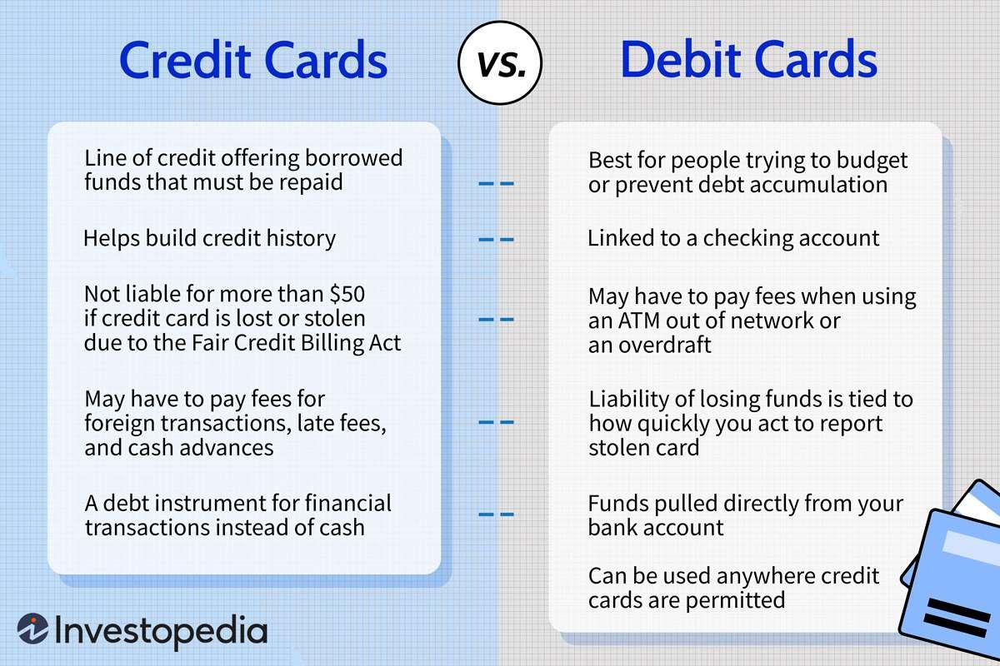

In the fast-paced world of financial markets, where decisions are made in fractions of a second, the quest for a competitive edge is crucial for successful trading. Traders, fueled by the relentless drive to outperform market benchmarks, are constantly seeking new sources of data that can reveal hidden patterns and provide insights necessary for informed investment decisions. With traditional financial metrics offering only a partial view, a captivating trend has emerged in algorithmic trading: the integration of alternative data sources.

Alternative data encompasses a broad spectrum of non-traditional datasets, providing novel perspectives and insights beyond conventional financial analyses. Among these, credit and debit card transaction data have garnered notable attention for their ability to provide near real-time insights into consumer behavior and spending patterns. This type of data can reveal shifts in consumer sentiment and economic activity long before they are reflected in quarterly earnings reports or official statistics. 



The integration of credit/debit card data in algorithmic trading marks a significant departure from traditional methods, promising a granular view of market dynamics by leveraging consumer transactions at a detailed level. This data, with its capacity to indicate short-term inflection points and broader economic shifts, is increasingly being used to predict market movements and strategize trades.

This article will explore the role, sources, benefits, and impact of credit/debit card alternative data in algorithmic trading. We aim to provide a comprehensive analysis of whether this data truly transforms algorithmic trading or represents an elusive advantage for traders seeking to outpace their competitors. As the financial industry continues to evolve, the integration of alternative data sources like credit/debit card transactions is shaping the future of trading strategies, offering both unprecedented opportunities and significant challenges.

## Table of Contents

## Understanding Alternative Data in Trading

Alternative data encompasses non-traditional datasets that provide novel perspectives and insights for financial analysis that are absent from conventional sources. These datasets are mined from a variety of channels, such as social media, web traffic, satellite imagery, and notably, credit/debit card transactions. By tapping into these diverse sources, [alternative data](/wiki/best-alternative-data) can furnish timely, granular insights into consumer behavior, economic activity, and market trends—elements vital for [algorithmic trading](/wiki/algorithmic-trading).

Social media data, for instance, can capture real-time shifts in public sentiment, which might foretell market movements following high-profile events or announcements. Web traffic data, including metrics like page visits and search trends, can spotlight burgeoning consumer interest in particular products or sectors, potentially anticipating revenue changes before they are reflected in quarterly earnings reports. Satellite images can provide unique visibility into physical commodities, such as estimating oil inventories by analyzing shadow lengths of storage tanks, or tracking agricultural yields and their supply chain impacts.

The integration of credit and debit card transaction data allows for immediate tracking of consumer spending habits and merchant success. By analyzing these transactions, traders can detect emerging consumer trends and economic shifts earlier than they could with traditional economic indicators that might be delayed. For example, a surge in transactions at home improvement stores could presage an uptick in the housing sector.

Utilizing alternative data is crucial in identifying opportunities that traditional data might overlook or respond to less swiftly. Machine learning algorithms and predictive models can process these unconventional datasets to generate insights with the goal of achieving a competitive advantage. By incorporating these cutting-edge data streams, traders can be better positioned to gauge market sentiment and adjust their strategies more nimbly, improving their chances of capitalizing on emerging trends and untapped market opportunities.

## Role of Credit/Debit Card Data as Alternative Data

Credit and debit card transaction data provide critical real-time insights for traders by revealing consumer spending patterns and merchant performance. This type of alternative data has become increasingly valuable in algorithmic trading, providing a granular view of economic activities that traditional financial metrics often overlook.

By analyzing credit/debit card data, traders can monitor economic activities and consumer trends with precision. This real-time data enables the identification of sectors that might outperform or underperform, offering substantial advantages over conventional data sources that may arrive with a delay. For instance, during periods of economic uncertainty or when anticipating economic cycles, this data helps traders predict shifts in consumer preferences and spending, allowing for timely strategic adjustments in portfolio allocations.

The utility of this data becomes particularly evident during earnings seasons. Before official financial disclosures, credit/debit card data can reveal a company's performance by indicating its sales volumes and customer base behavior. This predictive capability allows traders to adjust their positions ahead of time, potentially leading to significant alpha generation. For example, if card data shows a surge in transactions at a retail chain, it is a strong indicator of above-expectation earnings, prompting traders to revisit their market positions related to that entity.

Moreover, transaction data aids in identifying inflection points in consumer behavior that can signal broader economic shifts. Such inflection points may include changes in discretionary spending, shifts from in-person to online shopping, or significant variations in expenses due to macroeconomic factors, such as changes in interest rates or consumer confidence. Using algorithms to scan for these changes, traders can detect early warning signs of economic contractions or expansions, allowing them to realign their strategies accordingly.

Thus, credit/debit card data not only enhances the granularity and timeliness of market insights but also refines the decision-making processes in algorithmic trading, providing traders with a competitive edge over those relying solely on traditional financial data.

## Applications in Algorithmic Trading

Algorithmic trading leverages a variety of data sources to enhance the precision and effectiveness of trading strategies, and credit/debit card data offers a distinctive edge in this context. This data provides traders with granular insights on consumer behavior by detailing spending patterns, which can be used to build models predicting stock movements and broader market dynamics.

**Integration into Algorithms:**

Credit/debit card transaction data is incorporated into algorithms to identify anomalies and trends. These algorithms analyze spending at different merchants, enabling them to quantify the financial health of companies in real time. For instance, if data indicates increased transactions at a specific retailer over multiple months, algorithms can flag this trend as a potential precursor to stock price appreciation, possibly before quarterly earnings reports reveal similar trends. 

**Predictive Analytics Models:**

Utilizing credit/debit card data, traders can create predictive analytics models that possess a temporal advantage over traditional data methods. The models capitalize on the timeliness and specificity of this data source. Consider a model analyzing trends from transaction data to predict retail sector performance; traders can adjust positions based on anticipated swings ahead of traditional market indicators, gaining early insight into market movements.

Python code example for analyzing transaction growth:

```python
import pandas as pd

# Example dataset of transactions
data = {
    'Month': ['2023-01', '2023-02', '2023-03', '2023-04'],
    'Transactions': [1000, 1500, 1800, 2400]
}

# Loading the data into a DataFrame
df = pd.DataFrame(data)

# Calculating the percentage growth in transactions month-over-month
df['Transaction_Growth'] = df['Transactions'].pct_change() * 100

print(df)
```

This code snippet calculates month-over-month growth rates in transactions, which could be an indicator of increased consumer spending and an early predictor of company performance during earnings.

**Real-Time Consumer Sentiment:**

Beyond predicting stock prices, real-time transaction data offers insights into consumer sentiment and spending behavior. A decline in transaction [volume](/wiki/volume-trading-strategy) across a sector can suggest a negative shift in consumer confidence, prompting algorithmic traders to adjust strategies. These real-time insights allow for dynamic strategy updates, as opposed to relying solely on static quarterly or annual reports.

In summary, the strategic use of credit/debit card data in algorithmic trading fosters the development of agile trading models that are capable of predicting market changes with enhanced accuracy and speed. This approach not only capitalizes on early indicators of market shifts but also reflects consumer sentiment, thereby offering a comprehensive toolkit for traders seeking a competitive edge in volatile markets.

## Challenges and Considerations

Using credit and debit card data as alternative data in algorithmic trading presents several challenges and considerations that must be addressed to use such information responsibly and effectively.

Data privacy and ethical concerns are paramount when it comes to utilizing credit and debit card data, as it encompasses sensitive consumer information. The handling of this data necessitates stringent privacy safeguards and compliance with relevant legal frameworks, such as the General Data Protection Regulation (GDPR) in the European Union, which mandates the protection of individuals' personal data and privacy. Ethical considerations demand that data is used in a manner that respects consumer confidentiality and that any analysis avoids infringing on personal privacy rights.

The accuracy and reliability of card transaction data are critical for its effective application in trading strategies. The source and aggregation methods of the data are crucial, as they determine the dataset's integrity. Thorough vetting processes are required to ensure that data is accurate, unbiased, and free from inconsistencies. The challenge lies in obtaining high-quality data that accurately reflects consumer behavior without distortion due to factors like sampling bias or incomplete datasets.

Implementing credit and debit card data into trading strategies demands substantial computational resources and expertise. The sheer volume and complexity of transaction data require advanced data processing systems capable of handling big data analytics. Expertise in data science, along with a deep understanding of financial markets, is essential for developing sophisticated models that can effectively interpret this data. This often involves using complex statistical techniques and [machine learning](/wiki/machine-learning) algorithms for pattern recognition and predictive analytics.

Regulatory environments significantly influence how alternative data, such as credit and debit card information, can be utilized in trading activities. Regulations may vary by jurisdiction, affecting data collection, storage, and usage. Traders must navigate these regulatory landscapes to ensure compliance, which can impact the feasibility and scalability of incorporating card data into trading models. Compliance with financial regulations and privacy laws ensures that data is used legally and transparently.

In conclusion, while credit and debit card data offer substantial advantages for algorithmic trading, leveraging this data must be approached with an awareness of the associated challenges. Balancing the technical, ethical, and regulatory aspects plays a critical role in utilizing such data responsibly and effectively, ultimately aiding in maintaining trust and integrity in financial markets.

## Conclusion

Credit/debit card alternative data represents a transformative development in the field of algorithmic trading, providing unique insights that traditional data sources cannot offer. This data allows traders to capture real-time consumer behavior, economic trends, and market dynamics, thereby offering a competitive edge in making investment decisions. However, the integration of such data into trading strategies comes with its own set of challenges, particularly concerning ethical, technical, and regulatory factors.

Ethically, the handling of credit/debit card data necessitates stringent adherence to data privacy norms, as it involves sensitive consumer information. Traders and firms must establish robust protocols for data anonymization and consent to mitigate privacy risks. Technically, the incorporation of alternative data demands advanced computational capabilities and expert knowledge in data science and financial markets. Proper data aggregation and analysis are critical for ensuring the accuracy and reliability of insights drawn from this data.

Furthermore, the regulatory landscape may evolve, influencing how this alternative data can be utilized in trading activities. Firms need to stay updated with regulatory requirements to avoid compliance issues and ensure that their practices align with legal standards.

As more players in the investment industry begin to explore the potential of alternative data, its role in securing a competitive advantage is likely to intensify. To capitalize on this emerging trend, traders and financial institutions must remain adaptable, taking a proactive approach to integrating alternative data responsibly. This involves continuously evaluating their data strategies to balance innovation with ethical and regulatory accountability, thus safeguarding their operations and enhancing their performance in the financial markets.

## References & Further Reading

[1]: ["Alternative Data in Finance: The Emergence of Data-Driven Investing"](https://onlinelibrary.wiley.com/doi/full/10.1111/jofi.13323) by CFA Institute.

[2]: Louca, C., & Miranda, R. (2019). ["Harnessing Alternative Data to Improve Investment Decisions."](https://papers.ssrn.com/sol3/papers.cfm?abstract_id=3380835) CFA Institute.

[3]: Kearns, M., & Nevmyvaka, Y. (2013). ["Machine Learning for Market Microstructure and High Frequency Trading."](https://www.cis.upenn.edu/~mkearns/papers/KearnsNevmyvakaHFTRiskBooks.pdf) University of Pennsylvania.

[4]: ["Alternative Data: From Hype to Reality"](https://www.ncbi.nlm.nih.gov/pmc/articles/PMC6109989/) by Boston Consulting Group.

[5]: ["Regulating Financial Algorithms: Harnessing the Power of Intelligent Machines"](https://www.sciencedirect.com/science/article/pii/S2214635021001210) Michigan Journal of Law Reform, Ben Green (2018).