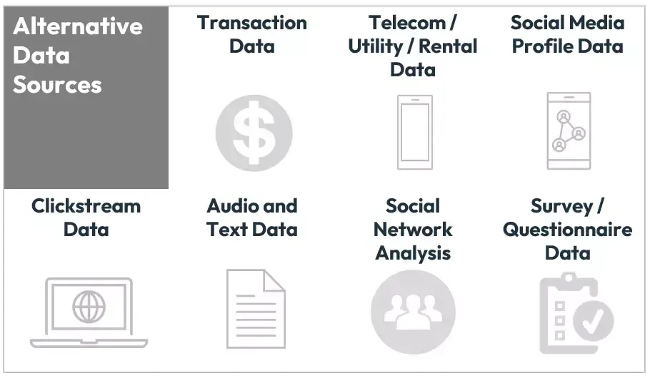

## Table of Contents

## What are credit/debit card alternative data?

Credit/debit card alternative data refers to information that comes from sources other than traditional credit and debit card transactions. This type of data can include things like mobile app usage, social media activity, and online shopping habits. By looking at this information, companies can learn more about people's spending habits and financial behaviors without directly using their card transaction data.

This alternative data is useful for businesses and financial institutions because it helps them understand their customers better. For example, if someone frequently uses a fitness app, a company might guess that they are interested in health and wellness products. This can help businesses make better decisions about what products to offer or how to market to their customers. It also helps them assess the creditworthiness of individuals who might not have a lot of traditional credit history.

## Why is alternative data important in the financial sector?

Alternative data is important in the financial sector because it helps companies learn more about people's habits and behaviors without using their regular credit and debit card information. This kind of data can come from things like how people use their phones, what they do on social media, or what they buy online. By looking at this information, businesses can get a better idea of what their customers like and how they spend their money.

This data is really helpful for making smart decisions. For example, if a company sees that someone often uses a fitness app, they might think that person likes health and wellness products. This can help businesses decide what to sell or how to advertise to their customers. It also helps them figure out if someone is good at paying back loans, even if they don't have a lot of traditional credit history. This makes the financial sector work better and helps companies serve their customers in a more personalized way.

## How can alternative data be used to assess creditworthiness?

Alternative data helps assess creditworthiness by looking at information that isn't from regular credit and debit card transactions. This can include things like how people use their phones, what they do on social media, and what they buy online. By studying this data, companies can see patterns in how people spend money and manage their finances. For example, if someone often pays their phone bill on time, it might show that they are good at managing regular payments, even if they don't have a long credit history.

This kind of data is really useful for people who might not have much traditional credit information. If someone doesn't have a credit card or a loan, it can be hard for banks to know if they are good at paying back money. But by looking at alternative data, like their history of paying utility bills or their online shopping habits, companies can get a better idea of their financial behavior. This helps banks make fairer decisions about who to lend money to and can help more people get the credit they need.

## What are the common sources of alternative data for credit/debit cards?

Alternative data for credit and debit cards comes from many different places. One common source is mobile phone data. This includes things like how often someone pays their phone bill on time, how they use apps, and even where they go based on their phone's location. Another source is social media activity. By looking at what people post, like, or share on social media, companies can learn about their interests and spending habits. Online shopping data is also a big source. This includes information about what people buy online, how often they shop, and how they pay for things.

Another important source of alternative data is utility bill payments. If someone regularly pays their electricity or water bill on time, it can show that they are good at managing regular payments. Rent payment history is also used. If someone always pays their rent on time, it can be a sign that they are responsible with money. Lastly, data from subscription services, like streaming platforms or gym memberships, can show how someone handles recurring payments. All these sources help companies understand a person's financial behavior without looking at their regular credit and debit card transactions.

## How does alternative data differ from traditional credit data?

Alternative data is different from traditional credit data because it comes from sources other than credit and debit card transactions. Traditional credit data includes things like how much money someone owes on their credit cards, if they pay their bills on time, and their history of taking out loans. This information is usually collected by credit bureaus and used to create a credit score that shows how good someone is at paying back money. 

On the other hand, alternative data can come from many different places, like how someone uses their phone, what they do on social media, or what they buy online. It might also include information about how someone pays their utility bills or rent. This kind of data helps companies understand more about a person's spending habits and financial behavior, even if they don't have a lot of traditional credit history. By looking at alternative data, businesses can make better decisions about who to lend money to and how to serve their customers.

## What are the benefits of using alternative data for credit scoring?

Using alternative data for credit scoring helps people who don't have a lot of traditional credit history. If someone doesn't have credit cards or loans, it can be hard for banks to know if they are good at paying back money. But by looking at alternative data, like how someone pays their phone bill or what they buy online, companies can see if they are responsible with money. This can help more people get the credit they need, even if they haven't used credit cards before.

Alternative data also helps companies understand their customers better. By looking at things like social media activity or how someone uses apps, businesses can learn about their interests and spending habits. This can help them make better decisions about what products to offer or how to advertise. Using alternative data makes the financial sector work better and helps companies serve their customers in a more personalized way.

## What are the challenges and risks associated with using alternative data?

Using alternative data can be tricky because it comes from many different places. This makes it hard to know if the data is correct and if it really shows what it's supposed to. For example, if someone pays their phone bill on time but is late on other bills, it might not give a full picture of their money habits. Also, different companies might use different kinds of alternative data, so it can be hard to compare people's credit scores fairly. This can lead to mistakes in deciding if someone should get a loan or not.

There are also big worries about privacy and keeping data safe. When companies use data from phones, social media, or online shopping, they are looking at very personal information. If this data gets into the wrong hands, it could hurt people. There are also rules about what data companies can use and how they can use it. If they don't follow these rules, they could get in trouble. So, while alternative data can help make better decisions, it also brings up important questions about how to protect people's privacy and keep their information safe.

## How can businesses collect and analyze alternative data effectively?

To collect alternative data effectively, businesses need to look at many different places where people leave digital footprints. This can include things like how people use their phones, what they post on social media, or what they buy online. Companies might use special software or work with data providers to gather this information. It's important to make sure the data is correct and comes from trustworthy sources. Businesses also need to follow rules about privacy and data protection to make sure they are collecting data in the right way.

Once the data is collected, analyzing it effectively means finding patterns and understanding what the data says about people's habits and behaviors. Companies can use tools like machine learning and data analytics to look through large amounts of data quickly. These tools can help find connections between different pieces of information, like seeing that someone who uses a fitness app a lot might be interested in health products. It's important to keep the analysis fair and to check the results to make sure they are accurate. By doing this, businesses can make better decisions about who to lend money to or how to serve their customers better.

## What are the regulatory considerations when using alternative data in credit decisions?

When businesses use alternative data to make credit decisions, they have to follow a lot of rules to make sure they are doing it the right way. These rules come from laws like the Fair Credit Reporting Act (FCRA) in the United States, which says companies need to be fair and clear about how they use data. They also need to make sure the data they use is correct and doesn't hurt people's privacy. If a business doesn't follow these rules, they could get in trouble and might have to pay fines.

Another important thing to think about is how using alternative data can affect different groups of people. Companies need to be careful that they are not treating some people unfairly because of their race, gender, or other personal details. This is called avoiding discrimination, and it's something that laws like the Equal Credit Opportunity Act (ECOA) focus on. By following these rules, businesses can use alternative data to make better credit decisions while still being fair and respecting people's rights.

## How can alternative data improve financial inclusion?

Alternative data can help more people get the money they need by looking at information that isn't just from credit cards or loans. If someone doesn't have a credit card or hasn't taken out a loan before, it can be hard for banks to know if they are good at paying back money. But by looking at other things, like how someone pays their phone bill or what they buy online, companies can see if they are responsible with money. This can help more people get loans or credit, even if they don't have a lot of traditional credit history.

Using alternative data also helps businesses understand their customers better. By looking at things like social media activity or how someone uses apps, companies can learn about their interests and spending habits. This can help them make better decisions about what products to offer or how to advertise. When more people can get credit and companies can serve them better, it makes the financial world work better for everyone.

## What advanced analytical techniques are used to process alternative data?

To process alternative data, businesses use advanced tools like machine learning and data analytics. These tools help companies look through a lot of data quickly to find patterns and understand what the data means. Machine learning can learn from the data and make predictions about things like whether someone will pay back a loan on time. Data analytics helps by sorting through the data and showing important information that might not be easy to see at first.

Another technique used is natural language processing (NLP), which helps understand what people are saying on social media or in online reviews. This can give insights into what people like and how they spend their money. By using these advanced techniques, businesses can make better decisions about who to lend money to and how to serve their customers. These methods make it easier to use alternative data to improve financial services and help more people get the credit they need.

## What future trends can we expect in the use of alternative data for credit/debit cards?

In the future, we can expect that alternative data will become even more important for credit and debit card companies. As technology gets better, companies will be able to use more types of data, like how people use their smart devices or what they do in virtual reality. This will help them understand their customers' habits and behaviors even better. They might also use more advanced tools like artificial intelligence to look at this data and make quick decisions about who to give credit to. This could help more people get the money they need, even if they don't have a lot of traditional credit history.

There will also be more focus on making sure that using alternative data is fair and respects people's privacy. New rules might be made to protect people's data and make sure companies are using it the right way. Companies will need to be careful about how they collect and use this data so they don't hurt anyone or break the law. By doing this, they can use alternative data to help more people while still being fair and keeping their information safe.

## References & Further Reading

[1]: ["Alternative Data in Finance: The Emergence of Data-Driven Investing"](https://onlinelibrary.wiley.com/doi/full/10.1111/jofi.13323) by CFA Institute.

[2]: Louca, C., & Miranda, R. (2019). ["Harnessing Alternative Data to Improve Investment Decisions."](https://papers.ssrn.com/sol3/papers.cfm?abstract_id=3380835) CFA Institute.

[3]: Kearns, M., & Nevmyvaka, Y. (2013). ["Machine Learning for Market Microstructure and High Frequency Trading."](https://www.cis.upenn.edu/~mkearns/papers/KearnsNevmyvakaHFTRiskBooks.pdf) University of Pennsylvania.

[4]: ["Alternative Data: From Hype to Reality"](https://www.ncbi.nlm.nih.gov/pmc/articles/PMC6109989/) by Boston Consulting Group.

[5]: ["Regulating Financial Algorithms: Harnessing the Power of Intelligent Machines"](https://www.sciencedirect.com/science/article/pii/S2214635021001210) Michigan Journal of Law Reform, Ben Green (2018).