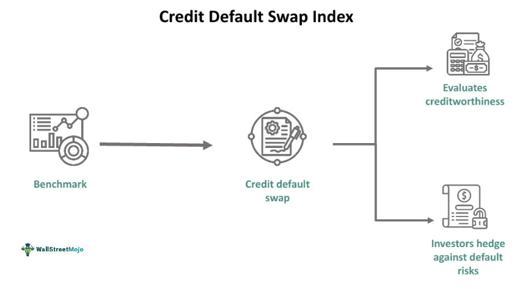

Financial derivatives have become indispensable in the financial markets, providing tools for a wide range of activities, from risk management to speculative strategies. Among these derivatives, Credit Default Swaps (CDS) play a pivotal role by acting as a safeguard against credit risk. A CDS is essentially a contract allowing one party to transfer the risk of a credit event, such as a default, to another party in exchange for periodic premium payments. This mechanism enables investors and institutions to manage exposure to credit risk efficiently.

Building on the foundation of individual CDS contracts, the Credit Default Swap Index (CDX) aggregates these instruments into a cohesive index. The CDX offers investors a diversified exposure to credit risks across a basket of issuers. This diversification not only spreads the risk but also enhances the instrument's usability in hedging and speculative scenarios, as it reflects broader credit market movements. The standardization and exchange trading of CDX products also contribute to increased liquidity and transparency, crucial factors for both individual and institutional investors.



In recent years, algorithmic trading has transformed the landscape of trading in these complex instruments. Algorithms allow for the automation of trading strategies, facilitating high-speed and efficient management of both CDS and CDX instruments. This technological approach enhances precision in executing trades, managing risk, and optimizing timing, which is particularly beneficial in volatile credit markets.

This article aims to provide a comprehensive exploration of the CDX market, examining its intricacies, benefits, and inherent risks. Additionally, it will discuss the transformative role of algorithmic trading in enhancing the efficiency and effectiveness of trading in these financial derivatives. Understanding these elements is crucial for market participants seeking to navigate and capitalize on opportunities within the credit derivatives space.

## Table of Contents

## Understanding Financial Derivatives

Financial derivatives are financial contracts that derive their value from a specific underlying asset. These assets can be varied, encompassing stocks, bonds, commodities, currencies, interest rates, or market indices. The primary function of derivatives is to facilitate risk management, allow for speculative opportunities, and enable leverage—the act of using borrowed capital for an investment, with the aim of amplifying potential returns.

### Purpose and Utility

Derivatives serve multiple vital purposes in financial markets:

1. **Hedging**: This involves reducing potential losses by making a series of strategic trades. For instance, a farmer may use commodity futures contracts to lock in a selling price for produce yet to be harvested, thereby insuring against unfavorable price changes.

2. **Speculation**: Traders often use derivatives to bet on the future movement of asset prices. For example, purchasing a call option on a stock allows a trader to speculate on its price increase.

3. **Leverage**: Derivatives can control a larger position with a smaller amount of actual capital. This is because the derivative contracts themselves may only require a fraction of the value of the underlying asset to control it.

### Credit Default Swaps (CDS)

One specific category of derivatives is the Credit Default Swap. A CDS is a financial derivative that transfers the credit exposure of fixed income products between two or more parties. Essentially, a CDS acts like an insurance policy wherein the buyer of the CDS makes regular payments to the seller and, in return, receives a payoff if the underlying financial instrument defaults. For instance, if a bond issuer defaults, the CDS delivers a payment to the holder that might cover some or all their loss. This transformation of credit risk into tradable securities was significant during the financial crises, highlighting both the utility and potential peril associated with such instruments.

### Growth and Diversity

The derivatives market has experienced substantial growth, diversifying extensively into products such as options, futures, forwards, and swaps:

- **Options**: A contract that offers the buyer the right, but not the obligation, to buy or sell an asset at a predetermined price before a specific date.

- **Futures**: Stand as contractual agreements to buy or sell a particular commodity or security at a predetermined price at a specific time in the future.

- **Swaps**: These involve an exchange of cash flows or other financial instruments between parties, often used to swap variable interest rates for fixed ones, or currency exchanges.

### Algorithmic Trading in Derivatives

The introduction of [algorithmic trading](/wiki/algorithmic-trading) has markedly enhanced the efficiency of derivative trading. Algorithmic trading refers to the use of complex algorithms to automatically execute trades based on pre-set criteria which can include timing, pricing, or quantity. This technology brings about several advantages:

- **Speed**: Algorithms can execute orders in milliseconds, much faster than a human trader.

- **Efficiency**: Reduces transaction costs by optimizing order execution, managing large order volumes, and improving liquidity.

- **Risk Management**: Algorithms can be coded to automatically initiate trades based on risk management profiles, helping mitigate potential losses.

Algorithmic trading's role is expected to expand further, driven by continuous technological advances and a demand for improved [liquidity](/wiki/liquidity-risk-premium) and efficiency in derivative markets. This expansion poses an ongoing challenge and opportunity to market participants, necessitating continuous adaptation to evolving technologies.

## Deep Dive into Credit Default Swaps (CDS)

A Credit Default Swap (CDS) is a derivative instrument designed to transfer the credit exposure of fixed income products between parties. Essentially, it functions as a form of insurance for lenders or investors against the risk of a borrower, such as a corporation or government, defaulting on its debt obligations. In a CDS contract, the buyer of the swap makes periodic premium payments to the seller, akin to paying an insurance premium. In return, the seller agrees to compensate the buyer upon a specified credit event, such as a default or bankruptcy of the underlying entity.

CDS contracts are inherently complex and involve specific terms regarding the underlying asset, the duration of the contract, and the stipulations for credit events. These terms define the contingencies under which the seller compensates the buyer, which can include events like restructuring, bankruptcies, or failures to pay by the reference entity.

Historically, CDSs rose to prominence during financial crises, particularly during the 2008 financial crisis. At that time, their misuse and the lack of transparency in their trading were identified as major factors contributing to severe market disruptions. The widespread failure of counterparties to fulfill their CDS obligations exacerbated financial instability. The crisis underscored the necessity for greater transparency and regulation within the CDS market.

For investors, understanding Credit Default Swaps is essential for both hedging and speculative purposes. Investors looking to hedge credit risk may purchase CDS contracts to offset potential losses from defaults on bonds or loans they hold. Conversely, traders might engage in CDS for speculative purposes, betting on the deterioration of a borrower's creditworthiness to profit from widening credit spreads. The value of a CDS contract is influenced by the perceived risk of the underlying credit as reflected in the credit spread. 

The calculation of these spreads and default probabilities often involves sophisticated financial models. These models typically incorporate various factors, including the credit rating of the issuer, prevailing economic conditions, and market perceptions of credit risk.

In conclusion, Credit Default Swaps offer a mechanism for managing credit risk in financial markets, allowing participants to protect against or speculate on changes in creditworthiness. Their role in modern finance continues to evolve, prompted by advances in financial technology and regulatory reforms aimed at enhancing market transparency and stability.

## Exploring the Credit Default Swap Index (CDX)

The Credit Default Swap Index (CDX) serves as a pivotal financial instrument within the credit derivatives market, designed to enhance the utility and manageability of Credit Default Swaps (CDS). The CDX is structured as a benchmark index, amalgamating several CDS contracts from various issuers into one cohesive financial instrument. This aggregated approach allows for diversified credit exposure across a spectrum of corporate or sovereign entities, which can mitigate individual credit event risks more effectively than holding single-name CDS contracts.

CDX indices are curated to be standardized and exchange-traded, which imparts several distinct advantages. The standardization means that the terms and conditions are uniform across the board, making it easier for investors to engage in trading without the complexity of negotiating individual CDS agreements. Exchange trading further enhances the liquidity of these instruments. Liquid markets are crucial for enabling investors to enter and [exit](/wiki/exit-strategy) positions promptly, which also contributes to greater market transparency—an essential [factor](/wiki/factor-investing) for reducing price uncertainties and fostering investor confidence.

There are multiple variants of the CDX indices catering to various investor risk preferences. Primarily, these are classified into investment-grade indices, which comprise CDS contracts on high-credit-quality entities, and high-yield indices, which focus on entities with lower credit ratings. Each type provides a different risk-return profile, allowing investors to tailor their credit exposure in alignment with their investment strategy and risk tolerance.

For investors, CDX indices offer a streamlined method to gain broad market exposure to credit risk. They can efficiently hedge portfolios or strategically position themselves in credit markets by trading a single CDX index rather than multiple individual CDS contracts. This approach not only saves transaction costs but also simplifies the management of credit exposure.

In conclusion, the Credit Default Swap Index provides a sophisticated mechanism for credit risk management, offering investors both diversification and liquidity benefits, with options tailored for different risk profiles. The advent of these indices has significantly transformed the way participants engage in and manage credit derivatives, underscoring their importance in modern financial markets.

## The Role of Algorithmic Trading in CDX Markets

Algorithmic trading involves the use of sophisticated computer algorithms to execute trades at optimal times based on predefined criteria. In CDX markets, these algorithms play a crucial role in providing liquidity, executing complex trading strategies, and managing large volumes of trades efficiently. By automating trade executions, algorithmic trading enhances market efficiency and reduces trading costs, while simultaneously quantifying risk exposure in dynamic credit markets.

One of the primary advantages of algorithmic trading in CDX markets is its ability to process and analyze vast amounts of data quickly. This capability allows algorithmic models to identify trading opportunities that might be missed by human traders. By leveraging statistical and [machine learning](/wiki/machine-learning) techniques, these algorithms can optimize hedge positions to protect against adverse market movements. For example, in Python, a common approach might involve using libraries such as NumPy and pandas for data analysis, along with machine learning libraries like scikit-learn for developing predictive models:

```python
import numpy as np
import pandas as pd
from sklearn.ensemble import RandomForestRegressor

# Sample data loading
data = pd.read_csv('market_data.csv')
features = data.drop(columns=['target'])
target = data['target']

# Train model
model = RandomForestRegressor(n_estimators=100, random_state=42)
model.fit(features, target)

# Predicting future market movements
predictions = model.predict(features)
```

Algorithmic trading systems in CDX markets are designed to operate with minimal human intervention. This characteristic is particularly beneficial in high-frequency trading environments where market conditions can change rapidly. Algorithms are used to exploit [arbitrage](/wiki/arbitrage) opportunities across different credit instruments and to manage risk exposure by dynamically adjusting positions based on real-time data analysis.

As technology continues to advance, the role of algorithmic trading in CDX markets is set to expand further. Innovations in machine learning and [artificial intelligence](/wiki/ai-artificial-intelligence) are expected to enhance the predictive capabilities of trading algorithms, potentially improving market stability by providing more accurate assessments of credit risk. With these advancements, algorithmic trading is poised to become an even more integral component of efficient and effective market operations. Understanding the capabilities and limitations of these algorithms is essential for market participants looking to harness their full potential in CDX trading.

## Risks and Challenges of Trading CDX and CDS

Credit Default Swaps (CDS) and the Credit Default Swap Index (CDX) offer critical mechanisms for managing credit risk, but they also [carry](/wiki/carry-trading) several inherent risks and challenges that market participants must navigate. These risks are multifaceted, impacting different aspects of the instruments and their trading environments.

One of the primary risks associated with CDS and CDX is counterparty risk. This arises from the possibility that the counterparty in a derivative contract may default on its obligations. The 2007-2008 financial crisis highlighted the severity of counterparty risk when major financial institutions faced insolvency, challenging the robustness of derivative markets[^1^].

Liquidity risk also poses a substantial challenge. The CDS market can experience periods of illiquidity, where finding counterparties to trade with becomes difficult, potentially leading to unfavorable pricing conditions. This risk is especially pronounced in times of economic stress, where market participants become risk-averse[^2^].

Market risk for CDS and CDX emanates from changing credit spreads and economic conditions that affect the value of these derivatives. Volatility in credit markets can lead to significant fluctuations in the pricing of CDS and CDX instruments, impacting portfolios that utilize them for hedging or speculative purposes. Calculating and managing these risks requires understanding the dynamics of credit spreads, often modeled using stochastic processes or regression analysis.

Algorithmic trading introduces its own set of risks, notably technology and execution risks. System failures or erroneous trades due to algorithmic errors can result in substantial financial losses. Algorithms must be meticulously coded and tested to minimize risk, often involving [backtesting](/wiki/backtesting) with historical data sets to ensure robustness. Here is a basic example in Python of how a backtest might be implemented to assess risk using historical data:

```python
import pandas as pd

# Load historical data
data = pd.read_csv('historical_credit_spreads.csv')

# Simple moving average strategy
data['SMA_50'] = data['credit_spread'].rolling(window=50).mean()
data['SMA_200'] = data['credit_spread'].rolling(window=200).mean()

# Trading logic
data['Signal'] = 0
data.loc[data['SMA_50'] > data['SMA_200'], 'Signal'] = 1
data.loc[data['SMA_50'] < data['SMA_200'], 'Signal'] = -1

# Calculate returns
data['Trade_Returns'] = data['Signal'].shift(1) * data['credit_spread'].pct_change()

# Estimate cumulative returns
cumulative_returns = (data['Trade_Returns'] + 1).cumprod() - 1
```

The complexity of CDS and CDX derivatives further complicates their management. These products often involve intricate terms and conditions that, if inadequately understood, can lead to misinformed financial decisions. This necessitates a comprehensive understanding of the instruments, underpinned by continuous education and market research.

Regulatory scrutiny is another critical factor affecting CDS and CDX trading. Post-crisis reforms have intensified oversight, aiming to enhance transparency and stability in derivative markets. Compliance with evolving regulations requires adaptive risk management strategies and investment in regulatory technology solutions to ensure adherence and avoid potential penalties.

In summary, while CDS and CDX offer significant benefits for managing credit risk, they are accompanied by notable risks that require prudent management and strategic planning. Market participants must maintain technological sophistication, regulatory compliance, and an informed approach to effectively navigate these challenges.

[^1^]: Duffie, D. (2011). "How Big Banks Fail and What to Do About It." Princeton University Press.
[^2^]: Hull, J. (2018). "Options, Futures, and Other Derivatives." Pearson Education.

## Conclusion: Navigating the Future of CDX Trading

The integration of financial derivatives such as the Credit Default Swap Index (CDX) and algorithmic trading epitomizes the innovative advancements in modern finance. These tools provide a comprehensive framework for managing credit risks and enhancing trading efficiency. The CDX, as an aggregated benchmark of multiple Credit Default Swaps (CDS), offers diversified credit exposure and an efficient mechanism for risk management. Its standardized nature and exchange-traded features contribute to increased liquidity and transparency, essential for sophisticated market strategies.

Understanding the dynamics of CDX is indispensable for investors seeking to make informed decisions. The CDX, with its varying indices—such as investment-grade and high-yield options—caters to diverse risk appetites. This allows investors to gain broad market exposure or efficiently hedge portfolios, reducing the need for managing multiple individual CDS contracts. However, this requires a thorough comprehension of the underlying credit risks and the factors influencing credit spreads.

Algorithmic trading has become a cornerstone of CDX markets, evolving rapidly with technological advancements. It offers significant opportunities by automating trading processes, lowering transaction costs, and executing complex strategies with precision. Algorithms can analyze extensive datasets to identify trading opportunities and optimize hedge positions, which are crucial in volatile markets. However, this evolution also presents challenges, such as system failures and the potential for erroneous trades. Thus, constant innovation and testing of algorithms are essential to maintain market competitiveness and stability.

As financial markets develop, regulatory frameworks and risk management practices must evolve in tandem to maintain financial stability. The complexity and systemic importance of derivatives like CDX necessitate robust regulatory oversight to mitigate risks such as counterparty default and market manipulation. This adaptation requires collaboration between financial institutions and regulators to enforce transparency while encouraging innovation.

Investors and traders must adopt a vigilant approach, leveraging the benefits of technology without compromising a comprehensive understanding of market principles. Continuous education and adaptation are critical, as is the alignment of risk management strategies with evolving market conditions. Balancing technological advancements with sound judgment will be key to navigating the future of CDX trading successfully.

## References & Further Reading

[1]: Duffie, D. (2011). ["How Big Banks Fail and What to Do About It."](https://web.stanford.edu/~duffie/DuffieDealersMarch10.pdf) Princeton University Press.

[2]: Hull, J. (2018). ["Options, Futures, and Other Derivatives."](https://www.amazon.com/Options-Futures-Other-Derivatives-9th/dp/0133456315) Pearson Education.

[3]: Markit. (n.d.). ["CDX: Markit North American Credit Default Swap Indices."](https://www.spglobal.com/spdji/en/landing/topic/cdx-tradable-cds-indices/) S&P Global Market Intelligence.

[4]: Terry, S. (2010). ["Credit Default Swaps and the Financial Crisis."](https://academiccommons.columbia.edu/doi/10.7916/D84T6SC8) CNBC.

[5]: Lopez de Prado, M. (2018). ["Advances in Financial Machine Learning."](https://www.amazon.com/Advances-Financial-Machine-Learning-Marcos/dp/1119482089) Wiley.

[6]: Jansen, S. (2020). ["Machine Learning for Algorithmic Trading."](https://github.com/stefan-jansen/machine-learning-for-trading) Packt Publishing.

[7]: Chan, E. P. (2009). ["Quantitative Trading: How to Build Your Own Algorithmic Trading Business."](https://github.com/ftvision/quant_trading_echan_book) Wiley.