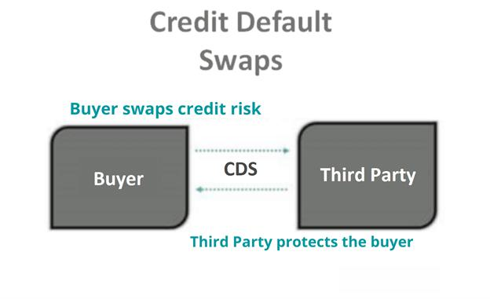

Financial derivatives are influential instruments within the financial markets, offering both lucrative opportunities and potential risks. These financial contracts derive their value from underlying assets, such as stocks, bonds, commodities, interest rates, or market indices, and are used by investors to hedge risk, speculate, and in some instances, arbitrage. This article aims to explore the management of risks associated with financial derivatives, particularly focusing on credit default swaps (CDS) and algorithmic trading strategies, which have significantly transformed trading and risk management practices.

The evolving complexity of financial markets, driven by technological advancements and globalization, necessitates robust risk management frameworks, especially in derivatives trading. The inherent leverage involved in derivatives can magnify both gains and losses, highlighting the critical need for effective risk mitigation techniques. Understanding the intricacies of financial derivatives, including their functions and associated risks, is essential for financial professionals to navigate these complex instruments.

Credit Default Swaps (CDS), a prominent type of derivative, will be a focal point of our discussion. Representing a form of financial insurance against the default of a borrower, CDS play a crucial role in the distribution and management of credit risk across financial institutions. We will examine the mechanics of CDS contracts, the parties involved, and their role in risk management.

Moreover, the rise of algorithmic trading has reshaped strategies within derivatives markets. Utilizing complex algorithms to optimize trading processes, manage risks, and execute trades at high speeds, these systems can enhance market efficiency but also introduce new challenges and risks, such as market manipulation and systemic failures.

Overall, the article aims to provide a comprehensive understanding of financial derivatives and the importance of developing sophisticated risk management strategies in this evolving landscape. By focusing on credit default swaps and the influence of algorithmic trading, we hope to shed light on the opportunities and challenges these financial instruments present, equipping investors with the knowledge needed to make informed decisions in the dynamic derivatives markets.

## Table of Contents

## Understanding Financial Derivatives

Financial derivatives are financial instruments whose value is derived from the performance of underlying assets, indexes, or interest rates. These underlying entities can include stocks, bonds, commodities, currencies, interest rates, and market indexes. Derivatives play a critical role in today's financial markets by enabling participants to hedge risks, speculate on future price movements, and execute arbitrage strategies.

**Types of Financial Derivatives**

The most common types of financial derivatives include futures, options, and swaps:

1. **Futures**: These are standardized contracts obligating the buyer to purchase or the seller to sell an asset at a predetermined future date and price. Futures are traded on exchanges and are used mainly to hedge risks or speculate on the anticipated direction of the asset's price.

2. **Options**: Options provide the buyer the right, but not the obligation, to buy or sell an asset at a specified price on or before a certain date. There are two primary types: call options (the right to buy) and put options (the right to sell). Options allow traders to leverage their investments while capping potential losses to the premium paid.

3. **Swaps**: Swaps are contracts in which two parties exchange cash flows or liabilities from two different financial instruments. The most common type is an interest rate swap where parties exchange fixed-rate for floating-rate interest payments to manage interest rate exposure.

**Uses of Financial Derivatives**

Derivatives are indispensable tools for financial professionals due to several key purposes:

- **Hedging**: Derivatives allow individuals and companies to protect themselves against fluctuations in asset prices. For instance, an airline company might use fuel futures to lock in current prices and hedge against future oil price increases.

- **Speculation**: Traders seek to profit from price changes in the underlying asset by buying and selling derivatives. This activity can introduce liquidity but also increase volatility in the markets.

- **Arbitrage**: Arbitrage involves simultaneously buying and selling an asset in different markets to exploit price differentials for profit. Financial derivatives facilitate such strategies by reducing transaction costs and enabling efficient capital allocation.

**Examples of Derivatives in Practice**

Consider a company that expects to receive a payment in foreign currency in six months. It could enter into a forward contract to lock in the current exchange rate, thereby avoiding the risk of currency depreciation. In another instance, an investor anticipating an increase in stock prices might purchase call options, benefiting from the upside while limiting potential losses to the option premium paid.

**Risks Associated with Derivatives Trading**

While derivatives offer several benefits, they also present substantial risks:

- **Market Risk**: The risk of losses due to adverse movements in the market prices of the underlying assets. Leverage can amplify these losses considerably.

- **Operational Risk**: The risk of loss arising from inadequate internal processes, people, or systems. Errors in valuation models, for example, can result in substantial losses.

- **Credit Risk**: This is the risk that a counterparty will default on its contractual obligations. Over-the-counter (OTC) derivatives are particularly susceptible to this risk as they are not standardized or regulated like exchange-traded derivatives.

In conclusion, financial derivatives are essential components of global financial markets, offering diverse functionalities for risk management, speculation, and [arbitrage](/wiki/arbitrage). However, their inherent risks necessitate stringent management practices and regulatory oversight to prevent systemic failures, underscored by past financial crises attributed partly to derivative misuse.

## Credit Default Swaps: An Overview

Credit default swaps (CDS) are specialized financial derivative contracts that serve as a form of risk management tool by providing protection against a borrower's default. They are widely used in modern finance to hedge credit risk and have significant implications for financial institutions and markets.

A CDS functions much like an insurance policy. An investor who holds debt instruments, such as bonds, can purchase a CDS to safeguard against the possibility of the borrower defaulting. In a typical CDS contract, there are two primary parties involved: the protection buyer and the protection seller. The protection buyer pays a periodic fee, or premium, to the protection seller. In return, the protection seller agrees to compensate the buyer if the borrower defaults or experiences another credit event defined in the contract.

The mechanics of a CDS are straightforward. The buyer of the CDS pays premiums, often quarterly, over a predetermined period. If a credit event, such as a default, occurs, the protection seller must deliver a settlement to the buyer. Settlement can be either physical, where the buyer delivers the defaulted bond to the seller for its face value, or cash, where the seller pays the buyer the difference between the bond's par value and its market value post-default.

Financial institutions utilize CDS to hedge against potential losses from credit exposures. By transferring default risk to another party, they can manage the credit risk in their portfolios more effectively. This hedging allows banks and other institutions to maintain a stable balance sheet and potentially achieve lower capital requirements.

Historically, CDS have played pivotal roles in various financial scenarios, showcasing both successes and failures. One notable success was during the early 2000s when CDS gained popularity for their ability to disperse risk and provide [liquidity](/wiki/liquidity-risk-premium) to credit markets. However, the 2008 financial crisis exposed significant failures. The rampant and sometimes speculative trading of CDS, particularly on mortgage-backed securities, contributed to systemic risk and financial instability. AIG's near-collapse is a prime example, where the company's vast CDS exposure with inadequate capital reserves led to a government bailout.

In summary, while credit default swaps are powerful tools for managing credit risk, their complexity and potential for misuse require careful consideration and robust risk management practices. The lessons learned from past experiences underscore the importance of transparency, regulation, and prudent oversight in the use of CDS in financial markets.

## Risk Management in Derivatives Trading

Risk management is crucial in financial derivatives trading due to the inherent complexity and [volatility](/wiki/volatility-trading-strategies) of these instruments. Derivatives, by their nature, [carry](/wiki/carry-trading) significant risks, including market risk, credit risk, and operational risk, which necessitate rigorous risk management practices. Effective risk management ensures that financial institutions and investors can mitigate potential losses and optimize their trading strategies.

Various techniques and tools are employed to manage risks associated with derivatives. One fundamental approach is diversification, which involves spreading exposure across multiple derivatives or asset classes to minimize risk. Hedging is another common strategy, where derivatives are used to offset potential losses in other investments. For example, options and futures can hedge against price movements in commodities or equities.

Regulatory frameworks play an essential role in managing derivative-related risks. Regulations such as the Dodd-Frank Wall Street Reform and Consumer Protection Act in the United States and the European Markets Infrastructure Regulation (EMIR) in the EU have been established to ensure transparency, reduce systemic risk, and protect market participants. These regulations require standardized reporting, clearing through central counterparties (CCPs), and margin requirements, all designed to enhance the stability of derivative markets.

Global financial crises, such as the 2008 crisis, have had a profound impact on derivatives trading and risk management practices. The crisis exposed the vulnerabilities of over-the-counter (OTC) derivatives, especially credit default swaps (CDS), highlighting the need for improved risk management and regulatory oversight. In response, the financial industry has adopted more robust risk management frameworks, emphasizing counterparty risk assessment and the importance of central clearing to mitigate systemic risk.

Value at Risk (VaR) is a widely used risk metric in derivatives trading. VaR estimates the potential loss in the value of a portfolio over a specified period, given a certain confidence level. For instance, a one-day VaR of $1 million at a 95% confidence level implies that there is a 5% chance that losses will exceed $1 million in a single day. VaR is useful for quantifying market risk and is often used by traders and financial institutions to set risk limits and assess capital requirements.

Other risk metrics include Conditional Value at Risk (CVaR), which considers the tail end of the loss distribution and provides insights into extreme loss scenarios. Stress testing and scenario analysis are also critical tools, allowing traders to evaluate the potential impact of extreme market conditions on their portfolios.

In summary, risk management in derivatives trading involves a multifaceted approach that combines strategic techniques, regulatory compliance, and advanced risk metrics. These efforts are vital to safeguarding against the inherent risks of derivatives and ensuring the stability of financial markets.

## The Role of Algorithmic Trading in Derivatives

Algorithmic trading involves using computer algorithms to automate trading decisions, making it a crucial component in today's derivatives markets. This type of trading leverages high-speed computations and complex decision-making processes to execute trades at a pace and [volume](/wiki/volume-trading-strategy) unattainable by humans alone. As derivatives markets have expanded in volume and complexity, [algorithmic trading](/wiki/algorithmic-trading) has grown significantly, providing financial institutions with advanced tools to manage and execute derivative trades efficiently.

Algorithms enhance efficiency in trading and managing derivatives by automating processes, reducing latency, and minimizing human error. They can process vast datasets, enabling them to make informed decisions rapidly. For instance, a well-designed algorithm can assess market conditions, predict price movements, and execute trades within milliseconds. This capacity reduces costs associated with manual trading and enhances the speed and accuracy of transactions.

Credit default swaps (CDS), a type of financial derivative, have also seen increased algorithmic intervention. Algorithms in CDS trading can help manage credit risk by swiftly calculating the probability of default and adjusting positions accordingly. They enable traders to respond instantly to market shifts, thereby providing a strategic advantage in mitigating potential losses associated with defaults. By continuously evaluating the creditworthiness of entities, algorithms ensure that positions remain aligned with risk management objectives.

Despite their advantages, algorithmic trading introduces risks such as systemic risk, market manipulation, and technical failures. Algorithms acting without human intervention can lead to unexpected market behaviors, as illustrated by events like the 2010 Flash Crash. Therefore, while enabling precision and speed, algorithms necessitate robust oversight and risk management frameworks to prevent adverse market impacts.

Artificial intelligence (AI) and [machine learning](/wiki/machine-learning) (ML) are poised to transform derivatives trading further. AI and ML algorithms offer the ability to learn from data patterns and improve their decision-making over time. In derivatives markets, these technologies can develop predictive models to assess risk, identify profitable trading opportunities, and optimize portfolios. For example, machine learning techniques can enhance risk valuation by identifying subtle patterns in market data, which may not be evident through traditional analysis.

In conclusion, algorithmic trading plays a pivotal role in the efficiency and management of derivatives markets, particularly in trading instruments like credit default swaps. The integration of AI and ML heralds a new era of sophisticated, data-driven trading strategies that promise further enhancements in risk management and trading efficiencies. However, the inherent risks associated with algorithmic interventions must be addressed through diligent oversight and continuous improvement of risk management systems.

## Challenges and Opportunities in Managing Derivatives Risk

Financial professionals managing derivatives risk face several key challenges. One of the foremost is the inherent complexity and unpredictability of derivatives markets. Derivatives, with their leverage and structural intricacies, can lead to substantial financial exposure even with a relatively small initial investment. Market dynamics, such as volatility and liquidity fluctuations, add an extra layer of complexity, often making risk levels challenging to quantify and predict accurately.

Technological advancements have significantly influenced risk management strategies. High-frequency trading and advanced analytics offer enhanced tools for monitoring and mitigating risk. Technologies such as blockchain have introduced possibilities for transparent and immutable transaction records, reducing counterparty risks and improving settlement efficiency. However, these technological developments also introduce new risks, such as cybersecurity threats and the reliance on complex algorithms that could malfunction or be manipulated.

Regulatory challenges also play a crucial role in derivatives trading. After the 2008 financial crisis, which was exacerbated by inadequacies in derivatives regulation, financial institutions are now subject to rigorous compliance and reporting standards. Initiatives like the Dodd-Frank Act in the United States and the European Market Infrastructure Regulation (EMIR) require detailed reporting and centralized clearing of many derivatives transactions to improve market transparency and stability. Compliance with these regulations can be resource-intensive and requires continuous adaptation to align with evolving standards.

Despite these challenges, there are significant opportunities for innovation within the derivatives market. Credit default swaps (CDS), for instance, continue to evolve as instruments for managing credit risk. Innovative products and structures can offer more tailored risk solutions, allowing financial institutions to hedge against specific exposures more efficiently. The application of [artificial intelligence](/wiki/ai-artificial-intelligence) and machine learning provides opportunities to enhance predictive modeling capabilities, potentially leading to more effective risk management strategies.

Continuous education and training are vital in improving risk management practices. Financial professionals must stay updated with the latest market developments, technological innovations, and regulatory changes. This ongoing education helps professionals to better understand complex derivatives products, develop more informed strategies, and implement more effective risk management frameworks.

Overall, managing derivatives risk presents both challenges and opportunities. By leveraging technological advancements, maintaining regulatory compliance, and fostering continuous education, financial professionals can navigate the complexities of the derivatives market and build robust risk management strategies.

## Conclusion

Financial derivatives, as explored in this article, are integral components of modern financial markets, offering opportunities for hedging risk, speculative investment, and arbitrage. Their complexity demands a robust risk management approach to mitigate the inherent dangers they pose, including market, operational, and credit risk. Among the various derivatives, credit default swaps (CDS) and algorithmic trading stand out as pivotal tools in managing these risks.

Credit default swaps serve as a critical mechanism for hedging against credit risk. By transferring the potential risk of a borrower defaulting from one party to another, CDS provide a form of insurance that can stabilize financial positions and offer protection. While CDS can effectively manage risk, they can also amplify systemic risk if not adequately managed, as exemplified during past financial crises.

Algorithmic trading, comprising computer-driven trading strategies, enhances the efficiency and precision of derivatives trading. Algorithms can swiftly analyze vast datasets and execute trades at speeds impossible for human traders, thus managing risk more effectively. However, reliance on algorithmic trading also introduces risks such as technology failures or exacerbated market volatility.

Looking to the future, the derivatives market will likely continue evolving, with technology playing a vital role in shaping risk management strategies. Innovations in artificial intelligence and machine learning are poised to transform algorithms, making them more adaptive and predictive. These advancements may enhance the capability to foresee risk factors and adjust trading strategies accordingly.

For financial professionals, staying informed and adaptable is imperative. The dynamic nature of derivatives markets requires a continuous commitment to education and awareness of emerging trends and regulatory frameworks. By recognizing both the opportunities and challenges associated with financial derivatives, professionals can execute informed decisions that balance risk and reward.

In conclusion, effective risk management remains a cornerstone of dealing with financial derivatives. Credit default swaps and algorithmic trading are invaluable tools, yet they require vigilant oversight and adaptive strategies to harness their benefits while safeguarding against their pitfalls. Financial professionals must proactively engage with ongoing developments in the derivatives sector, ensuring readiness to address the complexities of these powerful financial instruments.

## References & Further Reading

[1]: Hull, J. C. (2018). ["Options, Futures, and Other Derivatives"](https://www.semanticscholar.org/paper/Options%2C-Futures%2C-and-Other-Derivatives-Hull/89bdee500c8623864fc9eb7a471546aa713acc44) (10th Edition). Pearson.

[2]: Das, S. R. (2012). ["Credit Default Swaps and the Financial Crisis"](https://www.nber.org/papers/w15384). Journal of Financial Intermediation, 21(3), 267-287.

[3]: Biais, B., Foucault, T., & Moinas, S. (2015). ["Equilibrium High-Frequency Trading"](https://papers.ssrn.com/sol3/papers.cfm?abstract_id=2024360). The Review of Financial Studies, 28(4), 973-1003.

[4]: Mengle, D. (2007). ["Credit Derivatives: An Overview"](https://www.atlantafed.org/-/media/Documents/research/publications/economic-review/2007/vol92no4_mengle.pdf?la=en). Economic Review, Federal Reserve Bank of Atlanta, 92(4), 1-24.

[5]: Hendershott, T., Jones, C. M., & Menkveld, A. J. (2011). ["Does Algorithmic Trading Improve Liquidity?"](https://onlinelibrary.wiley.com/doi/full/10.1111/j.1540-6261.2010.01624.x). The Journal of Finance, 66(1), 1-33.

[6]: Pirrong, C. (2010). ["The Economics of Clearing in Derivatives Markets: Netting, Asymmetric Information, and the Sharing of Default Risks through a Central Counterparty"](https://www.bauer.uh.edu/spirrong/clearing_organization.pdf). University of Houston, Bauer College of Business Working Paper.

[7]: Tett, G. (2009). ["Fool's Gold: The Inside Story of J.P. Morgan and How Wall St. Greed Corrupted Its Bold Dream and Created a Financial Catastrophe"](https://link.springer.com/article/10.1007/s10068-024-01759-x). Free Press.