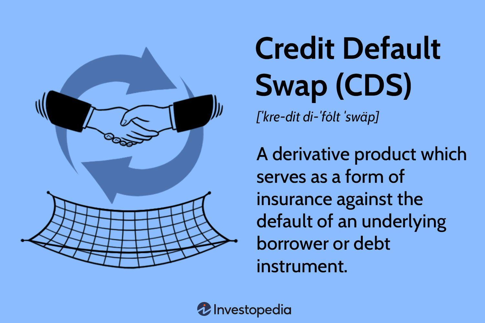

## Table of Contents

## What is a Credit Default Swap (CDS)?

A Credit Default Swap (CDS) is a type of insurance against the risk of a borrower defaulting on a loan. It's like a contract between two parties where one party, the buyer, pays a regular fee to the other party, the seller. In return, the seller agrees to pay the buyer if the borrower fails to repay the loan. Imagine you lend money to a friend, but you're worried they might not pay you back. You could buy a CDS from someone else, and if your friend doesn't pay, the person you bought the CDS from will cover your loss.

CDSs are often used by banks and investors to manage the risk of their investments. For example, if a bank has lent a lot of money to a company, it might buy a CDS to protect itself in case the company goes bankrupt. This way, the bank can continue to lend money without worrying too much about the risk of not getting paid back. However, CDSs can also be risky because they depend on the seller being able to pay if a default happens. If many borrowers default at the same time, it can lead to big problems, as seen during the 2008 financial crisis.

## How does a Credit Default Swap work?

A Credit Default Swap (CDS) is like a safety net for lenders. Imagine you lend money to someone, but you're worried they might not pay you back. You can buy a CDS from another person or a company. You pay them a small fee regularly, kind of like an insurance premium. In return, if the person you lent money to doesn't pay you back, the person you bought the CDS from will give you the money instead. It's a way to protect yourself from losing money if the borrower can't pay.

CDSs are used a lot by banks and investors to manage the risks of their loans and investments. For example, if a bank has given a big loan to a company, it might buy a CDS to protect itself in case the company goes bankrupt. This way, the bank can feel safer about lending money. But there's a catch: the safety of a CDS depends on the person selling it being able to pay if something goes wrong. If lots of borrowers default at the same time, it can cause big problems, like what happened during the 2008 financial crisis.

## What are the main components of a CDS contract?

A Credit Default Swap (CDS) contract has a few main parts that make it work. First, there's the buyer and the seller. The buyer is the person who wants protection against a borrower not paying back a loan. The seller is the one who agrees to pay if the borrower defaults. The buyer pays the seller a regular fee, called a premium, for this protection. This fee is usually a small percentage of the loan amount and is paid until the end of the contract or until a default happens.

The second important part is the reference entity, which is the borrower or the company that the loan is made to. If this entity fails to pay back the loan, it triggers the CDS. The contract also specifies what counts as a default. This could be missing a payment, going bankrupt, or other events that show the borrower can't pay. When a default happens, the seller of the CDS has to pay the buyer. This payment can be the full amount of the loan or the difference between the loan's value and what it's worth after the default, depending on the terms of the contract.

Lastly, the contract includes the notional amount, which is the total value of the loan that the CDS is protecting. This amount helps determine the size of the premium payments and the potential payout if a default occurs. The duration of the contract, or its maturity, is also specified, which can range from a few months to several years. Together, these components outline the rights and obligations of both the buyer and the seller, making the CDS a useful tool for managing credit risk.

## Who are the typical buyers and sellers of Credit Default Swaps?

The typical buyers of Credit Default Swaps (CDSs) are banks, hedge funds, and other financial institutions that want to protect themselves from the risk of borrowers not paying back their loans. For example, if a bank has given a big loan to a company, it might buy a CDS to make sure it gets its money back even if the company goes bankrupt. Investors who own bonds might also buy CDSs to protect their investments from default. These buyers are looking for a way to reduce the risk of losing money if things go wrong with their loans or investments.

The typical sellers of CDSs are often big banks and insurance companies. They sell CDSs because they believe they can handle the risk of a borrower defaulting, and they earn money from the regular fees that buyers pay. For instance, an insurance company might sell a CDS and use the fees to invest in other areas. However, if many borrowers default at the same time, it can be tough for sellers to pay out all the claims, which can lead to big problems in the financial markets.

## What are the benefits of using Credit Default Swaps?

Credit Default Swaps (CDSs) help people and companies manage risk. If you lend money to someone, you might worry they won't pay you back. A CDS is like insurance that protects you from losing money if the borrower can't pay. Banks and investors use CDSs to feel safer when they lend money or buy bonds. By buying a CDS, they can continue to invest without worrying as much about the risk of not getting their money back.

CDSs also help the financial markets work better. They allow banks to lend more money because they can protect themselves against defaults. This can help the economy grow because more money is available for businesses and people to borrow. But, CDSs are not without risks. If many borrowers default at the same time, it can be hard for the sellers of CDSs to pay out all the claims, which can cause big problems in the financial system.

## What are the risks associated with Credit Default Swaps?

Credit Default Swaps (CDSs) can be risky because they depend on the seller being able to pay if a borrower defaults. If many borrowers default at the same time, the sellers might not have enough money to cover all the claims. This can lead to big problems in the financial markets, like what happened during the 2008 financial crisis. If a big seller of CDSs can't pay, it can cause panic and make other banks and investors worried about their own money.

Another risk is that CDSs can be used to bet against a company or a country's debt. This means someone might buy a CDS not because they own the debt, but because they think the borrower will fail. If a lot of people do this, it can make the situation worse for the borrower, making it more likely they will default. This can create a cycle where the fear of default actually causes the default, which can hurt the whole economy.

## How is the price of a Credit Default Swap determined?

The price of a Credit Default Swap (CDS) is like a fee you pay for insurance. It depends on how likely people think the borrower is to default on their loan. If everyone thinks the borrower is very safe and will definitely pay back the loan, the price of the CDS will be low. But if people are worried that the borrower might not pay, the price goes up because the risk is higher. The price is usually a small percentage of the loan amount and is paid regularly, like every month or every year, until the end of the contract or until a default happens.

The price can also change based on what's happening in the economy or with the borrower's business. If the economy is doing well, the price might go down because fewer people think borrowers will default. But if the economy is struggling, or if the borrower's business is having problems, the price might go up because the risk of default seems higher. So, the price of a CDS is always changing based on what people think will happen in the future.

## What role did Credit Default Swaps play in the 2008 financial crisis?

Credit Default Swaps (CDSs) played a big part in the 2008 financial crisis. They were used a lot by banks and investors to protect themselves from the risk of borrowers not paying back their loans. But, many people were buying and selling CDSs without really understanding the risks. They thought the housing market would keep going up, so they bought CDSs on loans tied to houses. When the housing market crashed, lots of borrowers couldn't pay their loans, and the people who sold the CDSs didn't have enough money to pay out all the claims.

This caused a big problem because many big banks and financial companies were selling CDSs and couldn't pay when things went wrong. It led to a chain reaction where banks stopped trusting each other and stopped lending money. This made the financial crisis even worse because businesses and people couldn't get the money they needed. The government had to step in to help, but the crisis showed how dangerous CDSs can be if they're not used carefully.

## How are Credit Default Swaps regulated?

Credit Default Swaps (CDSs) are watched closely by governments to make sure they don't cause big problems like they did during the 2008 financial crisis. In the United States, the main group in charge is the Commodity Futures Trading Commission (CFTC) and the Securities and Exchange Commission (SEC). They make rules about how CDSs can be bought and sold, and they check to make sure everyone follows these rules. One big rule is that CDSs have to be traded on special platforms where everyone can see the prices. This helps keep things fair and makes it easier for the government to keep an eye on things.

In Europe, the rules are similar. The European Securities and Markets Authority (ESMA) is the main group that makes sure CDSs are used safely. They also have rules about trading CDSs on special platforms and keeping track of who is buying and selling them. Both in the US and Europe, there are also rules about how much money companies need to have if they're selling CDSs, to make sure they can pay if something goes wrong. These rules help make the financial system safer, but it's still important for everyone to be careful when using CDSs.

## What is the difference between a single-name CDS and a basket CDS?

A single-name Credit Default Swap (CDS) is like insurance for a loan to one specific borrower. If you buy a single-name CDS, you're protecting yourself against the risk of that one borrower not paying back their loan. For example, if a bank lends money to a company and wants to be safe, it might buy a single-name CDS on that company. If the company can't pay back the loan, the bank gets money from the CDS seller.

A basket CDS, on the other hand, covers a group of borrowers instead of just one. It's like having insurance on a bunch of loans at the same time. If any of the borrowers in the basket can't pay back their loans, the buyer of the basket CDS gets money from the seller. This can be useful for investors who have loans to several different companies and want to protect themselves from the risk of any one of them defaulting.

## How do Credit Default Swaps impact the broader financial markets?

Credit Default Swaps (CDSs) can have a big effect on the whole financial world. They're like insurance for loans, and when a lot of people buy them, it can change how safe everyone feels about lending money. If lots of people think a borrower is risky and buy CDSs on that borrower's loans, it can make the price of the CDSs go up. This might make other people think the borrower is even riskier, which can make it harder for the borrower to get loans. This can slow down the economy because businesses and people might not be able to borrow the money they need to grow.

On the other hand, CDSs can also help the financial markets work better. They let banks and investors feel safer when they lend money, which can help more money flow through the economy. If banks can protect themselves with CDSs, they might be willing to lend more money to businesses and people. But if something goes wrong and lots of borrowers can't pay back their loans at the same time, it can cause big problems. The sellers of CDSs might not have enough money to pay everyone, which can make everyone worried and cause a crisis, like what happened in 2008.

## What advanced strategies can be employed using Credit Default Swaps?

Credit Default Swaps (CDSs) can be used in some smart ways by people who know a lot about finance. One way is called "basis trading." This is when someone buys a bond and a CDS on the same bond at the same time. They do this because sometimes the price of the bond and the price of the CDS don't match up perfectly. If the prices move closer together, the person can make money from the difference. It's like betting that two things that should be close in price will get closer.

Another strategy is using CDSs to bet on the health of a whole industry or even a country's economy. For example, someone might buy CDSs on a bunch of companies in the same industry. If they think the industry is going to do badly, they can make money if any of those companies can't pay their loans. This is riskier because if they're wrong and the industry does well, they lose the money they paid for the CDSs. But if they're right, they can make a lot of money. These strategies show how CDSs can be used not just for protection, but also for making money from big changes in the market.

## References & Further Reading

[1]: Hull, J. C. (2018). ["Options, Futures, and Other Derivatives"](https://www.semanticscholar.org/paper/Options%2C-Futures%2C-and-Other-Derivatives-Hull/89bdee500c8623864fc9eb7a471546aa713acc44) (10th Edition). Pearson.

[2]: Das, S. R. (2012). ["Credit Default Swaps and the Financial Crisis"](https://www.nber.org/papers/w15384). Journal of Financial Intermediation, 21(3), 267-287.

[3]: Biais, B., Foucault, T., & Moinas, S. (2015). ["Equilibrium High-Frequency Trading"](https://papers.ssrn.com/sol3/papers.cfm?abstract_id=2024360). The Review of Financial Studies, 28(4), 973-1003.

[4]: Mengle, D. (2007). ["Credit Derivatives: An Overview"](https://www.atlantafed.org/-/media/Documents/research/publications/economic-review/2007/vol92no4_mengle.pdf?la=en). Economic Review, Federal Reserve Bank of Atlanta, 92(4), 1-24.

[5]: Hendershott, T., Jones, C. M., & Menkveld, A. J. (2011). ["Does Algorithmic Trading Improve Liquidity?"](https://onlinelibrary.wiley.com/doi/full/10.1111/j.1540-6261.2010.01624.x). The Journal of Finance, 66(1), 1-33.

[6]: Pirrong, C. (2010). ["The Economics of Clearing in Derivatives Markets: Netting, Asymmetric Information, and the Sharing of Default Risks through a Central Counterparty"](https://www.bauer.uh.edu/spirrong/clearing_organization.pdf). University of Houston, Bauer College of Business Working Paper.

[7]: Tett, G. (2009). ["Fool's Gold: The Inside Story of J.P. Morgan and How Wall St. Greed Corrupted Its Bold Dream and Created a Financial Catastrophe"](https://link.springer.com/article/10.1007/s10068-024-01759-x). Free Press.