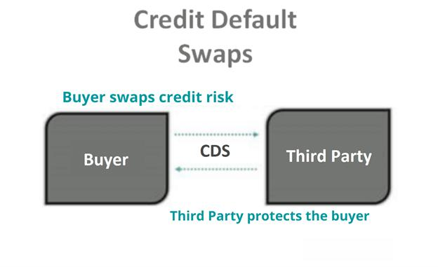

Financial derivatives have become integral tools in modern financial markets. These financial instruments derive their value from an underlying entity, which could include assets such as stocks, bonds, commodities, currencies, interest rates, or market indices. They provide sophisticated mechanisms for hedging risks and enhancing portfolio strategies, allowing market participants to lock in prices, hedge against potential losses, and stabilize revenue streams.

Among the various classes of financial derivatives, credit-based products hold particular significance. These include intricate instruments such as credit default swaps (CDS) and are fundamentally linked to credit events. Credit events represent specific situations that significantly influence the creditworthiness of an entity, like defaults, restructurings, or bankruptcies. Such occurrences often trigger settlements in credit derivative markets and underscore the necessity of these instruments for managing credit risk and formulating refined strategies.



The landscape of financial derivatives trading has been fundamentally reshaped by the advent of algorithmic trading. This technological evolution combines data analytics with high-speed computing to transform the trading process. By utilizing complex algorithms, traders can execute orders at speeds and frequencies beyond human capability, achieving optimal pricing and minimal market impact. Algorithmic trading has been particularly influential in the trading of derivatives, including credit default swaps, enhancing efficiency and precision in this volatile segment.

This article is intended to explore the interconnected world of financial derivatives, focusing on credit events and credit default swaps, alongside their symbiosis with algorithmic trading. Through this exploration, we will understand how these elements collaboratively enhance market operations and provide strategic advantages for risk management and trading efficiency.

## Table of Contents

## Understanding Financial Derivatives

Financial derivatives are complex financial instruments that derive their value from the performance of underlying entities such as assets, indices, or interest rates. The primary purpose of derivatives is to provide mechanisms for risk management, speculation, and arbitrage in financial markets. The valuation of derivatives depends on the fluctuations of the underlying asset, serving as essential tools for investors aiming to hedge against potential market volatility or capitalize on price movements.

The fundamental types of financial derivatives include futures, options, and swaps. Each of these derivative types serves distinct functions and carries unique characteristics that cater to different financial strategies and risk appetites.

**Futures** are standardized contracts obligating the buyer to purchase, or the seller to sell, an asset at a predetermined future date and price. Trading futures typically occurs on exchanges, facilitating a high degree of liquidity and transparency. They are mostly used by investors to hedge against risks associated with price changes in commodities, currencies, or financial instruments. For instance, a wheat farmer might use futures contracts to lock in a specific price ahead of the harvest season, thereby mitigating the risk of price fluctuations.

**Options** give the holder the right, but not the obligation, to buy or sell an underlying asset at a predetermined price within a specified time period. Two main types of options exist: call options, which confer the right to purchase an asset, and put options, which confer the right to sell an asset. Options are versatile instruments, allowing investors to hedge portfolio risks or speculate on market movements with limited potential losses, confined to the premium paid for the option.

**Swaps** are derivative contracts through which two parties exchange financial instruments, typically involving cash flows from financial assets like loans or bonds. Interest rate swaps, one of the most prevalent types, involve exchanging fixed interest payments for floating-rate interest payments, allowing parties to manage interest rate exposure effectively. Currency swaps enable the exchange of principal and interest payments in different currencies, assisting multinational corporations in managing foreign exchange risk.

The applications of these derivatives extend beyond simple hedging. They also provide opportunities for leveraging positions, enhancing portfolio performance, and executing complex financial strategies. The dynamic nature of derivatives enables market participants to achieve a wide range of financial objectives, while their inherent complexity requires a sound understanding of the underlying risks and market factors influencing their valuation. As derivatives are instrumental in managing financial risk, they play a pivotal role in maintaining market stability and efficiency.

## Exploring Credit Events

Credit events are pivotal occurrences that can deeply affect the creditworthiness and financial stability of an entity. These events typically include defaults, restructurings, or bankruptcies, each with distinct implications on the financial markets. A default occurs when an entity is unable to meet its debt obligations, often leading to legal procedures and a potential loss of asset value. Restructuring, on the other hand, involves altering the terms of debt agreements to help an entity avoid default. Bankruptcy, a severe financial state, involves a legal process where an entity's liabilities exceed its assets, leading to insolvency and potential liquidation or reorganization.

These credit events are crucial because they trigger the settlement of contracts in credit derivative markets. Credit derivatives are financial instruments like Credit Default Swaps (CDS), which provide a mechanism for transferring credit risk from one party to another. A credit event in the context of a CDS leads to the activation of the swap contract, often resulting in a payout to the protection buyer.

For instance, if a CDS is based on the debt of a corporation that declares bankruptcy, the event would trigger a payment. The settlement process can be physical, where the bond or loan is delivered to the protection seller, or cash-settled, where the difference between the bond’s face value and recovery price is paid.

Understanding credit events is essential for managing credit risk, which is a critical component of financial risk management strategies. Investors and risk managers need to evaluate the likelihood and impact of these events to make informed decisions about credit exposures. Quantitative measures such as probability of default (PD) and loss given default (LGD) are often used to assess and price credit risks in derivatives markets.

For accurate risk assessment, models and algorithms are employed. Here's a simple Python code illustrating how one might simulate the probability of a credit event using a basic Monte Carlo method.

```python
import numpy as np

# Parameters
probability_of_default = 0.02  # 2% annual default probability
num_simulations = 10000
years = 5

# Monte Carlo simulation
def simulate_credit_event_probability(pd, years, simulations):
    events = np.random.binomial(n=1, p=pd, size=(simulations, years))
    return np.mean(np.sum(events, axis=1) > 0)

estimated_probability = simulate_credit_event_probability(probability_of_default, years, num_simulations)
print(f"Estimated Probability of Credit Event in {years} years: {estimated_probability:.4f}")
```

Such simulations and statistical models help in gauging potential credit events' impact on portfolios and informing hedging strategies. Understanding the nuances and triggers of credit events is crucial, given their significant role in influencing credit derivative positions and market stability.

## Credit Default Swaps: An Essential Tool

Credit Default Swaps (CDS) are financial instruments that allow participants to manage credit risk by transferring the credit exposure of fixed income products between parties. Introduced in the 1990s, CDS have since become fundamental in the landscape of financial derivatives, predominantly used to hedge against the risk of default. They function as a form of insurance whereby the buyer of the CDS makes periodic payments to the seller in exchange for a payoff if a specified credit event, like default or restructuring, occurs.

Structurally, a CDS consists of two main parties: the protection buyer and the protection seller. The buyer seeks to mitigate exposure to potential credit losses on a reference asset, such as a corporate bond or loan. In contrast, the seller provides this protection in return for a periodic fee, generally known as the "CDS spread." The reference asset defines the underlying credit risk, and its creditworthiness significantly influences the CDS pricing.

The functioning of CDS relies heavily on the occurrence of credit events predefined in the contract. In the event of a default or another agreed-upon situation, the CDS protects the buyer by requiring the seller to compensate for the loss. This compensation can either be the face value of the asset minus its recovery value (physical settlement) or a cash settlement based on the difference between the original credit spread and the current market spread.

CDS have significant implications in the financial industry. They provide [liquidity](/wiki/liquidity-risk-premium) and enable market participants to express a view on the credit quality of an entity without holding the underlying asset. For instance, investors can use CDS to hedge sovereign or corporate bond portfolios, thus managing their risk exposure more flexibly. Furthermore, CDS pricing reflects credit market sentiment, providing insights into how market participants perceive the creditworthiness of entities.

The CDS market has also evolved with the development of CDS indices, which pool multiple single-name CDS contracts. These indices increase market efficiency by providing broader credit exposure and facilitating greater diversification. Notable indices include the CDX in North America and the iTraxx in Europe and Asia.

Despite their utility, CDS have been subject to scrutiny and regulatory oversight due to their complexity and the systemic risk they could pose during financial turmoil. The financial crisis of 2008 highlighted these concerns, leading to tighter regulatory frameworks aimed at increasing transparency and reducing counterparty risk.

In summary, Credit Default Swaps serve as a vital tool for managing credit exposure and providing insights into credit market dynamics. Their ability to transfer and hedge risk is indispensable for financial institutions, making them a cornerstone of modern financial markets.

## The Interplay of Credit Derivatives and Algo Trading

Algorithmic trading has significantly transformed the trading of credit derivatives by leveraging advanced technology and sophisticated data analytics. This innovation has facilitated unprecedented efficiencies and speeds, fundamentally altering the landscape for instruments such as credit default swaps (CDS).

Algorithms are at the heart of this transformation, enabling traders to execute complex strategies with precision and speed. By processing vast amounts of market data in real-time, algorithms can identify trading opportunities and execute transactions far quicker than traditional methods. This capability is particularly advantageous in the trading of credit derivatives, where understanding and responding to market movements swiftly is critical.

One primary benefit of [algorithmic trading](/wiki/algorithmic-trading) in credit derivatives is the enhancement of liquidity. By automating the execution of trades, algorithms ensure that buy and sell orders are matched efficiently, reducing the time it takes for these transactions to occur. This increased liquidity can lead to tighter bid-ask spreads, which lowers the cost of trading for participants.

Risk management is another area where algorithmic trading excels. Algorithms can continuously monitor market conditions and adapt trading strategies accordingly. For instance, they can automatically adjust positions in response to changes in the perceived credit risk of an instrument, thereby helping to manage exposure and mitigate potential losses. The use of predictive analytics models allows for the anticipation of credit events, providing ample time to implement risk-reducing strategies.

Algorithmic trading systems often utilize statistical and [machine learning](/wiki/machine-learning) models to optimize trading strategies. These models can be trained on historical data to recognize patterns and predict future price movements, which is particularly useful in the volatile credit derivatives market. For example, a machine learning model can be developed using Python as follows:

```python
import numpy as np
from sklearn.model_selection import train_test_split
from sklearn.ensemble import RandomForestRegressor

# Sample data: historical trade prices and market indicators
data = np.array([[...], [...], ...])  # Replace with actual data

# Splitting data into training and testing sets
X = data[:, :-1]  # Market indicators
y = data[:, -1]   # Trade prices

X_train, X_test, y_train, y_test = train_test_split(X, y, test_size=0.2, random_state=42)

# Train a Random Forest model
model = RandomForestRegressor()
model.fit(X_train, y_train)

# Predict future prices
predictions = model.predict(X_test)
```

The code above demonstrates a basic implementation of a predictive model using a random forest regressor to assess pricing in credit derivative markets, showcasing the type of tool traders might use.

Despite the advantages, algorithmic trading is not without risks. The speed and automation that algorithms provide can, if improperly designed or executed, lead to significant market disruptions. As such, robust risk management frameworks and regulatory oversight are critical to mitigate these risks and ensure market stability.

The interoperability of algorithmic trading within the derivatives market highlights its indispensable role in modern financial systems. By optimizing performance and refining risk management processes, algorithms enhance the strategic trading of credit derivatives, ultimately contributing to more efficient financial markets.

## Risk Management and Regulatory Implications

With the complexity of derivatives, particularly those centered on credit risks, effective risk management becomes crucial in protecting both individual firms and the broader financial system. Financial derivatives, while beneficial for hedging and speculative purposes, can amplify systemic risk if not properly managed. Understanding the intricacies involving these instruments allows stakeholders to adopt measures to mitigate potential downsides.

Regulatory frameworks have significantly evolved to provide a structured environment for trading derivatives. Post the 2008 financial crisis, global regulatory bodies such as the International Organization of Securities Commissions (IOSCO) and the Financial Stability Board (FSB) have introduced comprehensive guidelines and standards aimed at promoting market transparency and reducing systemic risk associated with these financial products. Key regulations include the Dodd-Frank Wall Street Reform and Consumer Protection Act in the United States and the European Market Infrastructure Regulation (EMIR) in Europe. Both mandate rigorous reporting, clearing, and capital and margin requirements for derivative transactions, thereby enhancing oversight and reducing counterparty risk.

Risk management in derivatives trading involves several critical components. Firstly, accurate assessment and continuous monitoring of credit risk are crucial. This involves evaluating the counterparty's creditworthiness through quantitative metrics such as the Credit Value Adjustment (CVA), which accounts for the risk of counterparty default during the term of a derivative. Additionally, the application of stress testing and scenario analysis can simulate the impact of adverse market conditions, ensuring preparedness for potential financial strains.

Effective risk management also necessitates the implementation of collateral management practices. Utilizing margin calls, where parties must provide collateral to cover potential losses, helps absorb shocks during volatile market conditions. Moreover, firms deploy risk mitigation techniques like netting and hedging strategies, which reduce the exposure to risk by offsetting positions in correlated assets or derivatives.

The operational component involves maintaining robust internal controls and governance practices, ensuring compliance with regulatory requirements and adherence to risk limits. The integration of advanced technology and data analytics aids in real-time monitoring and reporting, enhancing decision-making processes.

In conclusion, while derivatives, notably those that are credit-focused, offer significant advantages in risk management and strategic asset allocation, they also pose substantial risks if not managed effectively. Regulations and best practices for risk management collectively ensure that the benefits outweigh the risks, fostering a stable and transparent financial ecosystem.

## Conclusion

Financial derivatives, particularly those centered around credit, are indispensable instruments in today's financial markets. They offer tailored solutions for risk management and investment, with credit derivatives like Credit Default Swaps (CDS) providing a mechanism to mitigate potential losses due to credit events such as defaults or restructurings. Understanding these credit events and their implications is crucial for market participants as they form the basis for settlement triggers in credit derivative contracts.

The role of algorithmic trading has become increasingly significant, transforming the way credit derivatives are traded. With advanced algorithms, traders can execute high-speed, data-driven transactions that maximize efficiency and precision, allowing for optimized trading strategies and effective risk management. This technological advancement gives market participants a competitive edge, ensuring they can navigate complex market conditions with agility.

Despite the inherent challenges, the synergy of credit events, CDS, and algorithmic trading contributes to more efficient market operations. As a result, these elements open substantial opportunities for risk management and strategic trading, enabling participants to leverage market movements with a calculated approach. This dynamic interplay underscores the importance of a deep understanding of credit derivatives and the technological tools that enhance their utility in modern financial markets.

## References & Further Reading

[1]: Hull, J. C. (2018). ["Options, Futures, and Other Derivatives."](https://www.semanticscholar.org/paper/Options%2C-Futures%2C-and-Other-Derivatives-Hull/89bdee500c8623864fc9eb7a471546aa713acc44) Pearson Education.

[2]: Stulz, R. M. (2010). ["Credit Default Swaps and the Credit Crisis."](https://www.nber.org/papers/w15384) National Bureau of Economic Research Working Paper No. 15384.

[3]: Duffie, D. (1999). ["Credit Swap Valuation."](https://www.darrellduffie.com/uploads/1/4/8/0/148007615/duffiecreditswapvaluation1999.pdf) Financial Analysts Journal, 55(1), 73-87.

[4]: Lopez de Prado, M. (2018). ["Advances in Financial Machine Learning."](https://www.amazon.com/Advances-Financial-Machine-Learning-Marcos/dp/1119482089) Wiley.

[5]: Durbin, M. (2010). ["All About Derivatives."](https://www.amazon.com/All-About-Derivatives-Second/dp/0071743510) McGraw-Hill Education.

[6]: Awrey, D. (2013). ["The FSA, Integrated Regulation, and the Curious Case of OTC Derivatives."](https://papers.ssrn.com/sol3/papers.cfm?abstract_id=1645800) Journal of Financial Regulation, 1(1), 19-39.

[7]: Hull, J. C., & White, A. (2000). ["Valuing Credit Default Swaps II: Modeling Default Correlations."](https://tspace.library.utoronto.ca/bitstream/1807/127066/1/white_a_2001_valuing_credit_default_II_tspace.pdf) Journal of Derivatives, 8(2).

[8]: Chan, E. (2009). ["Quantitative Trading: How to Build Your Own Algorithmic Trading Business."](https://github.com/ftvision/quant_trading_echan_book) Wiley.