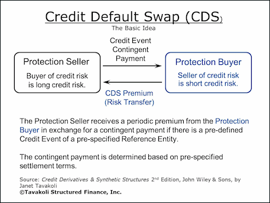

## Table of Contents

## What is a Credit Default Swap (CDS)?

A Credit Default Swap (CDS) is like an insurance policy for a loan or a bond. If you own a bond and you're worried that the company might not be able to pay you back, you can buy a CDS. The seller of the CDS agrees to pay you if the company defaults on the bond. In return, you pay the seller a regular fee, kind of like an insurance premium.

Think of it this way: if you lend money to a friend and you're not sure they'll pay you back, you could ask someone else to cover the loan if your friend can't. You'd pay that person a small amount every month. If your friend pays you back, great! If not, the other person steps in and pays you instead. That's basically what a CDS does, but on a much bigger scale and with companies or governments instead of friends.

## How does a Credit Default Swap work?

A Credit Default Swap (CDS) works by transferring the risk of a bond defaulting from one party to another. Imagine you own a bond from a company, and you're worried that the company might not be able to pay you back. To protect yourself, you can buy a CDS from another party, often a bank or financial institution. You pay them a regular fee, similar to an insurance premium. If the company defaults on the bond, the seller of the CDS has to pay you the value of the bond, so you don't lose your money.

In return for the regular payments, the seller of the CDS takes on the risk of the bond defaulting. If the company pays back the bond without any issues, the seller keeps the fees you paid as profit. However, if the company fails to pay, the seller must cover the loss. This system allows investors to manage their risk, but it also means that the seller of the CDS needs to be careful about how much risk they take on, as they could end up paying out a lot of money if many bonds default at the same time.

## What is a credit event in the context of a CDS?

A credit event in the context of a Credit Default Swap (CDS) is something bad happening to the company or government that issued the bond. It means the company might not be able to pay back the bond. Examples of credit events include the company going bankrupt, not paying interest or principal on time, or restructuring its debt in a way that hurts bondholders.

When a credit event happens, it triggers the CDS. The person who bought the CDS can ask the seller to pay them the value of the bond. This helps the buyer avoid losing money because of the company's problems. The seller of the CDS has to pay if a credit event occurs, which is why they get regular payments from the buyer as a kind of insurance premium.

## What are the common types of credit events?

Credit events are specific situations that trigger a Credit Default Swap (CDS). The most common type of credit event is bankruptcy. This happens when the company that issued the bond can't pay its debts and goes out of business. Another common credit event is failure to pay, which means the company misses a payment on its bond, like not paying interest or the principal amount on time.

Another type of credit event is debt restructuring. This happens when a company changes the terms of its debt in a way that makes it less valuable for bondholders, like extending the time to pay back the bond or reducing the amount they have to pay. These events are important because they show that the company is in financial trouble, and they trigger the CDS, making the seller of the CDS pay the buyer to cover the loss.

Sometimes, other events like a government taking over a company (called government intervention) or a company repudiating its debt (refusing to pay it back) can also be considered credit events. These situations are less common but still important because they can affect the value of bonds and trigger the CDS.

## Who are the typical buyers and sellers of CDSs?

The typical buyers of Credit Default Swaps (CDSs) are investors who own bonds and want to protect themselves from the risk of the bond issuer defaulting. These buyers might be banks, hedge funds, or other financial institutions that have a lot of money invested in bonds. They buy CDSs to make sure they don't lose money if the company that issued the bond can't pay them back. Sometimes, investors who don't even own the bond might buy a CDS if they think the company is going to have financial problems soon. They can make money if the company defaults.

The sellers of CDSs are usually big financial institutions like banks or insurance companies. They sell CDSs to earn the regular payments, which are like insurance premiums, from the buyers. These sellers take on the risk that the bond issuer might default, but they get paid for taking that risk. If they manage the risk well, they can make a profit from the fees they collect. However, if many bond issuers default at the same time, the sellers could end up having to pay out a lot of money, which is what happened during the 2008 financial crisis.

## What are the benefits of using Credit Default Swaps?

Credit Default Swaps (CDSs) offer a way for investors to manage risk. If you own a bond and you're worried the company might not pay you back, a CDS acts like insurance. By buying a CDS, you pay a small fee regularly, but if the company fails to pay, the seller of the CDS will cover your loss. This helps investors feel safer when they put money into bonds, because they know they have a backup plan if things go wrong.

CDSs also help make the bond market work better. They let investors and financial institutions trade risk more easily. For example, a bank might have a lot of bonds and want to reduce its risk. By selling CDSs, the bank can earn extra money from the fees. This can make the whole financial system more stable because risks are spread out among different people and companies. But it's important to use CDSs carefully, because if too many companies default at once, the sellers of the CDSs could have big problems.

## What are the risks associated with Credit Default Swaps?

Credit Default Swaps (CDSs) can be risky for both buyers and sellers. For buyers, the main risk is that the seller of the CDS might not be able to pay if a credit event happens. This is called counterparty risk. If the seller goes bankrupt or has too many claims to pay at once, the buyer might not get the money they were expecting. Also, if the bond does well and doesn't default, the buyer has paid fees for nothing, which can feel like a waste of money.

For sellers, the risks are even bigger. They take on the risk of the bond defaulting, and if many bonds default at the same time, the seller could owe a lot of money. This is what happened during the 2008 financial crisis, when many sellers of CDSs couldn't pay their claims, causing huge problems in the financial system. Sellers need to be careful about how much risk they take on and make sure they have enough money to cover any potential losses.

Using CDSs can also lead to other problems in the market. For example, some people might buy CDSs without owning the bonds, just betting that a company will fail. This can make the market more unstable and can lead to more companies going bankrupt if too many people are betting against them. It's important for everyone to understand these risks and use CDSs carefully.

## How are Credit Default Swaps priced?

Credit Default Swaps (CDSs) are priced based on how likely it is that the company will not be able to pay back its bond. The price of a CDS is usually shown as a percentage, called the spread. If a company is seen as risky, the spread will be higher because the buyer of the CDS needs to pay more to get protection. The spread is like an insurance premium; the riskier the bond, the higher the premium. Other things that affect the price include how long the CDS lasts, the amount of the bond it covers, and what's happening in the overall economy.

People who price CDSs also look at the bond's credit rating, which is a score given by agencies like Moody's or Standard & Poor's. A lower credit rating means the bond is riskier, so the CDS will cost more. They also think about how easy it would be to sell the bond if they needed to. If the bond is hard to sell, the CDS might be more expensive because it's harder to manage the risk. Pricing a CDS is tricky because it involves guessing the future, but it's important to get it right so that both the buyer and the seller feel they are getting a fair deal.

## What role did CDSs play in the 2008 financial crisis?

Credit Default Swaps (CDSs) played a big role in the 2008 financial crisis. Many banks and other financial institutions sold CDSs to protect against the risk of mortgage-backed securities failing. These securities were bundles of home loans, and when the housing market crashed, a lot of people couldn't pay their mortgages. This caused the value of these securities to drop, and the companies that had sold CDSs to protect them had to pay out huge amounts of money. Many sellers didn't have enough money to cover all the claims, which led to big problems for them and the whole financial system.

The use of CDSs also made the crisis worse because some people were betting against the housing market by buying CDSs without even owning the securities. This increased the amount of money that had to be paid out when the market crashed. It created a cycle where more and more companies failed, causing even more CDSs to be triggered. The 2008 crisis showed how dangerous it can be if too many CDSs are sold without enough money to back them up, leading to new rules to try to prevent this from happening again.

## How are Credit Default Swaps regulated?

Credit Default Swaps (CDSs) are now more regulated than they were before the 2008 financial crisis. Governments and financial watchdogs, like the U.S. Securities and Exchange Commission (SEC) and the Commodity Futures Trading Commission (CFTC), have made rules to make sure that CDSs are used safely. One big change is that many CDSs now have to be traded through clearinghouses. These are special organizations that stand between the buyer and seller of a CDS, making sure that if one side can't pay, the other side is still protected. This helps lower the risk that sellers won't be able to pay out if a lot of bonds default at the same time.

Another important rule is that banks and other big financial institutions have to report their CDS deals. This means they have to tell the regulators how many CDSs they've bought or sold, and how much risk they're taking on. This helps the regulators keep an eye on the market and step in if things start to look dangerous. While these rules have made the CDS market safer, it's still important for everyone involved to be careful and understand the risks they're taking on.

## What is the difference between a single-name CDS and a basket CDS?

A single-name Credit Default Swap (CDS) is like insurance for one specific bond or loan. If you own a bond from a company and you're worried they might not pay you back, you can buy a single-name CDS. It protects just that one bond. You pay a regular fee to the seller of the CDS, and if the company fails to pay, the seller gives you money to cover your loss. It's simple because it's focused on one bond, but if that bond does well, you've paid the fees for nothing.

A basket CDS, on the other hand, is like insurance for a group of bonds or loans. Instead of protecting just one bond, it covers several bonds at once. This can be good if you own a bunch of different bonds and want to protect them all with one deal. The cost of a basket CDS depends on how risky the group of bonds is. If any of the bonds in the basket have a problem, the CDS might pay out, but it's more complicated because it involves managing the risk of multiple bonds at the same time.

## How can advanced trading strategies be implemented using CDSs?

Advanced trading strategies using Credit Default Swaps (CDSs) can help investors make money or manage risk in smart ways. One way is by using CDSs to bet on the health of a company without owning its bonds. If an investor thinks a company is going to have trouble paying its debts, they can buy a CDS on that company's bonds. If the company does have problems and defaults, the investor makes money from the CDS payout. This is called taking a short position, and it can be profitable if the investor guesses right about the company's future.

Another strategy is to use CDSs to hedge a portfolio. If an investor owns a lot of bonds from different companies, they can buy CDSs to protect against the risk of any of those companies defaulting. This is like buying insurance for the whole portfolio. By carefully choosing which CDSs to buy, the investor can lower their overall risk without selling their bonds. It's a way to keep the bonds they like while still feeling safer about their investment. Both of these strategies need careful thinking and understanding of the market, but they can be powerful tools for managing money.

## References & Further Reading

[1]: Hull, J. C. (2018). ["Options, Futures, and Other Derivatives."](https://www.semanticscholar.org/paper/Options%2C-Futures%2C-and-Other-Derivatives-Hull/89bdee500c8623864fc9eb7a471546aa713acc44) Pearson Education.

[2]: Stulz, R. M. (2010). ["Credit Default Swaps and the Credit Crisis."](https://www.nber.org/papers/w15384) National Bureau of Economic Research Working Paper No. 15384.

[3]: Duffie, D. (1999). ["Credit Swap Valuation."](https://www.darrellduffie.com/uploads/1/4/8/0/148007615/duffiecreditswapvaluation1999.pdf) Financial Analysts Journal, 55(1), 73-87.

[4]: Lopez de Prado, M. (2018). ["Advances in Financial Machine Learning."](https://www.amazon.com/Advances-Financial-Machine-Learning-Marcos/dp/1119482089) Wiley.

[5]: Durbin, M. (2010). ["All About Derivatives."](https://www.amazon.com/All-About-Derivatives-Second/dp/0071743510) McGraw-Hill Education.

[6]: Awrey, D. (2013). ["The FSA, Integrated Regulation, and the Curious Case of OTC Derivatives."](https://papers.ssrn.com/sol3/papers.cfm?abstract_id=1645800) Journal of Financial Regulation, 1(1), 19-39.

[7]: Hull, J. C., & White, A. (2000). ["Valuing Credit Default Swaps II: Modeling Default Correlations."](https://tspace.library.utoronto.ca/bitstream/1807/127066/1/white_a_2001_valuing_credit_default_II_tspace.pdf) Journal of Derivatives, 8(2).

[8]: Chan, E. (2009). ["Quantitative Trading: How to Build Your Own Algorithmic Trading Business."](https://github.com/ftvision/quant_trading_echan_book) Wiley.