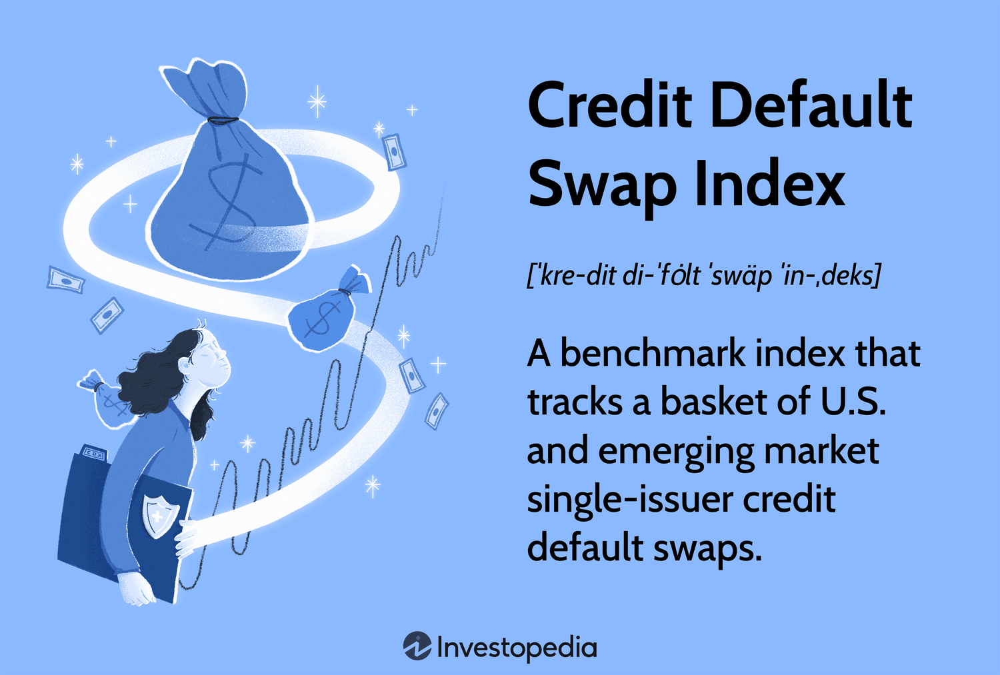

## Table of Contents

## What are credit derivatives?

Credit derivatives are financial tools that let people manage the risk of someone not paying back a loan. They work by transferring the risk from one party to another. For example, if a bank lends money to a company, it might use a credit derivative to protect itself if the company can't pay back the loan. The bank pays a fee to another party, who agrees to cover the loss if the company defaults.

These tools are often used by banks and investors to spread out their risk. They can buy and sell credit derivatives like they trade stocks or bonds. This helps them manage how much risk they want to take on. Credit derivatives can be complex, but they play a big role in the financial world by helping to keep the system stable and allowing more people to lend and borrow money safely.

## What is a credit derivative index?

A credit derivative index is like a big list of credit derivatives that are grouped together. It helps people who want to invest in many credit derivatives at once, instead of buying them one by one. Think of it as a basket where you can put a bunch of different fruits instead of buying each fruit separately. The most famous credit derivative index is called the CDX, which stands for Credit Default Swap Index.

These indexes make it easier for investors to see how well a group of credit derivatives is doing. They can use the index to understand the overall health of the market or to compare different groups of credit derivatives. Just like how a weather report gives you an idea of what the weather will be like, a credit derivative index gives investors a quick snapshot of the credit market's condition.

## What are the most common types of credit derivative indexes?

The most common types of credit derivative indexes are the CDX and the iTraxx. The CDX, which stands for Credit Default Swap Index, is used mainly in North America. It groups together credit default swaps, which are a type of credit derivative that protects against the risk of a company not paying back its debt. The CDX is split into different series based on the types of companies included, like high-yield or investment-grade companies.

The iTraxx is another popular index, used mostly in Europe and Asia. Like the CDX, it also groups credit default swaps, but it focuses on companies from those regions. The iTraxx has different versions too, such as the iTraxx Europe, which includes European companies, and the iTraxx Asia, which includes companies from Asia. Both the CDX and iTraxx help investors manage risk and understand market trends more easily by tracking a basket of credit derivatives.

## How do credit derivative indexes work?

Credit derivative indexes work by grouping together a bunch of credit derivatives, like credit default swaps, into one big package. This makes it easier for investors to buy and sell many credit derivatives at once, instead of dealing with each one separately. Think of it like buying a mixed fruit basket instead of buying each fruit one by one. The most common indexes are the CDX for North America and the iTraxx for Europe and Asia. Each index is made up of a specific list of companies, and it's updated regularly to keep it current.

These indexes help investors manage risk and understand how the market is doing. For example, if an investor wants to protect against the risk of many companies defaulting on their loans, they can buy an index that includes those companies. If one or more of the companies in the index can't pay back their loans, the index will pay out to the investor. This way, the investor doesn't have to worry about each company individually. By tracking these indexes, investors can also see trends in the market and make smarter decisions about where to put their money.

## What are the benefits of investing in credit derivative indexes?

Investing in credit derivative indexes has several benefits. One big advantage is that it helps spread out risk. Instead of worrying about one company not paying back its loan, you can invest in an index that includes many companies. This way, if one company has trouble, the impact on your investment is smaller because you're covered by the whole group. It's like not putting all your eggs in one basket. This makes it easier to manage the risk of companies not paying back their loans, which is a big worry for investors.

Another benefit is that credit derivative indexes make it easier to understand how the market is doing. By looking at an index like the CDX or iTraxx, you can see if the overall market is healthy or if there are problems. This can help you make better decisions about where to put your money. Plus, these indexes are updated regularly, so you always have the latest information. This can be really helpful for investors who want to keep a close eye on the market and adjust their investments as needed.

## What are the risks associated with credit derivative indexes?

Investing in credit derivative indexes can be risky because they are complex financial tools. One big risk is that if many companies in the index can't pay back their loans, the value of the index can drop a lot. This can lead to big losses for investors. Also, these indexes can be hard to understand because they involve a lot of different companies and financial terms. If you don't fully understand what you're investing in, you might make bad decisions and lose money.

Another risk is that credit derivative indexes can be affected by things happening in the whole economy, not just the companies in the index. For example, if there's a big economic downturn, more companies might have trouble paying back their loans, which can hurt the index. This means that even if you think you've spread out your risk by investing in an index, you could still face big problems if the whole market goes down. It's important to think about these risks and maybe talk to a financial advisor before investing in credit derivative indexes.

## How are credit derivative indexes priced?

Credit derivative indexes are priced based on the value of the credit default swaps (CDS) that make up the index. Each CDS in the index is linked to a company's ability to pay back its loans. The price of the index goes up or down depending on how likely it is that these companies will default on their loans. If investors think there's a higher chance of defaults, the price of the index will go up because it costs more to protect against that risk. On the other hand, if the risk of defaults seems low, the price of the index will go down.

These indexes are also affected by supply and demand in the market. If more people want to buy the index to protect against the risk of defaults, the price will go up. If fewer people want to buy it, the price will go down. The pricing is updated regularly to reflect changes in the market and the creditworthiness of the companies in the index. This means that the price of a credit derivative index can change often, making it important for investors to keep an eye on it.

## What role do credit derivative indexes play in financial markets?

Credit derivative indexes play a big role in financial markets by helping investors manage risk. They do this by grouping together many credit derivatives, like credit default swaps, into one package. This makes it easier for investors to protect themselves against the risk of many companies not paying back their loans at once. Instead of buying protection for each company separately, which can be complicated and expensive, investors can buy an index that covers a whole group of companies. This way, they can spread out their risk and feel more secure about their investments.

These indexes also help investors understand how the market is doing. By looking at an index like the CDX or iTraxx, investors can see if the overall market is healthy or if there are signs of trouble. This information is really useful for making smart investment decisions. For example, if an index shows that the risk of companies defaulting on their loans is going up, investors might decide to be more careful with their money. By providing a quick snapshot of the market's condition, credit derivative indexes help keep the financial system stable and allow more people to lend and borrow money safely.

## How can one invest in credit derivative indexes?

To invest in credit derivative indexes, you can buy them through a financial institution like a bank or an investment firm. These institutions often have special departments that deal with these kinds of investments. You'll need to open an account with them and then you can buy the index you're interested in, like the CDX for North America or the iTraxx for Europe and Asia. It's a good idea to talk to a financial advisor first because these indexes can be complicated and risky.

Once you've bought into a credit derivative index, you'll need to keep an eye on it because its value can change a lot. The price of the index depends on how likely it is that the companies in the index will default on their loans. If the risk of defaults goes up, the price of the index goes up too. You can usually sell your investment whenever you want, but the price you get will depend on what's happening in the market at that time. Always remember that investing in these indexes involves risks, so it's important to understand what you're getting into before you start.

## What are the regulatory considerations for credit derivative indexes?

Credit derivative indexes are watched closely by regulators because they can affect the whole financial system. In the United States, the main regulator is the Commodity Futures Trading Commission (CFTC), which makes sure that trading in these indexes is fair and transparent. They set rules about how these indexes can be traded, who can trade them, and how much information needs to be shared with the public. This helps keep the market stable and protects investors from big surprises.

In Europe, the European Securities and Markets Authority (ESMA) does a similar job. They have rules to make sure that credit derivative indexes are traded safely and that everyone knows what's going on in the market. Both the CFTC and ESMA work to stop fraud and make sure that the indexes are used in a way that doesn't hurt the economy. Because these indexes can be risky, regulators want to make sure that everyone understands the rules and follows them.

## How have credit derivative indexes evolved over time?

Credit derivative indexes started in the early 2000s as a way for investors to manage the risk of companies not paying back their loans. The first big index was the CDX, which was created in North America. It grouped together credit default swaps, which are a type of credit derivative that protects against the risk of a company defaulting on its debt. The idea was to make it easier for investors to buy and sell protection for many companies at once, instead of dealing with each one separately. This helped spread out risk and made the market more efficient.

Over time, credit derivative indexes have grown and changed a lot. New indexes like the iTraxx were created for Europe and Asia, giving investors more options to manage risk in different parts of the world. These indexes are now updated regularly to keep up with changes in the market and the creditworthiness of the companies included. They've become an important tool for investors to understand market trends and make smart decisions. Despite their complexity and risks, credit derivative indexes have played a big role in keeping the financial system stable and helping more people lend and borrow money safely.

## What are the future trends and innovations in credit derivative indexes?

Credit derivative indexes are likely to keep changing and getting better in the future. One big trend might be using more technology, like artificial intelligence and machine learning, to make these indexes smarter. This could help predict when companies might have trouble paying back their loans more accurately. Also, as more people around the world start using these indexes, they might become even more important in places like Asia and Latin America. This could mean new indexes for these regions or even more types of indexes to cover different kinds of risks.

Another trend could be making credit derivative indexes easier to understand and use. Right now, they can be pretty complicated, which might scare some people away. In the future, there might be simpler ways to buy and sell these indexes, maybe even through apps on your phone. This would make it easier for more people to use them to manage their risk. Also, regulators might come up with new rules to make sure these indexes are safe and fair for everyone, which could help them grow even more.

## References & Further Reading

[1]: Hull, J. (2017). ["Options, Futures, and Other Derivatives."](https://elibrary.pearson.de/book/99.150005/9781292212920) Pearson Education.

[2]: Das, S. (2005). ["Credit Derivatives: CDOs and Structured Credit Products."](https://archive.org/details/creditderivative0000dass) Wiley.

[3]: Aldridge, I. (2013). ["High-Frequency Trading: A Practical Guide to Algorithmic Strategies and Trading Systems."](https://www.amazon.com/High-Frequency-Trading-Practical-Algorithmic-Strategies/dp/1118343506) Wiley.

[4]: Lopez de Prado, M. (2018). ["Advances in Financial Machine Learning."](https://www.amazon.com/Advances-Financial-Machine-Learning-Marcos/dp/1119482089) Wiley.

[5]: Chan, E. P. (2009). ["Quantitative Trading: How to Build Your Own Algorithmic Trading Business."](https://github.com/ftvision/quant_trading_echan_book) Wiley.