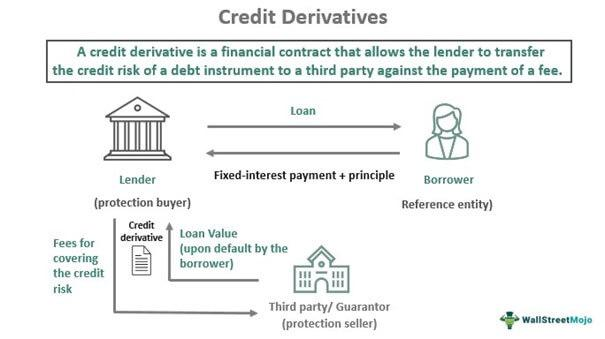

Derivative instruments are essential components of modern financial markets, serving as pivotal tools for diversifying portfolios and enhancing risk management strategies. These instruments derive their value from underlying assets, such as stocks, bonds, and indexes, offering a spectrum of applications ranging from hedging to speculation. Among the various types of derivatives, credit derivatives play a significant role in allowing market participants to mitigate credit risks. These specialized financial instruments, particularly credit default swaps, offer protection against the default of borrowers, facilitating the transfer of risk between parties and contributing to more accurate risk pricing within credit markets.

Financial indexes, such as the S&P 500 and Dow Jones, serve as vital benchmarks for evaluating market performance and the efficacy of derivative instruments. These indexes aggregate the performance of a set of instruments, thus providing insights into market trends and forming the basis for constructing index derivatives that enable traders to capitalize on broad market movements. Such derivatives are integral to managing risk within investment portfolios.



The emergence of algorithmic trading has revolutionized trade execution in financial markets. Utilizing computer algorithms to conduct trades based on predefined criteria, this technology enhances efficiency and precision in trading operations. High-frequency trading, in particular, has benefitted immensely from algorithmic strategies, which allow for rapid transaction processing and capitalizing on market fluctuations. The advent of algorithmic trading introduces new dynamics into the marketplace, presenting both opportunities and challenges by reshaping trading paradigms and influencing market behavior.

This article will discuss the interconnected nature of these financial products and technologies, examining their respective roles and substantial impacts on global financial markets. By understanding their functions and influences, we can appreciate how they collectively shape today's financial landscape, offering valuable insights into both the benefits and challenges they present to investors and institutions.

## Table of Contents

## Understanding Derivative Instruments

Derivatives are financial instruments that derive their value from an underlying asset or group of assets. These underlying assets, known as the 'basis', can include stocks, bonds, commodities, currencies, interest rates, or market indexes. The primary function of derivatives is to facilitate a variety of financial strategies, such as hedging against price volatility, speculating for profit, or arbitraging price discrepancies.

### Common Types of Derivatives:

1. **Futures Contracts**: These standardized contracts obligate the buyer to purchase, or the seller to sell, an asset at a predetermined future date and price. Futures are commonly used in commodities markets, such as oil or grains, to lock in prices and hedge against price fluctuations.

2. **Options Contracts**: Options provide the purchaser the right, but not the obligation, to buy (call option) or sell (put option) an asset at a specified strike price before or at expiration. This flexibility allows investors to speculate on the direction of market prices with limited risk relative to direct investment in the asset.

3. **Swaps**: These are customized contracts between two parties to exchange cash flows or other financial instruments. Interest rate swaps and currency swaps are prevalent, allowing participants to manage risks related to interest rate fluctuations and currency exchange rates.

4. **Forward Contracts**: Similar to futures, forward contracts allow two parties to agree on buying or selling an asset at a future date for a price established now. However, unlike futures, forwards are customizable and traded over-the-counter.

### Influences on Derivative Values:

The value, or price, of derivative instruments is highly sensitive to changes in market conditions. Factors such as the price of the underlying asset, the time until expiration, interest rates, and market [volatility](/wiki/volatility-trading-strategies) all influence derivative pricing. For instance, options pricing often employs mathematical models like the Black-Scholes model to determine theoretical prices based on these factors.

Here's a simplified Python code snippet to calculate the price of a European call option using the Black-Scholes model:

```python
from math import log, sqrt, exp
from scipy.stats import norm

def black_scholes_call(S, K, T, r, sigma):
    """
    Calculate the Black-Scholes call option price.

    :param S: Current stock price
    :param K: Strike price
    :param T: Time to expiration in years
    :param r: Risk-free interest rate
    :param sigma: Volatility of the stock
    :return: Call option price
    """
    d1 = (log(S / K) + (r + sigma ** 2 / 2) * T) / (sigma * sqrt(T))
    d2 = d1 - sigma * sqrt(T)
    call_price = S * norm.cdf(d1) - K * exp(-r * T) * norm.cdf(d2)
    return call_price
```

### Complexity in Trading:

Trading derivatives requires a deep understanding of market dynamics and the factors that influence the prices of both the derivatives and their underlying assets. The leverage provided by derivatives can amplify both profits and losses, which is why they are regarded as powerful but complex financial instruments. Effective risk management and precise market predictions are crucial for successful derivatives trading. This intricate nature of derivatives underscores their importance in financial strategies used by individuals, institutional investors, and corporations alike.

## What Are Credit Derivatives?

Credit derivatives are a subset of financial instruments specifically designed to manage exposure to credit risk, which is the risk that a borrower will default on their obligations. These derivatives serve as important tools for financial institutions and investors to hedge against potential credit events and transfer risk between parties. Common types of credit derivatives include credit default swaps, loan-only credit default swaps, and credit-linked notes.

Credit default swaps (CDS), the most commonly used credit derivatives, function as a form of insurance against the default of a borrower. In a CDS contract, one party, the protection buyer, pays a periodic fee to another party, the protection seller. In exchange, the seller agrees to compensate the buyer if a specified credit event, such as a default or a restructuring, occurs with respect to a reference entity. This mechanism allows risk to be transferred from the buyer to the seller, providing a safeguard against potential losses from credit events.

For instance, if the reference entity defaults, the protection seller pays the buyer an amount that is typically the difference between the debt's nominal value and its recovery value post-default. This payout structure enables the buyer to mitigate losses stemming from the default. CDS are thus crucial in enabling financial entities to manage their credit exposure more effectively and adjust their risk profiles in line with their strategic objectives.

In addition to hedging against specific credit risks, credit derivatives enhance market [liquidity](/wiki/liquidity-risk-premium) and facilitate the more accurate pricing of credit risk. By allowing participants to isolate and trade credit risk separately from the underlying asset, credit derivatives contribute to a more efficient allocation of risk in financial markets. This separation of credit risk from market risk is pivotal in enabling investors to tailor their risk exposure and implement complex trading strategies.

Moreover, these derivatives promote deeper and more liquid credit markets by allowing a wider range of participants to engage with credit risk, beyond traditional lenders and investors. As a result, credit derivatives not only aid in risk management but also support the stabilization and development of credit markets.

In conclusion, credit derivatives are vital instruments for managing credit risk, with credit default swaps being the most prevalent form. These financial tools offer protection against credit events, facilitate risk transfer, enhance market liquidity, and contribute to more precise credit risk pricing in financial markets.

## The Role of Financial Indexes

Financial indexes are pivotal in financial markets as they provide standardized benchmarks to evaluate the performance of assets, portfolios, and market segments. Well-known indexes such as the S&P 500 and the Dow Jones Industrial Average consolidate the performance data of selected groupings of stocks, thereby offering a concise overview of market conditions. These indexes enable investors, analysts, and fund managers to compare individual asset performance relative to the broader market.

Each financial index aggregates a unique set of instruments based on predefined criteria, such as market capitalization, sector, or geographic region. This aggregation enables indexes to reflect broader market movements, thereby offering insight into prevailing market trends. For instance, the S&P 500, comprising 500 leading companies listed on U.S. exchanges, acts as a proxy for the performance of the U.S. stock market. By summarizing data from various instruments, indexes facilitate the identification and analysis of trends, helping in the forecasting of economic conditions and guiding investment decisions.

Indexes also play a critical role in the construction of derivative products including index futures, options, and exchange-traded funds (ETFs). These index derivatives enable investors to engage in trading strategies that exploit broad market movements without targeting individual securities. By doing so, investors can undertake strategies such as hedging against market downturns or speculating on market trends, thereby managing their risk exposures more effectively.

Moreover, index derivatives offer liquidity and lower transaction costs as they represent a basket of securities rather than individual stocks. They also enable diversification, as changes in the value of these derivatives reflect collective movements across the indexed securities. The impact of such instruments is evidenced in the proliferation of ETFs and index funds, which have become a popular choice for both institutional and individual investors seeking market exposure.

In summary, financial indexes serve as essential tools in the financial ecosystem, providing benchmarks for investment performance and facilitating the development of derivative instruments. Through indexes and their derivatives, market participants are furnished with strategic avenues to efficiently manage risk and optimize investment outcomes while capturing the pulse of market trends.

## Algorithmic Trading in Modern Markets

Algorithmic trading, often referred to as algo trading, employs computer algorithms to automate trading processes, executing transactions based on pre-defined criteria such as timing, price, or quantity. This enhances not only efficiency but also precision, reducing the latency associated with human decision-making. In particular, [algorithmic trading](/wiki/algorithmic-trading) significantly influences high-frequency trading ([HFT](/wiki/high-frequency-trading-strategies)), where trades are executed in fractions of a second. The success of HFT firms hinges on their ability to execute tens of thousands of transactions at incredibly high speeds, capitalizing on minuscule price discrepancies across different markets or trading platforms.

The strategies employed in algorithmic trading vary extensively, ranging from simple implementations—such as moving averages and [momentum](/wiki/momentum) trading—to more sophisticated, data-intensive models. For instance, trend-following strategies rely on algorithms to identify and capitalize on market movements by analyzing technical indicators. These strategies are often implemented through relatively straightforward logic that enters trades when certain conditions are met, such as a short-term moving average crossing above a long-term moving average.

On the more complex end of the spectrum, quantitative models utilize vast datasets and [machine learning](/wiki/machine-learning) techniques to predict future price movements. These models might incorporate news analytics, social media sentiment, and various macroeconomic indicators to create a comprehensive trading strategy. Python, with libraries like Pandas, NumPy, and Scikit-learn, has become a favored programming language for developing such quantitative models due to its robust data handling capabilities and the support of vast machine learning frameworks.

```python
import pandas as pd
import numpy as np
from sklearn.linear_model import LinearRegression

# Sample dataset preparation
np.random.seed(0)
dates = pd.date_range('20230101', periods=100)
price_data = pd.DataFrame(np.random.rand(100, 1), index=dates, columns=["Price"])

# Example trend-following strategy using moving average
price_data['Short_MA'] = price_data['Price'].rolling(window=5).mean()
price_data['Long_MA'] = price_data['Price'].rolling(window=20).mean()

# Generate buy/sell signals
price_data['Signal'] = 0
price_data['Signal'][5:] = np.where(price_data['Short_MA'][5:] > price_data['Long_MA'][5:], 1, 0)

# Linear regression for predictive trading model
X = np.array(range(len(price_data))).reshape(-1, 1)
y = price_data['Price'].values
model = LinearRegression().fit(X, y)

# Predict future prices
price_data['Predicted'] = model.predict(X)
```

The impact of algorithmic trading extends beyond mere transactional efficiency; it reshapes market dynamics by contributing to liquidity and enhanced price discovery. However, it also poses new challenges. The [high frequency](/wiki/high-frequency-trading) and [volume](/wiki/volume-trading-strategy) of trades can exacerbate market volatility, creating scenarios such as "flash crashes," where drastic market movements occur in very short periods. These events underscore the necessity for stringent risk management protocols and regulatory oversight to mitigate potential systemic risks associated with automated trading strategies.

## Interconnections and Market Impact

The interplay between derivative instruments, financial indexes, and algorithmic trading generates a multifaceted financial ecosystem that significantly enhances market efficiency while simultaneously introducing systemic risks. Derivatives, such as credit derivatives, serve as essential tools for hedging and speculating on credit risk, impacting both the pricing and perception of credit risk across markets. Credit default swaps (CDS), for example, allow market participants to transfer credit risk, thus influencing the broader credit markets by altering perceived risk levels and potentially affecting credit spreads and valuations.

Financial indexes, by serving as benchmarks like the S&P 500 or Dow Jones, impact the construction and trading of derivatives. These indexes not only reflect market trends but also facilitate the creation of index-linked derivatives that allow for strategies based on market movements. Such derivatives enable investors to manage risks related to broad market changes, capitalizing on trends indicated by these aggregates.

Algorithmic trading further revolutionizes the way trades are executed in modern markets, using sophisticated computer programs to make split-second trading decisions based on predefined criteria. This technology increases the efficiency and speed of markets but also contributes to increased volatility. High-frequency trading, a subset of algorithmic trading, has been partly blamed for events like flash crashes, where markets experience severe downturns in extremely short timeframes. These incidents highlight the vulnerabilities embedded within advanced trading systems, necessitating robust risk management protocols and systemic safeguards.

Thus, while the confluence of derivatives, indexes, and algorithmic trading brings about enhanced market functionality and opportunities for profit and risk management, it also requires careful oversight and understanding of potential systemic risks. The potential for these innovations to trigger market instability means that investors, institutions, and regulators must remain vigilant and adapt to evolving financial technologies and conditions.

## Conclusion

Derivative instruments, financial indexes, and algorithmic trading form a crucial part of today's financial markets. They collectively offer tools that enable investors to manage risk and engage in market speculation with a degree of precision and efficiency that was previously unattainable. Derivative instruments, such as futures, options, swaps, and credit derivatives, allow participants to hedge against potential market movements, providing a layer of security that can stabilize financial operations against unforeseen fluctuations. This dynamic is further enhanced by financial indexes, which serve as benchmarks for evaluating market performance and guiding investment strategies.

Algorithmic trading, an innovation propelled by technological advancements, facilitates the rapid execution of trades through computer algorithms, often executing strategies that are beyond human capability in terms of speed and complexity. This has opened new horizons for market participants but has also introduced novel challenges regarding market volatility and potential systemic risks.

While these financial instruments and technologies offer substantial advantages, they inherently [carry](/wiki/carry-trading) risks that need careful management. The complexity of derivatives trading, coupled with the speed and volume of algorithmic transactions, requires investors and institutions to cultivate a robust understanding of the associated risks. This understanding is vital to mitigate potential financial crises that could arise from mismanagement or unforeseen market events.

Regulators, too, must keep pace with these evolving financial mechanisms, implementing guidelines and oversight that ensure market integrity and stability. The continuous evolution of financial products necessitates an adaptable regulatory framework that can address emerging risks without stifling innovation.

In conclusion, the interplay of derivative instruments, financial indexes, and algorithmic trading underlines the intricate nature of modern financial markets. As these components continue to evolve, stakeholders must remain vigilant, continually adapting their strategies and risk management practices to sustain market stability and integrity.

## References & Further Reading

[1]: Hull, J. (2017). ["Options, Futures, and Other Derivatives."](https://elibrary.pearson.de/book/99.150005/9781292212920) Pearson Education.

[2]: Das, S. (2005). ["Credit Derivatives: CDOs and Structured Credit Products."](https://archive.org/details/creditderivative0000dass) Wiley.

[3]: Aldridge, I. (2013). ["High-Frequency Trading: A Practical Guide to Algorithmic Strategies and Trading Systems."](https://www.amazon.com/High-Frequency-Trading-Practical-Algorithmic-Strategies/dp/1118343506) Wiley.

[4]: Lopez de Prado, M. (2018). ["Advances in Financial Machine Learning."](https://www.amazon.com/Advances-Financial-Machine-Learning-Marcos/dp/1119482089) Wiley.

[5]: Chan, E. P. (2009). ["Quantitative Trading: How to Build Your Own Algorithmic Trading Business."](https://github.com/ftvision/quant_trading_echan_book) Wiley.