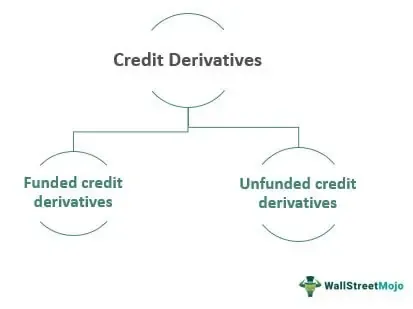

Derivatives have significantly impacted the financial landscape by providing versatile tools for hedging, speculation, and risk management. They allow market participants to transfer various types of risk—such as commodity price fluctuations, currency inconsistencies, and interest rate variability—to those willing to accept them. Among derivatives, credit derivatives hold particular importance as they enable parties to manage exposure to credit risk effectively. This capacity is crucial for financial institutions, investors, and businesses seeking to protect themselves from the potential default of borrowers or changes in credit conditions.

Credit derivatives, however, are complex financial instruments that are not without risks. They have been implicated in financial misuse and crises due to their intricate nature and the substantial leverage they can provide. Such characteristics make them susceptible to speculative practices and, when inadequately regulated, can contribute to financial instability. For instance, during the 2007-2008 financial crisis, misuse of credit derivatives was a significant factor that exacerbated market turmoil, highlighting the necessity for stringent oversight and regulation.



This article aims to explore the diverse types of derivatives, emphasizing credit derivatives and their various forms. We examine their potential for misuse, considering historical instances of financial crises. Furthermore, the article addresses the role of algorithmic trading in the derivatives market, detailing how it influences trading strategies and affects market dynamics. By understanding these elements, stakeholders can better navigate the complexities of modern financial markets and work towards maintaining stability while leveraging the benefits that derivatives offer.

## Table of Contents

## Understanding Financial Derivatives

Derivatives are financial instruments that derive their value from an underlying asset or benchmark, which can include stocks, bonds, interest rates, currencies, or commodities. These instruments are essential for managing financial risk and enhancing liquidity by enabling investors to hedge against potential adverse price movements. They play a crucial role in providing price discovery and allocating risk efficiently across financial markets.

The primary types of financial derivatives are futures, options, forwards, and swaps. Each type has unique characteristics and uses:

1. **Futures Contracts**: These are standardized agreements to buy or sell an asset at a predetermined price and date in the future. Traded on exchanges, futures offer liquidity and reduce credit risk through the intermediation of clearinghouses. For example, a wheat farmer might use futures to lock in a price for their crop, ensuring stability despite market volatility.

2. **Options Contracts**: Options give the holder the right, but not the obligation, to buy or sell an asset at a specified price within a certain period. They are versatile tools for speculation and risk management, providing the flexibility to capitalize on price movements without the commitment of a contract like futures. Options come in two forms: calls (to buy) and puts (to sell).

3. **Forward Contracts**: Similar to futures, forwards are customized contracts between two parties to buy or sell an asset at a specified price and future date. Unlike futures, they are not traded on exchanges and thus carry higher counterparty risk. Forwards are often used in hedging currency and interest rate exposures due to their bespoke nature.

4. **Swaps**: Swaps are agreements between two parties to exchange cash flows or financial instruments over time. Common types include interest rate swaps, where parties exchange fixed interest payments for floating rates to manage interest rate exposure, and currency swaps, used to hedge against foreign exchange risk.

The valuation of derivatives often involves sophisticated mathematical models due to the complexity of their payoff structures and risk characteristics. Black-Scholes, for instance, is a widely used model for pricing European call and put options. This model employs the formula:
$$
C = S_t N(d_1) - X e^{-rt} N(d_2)
$$
where $C$ is the call option price, $S_t$ is the current stock price, $X$ is the strike price, $r$ is the risk-free interest rate, $t$ is the time to expiration, and $N(d)$ is the cumulative distribution function of the standard normal distribution.

The ability to synthetically create a wide array of financial exposures makes derivatives a powerful component in portfolio management, yet also introduces significant complexity and potential for financial instability if not properly managed. As such, derivatives demand sophisticated understanding and rigorous risk assessment by market participants.

## Types of Credit Derivatives

Credit derivatives are financial instruments specifically designed to handle the credit risk associated with debts and similar financial obligations. They allow investors and institutions to transfer this risk between parties, thereby facilitating a more diversified risk management strategy. The following are key types of credit derivatives, each offering unique mechanisms to manage and transfer credit exposure.

**Credit Default Swaps (CDS):** These are agreements where the buyer of the swap makes periodic payments to the seller in exchange for compensation in the event of a credit event, such as a default, by a third party (reference entity). The payout from the seller to the buyer is typically triggered by specific credit events defined in the contract. This instrument allows investors to hedge against potential credit losses of a debtor. For instance, if an institution is worried about the default of a corporate bond it holds, it may enter into a CDS contract as a form of insurance against default.

**Collateralized Debt Obligations (CDOs):** CDOs are complex structured financial products backed by a pool of loans and other assets, which are divided into different risk tranches. Investors in CDOs receive returns depending on the performance of the underlying assets. The tranching allows different investors to assume varying degrees of exposure to credit risk, thereby facilitating risk management tailored to their risk appetite. The senior tranches typically have lower yields and lower risk, while the junior tranches are riskier with potentially higher returns.

**Total Return Swaps (TRS):** A total return swap is a contract where one party, the total return payer, agrees to pay the total return of a reference asset, including interest payments and capital gains, to the total return receiver. In exchange, the receiver agrees to pay a regular fixed or floating cash flow. This swap allows investors to gain or transfer exposure to the credit risk and market performance of an asset without having to own it directly.

**Credit Spread Options:** These options give the holder the right, but not the obligation, to profit from changes in the credit spread of a reference asset. Credit spreads are the difference in yield between two bonds of different credit qualities. A widening credit spread may indicate increasing perceived risk, while a tightening spread could imply a decrease in perceived risk. By purchasing credit spread options, investors can speculate on or hedge against changes in the credit spread, thus managing credit risk exposure effectively.

Each type of credit derivative serves as a tool for investors and financial institutions to effectively hedge against potential risks, optimize their investment strategies, and maintain financial stability. The selection of a specific credit derivative depends on the particular credit exposure and risk management objectives of the institution or investor involved.

## Potential Misuse of Credit Derivatives

Credit derivatives, though potent financial tools for managing credit risk, have shown considerable potential for misuse. The 2007-08 financial crisis serves as a prominent example where the uncontrolled and speculative usage of these instruments resulted in severe economic repercussions. One of the primary issues was the lack of transparency associated with credit derivatives. Many transactions were conducted over-the-counter (OTC), which often led to opaqueness in understanding the actual risks involved. This opacity hindered market participants' ability to assess the true exposure and interconnectedness within the financial system.

Moreover, the excessive leverage that credit derivatives facilitated played a critical role in amplifying financial instability. Financial institutions were able to take on large risk positions with relatively small amounts of capital, creating a fragile structure susceptible to systemic shocks. This leverage was exacerbated by the use of instruments like collateralized debt obligations (CDOs), which repackaged credit risk into complex securities that became difficult to accurately value and monitor.

Conflicts of interest further compounded the misuse of credit derivatives. Financial institutions often played multiple roles in the creation, sale, and rating of these instruments, which sometimes incentivized behavior that prioritized profit over sound risk management. In particular, the misalignment of interests between credit rating agencies and the issuers of CDOs contributed to the underestimation of credit risks.

The culmination of these issues underscores the necessity for robust regulatory frameworks and enhanced risk management practices within the financial industry. By ensuring greater transparency, limiting excessive leverage, and mitigating conflicts of interest, it is possible to reduce the potential for future misuse of credit derivatives. These measures are essential for maintaining financial stability and protecting against systemic risks.

## Algorithmic Trading and Derivatives

Algorithmic trading has revolutionized the way financial markets operate, including the trading of derivatives. By utilizing computer algorithms, traders can execute large volumes of trades at astonishing speeds, leveraging pre-set instructions to manage market positions. The reliance on algorithms allows traders to capitalize on minor price discrepancies, capture [liquidity](/wiki/liquidity-risk-premium), and reduce execution costs, which is particularly advantageous in the derivatives market where price dynamics are highly volatile.

In derivatives trading, the application of algorithmic strategies can enhance market efficiency. For example, algorithms can [arbitrage](/wiki/arbitrage) price differences in futures contracts across different exchanges, a practice known as [statistical arbitrage](/wiki/statistical-arbitrage). By doing so, they help align prices more closely with their theoretical values derived from underlying assets, thus improving market pricing accuracy and liquidity.

Despite its benefits, [algorithmic trading](/wiki/algorithmic-trading) in derivatives markets also presents significant challenges and risks. Algorithms, when inadequately designed or monitored, can exacerbate market [volatility](/wiki/volatility-trading-strategies). Flash crashes, such as the one experienced on May 6, 2010, highlighted the potential for algorithms to collectively trigger massive, rapid sell-offs, thereby destabilizing financial markets. This occurs when algorithms simultaneously react to adverse market signals, creating a cascade effect where automated selling leads to further price declines.

Moreover, the complexity of algorithmic trading systems can introduce systemic risks. A single faulty line of code or a malfunction in an algorithm can lead to unintended large-scale trading activities, resulting in significant financial losses not only for the entity using the algorithm but also affecting broader market stability. This necessitates stringent risk management procedures, including comprehensive testing and real-time monitoring of algorithmic strategies.

The introduction of [machine learning](/wiki/machine-learning) and [artificial intelligence](/wiki/ai-artificial-intelligence) (AI) into algorithmic trading has further transformed derivatives markets. These technologies enable the development of adaptive algorithms capable of learning from market movements and evolving their strategies in real-time. This can yield impressive trading performance, though it also increases the opacity of algorithms, making it harder to predict their behavior and understand decision-making processes.

Regulatory initiatives have sought to address some of these challenges by imposing stricter oversight on algorithmic trading. For example, financial regulators in various jurisdictions have introduced rules requiring financial institutions to maintain risk controls, test algorithms rigorously, and ensure the ability to halt trading operations in case of malfunction.

In conclusion, while algorithmic trading significantly enhances the efficiency and liquidity of derivatives markets, it also amplifies associated risks. Balancing innovation with effective regulation and robust risk management is essential to harness the benefits of algorithmic trading while safeguarding against its potential dangers.

## Regulation and Risk Management

Proper regulation and oversight are crucial to mitigate the risks associated with derivatives trading. The global financial crisis of 2007-2008 underscored the importance of regulatory frameworks to address the systemic risks posed by derivatives, particularly those traded over-the-counter (OTC). This led to significant legislative reforms, most notably in the United States with the implementation of the Dodd-Frank Wall Street Reform and Consumer Protection Act.

### Dodd-Frank Act and Its Impact

The Dodd-Frank Act, enacted in 2010, was a comprehensive reform aimed at increasing transparency, reducing systemic risk, and preventing abusive practices in financial markets. One of the key provisions of the Dodd-Frank Act pertains to the derivatives market. It requires most OTC derivatives to be cleared through central counterparties (CCPs) and mandates the trading of standardized derivatives on regulated exchanges or electronic platforms. This shift from bilateral to centralized clearing enhances transparency and reduces counterparty risk, as CCPs act as intermediaries between the parties involved in a transaction.

Additionally, the act introduces stringent reporting requirements, ensuring that detailed information about derivatives transactions is available to regulators. This increased transparency helps in monitoring market activity and identifying potential threats to financial stability.

### Risk Management Strategies

Effective risk management strategies are vital for financial institutions to safeguard against systemic risks associated with derivatives. These strategies include rigorous credit risk assessments, collateral management, and stress testing.

1. **Credit Risk Assessments**: Financial institutions must thoroughly evaluate the creditworthiness of their counterparties. This involves analyzing financial statements, credit ratings, and historical performance data to assess the likelihood of default.

2. **Collateral Management**: To mitigate counterparty risk, parties often require collateral to be posted. This collateral acts as a buffer, protecting against losses in the event of a counterparty's default. Effective collateral management involves regularly marking to market to ensure that the value of the collateral remains sufficient.

3. **Stress Testing**: Stress tests simulate extreme market conditions to evaluate how a portfolio would perform under adverse scenarios. These tests help institutions identify vulnerabilities and prepare contingency plans to address potential financial strains.

4. **Use of Derivatives Models**: Financial institutions often employ quantitative models to price derivatives and assess risk. Python is a popular language for implementing these models. For instance, a simple Monte Carlo simulation for option pricing can be executed in Python as follows:

   ```python
   import numpy as np

   def monte_carlo_option_pricing(S0, K, T, r, sigma, simulations):
       # S0: initial stock price
       # K: strike price
       # T: time to maturity
       # r: risk-free rate
       # sigma: volatility
       # simulations: number of simulations

       # Generate random paths
       rand = np.random.standard_normal(simulations)
       ST = S0 * np.exp((r - 0.5 * sigma**2) * T + sigma * np.sqrt(T) * rand)

       # Calculate payoff
       payoff = np.maximum(ST - K, 0)

       # Discounted payoff
       option_price = np.exp(-r * T) * np.mean(payoff)
       return option_price

   # Example usage
   option_price = monte_carlo_option_pricing(S0=100, K=105, T=1, r=0.05, sigma=0.2, simulations=10000)
   print(f"The estimated option price is: {option_price:.2f}")
   ```

By implementing these risk management strategies and adhering to regulatory frameworks like the Dodd-Frank Act, financial institutions can enhance their resilience to market shocks and contribute to overall financial stability. The balance between innovation and regulation remains pivotal in ensuring that the benefits of derivatives can be harnessed without compromising the integrity of the financial system.

## Conclusion

Financial derivatives, encompassing a wide array of instruments including credit derivatives, have solidified their role as indispensable tools in financial markets. Their chief utility lies in their capacity to manage and mitigate risk while simultaneously enhancing market liquidity. These instruments allow market participants to hedge against potential adverse price movements, thereby providing a structured mechanism for risk distribution.

Despite their advantages, derivatives [carry](/wiki/carry-trading) inherent risks, particularly in terms of misuse and systemic complexity. The episode of the 2007-08 financial crisis highlighted the severe consequences of unchecked speculative activities and opaque trading practices associated with credit derivatives. To prevent such occurrences, vigilant oversight has become crucial. Both regulatory bodies and financial institutions must commit to transparent practices backed by robust frameworks.

Algorithmic trading further compounds these challenges. While it enables rapid, high-frequency transactions that can lead to efficiencies and enhanced liquidity, it also introduces potential market volatility and systemic risk. Algorithmic models can sometimes react unpredictably to market conditions or flawed data inputs, exacerbating adverse market events.

To reconcile these benefits and risks, regulation must evolve. Post-crisis reforms, such as the Dodd-Frank Act, have laid the groundwork by introducing measures to enhance transparency and accountability, particularly within over-the-counter (OTC) derivatives markets. However, ongoing adaptation and implementation of regulatory measures are required to address emerging market developments and technological advancements.

A balanced approach outlined by the combination of innovation and regulation is essential. By maintaining stringent risk management strategies and fostering a culture of compliance, the financial industry can continue to utilize derivatives effectively while minimizing the probability of systemic risks. This balance is pivotal for sustaining the role of derivatives as constructive tools within the global financial ecosystem.

## References & Further Reading

[1]: Hull, J. C. (2018). ["Options, Futures, and Other Derivatives."](https://www.semanticscholar.org/paper/Options%2C-Futures%2C-and-Other-Derivatives-Hull/89bdee500c8623864fc9eb7a471546aa713acc44) Pearson.

[2]: Tett, G. (2009). ["Fool's Gold: How the Bold Dream of a Small Tribe at J.P. Morgan Was Corrupted by Wall Street Greed and Unleashed a Catastrophe."](https://www.amazon.com/Fools-Gold-Corrupted-Unleashed-Catastrophe/dp/141659857X) Free Press.

[3]: Das, S. R. (1997). ["Risk Management with Derivatives."](https://www.semanticscholar.org/paper/Risk-management-and-financial-derivatives-%3A-a-guide-Das/6aeee6a86633a01420c37248d4e830580103a2ae) Financial Analysts Journal, 53(6), 18–29.

[4]: Srivastava, A. (2017). ["The Dodd-Frank Reform and Consumer Protection Act: Implications for Financial Stability."](https://en.wikipedia.org/wiki/Dodd%E2%80%93Frank_Wall_Street_Reform_and_Consumer_Protection_Act) SSRN. 

[5]: Stulz, R. M. (2010). ["Credit Default Swaps and the Credit Crisis."](https://www.jstor.org/stable/pdf/25703483.pdf) Journal of Economic Perspectives, 24(1), 73–92. 

[6]: Patterson, S. (2010). ["The Quants: How a New Breed of Math Whizzes Conquered Wall Street and Nearly Destroyed It."](https://scottpattersonbooks.com/books/the-quants/) Crown Business.