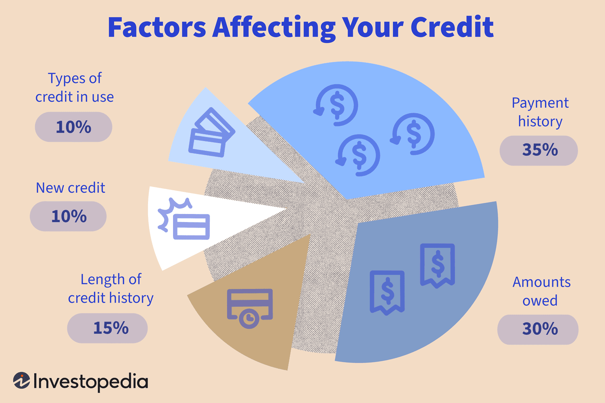

In the fast-paced world of finance, staying ahead of potential downturns is crucial for investors and market participants. One notable indicator of underlying financial health and market sentiment is credit downgrades. These occur when credit rating agencies lower the credit rating of a borrower, such as a corporation or a government, usually due to deteriorating financial conditions or increased risk factors. A lower credit rating generally implies higher risk, leading to higher borrowing costs and potentially reduced access to capital.

This article explores the warning signs associated with credit downgrades and their broader implications for investors. By understanding these signals, investors can make informed decisions about their portfolios, potentially mitigating the adverse effects of financial market fluctuations. Credit downgrades often coincide with or predict broader market movements, making their study vital for anyone involved in financial markets.



Additionally, we will examine how algorithmic trading systems, renowned for their speed and data-processing capabilities, respond to credit downgrade indicators. These systems, programmed to identify and capitalize on market patterns, can adjust trading strategies rapidly, thereby influencing market dynamics. Credit spreads, which represent the risk premium investors demand for corporate bonds over safer government bonds, will also be discussed as they provide early warning signals of market stress or economic downturns.

By analyzing these elements, the article aims to offer insights into the role of credit downgrades in financial markets and their usefulness as predictive tools. Understanding and anticipating these indicators can help market participants better manage risks and optimize their investment strategies in the face of potential economic challenges.

## Table of Contents

## Understanding Credit Downgrades

A credit downgrade occurs when a credit rating agency, such as Moody's, Standard & Poor's, or Fitch Ratings, reduces the credit rating of an issuer, which could be a corporation, government, or financial instrument. This rating adjustment typically results from a perceived deterioration in the issuer's creditworthiness, indicating an increased risk of default on debt obligations.

The impact of a credit downgrade is multifaceted, affecting both equity and fixed-income markets. A downgrade often leads to a reassessment of stock valuations as investors adjust their risk perceptions, potentially causing declines in stock prices. The increased perception of risk can lead to higher required returns on equity investments, which impacts valuation models. In the bond market, downgrades generally cause the affected bonds to decrease in market value. This is because investors demand higher yields to compensate for the higher risk, resulting in the bond's price falling to meet the yield expectations of the market. The relationship between bond prices and yields is inversely related, described by the formula:

$$

\text{Bond Price} = \frac{C}{(1+y)^1} + \frac{C}{(1+y)^2} + \cdots + \frac{C+F}{(1+y)^n}
$$

where $C$ is the annual coupon payment, $y$ is the yield, $F$ is the face value of the bond, and $n$ is the number of years to maturity.

Investors often respond to downgrades by reassessing the composition and risk level of their portfolios. This can lead to increased market [volatility](/wiki/volatility-trading-strategies) as reactions can range from strategic realignment of investment holdings to wholesale sell-offs of securities associated with the downgraded issuer. The volatility arises partly because investors and traders move to mitigate risks or exploit opportunities created by the market's adjustment to the new credit information. The altered perceptions of risk and potential changes in expected returns make monitoring credit ratings a crucial part of portfolio management strategies. 

Portfolio managers must also consider the broader implications of a credit downgrade in correlated markets and sectors, potentially triggering broader financial instability or reevaluation of related asset classes. This reevaluation can sometimes result in systematic risk affecting whole sectors or even the entire market, particularly if the downgrade affects a major issuer with significant market influence.

## Common Financial Warning Signs Leading to Downgrades

Unexpected events impacting a company or industry can trigger a credit downgrade, representing a significant shift in perceived financial stability. These events often result in increased risk assessments by rating agencies, leading to the reassessment of an entity's creditworthiness. Among these unexpected events, geopolitical tensions, natural disasters, or abrupt changes in market conditions stand out, each having the potential to disrupt normal business operations and financial health.

Poor financial performance is another critical warning sign that can lead to credit downgrades. Companies struggling to meet revenue expectations, experiencing declining profit margins, or facing deteriorating cash flows are at elevated risk. Rating agencies scrutinize financial statements to assess the sustainability of a company’s financial performance, and any persistent underperformance can lead to a downgraded credit rating. Additionally, new government regulations, which can alter the business landscape, pose risks. Such regulations may increase operational costs, restrict market opportunities, or enforce compliance requirements, all of which can impact financial performance adversely.

Changes in management or corporate strategy can also signal impending downgrades. A leadership change may lead to strategic shifts that could be viewed unfavorably by rating agencies, especially if the new direction is perceived as risky or detrimental to financial stability. For instance, aggressive expansion plans funded by higher leverage might increase perceived risk. Moreover, frequent turnover in executive positions can create uncertainty, potentially eroding market confidence in the company's future outlook.

To mitigate the risks associated with these warning signs, companies often aim to maintain stability in their operational and financial strategies. This includes maintaining strong cash reserves, diversifying business operations, and adhering to prudent financial practices. Recognizing these early warning signals enables investors and stakeholders to make informed decisions, helping to manage and anticipate potential credit risks effectively.

## Importance of Monitoring Credit Spreads

Credit spreads are a fundamental metric in assessing the health and stability of financial markets. They represent the difference in yield between corporate bonds and risk-free government bonds, primarily due to the credit risk associated with corporate debt. Essentially, this spread is the risk premium that investors require for holding a corporate bond instead of a government bond.

The magnitude of a credit spread directly correlates with market perception of risk. A widening of the spread typically signifies that investors are demanding a higher premium for the perceived increased risk of default associated with corporate bonds. This scenario often unfolds in response to growing economic uncertainties or financial instability within specific sectors. Conversely, narrowing spreads suggest that investors perceive lower risk, often associated with economic stability and improved creditworthiness of issuers.

For investors and market participants, monitoring credit spreads is crucial because these spreads can serve as harbingers of economic downturns. When spreads widen significantly, it may indicate underlying stress in the financial markets and potential economic slowdowns. Historically, periods of financial turmoil, such as the 2008 financial crisis, are often preceded by noticeable increases in credit spreads. Such changes can reflect a rapid reassessment of credit risk across global markets.

Credit spreads are also pivotal in evaluating market confidence. A stable or tightening spread environment can foster greater investor confidence, encouraging capital flow into riskier assets such as equities. Conversely, a rapid widening of spreads may cause a flight to quality, where investors seek safety in government bonds, thereby increasing market volatility.

Investors and traders often integrate credit spreads into their analytical frameworks. Many employ quantitative models to analyze spread movements. For example, a basic Python script utilizing financial data can calculate and plot credit spreads over time to identify trends:

```python
import pandas as pd
import matplotlib.pyplot as plt

# Sample data: yields of corporate and government bonds
data = {'Date': pd.date_range(start='2023-01-01', periods=12, freq='M'),
        'Corporate Yield': [2.5, 2.6, 2.7, 2.9, 3.0, 3.1, 3.3, 3.4, 3.5, 3.7, 3.8, 4.0],
        'Government Yield': [1.0, 1.0, 1.0, 1.1, 1.1, 1.2, 1.2, 1.3, 1.3, 1.3, 1.4, 1.5]}

df = pd.DataFrame(data)
df['Credit Spread'] = df['Corporate Yield'] - df['Government Yield']

plt.plot(df['Date'], df['Credit Spread'], marker='o')
plt.title('Credit Spreads Over Time')
plt.xlabel('Date')
plt.ylabel('Credit Spread (%)')
plt.grid(True)
plt.show()
```

This straightforward analysis allows financial professionals to visualize trends and identify anomalies that may require further investigation. By comprehensively monitoring credit spreads, investors can better anticipate potential downturns and adjust their strategies accordingly, ensuring they are well-prepared to navigate through financial uncertainties.

## Algorithmic Trading and Downgrade Indicators

Algorithmic trading systems have revolutionized the financial markets by enabling rapid responses to various market changes, including credit downgrades. These sophisticated systems leverage advanced computational algorithms to analyze vast amounts of financial data in real time. One of their primary functions is to adjust trading strategies promptly to mitigate risks associated with significant market events like credit downgrades.

When a credit rating is downgraded, it often leads to immediate shifts in market sentiment. Algorithmic trading systems are engineered to detect these shifts by continuously monitoring various indicators, such as stock prices, bond yields, and credit spreads. By processing this information, algorithms can identify patterns and trends that are not immediately obvious to human traders. For instance, a sudden increase in credit spreads may signal an increased risk of default, prompting algorithms to alter trading strategies. 

Algorithms assess downgrade information using models based on historical data, statistical methods, and [machine learning](/wiki/machine-learning) techniques. For example, regression models and clustering techniques can be used to predict how different asset classes might respond to a downgrade. Reinforcement learning, a subset of machine learning, allows these systems to learn optimal trading policies through trial and error, adjusting strategies as market conditions evolve.

Below is a simple representation of a Python script that might be part of an [algorithmic trading](/wiki/algorithmic-trading) system responding to credit downgrades:

```python
import numpy as np
import pandas as pd

def adjust_strategy_based_on_downgrade(credit_spreads, market_volatility, portfolio):
    # Set thresholds
    spread_threshold = 0.02
    volatility_threshold = 0.03

    # Check for increased risk
    if credit_spreads > spread_threshold and market_volatility > volatility_threshold:
        for asset in portfolio:
            if asset['credit_score'] < 'BBB':  # Using a simple credit rating threshold
                asset['allocation'] *= 0.9  # Reduce exposure by 10%

    return portfolio

# Assume we have some dummy data for credit spreads and market volatility
credit_spreads = 0.025  # Example credit spread
market_volatility = 0.04  # Example market volatility
portfolio = [{'name': 'Asset1', 'credit_score': 'BB', 'allocation': 100},
             {'name': 'Asset2', 'credit_score': 'AAA', 'allocation': 200}]

adjusted_portfolio = adjust_strategy_based_on_downgrade(credit_spreads, market_volatility, portfolio)
print(adjusted_portfolio)
```

Understanding how algorithms process downgrade information provides significant insights into market movements. Given that these systems can trigger large [volume](/wiki/volume-trading-strategy) trades almost instantaneously, their actions can lead to increased market volatility. Awareness of this dynamic allows investors and traders to better anticipate and react to potential market disruptions, navigating the complex landscape of credit downgrades more effectively.

## Implications for Investors

Investors should pay close attention to credit ratings and financial indicators to effectively manage and adjust their risk portfolios. These credit ratings, provided by agencies like Moody’s, Standard & Poor’s, and Fitch, offer insights into the creditworthiness of various issuers, influencing the market perception and valuation of stocks and bonds. A downgrade in these ratings can signal increased risks, prompting investors to reevaluate their holdings to mitigate potential losses.

Diversification is a key strategy for protecting against the adverse effects of credit downgrades. By spreading investments across various asset classes, geographies, and sectors, investors can reduce the impact of a downgrade in any single investment. This approach minimizes risk and stabilizes returns. Defensive investments, such as high-quality bonds, dividend-paying stocks, and other low-volatility assets, also play a crucial role in safeguarding portfolios. These investments tend to perform better during periods of market uncertainty, providing a buffer against potential downturns induced by downgrades.

Staying informed about broader economic indicators and market trends is essential. Economic indicators such as GDP growth rates, unemployment figures, inflation rates, and monetary policy signals provide context for credit ratings and help anticipate future market conditions. Investors can leverage this information to align their strategies with prevailing market dynamics, proactively adjusting portfolios to either capitalize on emerging opportunities or shield against imminent risks.

In a world where algorithmic trading and real-time data analysis are integral to financial markets, individual investors can benefit from similar strategies by utilizing financial software and tools that track market indicators and credit spread movements. Monitoring these metrics in real-time enables timely decision-making, aligning with the rapid pace at which institutional algorithms operate. This approach ensures that investors are better positioned to react to market signals, preserving capital and enhancing returns during periods of volatility associated with credit downgrades.

## The Bottom Line

Credit downgrades are pivotal indicators reflecting the financial health of an entity and potential market risks. A downgrade often signifies deteriorating fiscal conditions or heightened perceptions of risk, prompting both immediate and long-term repercussions in the financial markets. Such a change does not occur in isolation; rather, it is a symptom of underlying issues that could affect the broader economic landscape.

Proactivity and informed decision-making are essential for investors aiming to manage exposure to the risks associated with credit downgrades. By regularly monitoring credit ratings and associated financial indicators, investors can better anticipate shifts in market dynamics. It is vital to adjust investment strategies accordingly, potentially by reallocating assets or introducing measures to hedge against anticipated volatility.

Credit spreads offer significant insights into potential market changes. These spreads, defined as the difference in yield between corporate bonds and equivalent government bonds, act as real-time indicators of market sentiment. A widening credit spread typically suggests growing concern or skepticism about a company's ability to meet its obligations, reflecting increased perceived risk. Such fluctuations serve as early warning signals, allowing investors to gauge economic conditions and adjust their strategies proactively.

Algorithmic trading systems have significantly influenced how markets respond to credit downgrades. These systems are programmed to analyze vast datasets rapidly, reacting almost instantaneously to any fluctuations in credit ratings. By understanding how these algorithms interpret downgrade indicators, investors can better predict and understand market movements. Moreover, they can anticipate and prepare for potentially increased market activity or volatility resultant from algorithmic responses.

In conclusion, credit downgrades should be viewed as crucial signals for investors to reassess their portfolios and risk exposures. By utilizing tools like credit spreads and understanding algorithmic trading patterns, investors can gain valuable insights, equipping them with the knowledge necessary to navigate the complexities of financial markets effectively.

## References & Further Reading

[1]: Fabozzi, F. J., & Mann, S. V. (2005). ["The Handbook of Fixed Income Securities,"](https://www.mhebooklibrary.com/doi/book/10.1036/9781260473902?contentTab=true) 7th Edition. McGraw-Hill.

[2]: Hull, J. C. (2018). ["Options, Futures, and Other Derivatives,"](https://www.semanticscholar.org/paper/Options%2C-Futures%2C-and-Other-Derivatives-Hull/89bdee500c8623864fc9eb7a471546aa713acc44) 9th Edition. Pearson.

[3]: Gomber, P., Arndt, B., Lutat, M., & Uhle, T. (2011). ["High-Frequency Trading,"](https://papers.ssrn.com/sol3/papers.cfm?abstract_id=1858626) Business & Information Systems Engineering.

[4]: Brealey, R. A., Myers, S. C., & Allen, F. (2019). ["Principles of Corporate Finance,"](https://www.mheducation.com/highered/product/Principles-of-Corporate-Finance-Brealey.html) 13th Edition. McGraw-Hill.

[5]: Lopez de Prado, M. (2018). ["Advances in Financial Machine Learning."](https://books.google.com/books/about/Advances_in_Financial_Machine_Learning.html?id=oU9KDwAAQBAJ) Wiley.