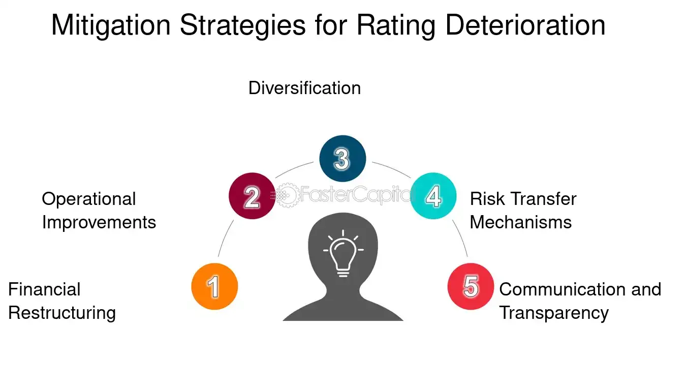

## Table of Contents

## What is a credit downgrade?

A credit downgrade happens when a credit rating agency decides that a borrower, like a person, a company, or even a country, is less likely to pay back their debts. These agencies give ratings to show how safe it is to lend money to someone. If a borrower's situation gets worse, like if they're having money problems, the agency might lower their rating. This is called a downgrade.

When a credit downgrade happens, it can make things harder for the borrower. For example, if a company gets downgraded, it might have to pay more interest on its loans because lenders see it as riskier. This can make it tougher for the company to borrow money in the future. For people, a downgrade can mean higher interest rates on credit cards or loans, making it more expensive to borrow money.

## Who are the main credit rating agencies?

The main credit rating agencies are Standard & Poor's (S&P), Moody's, and Fitch Ratings. These three are known as the "Big Three" because they rate most of the world's bonds and debts. They look at how likely someone or a company is to pay back what they owe. If they think it's less likely, they might lower the rating, which is called a downgrade.

These agencies use different letters and symbols to show their ratings. For example, S&P uses AAA as their highest rating, which means it's very safe to lend money to that borrower. Moody's uses Aaa for the same thing. Fitch also uses AAA at the top. When these agencies change their ratings, it can affect how much interest a borrower has to pay, and it can even impact the whole economy sometimes.

## What are the common reasons for a credit downgrade?

A credit downgrade can happen for many reasons. One common reason is when a borrower, like a person or a company, starts having money problems. Maybe they're not making as much money as before, or they're spending more than they can afford. When this happens, it makes it harder for them to pay back their debts, so credit rating agencies might think it's riskier to lend them money and lower their rating.

Another reason for a downgrade is if the economy is not doing well. If a lot of people are losing their jobs or businesses are struggling, it can make it harder for everyone to pay back what they owe. Credit rating agencies look at these bigger economic problems and might decide to lower ratings for many borrowers at once. This can make borrowing money more expensive for everyone affected.

Sometimes, a downgrade can also happen because of changes in the law or big events like natural disasters. If new laws make it harder for a company to make money, or if a hurricane destroys a lot of property, it can affect how well a borrower can pay back their debts. Credit rating agencies keep an eye on these kinds of changes and might lower ratings if they think it will be harder for borrowers to meet their financial obligations.

## How does a credit downgrade affect borrowing costs?

A credit downgrade makes borrowing money more expensive. When a credit rating agency lowers someone's rating, it means they think it's riskier to lend money to that person or company. Lenders want to be paid more for taking on this extra risk, so they charge higher interest rates. For example, if a company gets downgraded, it might have to pay more interest on its loans. This can make it harder for the company to borrow money because it costs them more.

For people, a credit downgrade can also mean higher interest rates on things like credit cards or personal loans. If a person's credit score goes down, banks and other lenders see them as a bigger risk. So, they might charge more interest to make up for that risk. This can make it more expensive for the person to borrow money, and it might even make it harder for them to get a loan at all. Overall, a credit downgrade can make everything related to borrowing money more costly and challenging.

## What are the different types of credit ratings?

Credit ratings come in different types, mainly split into two big groups: ratings for long-term debt and ratings for short-term debt. Long-term debt ratings look at how likely someone or a company is to pay back money they borrowed over a long time, like more than a year. Agencies like Standard & Poor's, Moody's, and Fitch use letters to show these ratings. For example, S&P uses AAA for the highest rating, which means it's very safe to lend money to that borrower. The ratings go down from there, like AA, A, BBB, and so on. If the rating is lower, it means it's riskier to lend money to that borrower.

Short-term debt ratings are about how likely someone is to pay back money they borrowed for a short time, usually less than a year. These ratings use different letters and symbols. For example, S&P uses A-1 for the highest short-term rating, which means it's very safe to lend money for a short time. The ratings go down from there, like A-2, A-3, and so on. Just like with long-term ratings, a lower short-term rating means it's riskier to lend money. Both types of ratings help lenders decide how much interest to charge and whether they want to lend money at all.

## How often are credit ratings reviewed?

Credit ratings are checked by the big rating agencies like Standard & Poor's, Moody's, and Fitch all the time. They don't have a set schedule but keep an eye on things that might change how safe it is to lend money to someone or a company. If something big happens, like a company losing a lot of money or the economy getting worse, the agencies might look at the ratings again right away. This helps them make sure their ratings are still right and fair.

Usually, a full review of a credit rating happens once a year. But if there's a big change in the borrower's situation, the agencies might do a special review at any time. This could be because of new laws, natural disasters, or other big events that affect how well the borrower can pay back their debts. Keeping ratings up to date helps lenders know how much risk they're taking when they lend money.

## What is the process of a credit downgrade?

A credit downgrade happens when a credit rating agency decides that a borrower, like a person or a company, is less likely to pay back their debts. The agency watches the borrower's situation all the time, looking at things like how much money they make, how much they owe, and what's happening in the economy. If they see that the borrower is having money problems or if something big changes, like a new law or a natural disaster, they might start thinking about a downgrade. They'll look at all the information they have and decide if the borrower's rating should be lowered.

If the agency decides a downgrade is needed, they will change the borrower's rating to a lower one. For example, if a company was rated 'A' and now they think it's riskier, they might change it to 'BBB'. They'll tell the borrower about the new rating and explain why it changed. This news can also go out to the public, which can affect how other people and companies see the borrower. A downgrade can make it harder and more expensive for the borrower to get loans because lenders see them as riskier.

## Can a credit downgrade impact the stock market?

A credit downgrade can definitely shake things up in the stock market. When a big company or even a country gets a lower credit rating, it can make investors worried. They might start thinking that the company or country is riskier to invest in. This can make the price of the company's stock go down because people might want to sell their shares. If a lot of people start selling, it can cause the whole stock market to go down a bit.

Sometimes, a downgrade can have a bigger effect if it's for a country or a very important company. For example, if a country's credit rating goes down, it might make people less confident in that country's economy. This can lead to a drop in the stock market not just for that country but also for other countries that do a lot of business with it. So, a credit downgrade can start a chain reaction that affects many parts of the stock market.

## How do credit downgrades influence investor behavior?

When a company or a country gets a credit downgrade, it can make investors nervous. They might start thinking that it's riskier to put their money into that company or country. Because of this, they might decide to sell their stocks or bonds to avoid losing money. This can lead to a drop in the stock price of the company that got downgraded. Investors might also move their money to safer places, like companies or countries with higher credit ratings, to protect their investments.

The impact of a credit downgrade can spread beyond just the company or country that got downgraded. If a big company gets a lower rating, it can make the whole stock market go down a bit because people lose confidence. The same can happen if a country's credit rating goes down; it can affect other countries that do a lot of business with it. So, a credit downgrade can start a chain reaction where investors change their behavior, moving money around to what they think are safer investments, which can shake up the stock market and the economy.

## What are the long-term effects of a credit downgrade on an economy?

A credit downgrade can have big effects on an economy over a long time. When a country gets a lower credit rating, it can make borrowing money more expensive. This means the country might have to pay higher interest rates on its loans. If it's harder and more expensive to borrow, the government might cut back on spending. This can slow down the economy because less money is being spent on things like building roads, schools, or other projects that help the economy grow. Businesses might also find it harder to get loans, which can make them less likely to start new projects or hire more people.

Over time, a credit downgrade can also make people and businesses less confident. If they think the economy is riskier, they might spend and invest less. This can lead to slower growth and even a recession if it goes on for a long time. The downgrade can also affect how other countries see the downgraded country. They might be less likely to invest or do business there, which can hurt the economy even more. So, a credit downgrade can start a chain reaction that makes the economy weaker over the long term.

## How can a company or country prevent a credit downgrade?

A company or country can take steps to avoid a credit downgrade by managing their money well. This means making sure they don't spend more than they earn and keeping their debts under control. If a company is doing well and making good profits, it's less likely to be seen as a risk by credit rating agencies. The same goes for a country; if it has a strong economy and can pay its bills on time, it's less likely to be downgraded. Keeping good relationships with lenders and showing that they can handle their finances responsibly can help prevent a downgrade.

Another way to avoid a credit downgrade is by keeping an eye on the economy and being ready for changes. If a company or country sees that something big might happen, like a new law or a natural disaster, they can plan ahead to lessen the impact. For example, a company might save some money for tough times or a country might make sure it has enough money set aside to handle emergencies. By being prepared and showing that they can adapt to changes, a company or country can make credit rating agencies feel more confident about their ability to pay back debts, which can help prevent a downgrade.

## What are some case studies of significant credit downgrades and their outcomes?

One big example of a credit downgrade happened to the United States in 2011. Standard & Poor's, a big credit rating agency, lowered the U.S. government's credit rating from AAA to AA+. This happened because the government was having trouble agreeing on how to manage its money, and there was a lot of arguing about the debt ceiling. After the downgrade, the stock market went down a lot, and people got worried about the U.S. economy. It made borrowing money more expensive for the government, and it took a long time for people to feel confident again.

Another example is when Greece got downgraded during its debt crisis in the early 2010s. Credit rating agencies kept lowering Greece's rating because the country was having big money problems and couldn't pay back its debts. This made it really hard for Greece to borrow money, and the interest rates got very high. The downgrade made the whole European economy shaky, and Greece had to get help from other countries and the International Monetary Fund. It took Greece many years to recover, and the downgrade had a big impact on its economy and people's lives.

These cases show how a credit downgrade can cause big problems. When a big company or country gets downgraded, it can make people less confident and cause the stock market to go down. It can also make borrowing money more expensive, which can slow down the economy. But by managing money well and being ready for changes, companies and countries can try to avoid these problems.

## What is the process of understanding credit downgrades?

A credit downgrade occurs when a credit rating agency, such as Moody's, Standard & Poor's, or Fitch Ratings, reduces the credit rating of an issuer, which could be a corporation, government, or financial instrument. This rating adjustment typically results from a perceived deterioration in the issuer's creditworthiness, indicating an increased risk of default on debt obligations.

The impact of a credit downgrade is multifaceted, affecting both equity and fixed-income markets. A downgrade often leads to a reassessment of stock valuations as investors adjust their risk perceptions, potentially causing declines in stock prices. The increased perception of risk can lead to higher required returns on equity investments, which impacts valuation models. In the bond market, downgrades generally cause the affected bonds to decrease in market value. This is because investors demand higher yields to compensate for the higher risk, resulting in the bond's price falling to meet the yield expectations of the market. The relationship between bond prices and yields is inversely related, described by the formula:

$$

\text{Bond Price} = \frac{C}{(1+y)^1} + \frac{C}{(1+y)^2} + \cdots + \frac{C+F}{(1+y)^n}
$$

where $C$ is the annual coupon payment, $y$ is the yield, $F$ is the face value of the bond, and $n$ is the number of years to maturity.

Investors often respond to downgrades by reassessing the composition and risk level of their portfolios. This can lead to increased market [volatility](/wiki/volatility-trading-strategies) as reactions can range from strategic realignment of investment holdings to wholesale sell-offs of securities associated with the downgraded issuer. The volatility arises partly because investors and traders move to mitigate risks or exploit opportunities created by the market's adjustment to the new credit information. The altered perceptions of risk and potential changes in expected returns make monitoring credit ratings a crucial part of portfolio management strategies. 

Portfolio managers must also consider the broader implications of a credit downgrade in correlated markets and sectors, potentially triggering broader financial instability or reevaluation of related asset classes. This reevaluation can sometimes result in systematic risk affecting whole sectors or even the entire market, particularly if the downgrade affects a major issuer with significant market influence.

## References & Further Reading

[1]: Fabozzi, F. J., & Mann, S. V. (2005). ["The Handbook of Fixed Income Securities,"](https://www.mhebooklibrary.com/doi/book/10.1036/9781260473902?contentTab=true) 7th Edition. McGraw-Hill.

[2]: Hull, J. C. (2018). ["Options, Futures, and Other Derivatives,"](https://www.semanticscholar.org/paper/Options%2C-Futures%2C-and-Other-Derivatives-Hull/89bdee500c8623864fc9eb7a471546aa713acc44) 9th Edition. Pearson.

[3]: Gomber, P., Arndt, B., Lutat, M., & Uhle, T. (2011). ["High-Frequency Trading,"](https://papers.ssrn.com/sol3/papers.cfm?abstract_id=1858626) Business & Information Systems Engineering.

[4]: Brealey, R. A., Myers, S. C., & Allen, F. (2019). ["Principles of Corporate Finance,"](https://www.mheducation.com/highered/product/Principles-of-Corporate-Finance-Brealey.html) 13th Edition. McGraw-Hill.

[5]: Lopez de Prado, M. (2018). ["Advances in Financial Machine Learning."](https://books.google.com/books/about/Advances_in_Financial_Machine_Learning.html?id=oU9KDwAAQBAJ) Wiley.