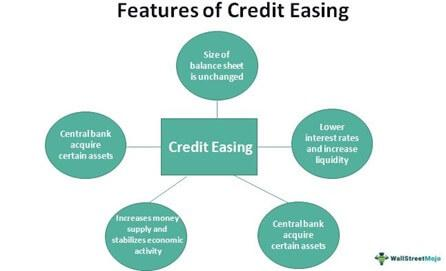

In the modern era of global finance, several key elements shape the economic landscape, notably financial markets, monetary policy, credit easing, and algorithmic trading. These factors are integral in promoting both economic stability and growth, as well as in crafting responses to financial crises and technological advancements. The intricate interplay between these elements creates a dynamic system that is essential for investors, policymakers, and financial professionals to understand, enabling them to effectively navigate the complexities of today’s financial environment.

Financial markets serve as platforms where a variety of securities and instruments, including commodities, derivatives, and Forex, are traded. They are critical in channeling capital and credit across the economy, thereby facilitating economic growth. The activities within these markets also provide vital signals that can influence monetary policies and economic strategies.

Monetary policy, managed by central banks, involves adjusting a country's money supply and interest rates to achieve macroeconomic objectives such as controlling inflation and fostering growth. By manipulating tools like open market operations, discount rates, and reserve requirements, monetary authorities can significantly impact both economic activity and the operations of financial markets.

Credit easing, as an unconventional subset of monetary policy, becomes particularly relevant during times of financial stress. It aims to enhance credit flow and liquidity by having central banks purchase various assets to stabilize the lending environment. This approach was notably applied during the 2008 financial crisis and the COVID-19 pandemic to mitigate economic disruptions. 

Algorithmic trading, which automates trading processes through complex algorithms, plays a significant role in the dynamics of financial markets. While it increases efficiency and liquidity, it poses challenges such as elevating market volatility and systemic risks. The rapid trading responses enabled by algorithms also intersect with monetary policies, potentially amplifying market movements following policy announcements.

This article examines these components—financial markets, monetary policy, credit easing, and algorithmic trading—highlighting their interconnectedness and mutual influence. Understanding these relationships is crucial for stakeholders aiming to adapt and thrive in the ever-evolving financial landscape.

## Table of Contents

## Understanding Financial Markets

Financial markets constitute essential platforms where various financial instruments, such as securities, commodities, derivatives, and foreign exchange, are actively traded. These markets play a pivotal role in fostering economic growth by ensuring the efficient allocation of capital and credit across the economy. They act as conduits between savers and investors, thereby facilitating the efficient use of resources. 

The primary types of financial markets include stock markets, bond markets, commodities markets, and Forex markets. Each market serves a distinct purpose, contributing to the overall functioning of the global financial system. 

Stock markets, for instance, offer companies a venue to raise capital by issuing shares to the public, thus enabling investors to own a portion of these companies. This process not only provides businesses with the much-needed capital to expand and grow but also furnishes investors with the opportunity to gain returns based on the companies' performances.

Bond markets allow governments and corporations to raise funds by issuing debt securities. These instruments are typically less volatile compared to stocks, providing investors with periodic interest payments and the return of principal upon maturity. The stability and predictability of bonds make them an attractive option for risk-averse investors.

Commodities markets enable the trading of physical goods like oil, gold, and agricultural products. These markets offer a means for producers to hedge against price [volatility](/wiki/volatility-trading-strategies) and for speculators to profit from price movements. They play a significant role in price discovery and in stabilizing economies that heavily rely on these essential resources.

Forex markets, which are the largest and most liquid financial markets in the world, facilitate the exchange of currencies. These markets are crucial for international trade and investment, influencing exchange rates and global economic stability.

Financial markets impact economic policies and strategies significantly. By providing a platform for price discovery, they influence monetary policy decisions as central banks monitor inflation indicators and economic growth prospects. Additionally, financial markets are integral to fiscal policy, impacting government borrowing costs and influencing fiscal strategies.

The interconnectedness of these markets requires careful regulation to ensure stability, transparency, and investor protection. Policymakers aim to balance the benefits of financial innovation with the need to mitigate systemic risks, as demonstrated by historical financial crises.

Understanding the complex mechanisms and interdependencies within financial markets is crucial for investors, policymakers, and financial professionals. It enables them to make informed decisions, adapt to changes swiftly, and foster a stable economic environment conducive to sustainable growth.

## The Role of Monetary Policy

Monetary policy is a critical aspect of economic management implemented by central banks to regulate a country's money supply and interest rates. Its primary objective is to maintain economic stability by controlling inflation, stimulating growth, managing employment levels, and ensuring [liquidity](/wiki/liquidity-risk-premium) within the financial system. The effectiveness of monetary policy can significantly influence the overall economic health and financial market conditions of a nation.

**Tools of Monetary Policy**

Central banks have several tools at their disposal to conduct monetary policy, each with specific applications for influencing economic variables:

1. **Open Market Operations (OMO)**: This involves the buying or selling of government securities in the open market. When a central bank buys securities, it injects liquidity into the banking system, encouraging lending and investment. Conversely, selling securities absorbs liquidity, restricting money supply and potentially cooling down an overheating economy.

2. **Discount Rate Adjustments**: The discount rate is the interest rate charged by a central bank for loans to commercial banks. Lowering the discount rate reduces borrowing costs for banks, prompting them to lend more, thereby increasing money supply and promoting economic activities. Raising the rate has the opposite effect, curbing excessive borrowing and spending.

3. **Reserve Requirements**: This tool mandates the amount of funds that banks must hold in reserve against deposits. Reducing reserve requirements frees up capital for banks to lend, increasing money supply and stimulating economic activity. Increasing reserve requirements can help to tighten monetary conditions.

**Impact on Economic Activity and Financial Markets**

Monetary policy decisions have far-reaching implications for both economic activity and financial markets:

- **Inflation Control**: By adjusting interest rates and money supply, central banks aim to keep inflation within a target range. Stable inflation fosters economic certainty and encourages long-term investment decisions by businesses and consumers.

- **Economic Growth and Employment**: Expansionary monetary policy, characterized by lower interest rates and increased money supply, aims to boost economic growth and reduce unemployment by making borrowing cheaper and encouraging spending and investment. On the other hand, contractionary policy seeks to prevent inflation and asset bubbles by tightening monetary conditions.

- **Financial Markets Influence**: Changes in interest rates directly impact financial markets. Lower rates tend to enhance equity market returns by reducing the cost of capital and improving corporate profitability. Bond prices, inversely related to interest rates, also become volatile with policy changes. Furthermore, interest rate adjustments can affect currency valuations, influencing export competitiveness.

Central banks must carefully balance these tools and their associated impacts to ensure that monetary policy effectively contributes to economic stability and growth while minimizing potential negative repercussions on financial markets. Through these mechanisms, central banks aim to maintain a harmonious economic environment conducive to sustainable development.

## Credit Easing Explained

Credit easing is an unconventional monetary policy designed to improve credit flow and liquidity during periods of financial stress. Unlike traditional monetary policy, which focuses primarily on regulating interest rates and controlling the money supply, credit easing involves central banks purchasing a diverse range of assets. The predominant mechanism for credit easing includes the acquisition of government securities, corporate bonds, and other financial instruments, aiming to reduce yield spreads and encourage lending practices across the economy.

The implementation of credit easing seeks to stabilize the lending markets by addressing dislocations and restoring the functioning of private credit markets. Central banks engage in large-scale asset purchases to inject liquidity directly into the financial system, which, in turn, amplifies the banks' capacity to lend to businesses and consumers. For instance, during the 2008 financial crisis, the U.S. Federal Reserve utilized credit easing as part of its broader quantitative easing strategy to purchase over a trillion dollars in mortgage-backed securities and treasury bonds. This intervention helped to thaw frozen credit markets by lowering long-term interest rates and fostering more favorable borrowing conditions for households and firms.

Credit easing practices were also pivotal during the COVID-19 pandemic as economies faced unprecedented disruptions. Central banks around the world, including the European Central Bank and the Bank of Japan, expanded their asset purchase programs significantly. These actions focused on maintaining financial stability, supporting economic activity, and preventing credit markets from seizing up during the pandemic-induced shock.

Critics of credit easing often point to potential drawbacks such as asset bubbles, increased financial risk-taking, and the diminishing marginal effectiveness of continuous asset purchases. Additionally, some argue that extensive asset purchasing policies can lead to distorted financial markets, creating challenges for unwinding the large balance sheets accumulated by central banks without triggering adverse market reactions. There is also concern over long-term dependency on such policies, which might impede the natural regulatory mechanisms of financial markets and result in moral hazard.

Overall, credit easing plays a crucial role when traditional monetary tools become less effective, particularly in lower bound [interest rate](/wiki/interest-rate-trading-strategies) scenarios. However, its application necessitates careful consideration of both its immediate economic benefits and the potential risks associated with prolonged use.

## Algorithmic Trading: Efficiency and Challenges

Algorithmic trading refers to the use of advanced mathematical models and computer programs to make high-frequency and high-speed trading decisions. It fundamentally changes how financial markets operate by promoting efficiency and liquidity, yet also introduces challenges such as increased volatility and systemic risks.

### Enhancing Market Efficiency and Liquidity

Algorithmic trading significantly increases market efficiency by executing trades at high speed, reducing transaction costs, and minimizing human error. By automating trades, algorithms can exploit price inefficiencies in the market, thereby narrowing bid-ask spreads and enhancing overall market liquidity. For instance, in liquid markets such as [forex](/wiki/forex-system) and stock exchanges, algorithms facilitate instantaneous trade executions, which helps stabilize prices and increase the predictability and precision of market operations.

The implementation of algorithms can be illustrated by the basic strategy of "[arbitrage](/wiki/arbitrage)," where algorithms identify and exploit price differences between different markets or financial instruments. Consider two stocks, A and B, with momentary price discrepancies across different markets. An algorithm can be programmed to buy low in one market and sell high in another, which naturally aligns prices over time and contributes to market efficiency.

### Challenges: Volatility and Systemic Risks

Despite its advantages, [algorithmic trading](/wiki/algorithmic-trading) comes with distinctive challenges. One significant issue is increased market volatility. Algorithms designed to react to market data often engage in rapid buying and selling, which can result in exaggerated price fluctuations. For example, the "Flash Crash" of May 6, 2010, was partially attributed to algorithmic trading programs and their rapid, automated responses to market conditions, highlighting how algorithms can amplify market movements.

Moreover, algorithmic trading raises systemic risks due to its potential to create feedback loops, where trading algorithms respond to each other in ways that may destabilize markets. The complexity of these algorithms makes it difficult for regulators to monitor and predict their actions, posing challenges for market stability.

### Interaction with Monetary Policy

Algorithmic trading can indirectly influence monetary policy by amplifying the effects of policy decisions. Automated responses to announcements related to interest rates or economic indicators may lead to volatile market reactions. Such rapid responses can complicate the implementation and outcome of monetary policies intended to stabilize the economy.

### Balancing Opportunities and Challenges

To leverage the benefits of algorithmic trading while mitigating its risks, financial institutions and regulators can adopt several strategies. Implementing circuit breakers, which temporarily pause trading when extreme volatility is detected, can help prevent flash crashes. Additionally, enhancing transparency and requiring rigorous testing of trading algorithms can aid in identifying and managing potential risks.

In conclusion, while algorithmic trading provides substantial opportunities to improve market operations, it also necessitates careful management to address its inherent challenges. By understanding and balancing these elements, stakeholders can enhance both the efficiency and stability of financial markets.

## Impact of Algorithmic Trading on Monetary Policy

The integration of algorithmic trading with monetary policy has introduced both challenges and opportunities in contemporary financial markets. Algorithmic trading refers to the use of computer algorithms to manage trading processes, which can significantly affect market dynamics by executing trades at speeds and volumes that are beyond human capabilities. This capability enables market participants to respond almost instantaneously to monetary policy announcements, potentially amplifying market movements and impacting overall financial stability.

### Rapid Responses and Implications

When central banks make policy announcements, whether they are adjusting interest rates or modifying asset purchase programs, algorithmic traders can react within milliseconds. This swiftness can lead to exaggerated market responses, as algorithms can trigger cascades of buy or sell orders based on predefined criteria or headlines rather than [fundamental analysis](/wiki/fundamental-analysis). For instance, an unexpected cut in interest rates may instantly cause an increase in stock and bond prices due to algorithmic trading strategies programmed to exploit such moves.

This rapid reaction raises concerns about the effectiveness of monetary policy. Central banks aim to manage economic conditions through well-calibrated policy measures; however, the excessive volatility induced by algorithmic responses can undermine these objectives. The intended gradual effect of a policy change might be overshadowed by volatile spikes in asset prices, which could distort market perceptions and investor behavior.

### Regulatory Considerations

To address these challenges, regulatory bodies are contemplating measures to manage the impact of algorithmic trading on market stability. Potential regulations include implementing circuit breakers or speed bumps, which are designed to temporarily halt trading or introduce slight delays in order processing during periods of extreme volatility. These mechanisms can help moderate rapid market movements, providing a buffer to assess the full implications of policy changes before the market reacts adversely.

Moreover, transparency and disclosure requirements for algorithmic trading strategies could also be enhanced. By mandating that trading firms disclose certain aspects of their algorithms, regulators could better understand the potential systemic risks and design more effective policy tools. Enhanced surveillance systems may be necessary to monitor trading patterns and detect abnormal behaviors that could precipitate financial instability.

In conclusion, while algorithmic trading has improved liquidity and efficiency in financial markets, its interaction with monetary policy announcements poses significant challenges. Regulating this interaction to preserve market stability is crucial for ensuring that central banks can effectively implement and achieve their macroeconomic goals. The ongoing evolution of both trading technology and regulatory frameworks will determine how these challenges are managed in the future.

## Case Studies and Real-World Applications

During the 2008 financial crisis, monetary policy and credit easing played pivotal roles in stabilizing global economies. Central banks, particularly the Federal Reserve, implemented aggressive interest rate cuts and introduced unconventional monetary policies, such as quantitative easing (QE), to inject liquidity into the financial system. The Federal Reserve's purchase of long-term securities aimed to lower long-term interest rates, thereby stimulating investment and consumption.

Quantitative easing during this period involved large-scale asset purchases. Specifically, the Federal Reserve's balance sheet expanded dramatically, purchasing over $1.7 trillion in mortgage-backed securities and Treasury bonds from 2008 to 2010. This expansion aimed to ease credit conditions, support asset prices, and spur economic growth, ultimately preventing a deeper recession. The success of these policies is reflected in the gradual recovery and stabilization of financial markets by 2010.

Fast-forward to the COVID-19 pandemic, the global economic shock fueled a resurgence of expansionary monetary policies. Central banks again employed tools like QE, alongside interest rate cuts, to address the unprecedented downturn. The Federal Reserve and other central banks quickly lowered policy rates and extended credit facilities to ensure liquidity in the banking system. For instance, the Federal Reserve launched the Main Street Lending Program, targeting small and midsize businesses affected by the pandemic-induced economic shutdowns.

Besides traditional monetary policy actions, central banks engaged in significant quantitative easing. By the end of 2020, the Federal Reserve's asset purchases reached nearly $3 trillion, aiming to reinforce financial stability and provide economic support amidst uncertainty.

In both crises, algorithmic trading influenced market responses to policy changes. The speed and [volume](/wiki/volume-trading-strategy) of algorithm-driven trades often resulted in heightened market volatility immediately following policy announcements. This impact was particularly evident in equity and foreign exchange markets, where rapid algorithmic responses amplified price movements, occasionally challenging central bank efforts to maintain orderly market conditions.

The interaction between algorithmic trading and monetary policy underscores the need for careful regulatory oversight. Potential measures include enhanced transparency and oversight to mitigate systemic risks associated with high-frequency trading. Nonetheless, the integration of algorithmic trading within financial systems also provides opportunities for improving market efficiency and liquidity when properly managed.

Overall, these case studies illustrate the significant role of expansionary monetary policies and credit easing in addressing severe economic disruptions. The dual challenges of implementing effective policies while managing the complexities introduced by algorithmic trading continue to shape the landscape of modern economic management.

## Conclusion

The interplay between financial markets, monetary policy, credit easing, and algorithmic trading is a multilayered system that continuously shapes and is shaped by global economic conditions. Each of these components contributes uniquely to economic growth and stability. However, their complex interactions necessitate vigilant management to prevent potential risks.

Financial markets, as mechanisms for capital allocation, are influenced by the monetary policies and regulatory frameworks established by central banks. Monetary policy, through tools like interest rate adjustments and reserve requirements, aims to balance economic growth and control inflation. In times of economic distress, credit easing is employed to ensure liquidity and support financial stability. This involves significant asset purchases by central banks to enhance credit flow, as evidenced during the 2008 financial crisis and the COVID-19 pandemic. Such interventions demonstrate the importance of adaptive monetary policies in maintaining economic equilibrium.

Algorithmic trading, which automates trading processes, further complicates the financial ecosystem. While it enhances liquidity and market efficiency, it also poses risks, such as increased volatility and potential systemic shocks. The rapid execution and massive scale of algorithmic trades can exacerbate market movements, especially following unexpected monetary policy adjustments.

Given these dynamics, stakeholders across the financial spectrum—regulators, investors, and financial institutions—must consistently monitor and adapt to these interactions. The technological advancements in trading, compounded by evolving monetary strategies, demand a comprehensive understanding of both immediate and long-term impacts on the global financial landscape. Continuous evaluation and strategic management are essential to harness the benefits of these intertwined elements while minimizing associated risks, ensuring sustained economic growth and stability in an ever-evolving world.

## References and Further Reading

1. **Mishkin, F. S. (2019). _The Economics of Money, Banking, and Financial Markets._**: This textbook offers an extensive analysis of how financial markets operate, with a specific focus on the role they play in the economy and how they are interlinked with monetary policy.

2. **Bernanke, B. S. (2011). "The Effects of Monetary Policy on Real Economic Activity: A Review." _Journal of Economic Perspectives._**: Provides a comprehensive review of how various aspects of monetary policy influence economic activity, with case study insights on real-world applications.

3. **Gagnon, J., Raskin, M., Remache, J., & Sack, B. (2011). "The Financial Market Effects of the Federal Reserve's Large-Scale Asset Purchases." _International Journal of Central Banking._**: This article explores the methodologies and impacts of credit easing strategies used by the Federal Reserve, emphasizing responses during financial crises.

4. **Biais, B., & Woolley, P. (2012). "_High-Frequency Trading._" In _The Oxford Handbook of Capitalism._**: Offers a detailed exploration into algorithmic and high-frequency trading, analyzing both the benefits of improved market efficiency and the associated risks including market volatility.

5. **Chakrabarty, B., & Moulton, P. C. (2012). "Has Algorithmic Trading Increased Market Efficiency?" _Journal of Applied Finance._**: This paper investigates whether algorithmic trading contributes positively to market efficiency and liquidity, along with its potential downsides.

6. **Svensson, L. E. O. (2020). "Monetary Policy and Market Instability." _Princeton University Working Papers._**: Provides a detailed assessment of how central banks should traverse the complex territory of monetary policy amidst evolving market structures influenced by algorithmic trading.

7. **Krishnamurthy, A., & Vissing-Jorgensen, A. (2011). "The Effects of Quantitative Easing on Interest Rates: Channels and Implications." _Brookings Papers on Economic Activity._**: A thorough examination of quantitative easing measures, exploring their influence on interest rates and broader financial market implications.

8. **Brynjolfsson, E., & McAfee, A. (2014). _The Second Machine Age: Work, Progress, and Prosperity in a Time of Brilliant Technologies._**: While not solely focused on financial markets, this book provides valuable insights into the technological advancements, including algorithmic processes, shaping the modern economy.

These selected readings provide a foundational and advanced understanding of the multifaceted components involved in financial markets, monetary policy, credit easing, and algorithmic trading, offering a mix of theoretical insights and real-world applications.

## References & Further Reading

[1]: Mishkin, F. S. (2019). [The Economics of Money, Banking, and Financial Markets.](https://www.pearsonhighered.com/assets/preface/0/1/3/4/0134855388.pdf) Pearson Education.

[2]: Bernanke, B. S. (2011). ["The Effects of Monetary Policy on Real Economic Activity: A Review."](https://www.federalreserve.gov/newsevents/speech/bernanke20111018a.htm) Journal of Economic Perspectives.

[3]: Gagnon, J., Raskin, M., Remache, J., & Sack, B. (2011). ["The Financial Market Effects of the Federal Reserve's Large-Scale Asset Purchases."](https://www.ijcb.org/journal/ijcb11q1a1.pdf) International Journal of Central Banking.

[4]: Biais, B., & Woolley, P. (2012). [High-Frequency Trading.](http://idei.fr/sites/default/files/IDEI/documents/pw/hft_financial_world.pdf) In The Oxford Handbook of Capitalism.

[5]: Chakrabarty, B., & Moulton, P. C. (2012). ["Has Algorithmic Trading Increased Market Efficiency?"](https://www.scirp.org/reference/referencespapers?referenceid=2055164) Journal of Applied Finance.

[6]: Svensson, L. E. O. (2020). ["Monetary Policy and Market Instability."](https://larseosvensson.se/files/papers/monetary-policy-strategies-for-the-federal-reserve.pdf) Princeton University Working Papers.

[7]: Krishnamurthy, A., & Vissing-Jorgensen, A. (2011). ["The Effects of Quantitative Easing on Interest Rates: Channels and Implications."](https://www.brookings.edu/wp-content/uploads/2016/07/2011b_bpea_krishnamurthy.pdf) Brookings Papers on Economic Activity.

[8]: Brynjolfsson, E., & McAfee, A. (2014). [The Second Machine Age: Work, Progress, and Prosperity in a Time of Brilliant Technologies.](https://psycnet.apa.org/record/2014-07087-000) W. W. Norton & Company.