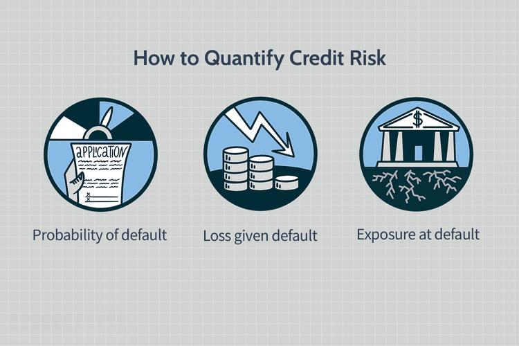

In today's rapidly evolving financial landscape, understanding banking credit risk and financial exposure is essential for both financial institutions and investors. These two elements are intertwined, significantly influencing decision-making processes, risk assessment, and strategic financial planning. Credit risk represents the possibility of a loss resulting from a borrower's failure to repay a loan or meet contractual obligations. Monitoring and managing this risk are fundamental to a bank's sustainability and profitability. 

Algorithmic trading, often referred to as algo trading, plays a pivotal role in effectively managing credit risk and financial exposure. By leveraging sophisticated algorithms and automated processes, financial markets can be navigated with enhanced precision and speed. Algorithmic trading systems analyze massive datasets to identify patterns and trends that inform trading decisions, offering an edge over manual trading by minimizing human error and responding promptly to market changes.

This article explores the intricacies of banking credit risk, strategies to manage financial exposure, and the application of algorithmic trading in this context. By integrating data analytics and automation, stakeholders gain the ability to efficiently assess and respond to the complex dynamics of financial markets. Such capabilities enable the identification of potential risks and opportunities with greater confidence. 

Understanding these concepts is crucial as they underscore financial stability and the resilience of institutions to external shocks. The interconnected nature of credit risk management, financial exposure, and algorithmic trading emphasizes the need for integrated strategies that leverage technological advancements to enhance decision-making processes. By focusing on these areas, institutions can not only mitigate risks but also capitalize on new opportunities, ensuring continued growth and competitive advantage in the financial landscape.

## Table of Contents

## Understanding Banking Credit Risk

Credit risk in banking represents the possibility that a borrower will fail to meet their payment obligations, leading to financial losses for the bank. This form of risk is inherent in lending activities and poses a significant challenge to financial institutions seeking to balance risk and return. Credit exposure is a major element of credit risk and refers to the quantifiable maximum potential loss that a lender might encounter should the borrower default. Calculating credit exposure accurately is essential for banks to set aside appropriate capital reserves and maintain financial health.

To manage credit risk effectively, banks utilize credit ratings, a critical tool in risk mitigation. Credit ratings assess the creditworthiness of borrowers and guide banks in extending credit mainly to those with high credit scores, thereby minimizing the probability of default. These ratings are derived from complex evaluations involving a borrower’s financial history, current financial situation, and economic conditions affecting their capacity to repay.

Credit risk assessment is another pivotal aspect that involves a comprehensive evaluation of a borrower's likelihood of default. This assessment includes analyzing financial statements, payment history, and other relevant economic factors. The process often employs quantitative models like the Probability of Default (PD), Loss Given Default (LGD), and Exposure at Default (EAD) to measure and predict potential losses.

$$
\text{Expected Loss (EL)} = \text{PD} \times \text{LGD} \times \text{EAD}
$$

Effective credit risk management is not only crucial for preserving the financial stability of a bank but also for ensuring its profitability. By implementing robust risk management frameworks, banks can anticipate potential defaults and take pre-emptive actions such as restructuring debts, modifying lending terms, or increasing collateral requirements. These strategies help in maintaining a cushion against unforeseen credit events, ultimately safeguarding the institution’s capital base and reputation.

In summary, understanding and managing credit risk involves a blend of precise measurement, strategic credit allocation, and proactive assessment techniques. It is fundamental for banks to adopt sophisticated tools and methodologies to mitigate this risk, ensuring sustainable financial growth and stability in an ever-changing economic landscape.

## Managing Financial Exposure

Financial exposure represents the extent to which a company or investor is susceptible to financial loss due to various market risks. Managing financial exposure is a critical task for financial institutions as they aim to safeguard their operations against potential losses. Several strategies are employed to manage and limit exposure effectively.

One of the primary strategies used by financial institutions to manage exposure is diversifying investment portfolios. Diversification involves spreading investments across different asset classes and geographic locations to reduce risk. By not concentrating investments in a single area, institutions can mitigate the impact of adverse movements in any one sector or market.

Another critical tool in managing financial exposure is the use of credit default swaps (CDS). A credit default swap is a financial derivative that allows an institution to transfer the credit risk of a borrower to a third party. By purchasing a CDS, a lender can protect itself against the default of one of its borrowers, effectively managing and transferring the credit risk.

Banks also set credit limits based on a customer’s repayment ability as a part of controlling financial exposure. Credit limits are predetermined ceilings on the amount of credit a bank can extend to a borrower. These limits are usually established by evaluating the borrower’s creditworthiness, financial history, and repayment capacity. By setting these limits, banks can control the extent of their exposure to any single borrower.

Furthermore, effective exposure management involves continuous monitoring of financial positions and leveraging hedging strategies to minimize potential losses. Hedging involves taking positions in financial instruments, such as options or futures, to offset potential losses in other investments. Continuous monitoring allows institutions to adjust their strategies in response to changing market conditions, ensuring that their risk exposure remains within acceptable limits.

By incorporating these strategies, financial institutions can efficiently manage financial exposure, mitigating risks while optimizing their financial positions. This approach not only protects against potential losses but also allows institutions to take advantage of opportunities for growth and profitability.

## Role of Algo Trading in Risk Management

Algorithmic trading, or algo trading, employs sophisticated computer algorithms to conduct trades based on predefined criteria, facilitating efficient and effective risk management in the financial markets. This approach harnesses the power of data analytics, enabling the rapid processing and assessment of vast volumes of market data. By doing so, algo trading provides critical insights into market trends and potential risks, thereby enhancing the decision-making processes of traders and financial institutions.

One of the primary advantages of algo trading in risk management is its ability to evaluate extensive datasets quickly and accurately. This capability allows traders to identify and respond to market fluctuations with exceptional speed, optimizing entry and [exit](/wiki/exit-strategy) points to maximize returns. For instance, algorithms can detect patterns and anomalies that might indicate an upcoming market shift, allowing traders to adjust their positions accordingly to mitigate risks.

Automating trading processes through algorithms also plays a crucial role in reducing human error, which can negatively impact trading outcomes and risk assessments. By minimizing manual intervention, [algorithmic trading](/wiki/algorithmic-trading) ensures that trades are executed with high precision, adhering strictly to the predetermined strategies and conditions. This automation results in more consistent and reliable trading performance, particularly in volatile markets where rapid decision-making is essential.

Further enhancing its utility, algo trading is indispensable in high-frequency trading ([HFT](/wiki/high-frequency-trading-strategies)) environments. HFT involves executing a large number of orders at extraordinarily high speeds, often leveraging [arbitrage](/wiki/arbitrage) opportunities that arise from slight price differences across markets. In such settings, the speed and accuracy provided by algorithmic trading are crucial, as any delay or mistake could lead to significant financial losses.

In conclusion, algorithmic trading not only streamlines trading operations but also fortifies risk management strategies by providing a robust framework for analyzing market conditions and executing trades with precision. Its integration into the financial landscape empowers traders and institutions to manage risks more effectively, paving the way for improved financial performance and resilience in the face of market uncertainties.

## Integrating Algorithmics for Credit Management

Algorithmic solutions such as SS&C Algorithmics are pivotal in enhancing credit management by offering comprehensive life cycle management capabilities. These advanced systems aid banks in monitoring, managing, and controlling credit risks across various business lines and product offerings. By implementing such algorithmic solutions, financial institutions can achieve an integrated approach to efficiently handle credit risk.

One of the primary advantages of these systems is their ability to support compliance with regulatory standards through advanced data management. This is crucial for banks and financial institutions striving to meet stringent regulatory requirements while optimizing their operational efficiency. By ensuring that all aspects of credit risk are meticulously tracked and managed, these solutions provide a solid foundation for maintaining regulatory compliance.

Algorithmics capitalize on intelligent automation, streamlining risk management processes which, in turn, enhances decision-making capabilities. This automation reduces the need for manual intervention, minimizing the chances of human error and lowering operational costs. By automating data collection, analysis, and reporting tasks, banks can focus on strategic decision-making, leading to more informed and timely responses to potential risks.

Furthermore, these technologies are essential for financial institutions to adapt to rapidly evolving market dynamics. With market conditions constantly changing, banks must have the agility to respond swiftly and effectively. Algorithmic solutions provide the necessary tools to adjust credit risk strategies in real-time, ensuring that financial institutions remain resilient and competitive.

In conclusion, integrating algorithmics into credit management processes is vital for financial institutions aiming to enhance their risk management frameworks. By leveraging technology to automate and optimize credit risk management, banks can improve their operational efficiency, maintain compliance with regulatory standards, and ensure financial resilience in a dynamic marketplace.

## Conclusion

Effectively managing banking credit risk and financial exposure is crucial for maintaining financial stability in today's complex market environment. One of the key tools now available for risk management is algorithmic trading (algo trading), which has revolutionized how banks and financial institutions handle these challenges. By leveraging algorithmic trading, institutions can engage in proactive risk management, enhancing their ability to analyze vast amounts of data and make automated, data-driven decisions. This provides the dual benefit of reducing the likelihood of human error and allowing for quicker, more informed response to market [volatility](/wiki/volatility-trading-strategies).

The integration of advanced algorithmic tools permits financial institutions to refine their risk strategies substantially. By aligning algorithmic solutions with comprehensive data analytics, these institutions can fine-tune their credit risk models and optimize their financial exposure. This not only improves risk management but also aids in achieving superior financial outcomes. In a competitive landscape where technology continuously evolves, remaining at the forefront requires consistent investment in such technology-driven risk management solutions.

Furthermore, this integrated approach offers a dual advantage. It not only mitigates risks associated with credit and financial exposure but also enables institutions to seize opportunities that drive financial growth and enhance resilience. The capacity to intertwine risk management with opportunity amplification ensures that financial institutions can maintain robust performance profiles even in the face of market uncertainties, ultimately contributing to long-term economic stability and growth.

## References & Further Reading

[1]: Jorion, P. (2007). ["Value at Risk: The New Benchmark for Managing Financial Risk"](https://link.springer.com/article/10.1007/s11408-007-0057-3). McGraw-Hill.

[2]: Hull, J. C. (2015). ["Risk Management and Financial Institutions"](https://books.google.com/books/about/Risk_Management_and_Financial_Institutio.html?id=1J1QDwAAQBAJ). Wiley Finance Series.

[3]: Treleaven, P., Galas, M., & Lalchand, V. (2013). ["Algorithmic Trading and Finance: Special Issue Introduction."](https://www.semanticscholar.org/paper/Algorithmic-trading-review-Treleaven-Galas/23df7a551426789170c4ea8368faaca5e8ed86c0) Communications of the ACM, 56(11), 76-85.

[4]: Lopez de Prado, M. (2018). ["Advances in Financial Machine Learning"](https://www.amazon.com/Advances-Financial-Machine-Learning-Marcos/dp/1119482089). Wiley.

[5]: Black, F., & Scholes, M. (1973). ["The Pricing of Options and Corporate Liabilities."](https://www.cs.princeton.edu/courses/archive/fall09/cos323/papers/black_scholes73.pdf) Journal of Political Economy, 81(3), 637-654.

[6]: Fabozzi, F. J., Kolm, P. N., Pachamanova, D. A., & Focardi, S. M. (2007). ["Robust Portfolio Optimization and Management"](https://onlinelibrary.wiley.com/doi/book/10.1002/9781119202172). Wiley Finance.