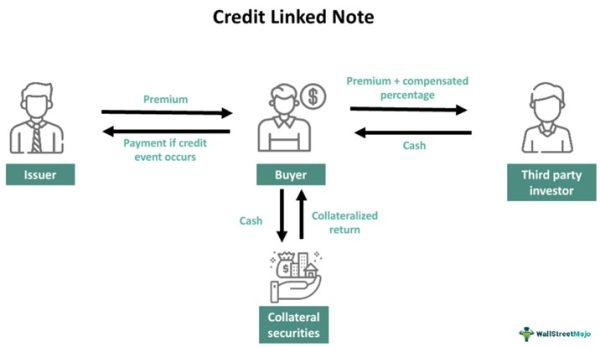

Financial instruments are essential components of global financial markets, facilitating various economic activities such as investment, hedging, and risk management. They include a wide array of products such as stocks, bonds, derivatives, and hybrid instruments. Among these, Credit-Linked Notes (CLNs) have emerged as significant tools for investors and issuers alike. CLNs are hybrid financial instruments that combine the features of bonds and credit derivatives, allowing investors to gain exposure to credit risk while potentially enhancing returns.

CLNs have become increasingly popular due to their ability to satisfy the diverse risk-return profiles of investors. They are typically employed in scenarios where investors seek exposure to the credit risks of specific entities or portfolios without directly holding the underlying debt. The structured nature of CLNs makes them attractive in various market conditions, thus contributing to their increasing demand.



Concurrently, algorithmic trading has transformed the landscape of financial markets, primarily driven by advances in technology and computational power. Algorithmic trading refers to the use of computer algorithms to execute trading orders based on predefined criteria, often involving high-speed data processing and complex mathematical models. This form of trading has grown rapidly, offering advantages like increased speed, reduced transaction costs, and minimized human errors. As a result, algorithmic trading has gained prominence, particularly in markets that demand high-frequency trading and substantial liquidity.

The purpose of this article is to explore the intersection of Credit-Linked Notes and algorithmic trading, highlighting how technology can optimize trading strategies involving CLNs. The integration of sophisticated computational tools in trading CLNs presents unique opportunities and challenges. By investigating this synergy, the article aims to shed light on how financial innovations can be harnessed to maximize returns while managing risks effectively.

Optimizing trading strategies with technology is crucial in today's fast-paced financial markets. With the continuous development of artificial intelligence and machine learning, trading algorithms have become more advanced, offering strategic advantages in analyzing complex datasets and implementing robust trading strategies. The relevance of such technology-driven optimization is evident in enhancing decision-making processes, improving market efficiency, and fostering sustainable growth within the financial sector.

In summary, this article will provide insights into the dynamic relationship between CLNs and algorithmic trading, highlighting the potential benefits and challenges. Through the lens of technological advancements, it aims to contribute to the ongoing discourse on the future of finance, encouraging further exploration and innovation in the integration of diverse financial instruments and trading methodologies.

## Table of Contents

## Understanding Credit-Linked Notes (CLNs)

Credit-Linked Notes (CLNs) are structured financial instruments that allow investors to gain exposure to credit risk. These are securities issued by a financial institution, usually in the form of bonds, that are linked to the credit risk of a specific entity or a basket of entities. The performance of CLNs is contingent upon the credit events specified in the contract, such as default or restructuring of the reference entity.

**Characteristics and Functionality**  
CLNs are characterized by their hybrid nature, combining features of traditional fixed-income investments and credit derivatives. In essence, a CLN is a debt security which is augmented by a derivative component that transfers the credit risk from the issuer to the investor. This setup provides the issuer with credit risk reduction while offering the investor potential yields that exceed those of risk-free instruments.

The structure of a CLN can be represented mathematically as:

$$
\text{CLN Value} = \text{Bond Value} + \text{Credit Default Swap (CDS) Spread}
$$

This formulation indicates that the pricing of a CLN typically includes the coupon payments of a bond and the premium of a credit default swap, which accounts for the credit risk of the underlying reference entity.

**Risk and Return Profiles**  
The risk profile of CLNs is significantly influenced by the creditworthiness of the underlying reference entity or entities. In the event of a credit event, such as default, investors may incur substantial losses, as the payouts from CLNs are tied to such occurrences. Conversely, if no credit events transpire, investors enjoy returns in the form of bond-like coupon payments along with a yield premium commensurate with the transferred credit risk. This yield can be particularly attractive in low-interest-rate environments or as part of a diversified investment strategy.

**Use Cases and Scenarios**  
CLNs find typical application in various scenarios, including risk management and diversification strategies. Financial institutions often use CLNs to manage and transfer credit risk without selling the actual loans or bonds. This allows them to free up capital and comply with regulatory requirements surrounding risk exposure.

For investors, CLNs offer an opportunity to participate in the credit markets with varying levels of exposure and return potential, depending on the riskiness of the referenced credit entities. Institutional investors, such as pension funds and insurance companies, frequently utilize CLNs to enhance portfolio returns while managing credit risk exposure.

**Recent Trends and Market Demand**  
In recent years, the demand for CLNs has been bolstered by several macroeconomic factors. The low-yield environment has driven investors to seek out alternative products that offer higher returns, such as CLNs. Additionally, as the global financial markets have seen an increase in market [volatility](/wiki/volatility-trading-strategies), the capacity of CLNs to provide tailored credit risk exposure has become a compelling attribute for risk-averse investors.

Moreover, the integration of CLNs within sophisticated trading strategies, particularly within the realms of [algorithmic trading](/wiki/algorithmic-trading), has become increasingly prevalent. Algorithmic trading systems can dynamically adjust CLN portfolios in response to changing market conditions, enhancing both risk management and return optimization strategies. This adaptability aligns well with the evolving needs of modern finance, where agility and data-driven decision-making are paramount.

The burgeoning interest in sustainable finance also suggests a potential trend towards developing CLNs that are linked to environmental, social, and governance ([ESG](/wiki/esg-investing)) criteria, thus providing investors with instruments that align with ethical and sustainable investment goals.

In summary, CLNs represent a flexible and innovative solution for both issuers seeking to manage credit exposure and investors aiming for enhanced yields. Their utility spans across various financial strategies, making them a staple component in the financial markets' toolkit.

## Algorithmic Trading: A Modern Approach

Algorithmic trading refers to the use of computer programs to execute trades in financial markets based on predefined strategies. These strategies can range from simple moving averages to complex mathematical models. Algorithmic trading emerged in the late 1970s and 1980s with the advent of electronic trading platforms and has since grown to dominate a significant proportion of trading activities across various financial markets.

The historical development of algorithmic trading is closely tied to technological advancements and increases in computational power. Initially, algorithms were simple, focusing on execution efficiency. However, during the 1990s and early 2000s, as markets became more data-driven, algorithms evolved to incorporate statistical and quantitative models to predict price movements and optimize trade execution. Today, high-frequency trading ([HFT](/wiki/high-frequency-trading-strategies)) represents a further evolution, where trades are executed in fractions of a second, making up a substantial portion of equity trading [volume](/wiki/volume-trading-strategy).

The primary advantages of algorithmic trading are speed and efficiency. Algorithms can process vast amounts of data far more swiftly than human traders and execute transactions at optimal times, achieving better pricing. This mitigates the risks associated with timing errors and market fluctuations, leading to reduced transaction costs and improved market [liquidity](/wiki/liquidity-risk-premium).

In recent years, the integration of [artificial intelligence](/wiki/ai-artificial-intelligence) (AI) and [machine learning](/wiki/machine-learning) (ML) has revolutionized algorithmic trading. These technologies enable the development of adaptive algorithms that can learn from historical data, identify patterns, and make decisions with minimal human intervention. For instance, ML algorithms can analyze unstructured data, such as news feeds or social media, providing insights that traditional quantitative models might overlook. Python, for example, has become a favored language due to its robust libraries such as scikit-learn, pandas, and TensorFlow, facilitating machine learning research and deployment.

```python
# Example: A simple moving average crossover strategy using Python
import pandas as pd

# Assume 'data' is a pandas DataFrame containing 'Close' prices for a financial instrument
short_window = 40
long_window = 100

# Calculate the short and long moving averages
signals = pd.DataFrame(index=data.index)
signals['signal'] = 0.0
signals['short_mavg'] = data['Close'].rolling(window=short_window, min_periods=1, center=False).mean()
signals['long_mavg'] = data['Close'].rolling(window=long_window, min_periods=1, center=False).mean()

# Create signals
signals['signal'][short_window:] = np.where(signals['short_mavg'][short_window:] > signals['long_mavg'][short_window:], 1.0, 0.0)   
signals['positions'] = signals['signal'].diff()

# Plotting would be here, but omitted for brevity
```

Despite its advantages, developing and deploying successful trading algorithms involves several challenges. One of the key issues is the need for high-quality historical data to train and test models. Inaccurate or incomplete data can lead to suboptimal algorithms that perform poorly in live trading conditions. Moreover, the financial markets are inherently unpredictable and subject to sudden, unforeseen events, known as 'black swan' events, which can result in large losses for automated strategies.

Additionally, there is an ongoing challenge in managing model complexity and robustness. As models become more sophisticated, ensuring they are resilient to changes in market conditions without overfitting becomes crucial. Overfitting occurs when a model learns the noise in historical data rather than the underlying pattern, leading to poor performance on unseen data.

Regulatory scrutiny is another consideration, as authorities continuously assess the impact of high-speed trading on market stability. Ensuring compliance with regulatory standards, such as risk management and reporting requirements, adds another layer of complexity to algorithmic trading development.

In conclusion, algorithmic trading represents a sophisticated intersection of finance, mathematics, and computer science, critically dependent on technological innovation. As markets continue to evolve, so too will the algorithms that navigate them, demanding ongoing adaptation and refinement to remain competitive.

## Link Between CLNs and Algorithmic Trading

Credit-Linked Notes (CLNs) offer a unique proposition in the landscape of financial derivatives due to their hybrid nature, combining elements of both bond markets and credit derivatives. Consequently, their integration into algorithmic trading strategies can provide novel opportunities for optimization and risk management.

### Integration of CLNs into Algorithmic Trading Strategies

The integration of CLNs into algorithmic trading involves developing strategies that account for the distinct features of CLNs, such as their dependence on credit events and the creditworthiness of reference entities. Algorithms tailored for CLNs often incorporate credit risk modeling, which evaluates the probability of a credit event occurring and its potential impact on the CLN. 

These algorithms might employ statistical analysis and machine learning models to estimate credit spreads and detect patterns in credit default swap (CDS) spreads, which are closely related to the pricing of CLNs. For example, a logistic regression model might be used to predict the likelihood of a default event based on historical data:

$$
\text{Probability}(\text{Default}) = \frac{1}{1 + e^{-(\beta_0 + \beta_1 x_1 + \beta_2 x_2 + \ldots + \beta_n x_n)}}
$$

where $x_1, x_2, \ldots, x_n$ are features such as interest rates, economic indicators, and the financial health metrics of the reference entity.

### Benefits of Incorporating CLNs in Algo Trading Portfolios

Integrating CLNs into algorithmic trading portfolios offers potential benefits such as diversification and enhanced yield opportunities. CLNs can serve as a hedge against credit risk exposures in other parts of the portfolio or be used to speculate on credit events with a controlled risk profile. By algorithmically optimizing allocations between traditional securities such as stocks and bonds and credit-linked instruments, traders can balance risk and return more effectively. Furthermore, automated strategies can efficiently exploit [arbitrage](/wiki/arbitrage) opportunities arising from mispriced credit events.

### Real-World Examples of CLNs in Algo Trading

While specific case studies of algorithmically traded CLNs are less publicly documented due to the proprietary nature of trading strategies, there is significant interest in the financial sector to combine credit derivatives like CLNs with algorithmic trading systems. For example, trading desks in investment banks may employ automated systems to adjust CLN holdings dynamically in response to real-time credit spread data and economic indicators, thus managing credit exposure proactively.

### Strategic Importance of Diversifying with CLNs

Using CLNs in automated trading systems strategically diversifies risk by adding credit risk exposure, which is often uncorrelated with traditional market risks like those associated with equities and fixed income. This diversification can stabilize returns across volatile market conditions, where traditional asset classes might experience significant drawdowns. Additionally, the complexity and the need for specialized knowledge to trade CLNs can act as a barrier to entry, potentially providing a competitive edge to traders who successfully integrate them into algorithmic systems.

In summary, the integration of Credit-Linked Notes into algorithmic trading platforms offers nuanced advantages in diversification and risk management. By leveraging advanced algorithms and machine learning techniques, traders can exploit unique opportunities in the credit markets, thus enhancing overall portfolio performance. However, successful integration requires a thorough understanding of both credit derivatives and algorithmic trading principles.

## Challenges and Considerations

Regulatory and compliance issues surrounding Credit-Linked Notes (CLNs) and algorithmic trading present a significant challenge for market participants. Financial regulations are designed to preserve market integrity, protect investors, and maintain systemic stability. However, the fast-paced and complex nature of algorithmic trading complicates adherence to such regulations. Trading of CLNs, which include credit derivatives embedded within their structure, is subject to stringent regulations that govern derivatives markets. Participants must ensure compliance with regulations such as the Dodd-Frank Act in the United States or the Markets in Financial Instruments Directive II (MiFID II) in Europe. These regulations demand transparency and often require real-time reporting and extensive record-keeping, which can be arduous given the [high frequency](/wiki/high-frequency-trading) of algorithmic trades.

Risks associated with the algorithms used in trading CLNs cannot be understated. Algorithmic trading, while offering efficiency, speed, and precision, introduces specific risks — primarily operational and financial risks. From a technical standpoint, algorithms can malfunction due to coding errors, which may result in unintended trading activity, leading to financial losses. Furthermore, the competitive advantage often lies in the sophistication and speed of trading algorithms, increasing risks such as market manipulation or abuse. Thus, robust testing and validation frameworks are crucial to mitigate these risks before deploying algorithms into real trading environments.

Integrating CLNs into existing trading systems poses technological challenges due to the unique characteristics of these instruments. CLNs encapsulate credit risk by tying the note's payoff to the performance of a reference asset or entity, requiring additional layers of data analytics and evaluation not typically present in equity or traditional bond trading algorithms. Adapting infrastructure to accommodate these complexities often demands significant technological investment and development of custom analytical tools and models.

Market volatility significantly influences the algorithmic trading of CLNs. Volatile markets can lead to wide spreads and unpredictable price movements, which affect the valuation and execution of trades involving credit-linked notes. Algorithms must be designed to respond swiftly to changing market conditions, which requires sophisticated risk management techniques to prevent adverse outcomes. Strategies like dynamic hedging and scenario analysis could be integrated into algorithms to better manage exposure to volatility.

Considerations for risk management and ethical practices in algorithmic trading are paramount, especially when dealing with complex financial products like CLNs. Investment firms and traders must develop and adhere to stringent risk management protocols that encompass credit risk assessment, liquidity risk, and market risk. Additionally, adhering to ethical trading practices is critical to preventing manipulation and ensuring fair market access for all participants. This includes implementing mechanisms to detect and avoid market-cornering or spoofing tactics, which can distort market prices and harm other investors.

In conclusion, while the integration of Credit-Linked Notes into algorithmic trading holds significant potential, it requires careful navigation of regulatory landscapes, risk management, and technological adaptation to overcome inherent challenges.

## Future Prospects and Innovations

Emerging technologies are poised to significantly impact the trading of Credit-Linked Notes (CLNs), offering both opportunities and challenges. Artificial intelligence (AI) and machine learning (ML) are at the forefront, providing sophisticated tools for data analysis and predictive modeling, which can enhance the precision and efficiency of trading strategies for CLNs. These technologies enable traders to process large volumes of data and identify patterns that are not immediately obvious through traditional analysis methods.

In terms of future predictions for algorithmic trading in credit markets, we can expect further automation and refinement of strategies. The growing use of natural language processing (NLP) to analyze news and other text-based data sources can offer predictive insights about credit events, allowing traders to react more swiftly to potential changes in market conditions.

Innovations in financial instruments similar to CLNs include the development of more customizable and optimized products. For instance, the use of blockchain technology can lead to more transparent and efficient trading processes by enabling secure and immutable transaction records. This can potentially reduce counterparty risk and increase the appeal of CLNs and similar instruments to a broader range of investors.

The increasing computational power available today is crucial for algorithmic trading of CLNs. Enhanced processing capabilities enable real-time analysis and decision-making, which is essential in highly dynamic market environments. Python scripts, for instance, can be used to implement algorithms that continuously learn and adapt to new data, improving their decision-making over time. An example of a simple Python strategy could involve training a machine learning model to predict credit events using historical financial data:

```python
import pandas as pd
from sklearn.ensemble import RandomForestClassifier
from sklearn.model_selection import train_test_split

# Example dataset loading
data = pd.read_csv('credit_market_data.csv')
features = data.drop('credit_event', axis=1)
target = data['credit_event']

# Splitting the data into training and test sets
X_train, X_test, y_train, y_test = train_test_split(features, target, test_size=0.2, random_state=42)

# Model training
model = RandomForestClassifier(n_estimators=100, random_state=42)
model.fit(X_train, y_train)

# Prediction
predictions = model.predict(X_test)
```

Sustainable and responsible growth within this finance niche hinges on adopting ethical practices and incorporating risk management protocols. As algorithmic trading systems become more complex, they inherently pose risks, including potential market manipulation and systemic failures due to flawed algorithms. Therefore, it's vital to establish regulations ensuring transparency and accountability. Furthermore, the integration of ESG (Environmental, Social, and Governance) metrics into algorithmic models could guide more sustainable investments, aligning financial incentives with environmental and social goals.

In summary, the intersection of emerging technologies and financial innovation heralds a promising future for CLNs in algorithmic trading. However, stakeholders must remain vigilant and adapt their strategies to align with ethical standards and ensure lasting benefits for the broader financial ecosystem.

## Conclusion

In conclusion, Credit-Linked Notes (CLNs) and algorithmic trading represent a fascinating convergence of innovative financial instruments and advanced technological methods. CLNs, with their hybrid nature, offer unique opportunities for diversification and risk management in trading portfolios. Concurrently, algorithmic trading has revolutionized how financial markets operate by enhancing speed, efficiency, and sophistication in executing trades. 

When integrated, the synergy between CLNs and algorithmic trading presents notable benefits, including optimized portfolio performance and strategic diversification. However, challenges such as regulatory compliance, technological integration, and market volatility persist, necessitating careful consideration and robust risk management strategies. As the financial landscape continues to evolve with rapid technological advancements, staying informed about emerging trends and innovations remains crucial.

This ongoing relationship between technology and finance holds immense potential for future developments. It invites further research into optimizing algorithms for trading CLNs and exploring how advancing computation power might redefine trading strategies. As the sector grows, there is also a need to prioritize sustainable and responsible growth, ensuring that innovations contribute positively to the financial ecosystem. Readers are encouraged to engage with these dynamic developments, exploring new avenues for investment and trading.

## References & Further Reading

[1]: Bergstra, J., Bardenet, R., Bengio, Y., & Kégl, B. (2011). ["Algorithms for Hyper-Parameter Optimization."](https://papers.nips.cc/paper/4443-algorithms-for-hyper-parameter-optimization) Advances in Neural Information Processing Systems 24.

[2]: ["Advances in Financial Machine Learning"](https://www.amazon.com/Advances-Financial-Machine-Learning-Marcos/dp/1119482089) by Marcos Lopez de Prado

[3]: ["Evidence-Based Technical Analysis: Applying the Scientific Method and Statistical Inference to Trading Signals"](https://www.amazon.com/Evidence-Based-Technical-Analysis-Scientific-Statistical/dp/0470008741) by David Aronson

[4]: ["Machine Learning for Algorithmic Trading"](https://github.com/stefan-jansen/machine-learning-for-trading) by Stefan Jansen

[5]: ["Quantitative Trading: How to Build Your Own Algorithmic Trading Business"](https://www.amazon.com/Quantitative-Trading-Build-Algorithmic-Business/dp/1119800064) by Ernest P. Chan