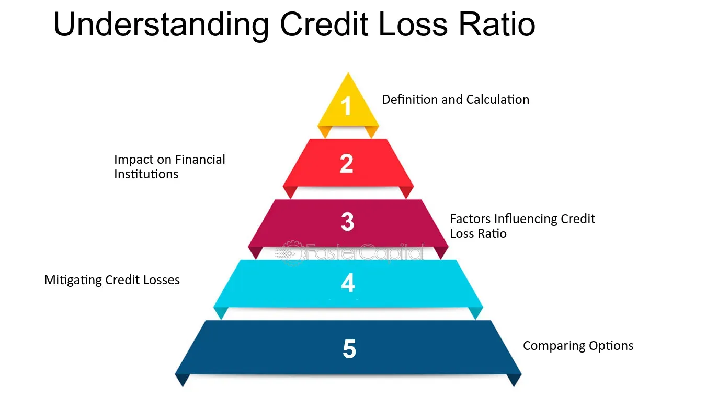

## Table of Contents

## What is the credit loss ratio?

The credit loss ratio is a measure that shows how much money a bank or a financial institution loses from loans that are not paid back. It is calculated by dividing the total amount of money lost from bad loans by the total amount of loans given out. This ratio helps banks understand the risk of lending money and manage their loan portfolios better.

A high credit loss ratio means that a bank is losing a lot of money on loans, which could be a sign that the bank needs to be more careful about who it lends money to. On the other hand, a low credit loss ratio suggests that the bank is doing a good job at picking borrowers who can pay back their loans. By keeping an eye on this ratio, banks can make better decisions about lending and reduce the risk of losing money.

## Why is the credit loss ratio important for financial institutions?

The credit loss ratio is important for financial institutions because it tells them how much money they are losing from loans that people don't pay back. By knowing this ratio, banks can see if they are lending money to the right people. If the ratio is high, it means the bank is losing a lot of money, and they might need to change who they lend to or how much they lend. This helps banks to stay healthy and avoid big financial problems.

Keeping the credit loss ratio low is also important for a bank's reputation. If a bank has a low ratio, it shows that they are good at [picking](/wiki/asset-class-picking) borrowers who can pay back their loans. This makes other people and businesses trust the bank more, and they might want to do more business with them. A low credit loss ratio can also help the bank get better deals when they borrow money from other places, because they are seen as a safer bet.

## How is the credit loss ratio calculated?

The credit loss ratio is calculated by dividing the total amount of money lost from bad loans by the total amount of loans given out. Bad loans are loans that people do not pay back. The total amount of loans given out includes all the loans the bank has made, whether they are paid back or not.

For example, if a bank lost $1 million from loans that were not paid back, and the total amount of loans given out was $100 million, the credit loss ratio would be $1 million divided by $100 million. This gives a credit loss ratio of 0.01 or 1%. This simple calculation helps banks see how much money they are losing from bad loans compared to all the loans they have made.

## What factors can affect the credit loss ratio?

Several things can change the credit loss ratio for a bank. One big [factor](/wiki/factor-investing) is the economy. If the economy is doing well, people are more likely to have jobs and pay back their loans, which can lower the credit loss ratio. But if the economy is bad, more people might lose their jobs and not be able to pay back their loans, making the credit loss ratio go up. Another factor is how careful the bank is when they decide who to give loans to. If a bank gives loans to people who are risky, the credit loss ratio might be higher because those people might not pay back their loans.

The way a bank manages its loans also matters. If a bank is good at keeping track of loans and helping people who are having trouble paying back, they might be able to keep the credit loss ratio low. On the other hand, if a bank does not watch its loans closely, the credit loss ratio could go up. Finally, the type of loans a bank gives out can affect the ratio. Loans for buying houses might have a different credit loss ratio than loans for starting a business, because the risks are different.

## Can you provide an example of how to calculate the credit loss ratio?

Let's say a bank has given out loans worth $50 million in total. Out of these loans, some people did not pay back $2 million. To find the credit loss ratio, we divide the amount of money lost from bad loans by the total amount of loans given out. So, we take $2 million and divide it by $50 million. This gives us a credit loss ratio of 0.04 or 4%.

This simple calculation helps the bank see how much money they are losing from loans that people do not pay back. If the credit loss ratio is high, like 4% in this example, the bank might want to be more careful about who they lend money to. A lower credit loss ratio would mean the bank is doing a good job at picking borrowers who can pay back their loans.

## How does the credit loss ratio differ from the default rate?

The credit loss ratio and the default rate are two different ways to look at how well a bank is doing with its loans. The credit loss ratio shows how much money a bank loses from loans that people don't pay back. It's calculated by dividing the total money lost from bad loans by the total amount of loans given out. This helps the bank see how much of their money is gone because people didn't pay back their loans.

The default rate, on the other hand, is about the number of loans that people don't pay back. It's the percentage of loans that go into default, which means the borrower stops making payments. The default rate is found by dividing the number of loans in default by the total number of loans. While the credit loss ratio looks at the money lost, the default rate looks at how many loans are not being paid back. Both are important, but they give different information about a bank's loan problems.

## What is considered a good credit loss ratio in the industry?

A good credit loss ratio in the banking industry is usually seen as being below 1%. This means that for every $100 in loans a bank gives out, they lose less than $1 from people not paying back their loans. Banks try to keep this number low because it shows they are good at choosing who to lend money to. A credit loss ratio below 1% is a sign that the bank is managing its loans well and not losing a lot of money.

However, what is considered a "good" credit loss ratio can change depending on the type of loans a bank gives out and the overall health of the economy. For example, banks that mostly give out home loans might have a different idea of a good credit loss ratio than banks that give out business loans. Also, during tough economic times, a credit loss ratio that is a bit higher might still be seen as good if it's lower than other banks in the same situation.

## How can a company improve its credit loss ratio?

A company can improve its credit loss ratio by being more careful about who they give loans to. They should check the credit history of people who want to borrow money to make sure they have a good record of paying back loans. The company can also set stricter rules for who can get a loan, like asking for a higher credit score or more money upfront. By picking borrowers who are more likely to pay back their loans, the company can lower the amount of money they lose from bad loans.

Another way to improve the credit loss ratio is by managing loans better after they are given out. The company should keep a close eye on all loans and quickly help people who are having trouble paying back. They can offer to change the loan terms, like giving more time to pay or lowering the monthly payments. By working with borrowers to make sure they can pay back their loans, the company can reduce the number of loans that go bad and keep their credit loss ratio low.

## What are the regulatory requirements related to credit loss ratios?

Banks have to follow rules set by government groups like the Federal Reserve in the U.S. These rules make sure banks are safe and do not take too many risks with their loans. One important rule is that banks must keep enough money aside to cover loans that people might not pay back. This is called a loan loss reserve. The size of this reserve can depend on the bank's credit loss ratio. If the credit loss ratio is high, the bank might need to put more money into the reserve to be ready for more losses.

Regulators also check the credit loss ratio to see if a bank is doing well. If the ratio is too high, it might mean the bank is not being careful enough about who it lends money to. The regulators can then ask the bank to change how it gives out loans or to hold more money in reserve. This helps keep the bank strong and stops it from having big problems if a lot of people do not pay back their loans.

## How do credit loss ratios impact financial statements?

Credit loss ratios show up in a bank's financial statements because they tell us how much money the bank loses from loans that people do not pay back. This information is important for the income statement, which shows how much money the bank makes or loses. If the credit loss ratio is high, it means the bank is losing more money on loans, and this will show up as a bigger expense on the income statement. This can make the bank's profits smaller or even turn them into losses.

The credit loss ratio also affects the balance sheet, which shows what the bank owns and what it owes. Banks have to set aside money to cover loans that might not be paid back, and this is called a loan loss reserve. If the credit loss ratio goes up, the bank might need to put more money into this reserve. This makes the bank's assets smaller because some of the money is now set aside and can't be used for other things. So, a high credit loss ratio can make the bank look less healthy on its balance sheet.

## What advanced statistical models are used to predict credit loss ratios?

Banks use advanced statistical models to predict credit loss ratios and help them make better decisions about lending money. One common model is called logistic regression. This model looks at things like a person's credit score, how much money they make, and their history of paying back loans to guess if they will pay back a new loan. By using this model, banks can see which loans are more likely to be paid back and which ones might turn into losses. This helps them keep their credit loss ratio low.

Another model that banks use is called [machine learning](/wiki/machine-learning). Machine learning models can look at a lot of different information at the same time, like how the economy is doing, what kind of loan it is, and even things like where the borrower lives. These models learn from past data to find patterns that can predict if a loan will be paid back or not. By using machine learning, banks can make more accurate guesses about their credit loss ratios and manage their loans better.

## How can credit loss ratios be used in stress testing and risk management?

Credit loss ratios are very important for banks when they do stress testing and manage risk. Stress testing is when banks pretend that bad things happen, like a big economic downturn, to see how they would do. By looking at the credit loss ratio, banks can guess how much money they might lose from loans during these tough times. If the credit loss ratio goes up a lot in the stress test, it means the bank needs to be ready for bigger losses and might need to change how they lend money or save more money to cover those losses.

In risk management, banks use the credit loss ratio to keep an eye on how well they are doing with their loans. If the credit loss ratio starts to go up, it can be a warning sign that the bank needs to be more careful about who they lend money to or how they manage their loans. By watching the credit loss ratio, banks can make changes early to avoid big problems later. This helps them stay strong and keep their money safe, even when things get tough.

## What is a Credit Loss Ratio?

A credit loss ratio is a fundamental metric utilized by financial institutions to assess the risk associated with a debt portfolio. Specifically, it quantifies credit-related losses as a proportion of the total value of assets or securities, such as mortgage-backed securities. This measure serves as an essential tool for evaluating the likelihood and extent of potential credit losses.

Mathematically, the credit loss ratio can be expressed as:

$$
\text{Credit Loss Ratio} = \frac{\text{Credit Losses}}{\text{Total Value of Assets}}
$$

where "Credit Losses" represents the monetary value of losses due to defaults or deteriorating credit quality, and "Total Value of Assets" is the aggregate value of the portfolio in question.

The importance of credit loss ratios surged following the 2007-08 Financial Crisis, highlighting their role in mitigating financial risk. This period underscored the systemic fragility that unchecked credit risk could pose. Consequently, the accurate assessment of credit loss ratios became imperative for financial institutions striving to understand and forecast potential vulnerabilities in their portfolios.

Employing credit loss ratios is vital for effective risk management. By regularly monitoring this ratio, institutions can implement preemptive measures aimed at curtailing potential losses. Proactive risk management, facilitated by credit loss ratios, enables financial entities to maintain robust portfolios and avoid substantial financial setbacks.

## What are Financial Metrics in Algorithmic Trading?

Algorithmic trading, which involves the use of computer algorithms to execute trading strategies, relies heavily on various financial metrics to assess and enhance both performance and risk management. Key metrics such as the Sharpe Ratio, Maximum Drawdown, and Win Rate play crucial roles in this context.

The **Sharpe Ratio** is a measure used to evaluate the risk-adjusted return of an investment strategy. Defined as the difference between the returns of the investment and the risk-free rate, divided by the standard deviation of the returns, it provides insight into how much excess return is obtained for the extra [volatility](/wiki/volatility-trading-strategies) endured.

$$

\text{Sharpe Ratio} = \frac{R_p - R_f}{\sigma_p} 
$$

where $R_p$ is the portfolio return, $R_f$ is the risk-free rate, and $\sigma_p$ is the standard deviation of the portfolio's excess return. A higher Sharpe Ratio indicates better risk-adjusted performance, guiding traders in assessing the potential reward of their strategies relative to the risk involved.

**Maximum Drawdown** is another vital metric that quantifies the largest peak-to-trough decline in the portfolio's value during a specified period. By highlighting the worst loss from a peak before a subsequent recovery to another peak, Maximum Drawdown helps traders understand the downside risk and potential losses. It is particularly crucial for traders who wish to limit losses and enhance capital preservation.

The **Win Rate** refers to the percentage of winning trades out of the total number of trades. It is a straightforward, yet informative, metric indicating the overall success rate of a trading strategy. While high Win Rates are desirable, traders must balance them with the average size of wins versus losses, to ensure overall profitability.

Financial metrics like these enable traders to understand the efficiency and stability of their trading systems. By analyzing these metrics, traders can make informed adjustments to their algorithms to optimize performance and mitigate risk. This includes fine-tuning entry and [exit](/wiki/exit-strategy) points, recalibrating risk limits, or even redesigning the strategy entirely.

These metrics are integral to ensuring consistent profitability in [algorithmic trading](/wiki/algorithmic-trading). By fostering an in-depth understanding of both risk and return, they equip traders with the tools necessary to maintain competitive and sustainable trading strategies in the rapidly evolving financial markets.

## How do credit loss ratios influence algorithmic trading?

Algorithmic trading, a discipline characterized by the use of computer algorithms to execute trading strategies, heavily relies on various financial metrics to assess and manage risk. Credit loss ratios are integral in this context as they serve to evaluate the potential credit risk associated with trading securities. By utilizing these ratios, traders can develop a more comprehensive understanding of a trading strategy's risk profile and make informed adjustments to align with their financial objectives.

High credit risk profile securities, identified through elevated credit loss ratios, necessitate modifications in trading algorithms. These adjustments are crucial to preemptively mitigate significant losses. For instance, if a trading algorithm deals extensively with a security manifesting a high credit loss ratio, traders might reduce the algorithm's exposure to such securities or incorporate a hedging strategy to balance potential losses. 

Integrating credit loss ratios into algorithmic trading strategies achieves a balance between risk and return, essential for optimizing performance. By quantifying potential losses, these ratios enable traders to gauge the amount of risk they are assuming relative to expected returns, facilitating decisions that adhere to established risk tolerance levels. A typical formula to express the risk-return profile in trading strategy could be:

$$

\text{Risk-Adjusted Return} = \frac{\text{Expected Return} - \text{Risk-Free Rate}}{\text{Credit Loss Ratio}}
$$

This formula highlights the importance of credit loss ratios in determining the attractiveness of returns when adjusted for risk.

Additionally, a well-maintained credit loss profile allows traders to fine-tune their algorithms, enhancing performance and reducing volatility. By continuously monitoring credit loss ratios and corresponding market data, algorithmic traders can adjust key parameters in their strategies to maintain optimal operation conditions. For example, a reactive algorithm could be set to alter transaction volumes or modify stop-loss orders based on real-time changes in credit loss ratios.

The strategic use of credit loss ratios fosters sustainable trading and investment decisions. By regularly evaluating and optimizing these ratios, traders ensure a robust risk management process, which is essential not only for safeguarding existing assets but also for capitalizing on new trading opportunities. Cultivating a well-managed credit loss profile thus minimizes unforeseen risks and establishes a foundation for long-term profitability in algorithmic trading practices.

## References & Further Reading

[1]: ["Credit Risk Measurement: New Approaches to Value at Risk and Other Paradigms"](https://archive.org/details/creditriskmeasur0000saun) by Anthony Saunders

[2]: ["Financial Risk Management for Dummies"](https://www.wiley.com/en-us/Financial+Risk+Management+For+Dummies-p-9781119082200) by Aaron Brown

[3]: ["An Introduction to Algorithmic Trading: Basic to Advanced Strategies"](https://archive.org/details/introductiontoal0000lesh) by Edward Leshik and Jane Cralle

[4]: ["Asset Management: A Systematic Approach to Factor Investing"](https://academic.oup.com/book/3342) by Andrew Ang

[5]: ["Algorithmic Trading: Winning Strategies and Their Rationale"](https://www.amazon.com/Algorithmic-Trading-Winning-Strategies-Rationale-ebook/dp/B00CY5HC0U) by Ernie Chan