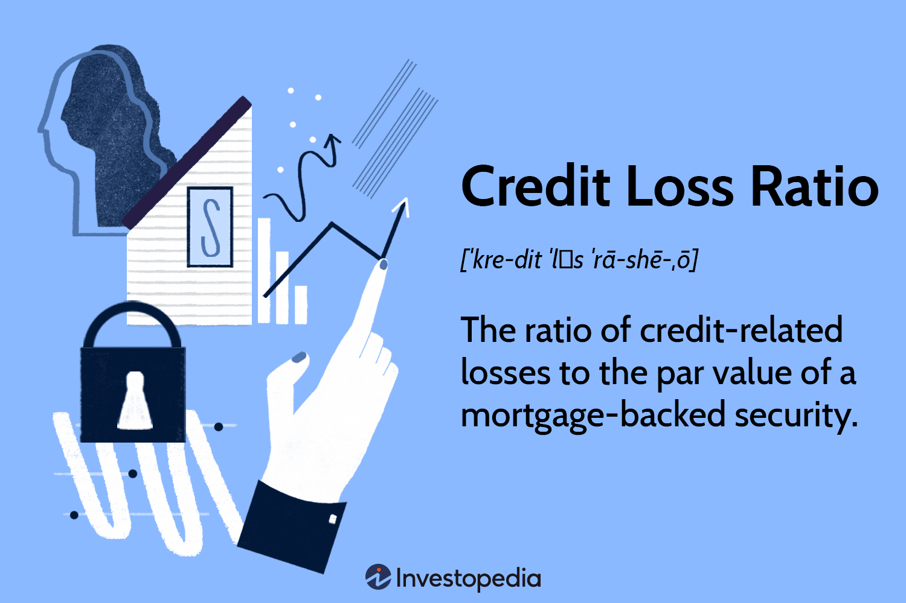

Understanding the dynamics of credit loss ratio risk management is crucial in today's volatile financial markets. The rapid evolution of financial products, coupled with increasing market complexity, necessitates robust risk management protocols, especially in algorithmic trading. Algorithmic trading involves the use of automated pre-programmed trading instructions to execute orders at high speed and volume. As such, the capacity to manage risk efficiently within this framework is essential to ensure sustainable trading outcomes.

Credit loss ratios serve as vital indicators in this process, as they measure the extent of credit-related losses relative to the total value of assets or securities. These ratios help financial institutions gauge the potential risk of credit loss, enabling them to refine and implement risk management strategies accordingly. The significance of credit loss ratios was highlighted following the 2007-08 Financial Crisis, wherein inadequacies in understanding and managing credit risk were deemed major contributing factors.

In the context of algorithmic trading, the evaluation of performance and risk through specific metrics is imperative. Metrics such as the Sharpe Ratio, Maximum Drawdown, and Win Rate provide a framework for understanding risk-adjusted returns, thereby guiding traders in refining their trading strategies. These financial metrics are critical for assessing the efficiency and stability of trading algorithms and making informed adjustments to enhance performance while minimizing risk.

By examining the interplay between credit loss ratios and algorithmic trading metrics, this article aims to enhance the reader's ability to leverage these tools for more informed trading and financial decision-making. Understanding these metrics can empower traders and risk managers to strengthen their risk assessment protocols and optimize their trading strategies for improved financial outcomes.

## Table of Contents

## What is a Credit Loss Ratio?

A credit loss ratio is a fundamental metric utilized by financial institutions to assess the risk associated with a debt portfolio. Specifically, it quantifies credit-related losses as a proportion of the total value of assets or securities, such as mortgage-backed securities. This measure serves as an essential tool for evaluating the likelihood and extent of potential credit losses.

Mathematically, the credit loss ratio can be expressed as:

$$
\text{Credit Loss Ratio} = \frac{\text{Credit Losses}}{\text{Total Value of Assets}}
$$

where "Credit Losses" represents the monetary value of losses due to defaults or deteriorating credit quality, and "Total Value of Assets" is the aggregate value of the portfolio in question.

The importance of credit loss ratios surged following the 2007-08 Financial Crisis, highlighting their role in mitigating financial risk. This period underscored the systemic fragility that unchecked credit risk could pose. Consequently, the accurate assessment of credit loss ratios became imperative for financial institutions striving to understand and forecast potential vulnerabilities in their portfolios.

Employing credit loss ratios is vital for effective risk management. By regularly monitoring this ratio, institutions can implement preemptive measures aimed at curtailing potential losses. Proactive risk management, facilitated by credit loss ratios, enables financial entities to maintain robust portfolios and avoid substantial financial setbacks.

## Role of Credit Loss Ratios in Risk Management

Credit loss ratios serve as a fundamental metric in risk management by providing a quantitative measure of potential credit risk. These ratios are instrumental for financial institutions in assessing the risk levels associated with various securities and subsequently adjusting their portfolios to match desired risk exposures. Through a comprehensive evaluation of credit loss ratios, financial institutions can implement strategies that are tailored to mitigate potential losses linked to credit defaults or deteriorations. 

When deciding on the issuance of new financial products or the maintenance of existing ones, credit loss ratios provide essential insights. For instance, a higher than anticipated credit loss ratio might indicate elevated risk levels, prompting institutions to reconsider or recalibrate their offerings. It allows them to anticipate adverse scenarios and react proactively, avoiding significant financial distress.

Moreover, credit loss ratios are crucial for risk managers who utilize this information to foresee potential losses, thereby enabling them to devise and adjust strategies to minimize such impacts effectively. By having a robust grasp of how these ratios influence financial health, risk managers can construct more resilient portfolios that are better equipped to withstand market volatilities. 

Ultimately, a profound understanding of credit loss ratios is indispensable for crafting a proactive risk management framework. This ensures that institutions cannot only protect against unforeseen losses but also seize opportunities that align with their risk appetite and strategic objectives. Through continuous monitoring and analysis of these ratios, organizations can enhance their ability to safeguard financial assets and optimize risk-adjusted returns.

## Financial Metrics in Algorithmic Trading

Algorithmic trading, which involves the use of computer algorithms to execute trading strategies, relies heavily on various financial metrics to assess and enhance both performance and risk management. Key metrics such as the Sharpe Ratio, Maximum Drawdown, and Win Rate play crucial roles in this context.

The **Sharpe Ratio** is a measure used to evaluate the risk-adjusted return of an investment strategy. Defined as the difference between the returns of the investment and the risk-free rate, divided by the standard deviation of the returns, it provides insight into how much excess return is obtained for the extra [volatility](/wiki/volatility-trading-strategies) endured.

$$

\text{Sharpe Ratio} = \frac{R_p - R_f}{\sigma_p} 
$$

where $R_p$ is the portfolio return, $R_f$ is the risk-free rate, and $\sigma_p$ is the standard deviation of the portfolio's excess return. A higher Sharpe Ratio indicates better risk-adjusted performance, guiding traders in assessing the potential reward of their strategies relative to the risk involved.

**Maximum Drawdown** is another vital metric that quantifies the largest peak-to-trough decline in the portfolio's value during a specified period. By highlighting the worst loss from a peak before a subsequent recovery to another peak, Maximum Drawdown helps traders understand the downside risk and potential losses. It is particularly crucial for traders who wish to limit losses and enhance capital preservation.

The **Win Rate** refers to the percentage of winning trades out of the total number of trades. It is a straightforward, yet informative, metric indicating the overall success rate of a trading strategy. While high Win Rates are desirable, traders must balance them with the average size of wins versus losses, to ensure overall profitability.

Financial metrics like these enable traders to understand the efficiency and stability of their trading systems. By analyzing these metrics, traders can make informed adjustments to their algorithms to optimize performance and mitigate risk. This includes fine-tuning entry and [exit](/wiki/exit-strategy) points, recalibrating risk limits, or even redesigning the strategy entirely.

These metrics are integral to ensuring consistent profitability in [algorithmic trading](/wiki/algorithmic-trading). By fostering an in-depth understanding of both risk and return, they equip traders with the tools necessary to maintain competitive and sustainable trading strategies in the rapidly evolving financial markets.

## How Credit Loss Ratios Influence Algorithmic Trading

Algorithmic trading, a discipline characterized by the use of computer algorithms to execute trading strategies, heavily relies on various financial metrics to assess and manage risk. Credit loss ratios are integral in this context as they serve to evaluate the potential credit risk associated with trading securities. By utilizing these ratios, traders can develop a more comprehensive understanding of a trading strategy's risk profile and make informed adjustments to align with their financial objectives.

High credit risk profile securities, identified through elevated credit loss ratios, necessitate modifications in trading algorithms. These adjustments are crucial to preemptively mitigate significant losses. For instance, if a trading algorithm deals extensively with a security manifesting a high credit loss ratio, traders might reduce the algorithm's exposure to such securities or incorporate a hedging strategy to balance potential losses. 

Integrating credit loss ratios into algorithmic trading strategies achieves a balance between risk and return, essential for optimizing performance. By quantifying potential losses, these ratios enable traders to gauge the amount of risk they are assuming relative to expected returns, facilitating decisions that adhere to established risk tolerance levels. A typical formula to express the risk-return profile in trading strategy could be:

$$

\text{Risk-Adjusted Return} = \frac{\text{Expected Return} - \text{Risk-Free Rate}}{\text{Credit Loss Ratio}}
$$

This formula highlights the importance of credit loss ratios in determining the attractiveness of returns when adjusted for risk.

Additionally, a well-maintained credit loss profile allows traders to fine-tune their algorithms, enhancing performance and reducing volatility. By continuously monitoring credit loss ratios and corresponding market data, algorithmic traders can adjust key parameters in their strategies to maintain optimal operation conditions. For example, a reactive algorithm could be set to alter transaction volumes or modify stop-loss orders based on real-time changes in credit loss ratios.

The strategic use of credit loss ratios fosters sustainable trading and investment decisions. By regularly evaluating and optimizing these ratios, traders ensure a robust risk management process, which is essential not only for safeguarding existing assets but also for capitalizing on new trading opportunities. Cultivating a well-managed credit loss profile thus minimizes unforeseen risks and establishes a foundation for long-term profitability in algorithmic trading practices.

## Steps for Effective Credit Loss Ratio Risk Management

Monitoring and evaluating credit loss ratios regularly is essential for maintaining awareness of the risk levels present in financial portfolios. By continuously assessing these ratios, financial institutions can detect adverse trends early and take appropriate actions to mitigate potential losses. This ongoing evaluation helps in maintaining the financial robustness of portfolios, enabling institutions to adapt to evolving market conditions.

Using advanced modeling techniques is another crucial component in predicting and mitigating potential credit losses. Techniques such as [machine learning](/wiki/machine-learning) and probabilistic models can be employed to analyze vast data sets and anticipate future credit loss scenarios. These models can identify patterns and correlations that may not be evident through traditional analysis. For instance, predictive analytics can be utilized to forecast credit defaults and adjust risk parameters accordingly. The application of these technologies allows for a more nuanced understanding of credit risk, leading to more informed decision-making.

Diversifying investments is a fundamental strategy for spreading risk and balancing credit loss ratios across various asset classes. By allocating resources across a wide range of sectors, geographic regions, and financial instruments, institutions can reduce the impact of localized economic downturns or sector-specific risks. Diversification ensures that the overall portfolio remains resilient, even if individual assets perform poorly. This approach not only manages risk but also enhances potential returns by capitalizing on diverse market opportunities.

Applying robust statistical tools and performance metrics is essential for the continuous improvement of trading algorithms. Financial metrics such as Sharpe Ratio, Maximum Drawdown, and Value at Risk (VaR) can be employed to evaluate the efficiency and stability of trading strategies. By integrating these metrics, traders can fine-tune algorithms, optimize performance, and mitigate risk. Moreover, the use of [backtesting](/wiki/backtesting) allows for the assessment of how trading strategies would have performed in the past, providing valuable insights for future trades.

Staying informed about market developments and reformulating strategies in response to changing risk environments is vital for effective credit loss ratio management. Financial markets are dynamic, influenced by a myriad of factors, including geopolitical events, regulatory changes, and macroeconomic trends. By keeping abreast of these developments, institutions can proactively adjust their strategies, ensuring that they remain well-aligned with current and anticipated market conditions. This adaptive approach is crucial for maintaining a competitive edge and ensuring the long-term sustainability of trading and investment activities.

## Conclusion

Credit loss ratios are indispensable tools in financial risk management and algorithmic trading, offering essential insights into the credit risk associated with various securities and trading strategies. The careful understanding and management of these ratios can significantly enhance decision-making and optimize trading performance. For financial institutions and traders, integrating credit loss ratios with other critical performance metrics allows for an improved assessment of risk-adjusted returns, a key [factor](/wiki/factor-investing) in evaluating the efficiency of portfolios and trading algorithms.

By maintaining a vigilant focus on credit loss ratios, financial portfolios can benefit from strategic adjustments that mitigate potential risks while maximizing returns. Effective credit loss ratio management enables stakeholders to safeguard financial assets against adverse market conditions, ensuring the long-term profitability and sustainability of trading operations. Consequently, these ratios serve as a foundation for creating robust trading frameworks that are resilient to market fluctuations and capable of delivering consistent, profitable outcomes. In an era of complex financial markets, the ability to leverage credit loss ratios effectively is an asset, promoting sound risk management and fostering enduring success in algorithmic trading.

## References & Further Reading

[1]: ["Credit Risk Measurement: New Approaches to Value at Risk and Other Paradigms"](https://archive.org/details/creditriskmeasur0000saun) by Anthony Saunders

[2]: ["Financial Risk Management for Dummies"](https://www.wiley.com/en-us/Financial+Risk+Management+For+Dummies-p-9781119082200) by Aaron Brown

[3]: ["An Introduction to Algorithmic Trading: Basic to Advanced Strategies"](https://archive.org/details/introductiontoal0000lesh) by Edward Leshik and Jane Cralle

[4]: ["Asset Management: A Systematic Approach to Factor Investing"](https://academic.oup.com/book/3342) by Andrew Ang

[5]: ["Algorithmic Trading: Winning Strategies and Their Rationale"](https://www.amazon.com/Algorithmic-Trading-Winning-Strategies-Rationale-ebook/dp/B00CY5HC0U) by Ernie Chan