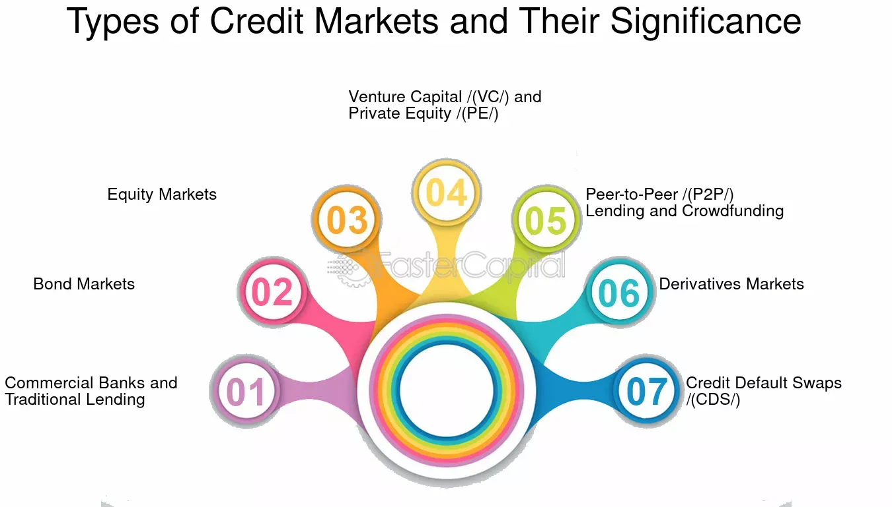

## Table of Contents

## What is a credit market?

A credit market is a place where people and businesses can borrow money. They borrow from banks, other financial institutions, or even from other people. When someone borrows money, they promise to pay it back with interest over time. This is called a loan. The interest is like a fee for borrowing the money. Credit markets help people buy things they can't afford right away, like houses or cars, and help businesses grow by giving them the money they need.

Credit markets are important for the economy. They help money move around and keep things running smoothly. When people and businesses can borrow money easily, they can spend and invest more, which can help the economy grow. But if it becomes hard to borrow money, it can slow down the economy. That's why governments and central banks keep a close eye on credit markets and sometimes step in to help them work better.

## How does the credit market function?

The credit market works by connecting people and businesses who need money with those who have money to lend. When someone wants to borrow money, they go to a bank or another lender and ask for a loan. The lender checks if the person or business can pay back the loan by looking at their credit history and other information. If the lender thinks the borrower can pay back the money, they give them the loan. The borrower then uses the money for things like buying a house, starting a business, or paying for school. They agree to pay back the loan over time, usually with interest.

Interest is the extra money the borrower pays for using the lender's money. It's like a fee for borrowing. The amount of interest depends on things like how much is borrowed, how long the borrower takes to pay it back, and how risky the lender thinks the loan is. If the borrower pays back the loan on time, everyone is happy. But if they can't pay it back, they might have to give up something they own, like a house or a car, to the lender. This is called collateral.

Credit markets are important because they help money move around in the economy. When people and businesses can borrow money easily, they can spend and invest more, which helps the economy grow. But if it becomes hard to borrow money, it can slow down the economy. That's why governments and central banks watch credit markets closely and sometimes make rules or take actions to help them work better.

## What are the main participants in the credit market?

The main participants in the credit market are borrowers and lenders. Borrowers are people or businesses that need money and want to borrow it. They might want to buy a house, start a business, or pay for school. Lenders are banks, other financial institutions, or even people who have money to lend. They give money to borrowers and expect to get it back with interest.

Another important group in the credit market is credit rating agencies. These agencies check how likely it is that a borrower will pay back their loan. They give the borrower a credit rating, which helps lenders decide if they should give them a loan. Governments and central banks also play a big role. They make rules about lending and borrowing and can take actions to help the credit market work better. For example, they might change interest rates to make borrowing easier or harder.

## What are the different types of credit?

There are several types of credit, each serving different needs. One common type is a loan, which is when someone borrows a lump sum of money and agrees to pay it back over time with interest. Loans can be for things like buying a car or a house, or for starting a business. Another type is a credit card, which lets people borrow money up to a certain limit to buy things. They have to pay back what they spend, usually every month, and if they don't pay it all back, they pay interest on the rest.

Another type of credit is a line of credit, which is like a credit card but often for bigger amounts. People can borrow money from it whenever they need to, up to a certain limit, and pay it back over time. There's also a mortgage, which is a special kind of loan used to buy a house. It's usually for a large amount of money and is paid back over many years. Lastly, there's student loans, which help people pay for school. These loans often have lower interest rates and can be paid back after the person finishes their studies.

## How do interest rates affect the credit market?

Interest rates have a big effect on the credit market. When interest rates are low, it's cheaper for people and businesses to borrow money. They can get loans with less interest to pay back, so more people want to borrow. This can make the economy grow because people can buy things like houses and cars, and businesses can invest more. But when interest rates are high, borrowing money costs more. Fewer people and businesses want to take out loans because they have to pay more interest. This can slow down the economy because people and businesses spend and invest less.

Central banks, like the Federal Reserve in the United States, can change interest rates to help control the economy. If they think the economy is growing too fast and might cause inflation, they might raise interest rates to make borrowing harder. This can cool down the economy. On the other hand, if the economy is slowing down too much, they might lower interest rates to make borrowing easier. This can help the economy grow again. So, interest rates are a powerful tool that can affect how the credit market works and how well the whole economy is doing.

## What is the difference between secured and unsecured credit?

Secured credit is when a borrower gives something valuable, like a house or a car, to the lender as a promise. This thing is called collateral. If the borrower can't pay back the loan, the lender can take the collateral. Because the lender has this safety net, they might give the borrower a lower interest rate. Secured credit is often used for big loans, like mortgages for buying a house or auto loans for buying a car.

Unsecured credit is when the borrower doesn't give any collateral. The lender gives the money based only on the borrower's promise to pay it back. Because it's riskier for the lender, they might charge a higher interest rate. Credit cards and personal loans are common examples of unsecured credit. If the borrower can't pay back an unsecured loan, the lender can't take anything specific, but they can try to get the money through other ways, like going to court.

## What role do credit ratings play in the credit market?

Credit ratings are important in the credit market because they help lenders decide if someone is a good bet to lend money to. A credit rating is like a score that shows how likely a person or a business is to pay back their loans. Credit rating agencies, like Moody's or Standard & Poor's, look at things like how much money the borrower makes, how much they owe, and if they've paid back loans on time before. If a borrower has a high credit rating, lenders think they are more likely to pay back the money, so they might offer them a loan with a lower interest rate. But if the credit rating is low, lenders see it as riskier and might charge a higher interest rate or not give a loan at all.

Credit ratings also affect how much it costs for businesses and governments to borrow money. If a company or a country has a high credit rating, investors feel safer lending them money, so they can borrow at lower interest rates. This can help them grow their business or run their country better. But if their credit rating goes down, it becomes more expensive for them to borrow money. This can make it harder for them to do things like build new factories or pay for public services. So, credit ratings are a big deal in the credit market because they help everyone understand the risks of lending and borrowing money.

## How do economic cycles impact the credit market?

Economic cycles, like booms and busts, can really change how the credit market works. When the economy is doing well and growing, people feel more sure about their jobs and money. They want to borrow more to buy things like houses or start businesses. Banks and lenders are happy to give out loans because they think people will be able to pay them back. This makes the credit market busy and helps the economy grow even more. But when the economy starts to slow down or goes into a recession, people get worried about their jobs and money. They don't want to borrow as much, and banks get more careful about giving out loans because they're not sure if people can pay them back. This can make the credit market slow down and can make the economy shrink.

In a boom, low interest rates often make it easier for people to borrow money. This can lead to a lot of lending and borrowing, which can sometimes create bubbles, like in the housing market. If these bubbles burst, it can cause a lot of problems in the credit market. During a bust, high interest rates or tight lending rules can make it hard for people and businesses to get loans. This can lead to less spending and investment, which can make the economy worse. So, economic cycles have a big effect on the credit market, making it expand and contract along with the ups and downs of the economy.

## What are credit derivatives and how are they used?

Credit derivatives are financial tools that let people manage the risk of lending money. They work like insurance for loans. If someone has lent money and is worried the borrower might not pay it back, they can use a credit derivative to protect themselves. The most common type of credit derivative is a credit default swap (CDS). With a CDS, the person who lent the money pays a fee to someone else. In return, if the borrower doesn't pay back the loan, the person who bought the CDS gets money from the one who sold it to them.

Credit derivatives are used by banks, investors, and other financial companies to spread out the risk of loans. Instead of one bank taking all the risk of a big loan, it can use credit derivatives to share that risk with others. This can make the credit market more stable because the risk is spread out. But credit derivatives can also be risky if they're not used carefully. If a lot of people are buying and selling them without understanding the risks, it can lead to big problems, like what happened during the 2008 financial crisis. So, while credit derivatives can help manage risk, they need to be used wisely.

## What is the significance of the yield curve in the credit market?

The yield curve is a graph that shows the interest rates for loans that last different amounts of time. It's important in the credit market because it tells us what people think about the economy's future. When the economy is doing well, people expect interest rates to go up, so the yield curve slopes upward. This means short-term loans have lower interest rates than long-term loans. Banks and investors use the yield curve to decide if they should lend money and for how long. If the yield curve looks normal, with higher rates for longer loans, it means people feel good about the economy and are willing to lend money for a long time.

But sometimes the yield curve can be flat or even upside down, which is called an inverted yield curve. This happens when long-term interest rates are the same or lower than short-term rates. An inverted yield curve can be a warning sign that people think the economy might get worse. When people see an inverted yield curve, they might start to worry and lend less money. This can make it harder for people and businesses to borrow, which can slow down the economy. So, the yield curve is a big deal in the credit market because it helps everyone understand what might happen next and make better decisions about lending and borrowing.

## How do regulatory changes influence the credit market?

Regulatory changes can have a big impact on the credit market. When governments or central banks make new rules, they can change how easy or hard it is for people and businesses to borrow money. For example, if a new rule makes banks keep more money in reserve, they might not have as much to lend out. This can make it harder for people to get loans and can slow down the economy. On the other hand, if a new rule makes it easier for banks to lend money, more people might borrow, which can help the economy grow.

These changes can also affect how much risk banks are willing to take. If new rules make it more expensive for banks to lend to risky borrowers, they might be more careful about who they lend to. This can make it harder for people with low credit scores to get loans. But if the rules are relaxed, banks might be more willing to take on risk, which can lead to more lending but also more problems if borrowers can't pay back their loans. So, regulatory changes are important because they can shape how the credit market works and how well the economy does.

## What are some advanced strategies for managing credit risk?

One advanced strategy for managing credit risk is diversification. This means spreading out the money you lend to different people or businesses. If you lend all your money to one person and they can't pay it back, you lose everything. But if you lend smaller amounts to many different people, the risk is spread out. Even if a few people can't pay back their loans, you still have money coming in from others. Another part of diversification is lending to different types of businesses or in different places. This way, if one type of business or one area has problems, your whole loan portfolio isn't in danger.

Another strategy is using credit derivatives, like credit default swaps (CDS). These are like insurance for loans. If you're worried someone might not pay back their loan, you can buy a CDS. You pay a fee, and if the borrower doesn't pay back the loan, the person who sold you the CDS pays you instead. This can help protect your money. But you have to be careful because credit derivatives can be complicated and risky if you don't understand them well. It's important to use them wisely and not rely on them too much.

A third strategy is stress testing. This means imagining bad things that could happen, like a big drop in the economy or a lot of people not paying back their loans, and seeing how your loans would do. By running these tests, you can find out which loans are most at risk and take steps to protect yourself. You might decide to ask for more collateral, charge higher interest rates, or not lend to certain people. Stress testing helps you be ready for tough times and manage your credit risk better.

## References & Further Reading

[1]: ["Bond Markets, Analysis, and Strategies"](https://books.google.com/books/about/Bond_Markets_Analysis_and_Strategies_ten.html?id=bQpNEAAAQBAJ) by Frank J. Fabozzi

[2]: Agapova, A., & McCumber, W. R. (2014). ["The interdependence between U.S. credit and stock markets: The role of cyber trading."](https://scholar.google.com/citations?user=xOtocPoAAAAJ&hl=en) Journal of Banking & Finance, 47, 115-129.

[3]: Aldridge, I. (2013). ["High-Frequency Trading: A Practical Guide to Algorithmic Strategies and Trading Systems"](https://www.ahmetbeyefendi.com/wp-content/uploads/2020/07/High-Frequency-Trading-Irene-Aldridge.pdf). Wiley.

[4]: Kirilenko, A. A., Kyle, A. S., Samadi, M., & Tuzun, T. (2017). ["The Flash Crash: High‐Frequency Trading in an Electronic Market."](https://onlinelibrary.wiley.com/doi/abs/10.1111/jofi.12498) The Review of Financial Studies, 30(7), 2221-2257.

[5]: Gomber, P., Arndt, B., Lutat, M., & Uhle, T. (2011). ["High-Frequency Trading"](https://www.researchgate.net/publication/271631628_High-Frequency-Trading). In: The Equity Trader Course. Springer Gabler, Wiesbaden. 

[6]: ["Asset Pricing and Portfolio Choice Theory"](https://academic.oup.com/book/43509) by Kerry Back