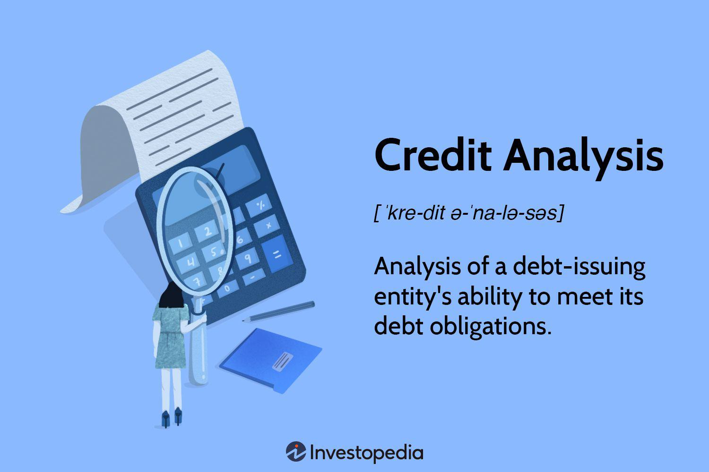

The credit market is a fundamental component of the global financial system, serving as a platform where individuals, corporations, and governments can access funds through the issuance and trading of debt instruments. These instruments, which include bonds, loans, and other credit facilities, enable entities to borrow money from investors whose primary return is in the form of interest payments. The credit market is crucial for the functioning of modern economies, as it facilitates capital flow, provides liquidity, and supports economic growth by enabling investment and consumption.

Within the credit market, several distinct types operate, each serving a specific purpose. These include the primary market, where new debt securities are issued directly from borrowers to investors, and the secondary market, where existing securities are traded among investors. Additionally, the credit market encompasses over-the-counter (OTC) markets, where securities not listed on formal exchanges are traded directly between parties, and derivatives markets, which involve securities whose value is derived from underlying assets.

Algorithmic trading has risen dramatically over the past few decades, profoundly impacting financial markets. This type of trading uses automated strategies powered by sophisticated algorithms to execute trades at speeds and volumes beyond human capabilities. The integration of algorithmic trading within credit markets has revolutionized how these markets function, introducing significant efficiencies in terms of trade execution speed and cost, and enhancing price discovery mechanisms.

Understanding the interplay between credit markets and algorithmic trading is increasingly vital as technology continues to reshape market dynamics. Algorithmic trading offers improved liquidity and tighter bid-ask spreads but also raises challenges such as increased volatility and susceptibility to 'flash crashes' due to high-frequency trading activities. As such, grasping the nuances of how these elements interact is essential for investors, regulators, and market participants aiming to navigate the ever-evolving financial landscape effectively.

In the sections that follow, a detailed exploration of various credit market examples and financial type mechanisms will be provided, offering insights into their significance and functionality in contemporary finance.

## Table of Contents

## Understanding the Credit Market: An Overview

The credit market serves as a critical platform within the financial system where debt instruments are actively traded. These instruments, often in the form of bonds, notes, and commercial paper, represent a promise by the issuer to repay the borrowed amount along with interest over a specified period. By allowing these debt instruments to be traded, the credit market plays a pivotal role in providing liquidity, thereby facilitating the smooth flow of capital essential for economic growth and stability.

Liquidity in the credit market ensures that there is always a ready market for these debt instruments, allowing issuers to raise funds efficiently and investors to convert their holdings to cash or other assets as needed. This [liquidity](/wiki/liquidity-risk-premium) not only supports the functioning of financial institutions but also enables corporations and governments to access necessary funding for a variety of purposes, including expansion, operational requirements, and infrastructure development.

The participants in the credit market are diverse, ranging from banks and financial institutions to individual investors and large corporations. Banks often act as intermediaries, matching borrowers with suitable lenders, while investors look for opportunities to earn returns by providing capital. Corporations, on the other hand, enter the credit market primarily to raise the funding necessary to support their business activities, taking advantage of favorable market conditions to issue debt.

Several types of securities are commonly traded within the credit market. Bonds, typically long-term debt securities, are issued by corporations and governments to secure capital with the promise of periodic interest payments (coupons) until maturity, at which point the principal is repaid. Notes, similar to bonds but with a shorter maturity period, serve a comparable function, offering an intermediary option for both issuers and investors. Additionally, commercial paper represents short-term unsecured promissory notes issued mainly by corporations to meet immediate funding requirements, capitalizing on lower borrowing costs due to shorter duration.

In summary, the credit market forms an integral component of the financial ecosystem, bringing together various participants to trade debt instruments, thus ensuring liquidity and enabling efficient capital allocation across economies. Understanding these dynamics is crucial for comprehending the broader implications of financial markets and the role they play in sustaining economic advancements.

## Different Types of Financial Markets within the Credit Market

## Different Types of Financial Markets within the Credit Market

The credit market is composed of several essential components, each serving distinct functions and contributing to the overall efficiency and liquidity of financial systems. Within this interconnected environment, diverse types of financial markets operate, each with specific roles and characteristics.

### Primary Market

The primary market is pivotal in the credit ecosystem, facilitating the initial issuance of debt instruments. This market allows corporations, governments, and other entities to raise capital by issuing new securities directly to investors. When a company wishes to raise funds for expansion or an infrastructure project, it may issue bonds through the primary market, where these bonds are purchased directly from the issuer. The proceeds from this transaction provide the issuer with necessary capital, marking the primary market's critical role in capital formation.

### Secondary Market

Once financial securities are issued in the primary market, they frequently enter the secondary market, where trading activities predominantly occur. In the secondary market, existing securities are bought and sold among investors, offering them an avenue to liquidate their investments or acquire new securities. This liquidity is essential for maintaining a vibrant market, as it allows investors to reallocate their portfolios in response to market conditions. The secondary market thus enhances the efficiency and stability of the credit system.

### Over-the-Counter (OTC) Market

The Over-the-Counter (OTC) market differs significantly from exchange-traded markets in terms of structure and operations. In the OTC market, securities are traded directly between parties without the oversight of a central exchange. This market accommodates the trading of customized debt instruments, which might not be suited for standardization required by exchange trading. OTC markets are typically characterized by higher flexibility and privacy, often favored for complex financial products and instruments such as derivatives or non-standard bonds.

### Role of Derivatives in the Credit Market

Derivatives are financial instruments whose value is derived from underlying assets, including various forms of debt securities. In the credit market, derivatives play several vital roles, such as risk management, price discovery, and [arbitrage](/wiki/arbitrage) opportunities. Instruments like credit default swaps (CDS) allow investors to hedge credit risk associated with specific debt securities. By providing a mechanism to transfer and manage risk, derivatives contribute to market stability and efficiency. They are also instrumental in enabling speculative strategies, creating opportunities for profit based on the movement of underlying credit market conditions.

These various types of financial markets within the credit market construct a multifaceted environment facilitating capital flow, risk management, and investment opportunities. Understanding these markets' nuanced interactions is essential for comprehending the broader dynamics at play within the financial sector.

## Examples of Credit Markets in Action

The credit market is a crucial component of the global financial system, facilitating the exchange of debt instruments. Various sub-markets within the credit market fulfill specific roles. This section provides an exploration of several critical examples of credit markets.

The U.S. Treasury market represents one of the most significant parts of the credit market. It involves the buying and selling of U.S. government securities. Treasuries are considered low-risk investments due to the backing of the U.S. government. The market serves several purposes, including debt refinancing and fulfilling short or long-term financing needs. Treasuries are also utilized as benchmark rates for other financial instruments and play an essential role in monetary policy operations.

The Eurobond market illustrates the international aspect of credit markets. Eurobonds are issued in a currency different from the home currency of the country or market in which they are issued. For instance, a bond issued in Europe that is denominated in U.S. dollars is considered a Eurobond. This market allows issuers to raise capital in international markets, providing benefits such as reduced currency risk and access to a broader investor base. The Eurobond market contributes significantly to global liquidity and offers diversification opportunities for both issuers and investors.

The corporate bond market is vital for businesses seeking to raise capital for operations, expansion, and other strategic investments. Unlike equities, corporate bonds allow companies to preserve ownership while securing necessary funds. Investors are attracted to corporate bonds due to their potential for higher yields compared to government securities, though they [carry](/wiki/carry-trading) increased risk. The dynamics in the corporate bond market can reflect broader economic conditions, influencing corporate strategies and investor decisions.

Municipal bonds, issued by local governments, are designed to gather funds for public projects such as infrastructure, schools, and utilities. These bonds offer tax advantages to investors, often making them attractive for individuals seeking tax-exempt income. Municipal bonds provide local governments with the means to fund essential services without resorting to tax increases, facilitating community development and economic growth.

Emerging market credit markets have shown considerable evolution, offering high-growth prospects that attract global investors. These markets typically involve higher risks due to economic [volatility](/wiki/volatility-trading-strategies), political instability, and less developed financial systems. However, they also offer higher returns, contributing to their appeal. Emerging markets can significantly impact the global economy, providing diversification opportunities while influencing global capital flows.

Each of these credit markets demonstrates unique characteristics and serves integral roles in the broader financial landscape. Their evolution and performance significantly affect global financial stability and economic development.

## Algorithmic Trading: Transforming Credit Market Dynamics

Algorithmic trading refers to the use of computer algorithms to automate trading decisions and processes in financial markets. In modern finance, it has become a critical tool, allowing traders and institutions to execute orders at speeds and volumes beyond human capabilities. Algorithms can process vast datasets to identify trading opportunities, optimize execution strategies, and manage risk, transforming how financial transactions are executed and influencing market dynamics.

One of the primary advantages of [algorithmic trading](/wiki/algorithmic-trading) is speed. Algorithms can assess market conditions, trigger trades, and complete transactions in milliseconds, compared to the slower pace of manual trading. This speed allows traders to capitalize on fleeting opportunities that would otherwise be missed. Efficiency is another notable advantage, as algorithmic trading reduces human errors, minimizes transaction costs through precise execution, and can efficiently handle large order volumes by splitting them into smaller parts to reduce market impact.

In credit markets, algorithmic trading plays a significant role in enhancing price discovery and market liquidity. By continuously analyzing market data, algorithms can infer the fair value of credit instruments, thereby improving price transparency. This process contributes to a more accurate reflection of supply and demand dynamics and facilitates more competitive pricing. Additionally, liquidity is boosted as algorithms provide continuous buy and sell orders, making it easier for participants to enter and [exit](/wiki/exit-strategy) positions.

Big data and [artificial intelligence](/wiki/ai-artificial-intelligence) (AI) have further refined algorithmic trading strategies in credit markets. The integration of AI techniques, such as [machine learning](/wiki/machine-learning), allows algorithms to adapt to changing market conditions by learning from historical data and real-time inputs. This adaptability helps in predicting market trends and assists in developing sophisticated strategies that can evolve. For instance, machine learning models can identify patterns indicative of market shifts, enabling traders to adjust their strategies in response to predicted changes.

In conclusion, algorithmic trading has reshaped credit market dynamics by providing speed and efficiency, improving price discovery, and enhancing liquidity. The incorporation of big data and AI continues to drive algorithmic sophistication, offering traders and institutions the ability to navigate and influence the credit market landscape with increased precision and agility.

## Challenges and Risks of Algorithmic Trading in Credit Markets

Algorithmic trading has transformed financial markets by leveraging algorithms to execute trades with high speed and precision. However, this technological advancement carries certain risks, particularly within credit markets. 

One notable risk is the occurrence of flash crashes, which are extreme market events characterized by rapid and substantial price declines in a short period. Flash crashes can be triggered by algorithmic trading, whereby algorithms act on erroneous data or cascade effects of automated sell orders. For example, on May 6, 2010, a significant flash crash occurred, wiping out about $1 trillion in market value within minutes, partially attributed to algorithmic trading dynamics.

Regulatory concerns surrounding algorithmic trading have necessitated enhanced oversight to mitigate systemic risks. Regulatory bodies have introduced measures to monitor and control algorithmic trading activities to prevent market manipulation and ensure fair market practices. The European Union, for instance, has implemented the Markets in Financial Instruments Directive II (MiFID II), which requires algorithmic trading firms to have pre-trade and post-trade controls, manage their algorithms effectively, and maintain comprehensive trading records.

The ethical considerations in algorithmic trading focus on maintaining transparency and preventing market manipulation. Algorithmic strategies designed to exploit market inefficiencies must uphold ethical standards without engaging in practices that could disrupt market integrity or provide unfair advantages to certain market participants. Ensuring fairness and transparency in market transactions remains a critical challenge.

High-frequency trading ([HFT](/wiki/high-frequency-trading-strategies)), a subset of algorithmic trading, poses specific challenges to credit market stability. HFT strategies involve executing a large number of orders at extremely fast speeds to capitalize on small price differences. While HFT can enhance market liquidity, its potential to create volatility due to rapid order flows and sudden liquidity withdrawal poses risks. In credit markets, where liquidity may already be thin, HFT can exacerbate price fluctuations, affecting market stability.

Mitigating these challenges requires a collaborative effort between regulators, traders, and technology providers to create a robust framework that balances innovation with market stability. Implementing kill switches, circuit breakers, and stringent compliance requirements are measures aimed at reducing the adverse effects of algorithmic trading in credit markets, ensuring a fair and stable trading environment.

## The Future of Credit Markets and Algorithmic Trading

The future of credit markets and algorithmic trading is poised to be significantly influenced by technological advancements, regulatory shifts, and evolving market strategies. 

### Innovations in Technology

In recent years, technological innovation has been a driving force in reshaping credit markets. The incorporation of sophisticated algorithms and artificial intelligence (AI) is expected to further enhance algorithmic trading capabilities. AI can process vast amounts of data to identify patterns and predict market movements, thereby optimizing trading strategies. For instance, machine learning algorithms can be employed to analyze historical data and execute trades based on predictive analytics, improving precision and execution speed.

Moreover, the rise of blockchain technology promises to bring added transparency and security to financial transactions. Smart contracts, which are self-executing contracts with the terms of the agreement directly written into code, could streamline processes such as bond issuance and settlement in credit markets. This could reduce costs and increase the speed of transactions, making markets more efficient.

### Emerging Trends in Algorithmic Trading

Algorithmic trading, initially predominant in highly liquid markets, is steadily making its way into less liquid credit markets. The increased efficiency and lower costs offered by algorithms are attractive to participants looking to capitalize on smaller opportunities that may be overlooked in traditional trading environments. As algorithms become more sophisticated, they can better manage the complexities and risks inherent in less liquid markets, thereby facilitating their expansion.

One emerging trend is the use of quantum computing in trading algorithms. Quantum computers offer the potential to solve complex optimizations and execute numerous trades simultaneously, which could significantly enhance the performance of trading algorithms.

### Global Regulatory Changes

Global regulatory changes can significantly impact the future of credit markets and algorithmic trading. Increased oversight and regulation may emerge as authorities work to protect against systemic risks and ensure fair trading practices. For example, the implementation of stricter reporting requirements and transparency measures could affect how algorithmic traders operate, potentially leading to adjustments in their strategies to comply with new guidelines.

Additionally, international cooperation among regulatory bodies may be necessary to address challenges posed by the global nature of credit markets and algorithmic trading. Harmonized regulations could facilitate smoother cross-border transactions and reduce the risk of regulatory arbitrage.

### Future Relationship Between Credit Markets and Algorithmic Trading

The interplay between credit markets and algorithmic trading is likely to evolve, driven by technological advancements and regulatory frameworks. As algorithms become more sophisticated, they will increasingly influence credit market dynamics, including price discovery and liquidity. The integration of big data analytics and AI in trading strategies can lead to more informed and rapid decision-making processes, enhancing market efficiency.

Potential shifts in market strategies may also occur as traders adapt to changing conditions. For instance, there could be a movement toward more collaborative strategies where algorithms are used to share risk information and coordinate trades across various platforms. This could lead to more integrated and resilient credit markets.

In conclusion, while the future of credit markets and algorithmic trading presents opportunities for greater efficiency and innovation, it also poses challenges that must be navigated carefully. Continuous technological development, coupled with adaptive regulatory measures, will be crucial in shaping a balanced and sustainable marketplace.

## Conclusion

In summarizing the critical elements of credit markets and algorithmic trading, it is evident that these components are indispensable to modern finance. Credit markets, with their complex structures and variety of debt instruments, serve as vital arenas for the flow of capital and liquidity. Their functioning relies on a myriad of participants, including banks, corporations, and investors, all interacting within various sub-markets such as the primary and secondary markets, and utilizing instruments like bonds, notes, and commercial papers. Algorithmic trading, on the other hand, brings a technological edge to these markets by enhancing speed, efficiency, and market liquidity and reshaping dynamics through advanced data analytics and artificial intelligence.

The interplay between credit markets and algorithmic trading underscores the significance of technology in optimizing trading strategies and market operations. As algorithmic methods evolve, they influence price discovery and liquidity provision within credit markets, showcasing their potential to redefine trading paradigms. However, this evolution is accompanied by challenges such as market stability, regulatory scrutiny, and ethical considerations, emphasizing the need for comprehensive oversight and adaptive strategies.

In this rapidly changing landscape, continuous learning and adaptation are paramount for understanding these multifaceted systems. Investors and finance professionals are urged to stay informed and engaged with emerging trends, technological advancements, and regulatory shifts. Ongoing education ensures that stakeholders can navigate the complexities of credit markets and algorithmic trading, fostering informed decision-making and strategic foresight. As these sectors evolve, a proactive approach will be crucial in leveraging opportunities and mitigating risks in the financial ecosystem.

## References & Further Reading

[1]: ["Bond Markets, Analysis, and Strategies"](https://books.google.com/books/about/Bond_Markets_Analysis_and_Strategies_ten.html?id=bQpNEAAAQBAJ) by Frank J. Fabozzi

[2]: Agapova, A., & McCumber, W. R. (2014). ["The interdependence between U.S. credit and stock markets: The role of cyber trading."](https://scholar.google.com/citations?user=xOtocPoAAAAJ&hl=en) Journal of Banking & Finance, 47, 115-129.

[3]: Aldridge, I. (2013). ["High-Frequency Trading: A Practical Guide to Algorithmic Strategies and Trading Systems"](https://www.ahmetbeyefendi.com/wp-content/uploads/2020/07/High-Frequency-Trading-Irene-Aldridge.pdf). Wiley.

[4]: Kirilenko, A. A., Kyle, A. S., Samadi, M., & Tuzun, T. (2017). ["The Flash Crash: High‐Frequency Trading in an Electronic Market."](https://onlinelibrary.wiley.com/doi/abs/10.1111/jofi.12498) The Review of Financial Studies, 30(7), 2221-2257.

[5]: Gomber, P., Arndt, B., Lutat, M., & Uhle, T. (2011). ["High-Frequency Trading"](https://www.researchgate.net/publication/271631628_High-Frequency-Trading). In: The Equity Trader Course. Springer Gabler, Wiesbaden. 

[6]: ["Asset Pricing and Portfolio Choice Theory"](https://academic.oup.com/book/43509) by Kerry Back