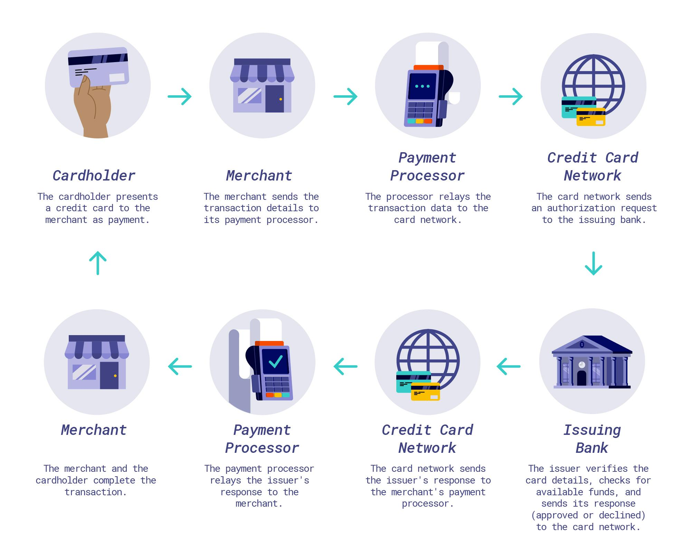

## Table of Contents

## What is credit money?

Credit money is a type of money that represents a promise to pay. Instead of using physical coins or paper money, people use credit money when they borrow money from a bank or use a credit card. When you use a credit card to buy something, you are essentially using credit money because you are promising to pay the bank back later. This type of money is based on trust and the belief that the borrower will repay the amount they owe.

Credit money is important because it helps the economy grow. It allows people to buy things they need or want even if they don't have enough cash at the moment. For example, a family might use a loan to buy a house or a car. Businesses can also use credit money to expand and create more jobs. However, using credit money comes with risks, like the possibility of not being able to pay back the borrowed money, which can lead to financial problems.

## How does credit money differ from physical currency?

Credit money and physical currency are different in how they work and what they represent. Physical currency is the money you can touch, like coins and paper bills. It's real money that you can use right away to buy things. When you pay with cash, the transaction is done as soon as you hand over the money. Physical currency is issued by the government and has a set value.

On the other hand, credit money is not something you can hold in your hand. It's a promise to pay in the future. When you use a credit card or take out a loan, you're using credit money. You're borrowing money from a bank or a credit card company, and you agree to pay it back later, usually with interest. Credit money depends on trust between the borrower and the lender. It allows people to buy things even if they don't have enough cash at the moment, but it also comes with the responsibility of paying back what you owe.

## What are the basic mechanisms behind credit money creation?

Credit money is created when banks lend money to people or businesses. When a bank gives you a loan, it doesn't usually hand you cash from a vault. Instead, it adds the loan amount to your bank account. This new money in your account is credit money. It's like the bank is creating money out of thin air, but it's really based on the promise that you will pay the loan back with interest. The bank believes you will repay the loan, so it feels safe to create this credit money.

The process of creating credit money helps the economy grow. When people and businesses borrow money, they can spend it on things like houses, cars, or starting new businesses. This spending can lead to more jobs and more economic activity. But, there's a limit to how much credit money banks can create. Banks have to follow rules set by the government, like keeping a certain amount of money in reserve. If too many people can't pay back their loans, it can cause problems for the bank and the economy. So, creating credit money is a careful balance between helping the economy grow and managing risk.

## Can you explain the role of banks in the creation of credit money?

Banks play a big role in creating credit money. When you go to a bank and ask for a loan, the bank doesn't just give you cash from a vault. Instead, it adds the loan amount to your bank account. This new money in your account is credit money. It's like the bank is making money out of nothing, but it's really based on the promise that you will pay the loan back with interest. The bank trusts that you will repay the loan, so it feels safe to create this credit money.

The process of banks creating credit money helps the economy grow. When people and businesses borrow money, they can spend it on things like houses, cars, or starting new businesses. This spending can lead to more jobs and more economic activity. But, banks have to be careful. They have to follow rules set by the government, like keeping some money in reserve. If too many people can't pay back their loans, it can cause problems for the bank and the economy. So, creating credit money is a careful balance between helping the economy grow and managing risk.

## What is fractional reserve banking and how does it relate to credit money?

Fractional reserve banking is a system where banks keep only a small part of the money people deposit, called the reserve, and lend out the rest as loans. This reserve is usually set by the government or a central bank. For example, if the reserve requirement is 10%, the bank keeps $10 for every $100 deposited and can lend out the other $90. This system allows banks to create more money than they actually have in their vaults, which is where credit money comes in.

When a bank gives a loan, it adds the loan amount to the borrower's account as credit money. This new money didn't exist before the loan was made. It's based on the promise that the borrower will pay it back with interest. So, fractional reserve banking helps create credit money because it lets banks lend out more money than they have, which can help the economy grow. But it also means that if too many people want their money back at the same time, the bank might not have enough cash on hand, which can lead to problems.

## How does the process of lending and borrowing affect the money supply?

When banks lend money, they create more money in the economy. This happens because banks don't just give you cash from a vault when you take out a loan. Instead, they add the loan amount to your bank account as credit money. This new money didn't exist before the loan was made. It's based on the promise that you will pay it back with interest. So, every time a bank makes a loan, it increases the total amount of money in the economy.

But when people pay back their loans, the money supply can go down. When you pay back a loan, the money you used to pay it off is no longer in your account. It goes back to the bank, and the bank might not lend it out again right away. If a lot of people pay back their loans at the same time, and the bank doesn't make new loans, the total amount of money in the economy can decrease. So, lending and borrowing can make the money supply go up and down, depending on how much people are borrowing and paying back.

## What are some common examples of credit money in everyday life?

Credit money is all around us in everyday life. One common example is using a credit card to buy things. When you swipe your credit card at a store, you're not using cash. Instead, you're borrowing money from the bank that gave you the card. You promise to pay it back later, usually with some extra money called interest. This is credit money because it's based on trust that you'll pay it back.

Another example is taking out a loan from a bank. Let's say you want to buy a car but don't have enough cash. You can go to a bank and get a car loan. The bank adds the loan amount to your account, and you can use that money to buy the car. This money in your account is credit money because it's created by the bank based on the promise that you'll pay the loan back over time. Both credit cards and loans show how credit money works in our daily lives.

## How do credit cards function as a form of credit money?

Credit cards work as a form of credit money because they let you borrow money from a bank to buy things. When you use your credit card to pay for something, the bank pays the store for you. But you don't get the money in cash. Instead, the bank adds what you spent to your credit card bill. You promise to pay the bank back later, usually with some extra money called interest. This means the money you use with your credit card is credit money, not real cash.

Using a credit card is handy because it lets you buy things even if you don't have enough money right now. You can use it to pay for groceries, gas, or even a big purchase like a new TV. But you have to be careful because if you don't pay your bill on time, you'll owe more money because of the interest. So, credit cards are a way to use credit money, but you need to manage them well to avoid getting into financial trouble.

## What are the risks associated with credit money for individuals and the economy?

Credit money can be risky for individuals because it's easy to borrow more money than you can pay back. When you use a credit card or take out a loan, you're promising to pay the money back with interest. If you can't pay it back, you might get into a lot of debt. This can hurt your credit score, making it hard to borrow money in the future. It can also cause stress and money problems. So, it's important to be careful and only borrow what you know you can pay back.

For the economy, too much credit money can also be a problem. If a lot of people borrow money and then can't pay it back, banks might lose money. This can make banks less willing to give out loans, which can slow down the economy. If this happens a lot, it can lead to a financial crisis, like what happened in 2008. So, while credit money helps the economy grow by letting people and businesses spend more, it's important for banks and governments to keep an eye on how much credit money is being created to avoid big problems.

## How do government policies and regulations impact the use and creation of credit money?

Government policies and regulations have a big impact on how much credit money banks can create and how it's used. One way governments do this is by setting rules about how much money banks need to keep in reserve. This is called the reserve requirement. If the government says banks have to keep a lot of money in reserve, banks can't lend out as much money. This means less credit money is created. On the other hand, if the government lowers the reserve requirement, banks can lend out more money, and more credit money is created. This can help the economy grow, but it can also be risky if too much credit money is made.

Another way governments influence credit money is through interest rates. The central bank can change the [interest rate](/wiki/interest-rate-trading-strategies), which is the cost of borrowing money. If the central bank raises interest rates, it becomes more expensive for people and businesses to borrow money. This can slow down the creation of credit money because fewer people will want to take out loans. If the central bank lowers interest rates, borrowing money becomes cheaper, and more people might take out loans. This can lead to more credit money being created, which can help the economy but also increase the risk of people not being able to pay back their loans. So, governments have to balance these policies carefully to keep the economy stable.

## Can you discuss any historical examples where credit money played a significant role in economic events?

One big example of credit money affecting the economy happened in the United States in the 1920s. During this time, banks were giving out a lot of loans, which created a lot of credit money. People were using this credit money to buy stocks and other things. This led to a big boom in the economy, but it also made things risky. When the stock market crashed in 1929, many people couldn't pay back their loans. This caused banks to fail, and it led to the Great Depression, a time when the economy was very bad and many people were out of work.

Another example is the 2008 financial crisis. Before the crisis, banks were giving out a lot of loans for houses, which created a lot of credit money. Many people were buying homes they couldn't really afford because they thought the prices would keep going up. But when house prices started to fall, people couldn't pay back their loans. This caused a lot of problems for banks and led to a big economic crisis. The government had to step in to help fix things, but it took a long time for the economy to recover. These examples show how important it is to be careful with credit money because it can have a big impact on the economy.

## What are the future trends and potential innovations in the field of credit money?

In the future, we might see more digital and electronic forms of credit money. Right now, people mostly use credit cards and bank loans, but new technologies like cryptocurrencies and digital wallets could change that. For example, some companies are working on digital currencies that could be used like credit money. These digital currencies could make it easier and faster to borrow and spend money. Also, with more people using smartphones, we might see more apps that let you borrow money quickly and easily, without needing to go to a bank.

Another trend could be more personalized credit money. Right now, banks use a person's credit score to decide if they can borrow money. But in the future, banks might use more information, like how you spend money and what you buy, to make better decisions about lending. This could help more people get loans, even if they don't have a perfect credit score. However, it's important to make sure these new ways of using credit money are safe and fair, so people don't end up with too much debt.

## What is Credit Money: Definition and Examples?

Credit money involves generating monetary value by extending credit and promises to pay, characterized by instruments like IOUs, bonds, and various debt securities. Unlike fiat money, which derives its value through government decree, credit money's worth is rooted in the trust and creditworthiness of the issuing entity. 

### Forms of Credit Money

1. **IOUs (I Owe You)**: An IOU is a documented acknowledgment of debt, expressing the borrower's intention to repay the lender. While informal and lacking the legal enforceability of contracts, they are prevalent in various informal transactions and agreements.

2. **Bonds**: These are formal debt instruments within which the issuer is obligated to pay interest and repay principal at a later date. Governments and corporations commonly issue bonds to raise capital. Bonds are essential to credit money because they rely on the issuer's reputation and creditworthiness to maintain value. For instance, U.S. Treasury bonds are considered highly secure due to the low default risk associated with the U.S. government.

3. **Debt Instruments**: This category includes various certificates of debt, such as debentures and mortgages, which oblige repayment with specific terms regarding interest rates and timelines.

### Credit Money in the Fractional Reserve Banking System

The fractional reserve banking system plays a vital role in the creation and management of credit money. In this system, banks hold a fraction of their customers' deposits as reserves while using the remainder for lending. This practice effectively multiplies the money supply by allowing banks to extend more credit than the total cash reserves they possess.

#### Mechanism of Money Creation

Assume a bank has a reserve requirement of 10%. If a customer deposits $1,000, the bank must retain $100 (10%) as reserves but can lend out $900. The borrower, in turn, may deposit the $900 in the same or another bank, allowing that institution to lend $810 and retain $90. This cycle continues, with each deposit and loan expanding the money supply. The total money supply (M) stimulated by an initial deposit can be calculated using the formula:

$$
M = \frac{1}{R} \times \text{initial deposit}
$$

Where $R$ is the reserve ratio. For a 10% reserve ratio:

$$
M = \frac{1}{0.1} \times 1,000 = 10,000
$$

Thus, a $1,000 deposit can potentially increase the money supply to $10,000 through successive loans.

### Implications for Economic Activity

Credit money, through fractional reserve banking, affects economic activity significantly by facilitating greater access to funds than would be available under a full-reserve system. This access can stimulate investment, promote consumption, and influence interest rates. However, reliance on credit money and potentially excessive lending can also lead to economic instability if not managed prudently, as seen in financial crises where defaults on loans multiplied systemic risk.

Therefore, understanding the mechanisms underlying credit money and its integration into banking practices is crucial for comprehending broader economic dynamics.

## References & Further Reading

[1]: ["Advances in Financial Machine Learning"](https://www.amazon.com/Advances-Financial-Machine-Learning-Marcos/dp/1119482089) by Marcos Lopez de Prado

[2]: Bergstra, J., Bardenet, R., Bengio, Y., & Kégl, B. (2011). ["Algorithms for Hyper-Parameter Optimization."](https://dl.acm.org/doi/10.5555/2986459.2986743) Advances in Neural Information Processing Systems 24.

[3]: ["Evidence-Based Technical Analysis: Applying the Scientific Method and Statistical Inference to Trading Signals"](https://www.amazon.com/Evidence-Based-Technical-Analysis-Scientific-Statistical/dp/0470008741) by David Aronson

[4]: ["Machine Learning for Algorithmic Trading"](https://github.com/stefan-jansen/machine-learning-for-trading) by Stefan Jansen

[5]: ["Quantitative Trading: How to Build Your Own Algorithmic Trading Business"](https://www.amazon.com/Quantitative-Trading-Build-Algorithmic-Business/dp/1119800064) by Ernest P. Chan